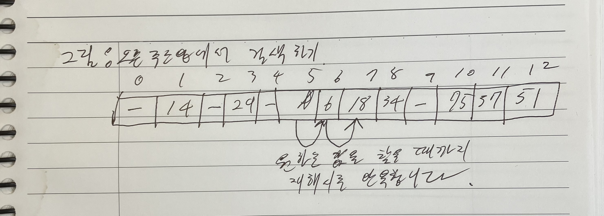

# [Algorithm] Do It! 자료구조와 함께 배우는 알고리즘 입문 - 2


> 개념과 이슈 트래킹을 조합해서 “복기 가능한” 자료를 만들도록 합니다.

> 이슈 트래킹 작성 원칙: Phase1(환경, 로그, 최근 변경사항), Phase2(확인, 시도, 결과분석) 형식으로 정리하세요. (Phase2는 최대 3회까지 반복하고 해결 안 되면 아예 처음부터 시작(불가능할 경우 도움 요청))

> 실습은 천천히, 하지만 robust하게 하세요. 

# 검색 알고리즘이란? 

> 읽고, 개구코 정리.

## 개구코1. 검색의 종류에는 크게 3가지가 있다

### 개념: 자료구조에 의존하는 검색 알고리즘에는 배열검색, 연결 리스트 검색, 이진 트리 검색이 있다.

### 구현: 그림 참조


### 코멘트: 그래프는 없네? 아래는 그 이유

> 그래프 탐색(검색)이 언급되지 않은 점을 지적한 것 같네요!

## 개구코2. 배열 검색의 구체적인 알고리즘들

### 개념: 배열 검색에는 선형 검색, 이진 검색, 해시법이 있다. 

### 구현: 배열 검색 종류 목록

- 선형 검색: 무작위로 늘어놓은 데이터 집합에서 검색을 수행합니다.
- 이진 검색: 일정한 규칙으로 늘어놓은 데이터 집합에서 아주 빠른 검색을 수행합니다.
- 해시법: 추가, 삭제가 자주 일어나는 데이터 집합에서 아주 빠른 검색을 수행합니다.
  - 체인법: 같은 해시값 데이터를 연결 리스트로 연결하는 방법입니다.
  - 오픈 주소법: 데이터를 위한 해시값이 충돌할 때 재해시하는 방법입니다.
### 코멘트: 카테고리를 잘 생각해야 한다. 

배열검색에는 선형검색, 이진 검색, 해시법이 있다. 이진 검색 하는데 이진 트리는 필요 없다. 은근 헷갈린다. 이진 트리가 아니라 ‘정렬된 배열’이 필요하다.

## 개구코3. 이진 검색 구현에 대해

### 개념: 이진 검색은 원소가 오름차순이나 내림차순으로 정렬된 배열에서 효율적으로 검색할 수 있는 알고리즘입니다.

### 구현

### 코멘트

# 큐: 끝!

## 개구코 1. 큐 

### 개념: 큐 관련 개념 일괄 정리

- FIFO
- 인큐: 데이터 추가
- 디큐: 데이터 꺼내기
- front: 데이터 꺼내는 쪽
- rear: 데이터 넣는 쪽
- 링 버퍼: 배열 맨 끝의 원소 뒤에 맨 앞의 원소가 연결되는 자료구조
- 프런트와 리어: 둘 다 논리적인 데이터 순서일 뿐 물리적 원소 순서 아님!
- 양방향 대기열 덱: 맨 앞과 맨 끝 양쪽에서 데이터 넣고 꺼낼 수 있는 자료구조.
### 구현

```python
# ring buffer!
"""
큐의 구성 요소: 
링 버퍼: 프론트, 리어
함수: 인큐, 디큐
"""
class Que():
    class FULL(Exception):
        def __init__(self, message="The que is full"):
            super().__init__(message)
    class EMPTY(Exception):
        def __init__(self, message="The que is empty"):
            super().__init__(message)
        
    _MAX_N = 10
    def __init__(self):
        self.front = 0
        self.rear = 1
        self.ring_buffer = [0] * self._MAX_N

    def is_full(self):
        if self.front+2 == self.rear: return True
        return False
    
    def is_empty(self):
        if self.front+1 == self.rear: return True
        return False
    
    def enque(self, val):
        if self.is_full(): 
            raise self.FULL
        self.ring_buffer[self.front] = val
        self.front += 1
        self.front %= self._MAX_N

    def deque(self):
        if self.is_empty():
            raise self.EMPTY
        tmp = self.ring_buffer[self.rear]
        self.rear += 1
        self.rear %= self._MAX_N
        return tmp
```

### 코멘트

스택보다 구현이 훨씬 어려웠다. 일단 다음과 같은 순서로 구현하는 것이 좋다.

1. 큐의 데이터와 front, rear 포인터를 한 눈에 볼 수 있도록 프린트 함수를 작성한다.
1. enque 관련 작업을 먼저 진행한다. 
1. deque 관련 작업을 이어 진행한다.
1. is_full과 is_empty를 나중에 처리한다(왜? 일단 인덱스가 제대로 동작하도록 구현하는게 중요하다.)


# 이슈 트래킹

# 이슈: ring buffer에서 is_full, is_empty가 제대로 작동 안함(큐의 사이즈를 어떻게 추적할 것인가?)

## Phase1. 

### 환경: 파이썬

### 로그: 없음. 오작동.

### 최근 변경 사항: 링버퍼 개념을 이용한 큐 구현.

## Phase2-1

### 확인: 큐와 포인터의 이동 모습을 로그로 확인해보기

로그 출력 함수 작성

```python
def print_q():
    global Q
    print(f'-----size: {Q.size}-------')
    for idx in range(len(Q.ring_buffer)-1, -1, -1):
        print(Q.ring_buffer[idx], end="")
        if idx == Q.rear:
            print('<----rear', end='')
        if idx == Q.front:
            print('<----front', end='')
        print()
    print('------------')

```

출력 예시

```python
------------
10
9
8
7
6
5
4
3
2<----rear
1<----front
------------
------------
10
9
8
7
6
5
4
3<----rear
2
1<----front
------------
```

인큐와 디큐 작업은 제대로 되고 있음을 확인할 수 있다. 문제는 is_empty와 full을 어떻게 관리하느냐이다. 그냥 인테저 값 하나를 사이즈로 관리하면 안 되나? 그게 편할듯. 

### 시도

```python
# ring buffer!
"""
큐의 구성 요소: 
링 버퍼: 프론트, 리어
함수: 인큐, 디큐
"""
class Que():
    class FULL(Exception):
        def __init__(self, message="The que is full"):
            super().__init__(message)
    class EMPTY(Exception):
        def __init__(self, message="The que is empty"):
            super().__init__(message)
        
    _MAX_N = 10
    def __init__(self):
        self.front = 0
        self.rear = 0
        self.ring_buffer = [0] * self._MAX_N
        self.size = 0

    def is_full(self):
        if self.size == self._MAX_N: return True
        return False
    
    def is_empty(self):
        if self.size == 0: return True
        return False
    
    def enque(self, val):
        if self.is_full(): 
            raise self.FULL
        self.ring_buffer[self.front] = val
        self.front += 1
        self.front %= self._MAX_N
        self.size += 1

    def deque(self):
        if self.is_empty():
            raise self.EMPTY
        tmp = self.ring_buffer[self.rear]
        self.rear += 1
        self.rear %= self._MAX_N
        self.size -= 1
        return tmp

def print_q():
    global Q
    print(f'-----size: {Q.size}-------')
    for idx in range(len(Q.ring_buffer)-1, -1, -1):
        print(Q.ring_buffer[idx], end="")
        if idx == Q.rear:
            print('<----rear', end='')
        if idx == Q.front:
            print('<----front', end='')
        print()
    print('------------')


Q = Que()
for i in range(1, 11):
    Q.enque(i)
    print_q()
for i in range(1, 6):
    Q.deque()
    print_q()
print('====================')
for i in range(1, 6):
    Q.enque(i)
    print_q()

print(f'is Q empty? {Q.is_empty()} because front: {Q.front} rear: {Q.rear}')
print(f'is Q full? {Q.is_full()} because front: {Q.front} rear: {Q.rear}')
```

size로 따로 관리를 해서 이렇게 된다.

### 결과 분석: 구현이 완료 된 거 같았지만, 다시 보니 front와 rear에 대한 이해를 거꾸로 했다.

내가 이해한 바

- front: 인큐할 때 데이터가 들어오는 인덱스
- rear: 디큐할 때 데이터가 나가는 인덱스
컨벤션

- front: 데이터가 나가는 인덱스
- rear: 디큐할 때 데이터가 들어오는 인덱스
그리하여 컨벤션에 맞게 다시 수정

```javascript
class Que():
    class FULL(Exception):
        def __init__(self, message="The que is full"):
            super().__init__(message)
    class EMPTY(Exception):
        def __init__(self, message="The que is empty"):
            super().__init__(message)
        
    _MAX_N = 2_000_000
    def __init__(self):
        self.rear = 0
        self.front = 0
        self.ring_buffer = [0] * self._MAX_N
        self.size = 0

    def is_full(self):
        if self.size == self._MAX_N: return True
        return False
    
    def is_empty(self):
        if self.size == 0: return True
        return False
    
    def enque(self, val):
        if self.is_full(): 
            raise self.FULL
        self.ring_buffer[self.rear] = val
        self.rear += 1
        self.rear %= self._MAX_N
        self.size += 1

    def deque(self):
        if self.is_empty():
            raise self.EMPTY
        tmp = self.ring_buffer[self.front]
        self.front += 1
        self.front %= self._MAX_N
        self.size -= 1
        return tmp
    
    def pop(self):
        try:
            return self.deque()
        except self.EMPTY:
            return -1

    def call_front(self):
        if self.is_empty(): return -1
        return self.ring_buffer[self.front]
    
    def call_back(self):
        if self.is_empty(): return -1
        return self.ring_buffer[self.rear-1]
    
    def empty(self):
        if self.is_empty(): return 1
        return 0
```

이렇게 제출해서 정답으로 인정 받았다.

### 피드백

아래 내용은 위 코드(링 버퍼 방식의 큐) 구현에 대한 전반적인 피드백과, 흔히 발생하는 실수 혹은 추가적으로 고려해볼 만한 점들을 정리한 것입니다.

1. front와 rear의 일반적인 컨벤션

•	front: “맨 앞 원소가 있는 인덱스” 혹은 “디큐할 때 참조할(꺼낼) 위치”

•	rear: “맨 뒤 원소 뒤에 새 원소를 쌓을(인큐할) 위치”

구현 시, enque 연산에는 rear가 증가하고, deque 연산에는 front가 증가합니다.

따라서 다음과 같은 흐름이 됩니다.

```plain text
enque(val):
    ring_buffer[rear] = val
    rear = (rear + 1) % capacity
    size++

deque():
    return_val = ring_buffer[front]
    front = (front + 1) % capacity
    size--
```

질문에서처럼 front와 rear 역할을 뒤집어서(혹은 헷갈려서) 사용하는 경우가 종종 있는데, 결국 기능만 맞으면 문제는 없습니다. 다만 보통 알고리즘/자료구조 수업 등에서 사용하는 컨벤션과는 같게 맞추는 것이 협업이나 코드를 읽는 사람 입장에서 이해하기 수월합니다.

2. is_empty, is_full를 size로 관리하기

원형 큐에서 흔히 발생하는 문제는 빈 큐인지 꽉 찬 큐인지 구분하는 방법입니다.

이를 해결하는 대표적인 방법 두 가지가 있습니다.

1.	size 변수를 따로 둬서 관리

•	size == 0이면 empty, size == capacity면 full.

•	매번 인큐 시 size 증가, 디큐 시 size 감소.

•	간단하고 직관적이며, 조건문도 명확해지는 장점이 있음.

2.	포인터(front, rear)만으로 구분

•	front == rear이면 empty

•	(rear + 1) % capacity == front이면 full

•	다만 이 경우 한 칸을 비워두는 방식으로 구현해야 충돌을 피함.

•	별도의 size 변수가 없으므로, 현재 큐에 몇 개가 들어있는지 계산할 때는

\text{size} = (rear + capacity - front) \mod capacity

이런 식으로 별도 연산이 필요.

질문에서 시도하신 방법처럼 size를 관리하는 방식이 가장 구현하기도 쉽고 에러도 적게 납니다.

3. 대용량 버퍼에서의 메모리 사용 이슈

```plain text
_MAX_N = 2_000_000
self.ring_buffer = [0] * self._MAX_N
```

파이썬에서 2백만 개의 원소를 미리 0으로 할당하면, 꽤 큰 메모리를 차지하게 됩니다.

만약 실제로 2백만 개 정도를 자주 사용하는 시스템이라면 상관없지만, 그 이하로만 사용한다면 다음과 같은 방법을 고려할 수 있습니다.

1.	동적 크기 조절

•	초기에 어느 정도 크기로 할당해 놓고, 꽉 차면 크기를 2배로 늘리는 식의 방법.

•	다만 구현이 복잡해질 수 있고, 해당 문제의 본질과 다를 수 있음.

2.	collections.deque 사용

•	파이썬 표준 라이브러리에서 제공하는 데크(Deque)는 내부적으로 비슷한 원형 버퍼를 최적화하여 구현해 놓은 자료구조.

•	큐 연산(append, popleft 등)이 매우 빠름.

•	단, 알고리즘 문제에서 직접 구현을 요구하는 경우엔 사용할 수 없지만, 일반적인 파이썬 코딩에는 유용.

문제에서 요구사항이 “최대 2백만 데이터를 처리해야 한다”처럼 명시되었다면, 현재 구현도 충분히 합리적일 수 있습니다.

4. 디버깅 시 로그 확인 방법

질문에 첨부한 print_q() 함수처럼 실시간으로 front, rear, size, 그리고 ring_buffer 상태를 출력하여 확인하는 것은 좋은 디버깅 습관입니다.

원형 큐 로직에서 가장 흔히 발생하는 실수는 “포인터가 돌아가는(모듈로 연산) 시점에 off-by-one 오류가 나는 것”이므로,

•	front, rear가 정상적으로 순환하는지,

•	size가 정상적으로 증가/감소하는지,

•	인덱스가 capacity를 넘어가지 않는지

등을 주로 체크해보면 됩니다.

5. 기타 팁

•	예외 처리:

현재 Que.FULL과 Que.EMPTY라는 커스텀 예외 클래스를 잘 정의해 두셨습니다. 이 예외가 발생할 수 있는 조건이 정확히 맞는지, 혹은 예외 대신 반환값(-1 등)으로 처리해야 하는 상황인지 고려하면 좋습니다.

•	메서드 네이밍:

•	call_front, call_back 대신 Pythonic하게 peek_front, peek_back 같은 이름을 쓰거나, C++ STL 스타일로 front, back을 사용하기도 합니다.

•	pop이 deque(프론트에서 꺼내기)와 동일한 기능을 한다면, 실제로 파이썬의 list나 deque에서 pop이라는 동사는 “마지막에서 꺼낸다”는 의미가 있기 때문에, 혼동되지 않게끔 주석으로 정리하면 좋습니다.

결론

•	size로 관리하는 방식은 구현하기 쉽고, is_empty/is_full을 구분하기도 명확하므로 좋은 선택입니다.

•	다만, front와 rear의 컨벤션을 헷갈리지 않도록 잘 지키는 것이 중요합니다.

•	실제 코딩 테스트나 알고리즘 문제에서 간단히 통과할 때는 지금처럼 구현해도 전혀 문제가 없습니다.

•	최적화나 파이썬 내장 함수를 활용한 간편 구현이 필요할 때는 collections.deque도 고려해 보세요.

구현 자체는 충분히 잘 되어 있고, 일반적인 원형 큐 개념에서 크게 벗어나지 않았으므로 좋은 코드라고 보입니다.

앞으로도 ring buffer(원형 큐)를 사용할 일이 있다면, 이번 경험을 통해 “포인터 인덱스와 size 관리 로직이 제일 중요하다”는 점만 계속 유의하시면 됩니다.

# 해시법

## 개구코 1. 체인법 해시

### 개념: 체인법이란 해시값이 같은 데이터를 체인 모양의 연결 리스트로 연결하는 방법을 말하며, 오픈 해시법이라고도 합니다.

### 구현


```python
from __future__ import annotations
from typing import Any, Type
import hashlib

class Node:
    def __init__(self, key: Any, value: Any, next: Node) -> None:
        self.key = key
        self.value = value
        self.next = next
    
class ChainedHash:
    def __init__(self, capacity: int):
        self.capacity = capacity
        self.table = [None] * self.capacity
    
    def hash_value(self, key: Any) -> int:
        if isinstance(key, int):
            return key % self.capacity
        return(int(hashlib.sha256(str(key).encode()).hexdigest(), 16) % self.capacity)
    
    def search(self, key: Any) -> Any:
        hash = self.hash_value(key)
        p = self.table[hash]

        while p is not None:
            if p.key == key:
                return p.value # 검색 성공
            p = p.next # 뒤쪽 노드를 주목.
        return None # 검색 실패

    def add(self, key: Any, value: Any) -> bool:
        """키가 key이고 값이 value인 원소를 추가"""
        hash = self.hash_value(key)
        p = self.table[hash]

        while p is not None:
            if p.key == key:
                return False
            p = p.next
        
        temp = Node(key, value, self.table[hash])
        self.table[hash] = temp # 노드를 추가
        return True # 추가 성공
    
    def remove(self, key: Any) -> bool:
        """키가 key인 원소를 삭제"""
        hash = self.hash_value(key) # 삭제할 key 의 해시값.
        p = self.table[hash] # 노드를 주목
        pp = None # 바로 앞의 노드를 주목

        while p is not None:
            if p.key == key: # key를 발견하면 아래를 실행
                if pp is None:
                    self.table[hash] = p.next
                else:
                    pp.next = p.next
                return True # 키 삭제 성공
            pp = p
            p = p.next # 뒤쪽 노드를 주목
        return False
    
    def dump(self) -> None:
        """해시 테이블을 덤프"""
        for i in range(self.capacity):
            p = self.table[i]
            print(i, end='')
            while p is not None:
                print(f' -> {p.key} ({p.value})', end='')
                p = p.next
            print()
```

### 코멘트

이것만 보고 코드 구현 해보세요.

1. 노드 구현하기
1. 프리미티브한 프레임은 리스트라고 가정.
1. 어디서 막혔냐? 새 노드를 추가하는 과정에. 일단 
## 머리가 나쁘면 몸이 고생한다 공부법

### 해시 구현 코드의 수도코드를 작성해보기

이미지


후기

- 난 해시가 뭐고 키가 뭔지 모르는구나. 해시값을 기준으로 키를 찾는 것인가? 일반적인 키, 밸류 관계로 생각했는데, 잘 대응이 안 된다. 하나의 해쉬 값에 여러 키가 대응되는 것인거 같다.
- 해쉬는 키도 아니고 밸류도 아니야? 그렇다.
- 내가 해쉬 테이블에 노드를 추가하는 과정을 제대로 이해하지 못했음을 깨달았다. → 그림으로 그리고 아래에 이미지 첨부하세요


### 수도 코드를 보지 않고 작성한 다음 검토해보기

어떤 클래스를 구현해야 하나요?

- Node, ChainedHash
어떤 함수를 구현해야 하나요?

- 모든 생성자
- 해쉬
  - 해쉬벨류
  - 검색
  - 추가
  - 제거
  - 덤프
아래에 사진을 첨부하세요


검토

몸이 고생한 덕분에 뭐 대충 동작은 다 이해한 거 같다.

### 코드로 구현해보기

> 위 내용만 참고해서 코드로 ChainedHash를 구현합니다.

```python
import hashlib
from typing import Any

class Node:
    def __init__(self, key, value, next):
        self.key = key
        self.value = value
        self.next = next

class ChainedHash:
    def __init__(self, capacity: int):
        self.capacity = capacity
        self.hash_table = [None] * capacity
        
    def hash_value(self, key: Any):
        if isinstance(key, int):
            return key % self.capacity
        return int(hashlib.sha256(str(key).encode()).hexdigest(), 16) % self.capacity
    
    def find(self, key: Any):
        hash = self.hash_value(key=key)
        p = self.hash_table[hash]
        while p is not None:
            if p.key == key:
                return p.value
            p = p.next
        return False
    
    def add(self, key: Any, value: Any):
        hash = self.hash_value(key)
        p = self.hash_table[hash]
        while p is not None:
            if p.key == key:
                return False
            p = p.next
        temp = Node(key, value, self.hash_table[hash]) # 기존 첫 요소를 내 뒤로 설정.
        self.hash_table[hash] = temp # 내가 일등 먹음. 각 해쉬의 마지막 요소는 next가 None
        return True
    
    def remove(self, key: Any):
        hash = self.hash_value(key)
        p = self.hash_table[hash]
        pp = None
        while p is not None:
            if p.key == key: # 일치하는 키를 찾았을 경우
                if pp is None: # 앞 요소가 none일 경우, 그대로 p만 배제
                    self.hash_table[hash] = pp
                else: # 앞 요소가 있을 경우!
                    pp.next = p.next # 끝인가?
            pp = p # 왜 저장해? 끊고 나서 next를 서로 엇갈리게 지정해줘야 함.
            p = p.next
        return False
    
    def dump(self):
        for i in range(self.capacity): #그니까.
            p = self.hash_table[i] # 이터레이션을 어떻게 함?
            print(f'{i}', end='')
            while p is not None:
                print(f'-> {p.key} ({p.value})', end='')
                p = p.next
            print()

```

이제 테스트 하고, 문제가 생기면 이슈를 팝니다. 

이로써 연결 리스트 구현 완료! 이에 대한 피드백을 받아 봅시다.

### 피드백

아주 깔끔하게 구현하셨습니다. 다만 remove 메서드 내부에서 버그가 하나 보이므로, 그 부분만 수정하면 완성도 높은 코드가 됩니다. 아래에서 해당 부분을 짚어드릴 테니 참고해보세요.

1. remove 메서드 버그

현재 remove 메서드에서는 찾고자 하는 키를 발견했을 때,

```plain text
if pp is None:  # 앞 요소가 none일 경우, 그대로 p만 배제
    self.hash_table[hash] = pp  # <-- 여기서 head를 None으로 덮어쓰고 있습니다.
else:
    pp.next = p.next
```

이 로직 때문에 버킷의 첫 번째 노드를 지울 때, 원래 연결 리스트의 head를 **pp(None)**로 덮어쓰게 됩니다.

결과적으로 해당 버킷 전체가 날아가 버리게 되므로, 올바른 head 재설정이 필요합니다.

또한 노드를 제대로 삭제한 시점에서 return False를 고정적으로 리턴하므로, 삭제 성공 여부가 반영되지 않습니다.

올바른 수정 예시

```plain text
def remove(self, key: Any):
    hash = self.hash_value(key)
    p = self.hash_table[hash]
    pp = None

    while p is not None:
        if p.key == key:  # 일치하는 키를 찾았을 경우
            if pp is None:
                # 연결 리스트의 맨 앞 노드를 지우는 경우 -> head 교체
                self.hash_table[hash] = p.next
            else:
                # 중간 혹은 끝 노드를 지우는 경우 -> 앞 노드(pp)의 next를 건너뛰어 연결
                pp.next = p.next
            return True  # 삭제 성공 시 True 반환

        # 다음 노드로 이동
        pp = p
        p = p.next

    # 찾지 못하고 반복문 종료 시
    return False
```

•	맨 앞 노드(head) 교체

self.hash_table[hash] = p.next 로 연결 리스트의 첫 노드만 제거하고, 이후 노드는 모두 유지합니다.

•	중간 혹은 끝 노드 교체

pp.next = p.next 로 원하는 노드를 제거하고, 앞 노드(pp)를 제거된 노드(p)의 다음 노드와 연결합니다.

•	삭제 성공 시 return True 하여, 호출하는 쪽에서 삭제 여부를 알 수 있게 합니다.

2. 추가적으로 개선할 수 있는 부분

1.	find 메서드 반환 타입 통일

•	지금은 값이 없을 때 False를 리턴하시는데, 객체 혹은 자료구조에서는 “값이 없음”을 뜻하기 위해 None을 쓰는 경우가 많습니다.

•	예: return None

2.	hash_value에서의 변수명

•	hash라는 이름을 사용할 경우, 파이썬 내장 함수 hash와 혼동될 수 있습니다.

•	bucket_idx 또는 index 등으로 변수명을 변경하면 가독성이 좋아집니다.

3.	버킷 확장(Resize) & 재해싱(Rehash) 로직

•	현재는 정해진 capacity만큼만 버킷을 사용하고 있습니다.

•	데이터가 계속 쌓여 체인이 너무 길어지면 검색/삭제 시 성능이 저하될 수 있습니다.

•	일정 ‘부하율(load factor)’을 넘어가면 버킷을 확장하고, 기존 데이터를 새로운 해시 테이블로 옮기는(재해싱) 로직을 구성해주면 좋습니다.

4.	테스트 코드 작성

•	실제로 동작이 잘 되는지 확인할 수 있도록, 적절한 테스트 함수를 작성하는 것이 좋습니다. 예를 들어 unittest나 pytest 등을 이용하여, add/find/remove/dump가 의도대로 작동하는지 체크하면 디버깅이 훨씬 쉬워집니다.

3. 최종 수정 예시

전체적으로 버그만 수정한 예시는 아래와 같습니다.

```plain text
import hashlib
from typing import Any

class Node:
    def __init__(self, key, value, next):
        self.key = key
        self.value = value
        self.next = next

class ChainedHash:
    def __init__(self, capacity: int):
        self.capacity = capacity
        self.hash_table = [None] * capacity

    def hash_value(self, key: Any):
        if isinstance(key, int):
            return key % self.capacity
        return int(hashlib.sha256(str(key).encode()).hexdigest(), 16) % self.capacity

    def find(self, key: Any):
        index = self.hash_value(key)
        p = self.hash_table[index]
        while p is not None:
            if p.key == key:
                return p.value
            p = p.next
        return None  # 혹은 False 대신 None으로 반환

    def add(self, key: Any, value: Any):
        index = self.hash_value(key)
        p = self.hash_table[index]
        while p is not None:
            if p.key == key:
                return False  # 이미 존재하는 키면 False
            p = p.next

        new_node = Node(key, value, self.hash_table[index])
        self.hash_table[index] = new_node
        return True

    def remove(self, key: Any):
        index = self.hash_value(key)
        p = self.hash_table[index]
        pp = None

        while p is not None:
            if p.key == key:  # 일치하는 키를 찾았을 경우
                if pp is None:
                    self.hash_table[index] = p.next
                else:
                    pp.next = p.next
                return True  # 삭제 성공을 알림
            pp = p
            p = p.next
        return False  # 찾지 못했음

    def dump(self):
        for i in range(self.capacity):
            p = self.hash_table[i]
            print(f'[{i}]', end='')
            while p is not None:
                print(f' -> {p.key} ({p.value})', end='')
                p = p.next
            print()
```

정리

•	연결 리스트 기반 체이닝 기법이 잘 구현되었습니다.

•	remove 메서드에서 버킷의 첫 노드를 올바르게 제거하고, 삭제 성공 여부를 반환하도록 수정만 해주시면 좋습니다.

•	필요하다면 부하율을 고려해 리사이징과 재해싱을 고려하시면, 실제 해시 테이블 구현에 더 가깝게 다가갈 수 있습니다.

이상으로 기본적인 체이닝 방식의 해시 테이블 코드를 완성하실 수 있을 겁니다. 구현해보시고 궁금한 부분 있으시면 또 질문 주세요. 화이팅입니다!

## 개구코 2. 오픈 주소법(기본 개념 및 원소 추가)

### 개념: 충돌이 발생했을 때 재해시를 수행하며 빈 버킷을 찾는 방법. 닫힌 해시법이라고도 함

- 재해시를 위한 해시 함수는 자유롭게 정할 수 있음(그림에서는 키에 1을 더하여 13으로 나눈 나머지를 사용)
### 구현: 그림참조


### 코멘트: Open address 해시는 closed hashing이다. 

뭐 이리 엇갈리게 이름을 지었냐.

## 개구코 3. 닫힌 주소법의 버킷 속성과 검색

### 개념:

### 구현:

(그림: 오픈 주소법에서의 버킷의 속성에 대해)


(그림: 오픈 주소법에서 원소 검색)



### 코멘트

삭제완료 버킷 속성은, 해시값에 원하는 데이터가 없다고해서 검색 실패하지 말고 재해싱한 값으로 다 이터레이션 해 봐야기 때문에 주어져 있는 사인이구나. 그런데, 그러면 배열 전체 돌때까지 이터레이션 해야하나?


## 머나몸고: 닫힌 해시 구현

### Phase1. 수도코드 필사

(이미지 첨부)

### Phase2. 수도코드 직접 작성

(이미지 첨부)

### Phase3. 위 이미지를 기반으로 코드 구현

# 이슈: 해쉬값 구하는 과정에 에러 발생

## Phase1. 

### 환경: 파이썬

### 로그: TypeError: int() can't convert non-string with explicit base

### 최근 변경 사항: chained hash 구현

## Phase2-1

### 확인: 

```python
return int(hashlib.sha256(str(key).encode()), 16) % self.capacity
```

int 캐스팅에 주어진 값이 int일 때 발생한다고 함. 이건 원래 코드가 기억이 안 나서 그냥 교재 참조.

```python
return(int(hashlib.sha256(str(key).encode()).hexdigest(), 16) % self.capacity)

```

.hexdigest() 연산이 빠져 있었음. 이것의 의미는? 

> Return the digest value as a string of hexadecimal digits.

16진수 문자열 값을 반환.

### 시도: 

위 코드를 그대로 사용

### 결과 분석

성공


