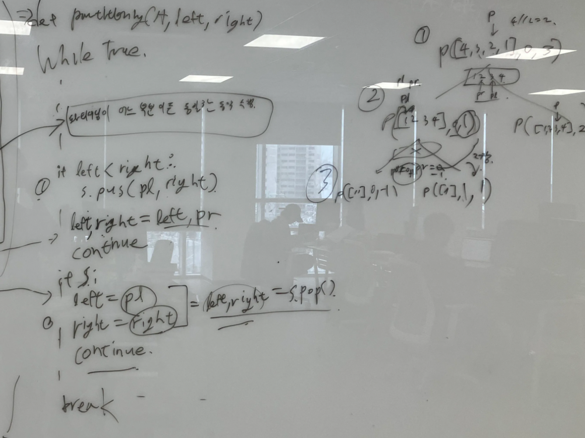

# [Algorithm] Do It! 자료구조와 함께 배우는 알고리즘 입문 -파이썬 편


> 개념과 이슈 트래킹을 조합해서 “복기 가능한” 자료를 만들도록 합니다.

> 이슈 트래킹 작성 원칙: Phase1(환경, 로그, 최근 변경사항), Phase2(확인, 시도, 결과분석) 형식으로 정리하세요. (Phase2는 최대 3회까지 반복하고 해결 안 되면 아예 처음부터 시작(불가능할 경우 도움 요청))

> #: 주제, 그림, 스텝(중요)

>  정렬 부분은 다 한번 해봤지만 기억이 안 남. → 그럼 그냥 해. 알면 빨리 될 것이고, 그렇지 않으면 느리겠지. 코드는 타이핑하고 그림은 따라 그리기.

> 💡 추천 학습법:

# 자료구조: 스택

## 구현: 스택 구현하기

### Phase1. 스택 기본 요소 생각하기

1. 스택 포인터
1. 푸시 연산
1. 팝 연산
1. is_empty() 연산
1. is_full() 연산
1. 사이즈? 연산
1. 기본 배열 사용
1. 피크 연산.
### Phase2. 스택 구현하기 

워낙 간단해서 그냥 바로 된 거 같은데, GPT의 피드백을 받아 보도록 하자.

```python
class Stack:
    def __init__(self, size):
        self.size = size
        self.stack = [0] * size
        self.ptr = 0

    class Empty(Exception):
        pass
    class Full(Exception):
        pass

    def is_empty(self):
        return self.ptr == 0
    
    def is_full(self):
        return self.ptr == self.size

    def __str__(self):
        return f'{self.stack}'
    
    def clear(self):
        self.ptr = 0

    def peak(self):
        return self.stack[self.ptr-1]
    
    def push(self, n):
        if self.is_full(): raise Stack.Full
        self.stack[self.ptr] = n
        self.ptr += 1

    def pop(self):
        if self.is_empty(): raise Stack.Empty
        tmp = self.stack[self.ptr] 
        self.ptr -= 1
        return tmp
```

### Phase3. 피드백

코드 전체적으로 잘 구현되었지만, 몇 가지 개선할 점이 있습니다.

1. 오타 수정

•	peak → peek: 일반적으로 peak는 산봉우리를 의미하고, 스택의 최상위 요소를 확인하는 연산은 peek입니다.

```plain text
def peek(self):
    return self.stack[self.ptr - 1]
```

2. pop() 오류 수정

•	pop()에서 self.ptr -= 1을 먼저 수행한 후에 요소를 반환해야 합니다.

•	현재 self.stack[self.ptr]을 반환하는데, self.ptr이 가리키는 위치가 push된 마지막 요소보다 1 크게 설정되어 있어 IndexError가 발생합니다.

```plain text
def pop(self):
    if self.is_empty():
        raise Stack.Empty
    self.ptr -= 1  # 포인터 감소 먼저 수행
    return self.stack[self.ptr]
```

3. __str__() 개선

•	현재 __str__()은 전체 리스트를 그대로 출력하지만, 실제로는 스택의 사용된 부분만 보여주는 것이 직관적입니다.

```plain text
def __str__(self):
    return f'{self.stack[:self.ptr]}'
```

4. 스택 요소 반환 시 예외처리

•	peek()도 is_empty() 상태에서 호출되면 예외를 던지는 것이 좋습니다.

```plain text
def peek(self):
    if self.is_empty():
        raise Stack.Empty
    return self.stack[self.ptr - 1]
```

5. 에러 메시지 추가

•	예외를 던질 때 명확한 메시지를 포함하는 것이 디버깅에 유리합니다.

```plain text
class Empty(Exception):
    def __init__(self, message="Stack is empty"):
        self.message = message
        super().__init__(self.message)

class Full(Exception):
    def __init__(self, message="Stack is full"):
        self.message = message
        super().__init__(self.message)
```

6. 사이즈 반환 함수 추가

•	size()를 추가하여 현재 스택에 있는 요소의 개수를 반환할 수 있도록 합니다.

```plain text
def size(self):
    return self.ptr
```

최종 코드

```plain text
class Stack:
    class Empty(Exception):
        def __init__(self, message="Stack is empty"):
            self.message = message
            super().__init__(self.message)

    class Full(Exception):
        def __init__(self, message="Stack is full"):
            self.message = message
            super().__init__(self.message)

    def __init__(self, size):
        self.size = size
        self.stack = [0] * size
        self.ptr = 0

    def is_empty(self):
        return self.ptr == 0

    def is_full(self):
        return self.ptr == self.size

    def __str__(self):
        return f'{self.stack[:self.ptr]}'

    def clear(self):
        self.ptr = 0

    def peek(self):
        if self.is_empty():
            raise Stack.Empty
        return self.stack[self.ptr - 1]

    def push(self, n):
        if self.is_full():
            raise Stack.Full
        self.stack[self.ptr] = n
        self.ptr += 1

    def pop(self):
        if self.is_empty():
            raise Stack.Empty
        self.ptr -= 1
        return self.stack[self.ptr]

    def size(self):
        return self.ptr
```

변경된 주요 사항

1.	peak() → peek()로 변경 (오타 수정)

2.	pop()에서 ptr 감소 후 반환하도록 수정 (IndexError 방지)

3.	__str__()에서 사용된 요소만 출력

4.	peek()에서 예외 처리 추가 (is_empty() 검사)

5.	Empty 및 Full 예외 클래스에 메시지 추가

6.	size() 메서드 추가하여 현재 스택 크기 반환

이제 테스트를 진행해보세요! 🚀

# 버블정렬

## 단순 버블 정렬

### 그림: 버블정렬 pass 

pass: 일련의 비교 교환 과정. 버블 정렬에서는 첫 번째 패스로 가장 작은 원소를 구할 수 있음.


### 코드

```python
from typing import MutableSequence

def bubble_sort(a: MutableSequence):
    """bubble sort"""
    n = len(a)
    for i in range(n-1):
        for j in range(n-1, i, -1): # from the end
            if a[j-1] > a[j]:
                a[j-1], a[j] = a[j], a[j-1]


```

## 버블정렬 개선 1

### 코드: 교환 횟수 감지해서 성능 올리기

```python
from typing import MutableSequence

def bubble_sort(a: MutableSequence):
    """bubble sort"""
    n = len(a)
    for i in range(n-1):
		    exchng = 0 # exchange time in a pass
        for j in range(n-1, i, -1): # from the end
            if a[j-1] > a[j]:
                a[j-1], a[j] = a[j], a[j-1]
                exchng += 1
    if exchng == 0:
			break
```

## 버블정렬 개선 2

아래와 같은 상태일 때 스캔 범위(비교 범위)를 좁히는 부분 추가.


### 코드: 스캔 범위 제한

```python
from typing import MutableSequence

def bubble_sort(a: MutableSequence):
    """bubble sort"""
    n = len(a)
    k = 0
    while k < n - 1:
        last = n - 1    
        for j in range(n-1, k, -1): # from the end
            if a[j-1] > a[j]:
                a[j-1], a[j] = a[j], a[j-1]
                last = j # update last. we can mark maximum area that should be scanned.
        k = last


```

## 셰이커 정렬

밀크 셰이크 먹고 싶다.

위와 같은 경우 거의 정렬이 다 됐지만 빠르게 마칠 수 없음. 9가 맨 끝에 있어서. 아이디어: 9를 맨 뒤로 이동시키면 정렬이 훨씬 빠르겠지?

### 코드: 셰이커 정렬

```python
from typing import MutableSequence

def shaker_sort(a: MutableSequence) -> None:
    """셰이커 정렬"""
    left = 0
    right = len(a) - 1
    last = right
    while left < right:
        for j in range(right, left, -1):
            if a[j-1] > a[j]:
                a[j-1], a[j] = a[j], a[j-1]
                last = j
        left = last

        for j in range(left, right):
            if a[j] > a[j + 1]:
                a[j], a[j + 1] = a[j + 1], a[j]
                last = j
        right = last
```

### 그림: 셰이커 정렬 패스

일단 스킵

# 단순 선택 정렬

# 단순 삽입 정렬

# 셸 정렬

# 퀵 정렬: 학습 종료

> 안 보고 구현한 다음, 재귀를 스택 형태로 바꾸는 연습을 반복해봅시다.

### 그림: 퀵 정렬의 예


## 개구코 1.

### 개념

재귀를 사용하지 않는 퀵정렬 구현은 pl, pr 포인터를 이용해야 한다. 아래는 이 아이디어만으로 직접 작성해본 퀵정렬 수도코드.

### 구현

```python
# 1. 일단 배열을 본다
# 2. 배열의 중간 값을 피벗으로 삼는다.
# 3. 양 끝에 pl, pr 포인터를 초기화한다.
# 4. '피벗 기준'을 충족하는 동안 포인터를 감소시킨다.
# 5. '피벗 기준'에 벗어나는 요소를 교환한다. 
# 6. 포인터들이 배열의 중간에 오기 전까지? 이 기준을 어떻게 잡아야 하지? 
# 7. 피벗을 다시 잡고 pl, pr을 초기화해서 진행한다. 
```

6번이 잘 모르겠다. 책을 다시 참고해서 정리해보자. 책에서는 이 기준을 pl ≤ pr로 잡았다. 즉, ‘배열의 중간’으로 픽스하면 안 되고, “pl, pr이 피벗 기준으로 배열을 모두 정리하기까지”가 이것을 의미한다. 

그리고 이 책의 구현에서도 퀵정렬은 재귀를 사용한다. 대신 in-place한 정렬이다. 재귀를 사용하는 inplace 정렬인데, 그럼 이걸 직접 구현해보도록 하자

```python
def q_sort(A, left, right):
    if left >= right: # 종료조건: 더 정렬할 영역이 없거나 요소가 하나일 때
        return
    pl, pr = left, right # 양 끝을 포인터로 설정
    pivot = A[(left + right)//2] # 피벗을 중간 값으로 설정
    while pl <= pr: # 포인터가 겹치지 않는 동안
        while A[pl] < pivot:  # 교환할 필요가 없을 때까지 포인터 움직여주기
            pl += 1 
        while A[pr] > pivot:
            pr -= 1
        # 다 움직인 다음에 교환. 이때 불필요한 교환이 최대 한 번 발생할 수 있음
        A[pl], A[pr] = A[pr], A[pl]
        pl += 1
        pr -= 1
    # 최종적으로 저장된 pr, pl 값의 의미
    # pl: 피벗 바로 왼쪽
    # pr: 그 반대
    q_sort(A, left, pl) # 피멋을 기준으로 왼쪽 영역 재귀
    q_sort(A, pr, right) # 피벗을 기준으로 오른쪽 영역 재귀


arr = [3, 2, 5, 234, 14, 5,234]
q_sort(arr, 0, 6)
    
```

위에가 내가 작성한 엉터리 정렬이고, 아래가 제대로된 정렬이다.

```python
def q_sort(A, left, right):
    if left >= right: # 종료조건: 더 정렬할 영역이 없거나 요소가 하나일 때
        return
    pl, pr = left, right # 양 끝을 포인터로 설정
    pivot = A[(left + right)//2] # 피벗을 중간 값으로 설정
    while pl <= pr: # 포인터가 겹치지 않는 동안
        while A[pl] < pivot and pl <= right:  # 교환할 필요가 없을 때까지 포인터 움직여주기
            pl += 1 
        while A[pr] > pivot and pr >= left:
            pr -= 1
        # 다 움직인 다음에 교환. 이때 불필요한 교환이 최대 한 번 발생할 수 있음
        if pl <= pr: 
            A[pl], A[pr] = A[pr], A[pl]
            pl += 1
            pr -= 1
    # 최종적으로 저장된 pr, pl 값의 의미
    # pl: 피벗 바로 왼쪽
    # pr: 그 반대
    q_sort(A, left, pr) # 피멋을 기준으로 왼쪽 영역 재귀
    q_sort(A, pl, right) # 피벗을 기준으로 오른쪽 영역 재귀


arr = [3, 2, 5, 234, 14, 5,234]
q_sort(arr, 0, 6)
print(arr)
```

### 코멘트

아무리 생각해도 제대로 된 인덱스 설정이 어렵다. 어떻게 하면 이 능력을 기를 수 있을까?

> 🔍 올바른 인덱스 설정 능력을 기르는 방법

위 내용에 따라 연습하면 되기도 하겠지만, 여기서 헤맸던 건 그냥 퀵 정렬의 포인터 이동을 제대로 이해하지 못했던 것 때문인거 같다.

→ 이 정렬의 스탭을 쉐도잉 해보자.

## 개구코 2

### 개념

피벗을 중심으로 배열을 두 부분으로 나누는 코드 작성해보기. 


위 그림을 그대로 해주면 될 거 같다.

### 구현

```python
def q_sort(A: list):
    # A를 피벗을 기준으로 '피벗보다 작은 영역'과 '큰 영역'으로 나누는 함수
    left, right = 0, len(A)-1
    # 배열의 양 끝에 포인터를 잡아줍니다.
    pl, pr = left, right
    # 피벗을 구해줍니다.
    p = A[(left+right)//2]
    # 두 포인터가 겹치지 않는 동안 포인터를 가운데로 스캔합니다.
    while pl <= pr:
        while A[pl] < p:
            pl += 1
        while A[pr] > p:
            pr -= 1
        # 만약에 포인터가 멈췄고, 두 값을 비교했을 때 대소관계가 다르면 교환해줍니다
        if A[pl] > A[pr]:
            print(f'before: {A}')
            print(f'pivot: {p}, exchange: {A[pl]}, {A[pr]}')
            A[pl], A[pr] = A[pr], A[pl]
            pl += 1
            pr -= 1
            print(f'after: {A}')
        
    # 작업이 끝났다면 결과를 출력해줍니다.
    print(A)

q_sort([5, 4, 3, 2 ,1])

```

### 코멘트

> 현재 코드에서 피벗을 기준으로 배열을 나누는 동작은 부분적으로 수행되지만, 완전히 올바르게 동작하지 않습니다.


제대로 수정한 코드는 다음과 같음

```python
def q_sort(A: list):
    # A를 피벗을 기준으로 '피벗보다 작은 영역'과 '큰 영역'으로 나누는 함수
    left, right = 0, len(A)-1
    # 배열의 양 끝에 포인터를 잡아줍니다.
    pl, pr = left, right
    # 피벗을 구해줍니다.
    p = A[(left+right)//2]
    # 두 포인터가 겹치지 않는 동안 포인터를 가운데로 스캔합니다.
    while pl <= pr:
        while A[pl] < p:
            pl += 1
        while A[pr] > p:
            pr -= 1
        # 만약에 포인터가 멈췄고, 포인터 위치가 엇갈리지 않았다면 교환
        if pl <= pr:
            print(f'before: {A}')
            print(f'pivot: {p}, exchange: {A[pl]}, {A[pr]}')
            A[pl], A[pr] = A[pr], A[pl]
            pl += 1
            pr -= 1
            print(f'after: {A}')
        
    # 작업이 끝났다면 결과를 출력해줍니다.
    print(A)

q_sort([5, 4, 3, 2 ,1])

```

## 개구코 3.

### 개념: 구현한 파티셔닝을 토대로 퀵 정렬 만들기

### 구현: 그냥 해 봅시다

```python
def paritioning(A: list, left, right):
    if left >= right:
        return
    # A를 피벗을 기준으로 '피벗보다 작은 영역'과 '큰 영역'으로 나누는 함수
    # 파티션 배열의 양 끝에 포인터를 잡아줍니다.
    pl, pr = left, right
    # 피벗을 구해줍니다.
    p = A[(left+right)//2]
    # 두 포인터가 겹치지 않는 동안 포인터를 가운데로 스캔합니다.
    while pl <= pr:
        while A[pl] < p and pl < right: # 파티션을 벗어나지 않게 조건을 추가합니다!
            pl += 1
        while A[pr] > p and pr > left: # 이하 동일
            pr -= 1
        # 만약에 포인터가 멈췄고, 포인터 위치가 엇갈리지 않았다면 교환
        if pl <= pr:
            print(f'before: {A}')
            print(f'pivot: {p}, exchange: {A[pl]}, {A[pr]}')
            A[pl], A[pr] = A[pr], A[pl]
            pl += 1
            pr -= 1
            print(f'after: {A}')
    paritioning(A, left, pr) # 파티셔닝이 끝난 후 pr은 작은 그룹의 끝단에 위치하게 됨
    paritioning(A, pl, right)
    # 작업이 끝났다면 결과를 출력해줍니다.s

def quick_sort(A: list):
    paritioning(A, 0, len(A) - 1) # 배열 전체를 범위로 하는 파티셔닝 호출

A = [5, 4, 3, 2, 1, 4, 3, 6, 4]
quick_sort(A)
print(A)


```

### 코멘트

성공~ 퀵 정렬은 ‘파티셔닝’과정과 ‘정렬’ 과정을 차례로 구현하면 잘 되네요.


## 개구코 4. 비재귀적 퀵 정렬로 바꾸기

### 개념: 비재귀적인 퀵 정렬 만들기

> 비재귀적인 퀵 정렬은 이미 배운 재귀 함수 recur()를 비재귀적으로 구현하는 방법과 같이 만들 수 있습니다. 

(그렇다면 이 작업을 하기 전에 복습 차원에서 recur()를 다시 비재귀적으로 구현해보는 것도 좋을 거 같다. 전혀 기억이 안 난다. 이걸 그 사이에 까먹네. 

코드 자체를 기억하려 하지 말고 제발 방법론을 떠올려봐라.

1. 상향식 재귀 분석
1. 스택 동작 그림
```python
def recur(n):
    if n <= 0: 
        return # n이 0보다 작으면 아무 작업하지 않는다.
    
    recur(n-1) # 이 세 줄의 코드가 트리형으로 갑니다.
    print(n)
    recur(n-2) #n-2로 업데이트하고 함수의 처음으로 돌아갑니다.

```

이 코드의 상향식 재귀 분석 및 스택 동작 예측


따라서 제대로 된 구현은 아래와 같을 것

```plain text
1. 초기 n을 스택에 푸시
2. 만약 n 값이 0보다 크면(n>0)이면 
	1. 푸시된 n을 n-1로 업데이트
4. 만약 n 값이 0 이하면(n <= 0)이면 
	1. n = pop()
	2. print(n)
	2. (그림에서 까먹음. 만약 n-2가 0보다 크면) n-2를 스택에 푸시
	3. n = n -1
```

진짜..이래도 기억이 안 난다. 다시 참조

## 개구코 5. 퀵 정렬에서 피벗과 겹치는 부분.

### 개념

퀵 정렬에서 pl, pr을 계속 스캔하며 포인터를 옮겨주면 피벗과 일치하는 그룹이 생길 수 있다. 이때는 배열 나누기가 완료되어 pl > pr + 1일 때 뿐이다.

### 구현

그림 참조


### 코멘트

아마 피벗과 같은 값이 더 있어도, 피벗과 일치하는 그룹이라는 건 하나밖에 없을 거 같다. 그니까 이게 이렇게 표현하면 안 될 거 같은데. ‘그룹’이 아니라 그냥 피벗 값 하나만 들어올 수 있는 거 아닌가.

## 개구코 6. 퀵 정렬을 스택으로 구현할 때 적절한 크기

### 개념: 퀵 정렬 규칙에 의해 배열에서 원소 수가 n이면 스택에 쌓이는 데이터의 최대 개수는 log n보다 적다.

따라서 원소 수 n이 100만 개라도, 스태의 최대 크기는 20이면 충분하다

$log_2 1000000$

이를 계산하면,

$log_2 1000000 = \frac{\log_{10} 1000000}{\log_{10} 2}$

상용로그 값을 이용하면,

$\log_{10} 1000000 = 6$

$log_{10} 2 \approx 0.3010$

따라서,

$log_2 1000000 = \frac{6}{0.3010} \approx 19.9$

즉, 최대값은 약 19.9입니다.

### 구현

이건 어렵게 보면 어렵긴 한데, 그냥 트리로 그려보면 바로 이해 됨. 재귀 결정 트리에서 스택에 저장되어야 하는 값은 어차피 루트-리프까지의 한 경로밖에 없음. 다른 경로들은 형제 노드를 처리한 다음 처리하게 됨. 이전에 화이트보드에 그렸던 것을 참조



### 코멘트: 없음.

## 복습: 재귀를 스택으로

### 개념: 재귀를 스택으로 변경하는 Robust한 방법론

```python
# 순수한 재귀 함수 구현하기

def recur(n: int) -> int:
	"""순수한 재귀 함수 recur의 구현"""
	if n > 0:
		recur(n-1)
		print(n)
		recur(n-2)

x = int(input())
recur(x)
```

1. 꼬리 재귀를 제거하기: 꼬리 재귀는 recur(n-2)인데, 이것의 역할은 n을 n-2로 업데이트하고 함수를 처음부터 실행하는 것임.
```python
def recur(n: int) -> int:
	while True:
		if n > 0:
			recur(n-1)
			print(n)
			n = n - 2
```

1. 중간재귀를 제거하기: 중간 재귀는 recur(n-1)인데, 이것을 제거하고 처음으로 돌아가버리면 발생하는 가장 큰 두 가지 문제는 print할 n을 저장할 수 없고, 꼬리 재귀에서 사용할 n값 역시 날아간다는 것임. 스택을 사용하여 해결. 그리고 결국 n = n -1로 업데이트 후 함수의 처음으로 돌아가기는 해야 함.
```python
from stack import Stack

def recur(n: int) -> int:
	s = Stack(n)
	while True:
		if n > 0:
			s.push(n) # 일단 스택에 저장을 했다면!
			n = n - 1 # n = n -1로 업데이트하고 처음으로 돌아가면 되긴 함. 그러니까 이것도, 
			continue
		if not s.is_empty():
			n = s.pop()
			print(n)
			n = n - 2
			continue
		break
```

위 코드에서도 보다시피, 재귀를 스택으로 구현하는 과정을 순서대로 생각할 필요가 있다.

```plain text
1. 꼬리 재귀 제거
2. 중간 재귀 제거 및 스택 저장 과정을 추가.
```

### 구현

```python
from collections import deque

def recur(n):
    if n <= 0: 
        return # n이 0보다 작으면 아무 작업하지 않는다.
    
    recur(n-1) # 이 세 줄의 코드가 트리형으로 갑니다.
    print(n)
    recur(n-2) #n-2로 업데이트하고 함수의 처음으로 돌아갑니다.


# 1. 꼬리 재귀 제거
# 2. 중간 재귀 제거 및 스택 저장 과정을 추가.

def recur2(n):
    s = deque()
    s.append(n)
    while True:
        if n > 0:
            s.append(n)
            n = n - 1
            continue
        if s:
            n = s.popleft()
            print(n)
            n = n - 2
            continue
        break


recur(4)
print('='*8)
recur2(4)
```

### 코멘트

아 어려워. 왜 이 둘의 구현이 다른 거지? 정리한 다음 다시 구현. 아래와 같이 방법론을 수정하며 구현해 보았다.

```python
def recur(n: int) -> int:
    if n > 0:
        recur(n-1)
        print(n)
        recur(n-2)

# 1. 그대로 while 문에 넣는다.

from collections import deque

def recur2(n: int) -> int:
    s = deque()
    while True:
        if n > 0: 
            # 중요한 사실: n은 이미 업데이트 된 상태다.
            # recur(n-1) # 스택에 저장을 해줄 부분과 안 해줄 부분을 구별해야 함
            s.append(n) #n을 저장하고
            n = n - 1 # 네. 이렇게 해서 n이 0보다 크면 다 1씩 줄여서 처음으로 돌아가는 겁니다. 
            continue
        if s: # 이 부분은 n이 0 보다 작을때만 출력되지 않나? 
            n = s.pop() #그러니까 n이 충분히 작아졌으면 이제 저장됐던 n을 팝해서 프린트 해주고 
            #디크레멘트해서 다시 콜 해주는 겁니다. 만약에 n이 1보다 크면 알아서 조건문에 걸릴 거고요.
            print(n)
            # recur(n-2) # 
            n = n - 2
            continue
        break
recur(4)
print("="*8)
recur2(4)
```

이를 다시 robust 한 방법론으로 정리해보자.

1. 재귀를 스택으로 만드는 기본: 함수의 첫 머리에 while True: 문을 삽입. 
1. 꼬리재귀: 함수의 파라메터 값을 재귀와 동일한 방식으로 수정하여 continue
1. 중간재귀(함수의 주요 구현 윗 부분): 이 부분도 꼬리 재귀와 똑같이 파라메터를 업데이트하여 함수의 처음으로 플로우를 보내야 함. 
1. 3에서 주의할 점: 그대로 뒤로 보내면 5의 내용 때문에 파라메터값이 덮어씌워진다. 
1. 스택은 실행 부분을 포함한다: 스택은 함수의 주요 실행 부분을 포함한다. 기본적으로 실행할 타이밍의 데이터를 스택에서 꺼내 와야 하고, 그것으로 작업을 한 다음, 꼬리 재귀를 실시해준다. 그 다음 중간 재귀에 걸리고 말고는 알 바 아님.
제대로 이해한 거 맞나? 찝찝하지만 일단 또 넘어가자. 반복만이 답이다.

## 복습: 재귀적 퀵 정렬 구현하기

### Phase1. 단계 구별하기

1. 파티셔닝
1. quick_sort 함수 구현하기
### Phase2. 코딩하기

```python
def partitioning(A: list, left, right):
    if left >= right: # 만약 봐야 하는 파티션이 유효하지 않은 값(파티셔닝 할요소가 하나거나 없다면)이라면 패스
        return
    pivot = A[(left+right)//2]
    pl, pr = left, right
    while pl <= pr: # 파티션이 엇갈리지 않는 동안
        while A[pl] < pivot and pl < right: # 첫 번째 조건: 파티셔닝의 기본 원리. # 두 번째 조건: 영역 유지
            pl += 1
        while A[pr] > pivot and pr > left: 
            pr -= 1
        if pl <= pr: # 포인터 값이 유효하다면
            A[pl], A[pr] = A[pr], A[pl]
            pl += 1
            pr -= 1
    partitioning(A, left, pr)
    partitioning(A, pl, right)

def quick_sort(A):
    partitioning(A, 0, len(A)-1)
        
A = [4, 2, 5, 3, 243, 5534, 21, 3]
quick_sort(A)
print(A)
```

일단 단기기억 덕분인지는 모르겠으나, 정상적으로 작동하는 정렬 구현에 성공했다.

## 연습: 위에서 구현한 재귀적 정렬을 스택으로 구현하기

### Phase1. 구현 단계

자, robust한 재귀 제거 방법을 떠올려보자

1. 기본적으로 while True:로 코드를 감싸기
1. 꼬리 재귀: 그냥 업데이트 해서 밀어버리면 됨. 밀어버리기 전에 두 재귀 중간에 있는 코드를 실행해야 함.
1. 중간 재귀: 스택에 저장하고, 파라메터 업데이트해서 밀어야 함.
### Phase2. 구현

```python
from collections import deque

def partitioning(A: list, left, right):
    s = deque()
    while True:
        # if left >= right: # 만약 봐야 하는 파티션이 유효하지 않은 값(파티셔닝 할요소가 하나거나 없다면)이라면 패스
        #     return
        pivot = A[(left+right)//2]
        pl, pr = left, right
        while pl <= pr: # 파티션이 엇갈리지 않는 동안
            while A[pl] < pivot and pl < right: # 첫 번째 조건: 파티셔닝의 기본 원리. # 두 번째 조건: 영역 유지
                pl += 1
            while A[pr] > pivot and pr > left: 
                pr -= 1
            if pl <= pr: # 포인터 값이 유효하다면
                A[pl], A[pr] = A[pr], A[pl]
                pl += 1
                pr -= 1
        
        if left < right:
            # partitioning(A, left, pr)
            s.append((left, pr)) # 저장해주고
            left = left# 파라메터 업데이트 해 줍니다.
            right = pr
            continue
        if s:
            # partitioning(A, pl, right)
            pl, right = s.pop()
            left = pl
            right = right
            continue
        break

def quick_sort(A):
    partitioning(A, 0, len(A)-1)
        
A = [4, 2, 5, 3, 243, 5534, 21, 3]
quick_sort(A)
print(A)

################결과################
[2, 3, 3, 5, 243, 5534, 21, 4]

```

이거는 이슈로 넘겨서 해결해볼까.

## 복습: 퀵 정렬의 재귀적 구현과 비재귀적 구현 

### 재귀적 구현

```python
from typing import MutableSequence

def partitioning(A: MutableSequence, left, right):
    if left >= right: return
    pivot = A[(left+right)//2]
    pl, pr = left, right
    while pl <= pr:
        while pl < right and A[pl] < pivot:
            pl += 1
        while pr > left and A[pr] > pivot:
            pr -= 1

        if pl <= pr:
            A[pl], A[pr] = A[pr], A[pl]
            pl += 1
            pr -= 1
    if left < pr: partitioning(A, left, pr)
    if pl < right: partitioning(A, pl, right)

def quick_sort(A):
    partitioning(A, 0, len(A)-1)

a = [3, 1, 4,234, 2334, -234, 453]
quick_sort(a)
print(a)

```

### 비재귀적 구현

```python
from typing import MutableSequence
from collections import deque

def partitioning(A: MutableSequence, left, right):
    s = deque()
    while True:
        pivot = A[(left+right)//2]
        pl, pr = left, right
        while pl <= pr:
            while pl < right and A[pl] < pivot:
                pl += 1
            while pr > left and A[pr] > pivot:
                pr -= 1

            if pl <= pr:
                A[pl], A[pr] = A[pr], A[pl]
                pl += 1
                pr -= 1
        if left < right: 
            # partitioning(A, left, pr)
            s.append((pl, right))
            left, right = left, pr
            continue
        if s:
            # partitioning(A, pl, right)
            left, right = s.pop()
            continue
        break


def quick_sort(A):
    partitioning(A, 0, len(A)-1)

a = [3, 1, 4,234, 2334, -234, 453]
quick_sort(a)
print(a)

```

### 피드백

아래 코드는 “왼쪽 부분(Left Partition)은 재귀(또는 반복)로 계속 진행하고, 오른쪽 부분(Right Partition)은 스택에 쌓았다가 나중에 처리하는 방식의 비재귀 퀵 정렬 구현입니다.** 실제로는 “(left, pr)을 재귀(or 반복) 처리”하고 “(pl, right)을 스택에 push”하는 형태죠.

코드 자체가 작동은 할 수 있으나, 몇 가지 개선하거나 주의해야 할 점이 있습니다.

1. 전체 알고리즘 흐름에서의 유의사항

1.	Partition 후, (left, pr)을 메인 루프에서 계속 처리

•	if left < right: 조건이 참이면, s.append((pl, right))를 하고 left, right = left, pr 로 바꾼 다음 continue

•	즉, **왼쪽 구간 left~pr**을 다시 while True: 루프에서 직접 처리하고, **오른쪽 구간 pl~right**은 스택에 쌓았다가(append) 나중에 pop()을 해서 꺼내 처리하는 구조입니다.

2.	조건문 if left < right:가 충분한가?

•	partition 과정을 거친 후, 실제로는 “(left < pr)”가 되어야 “왼쪽 부분”이 의미가 있습니다.

•	예: pr가 left보다 작아지는 경우에는 (왼쪽 부분을 더 이상 처리할 필요가 없음) → if left < pr:가 더 정확합니다.

•	하지만 현재 코드는 if left < right:를 쓰고 있기 때문에, 경계가 무너진(즉 pr < left) 경우에도 불필요하게 로직이 돌아갈 수 있습니다.

3.	if s: 조건 이후 처리

•	왼쪽 부분이 더 이상 처리할 게 없을 때(if left >= right:) → 오른쪽 부분을 스택에서 꺼내 처리:

```python
if s:
    left, right = s.pop()
    continue
```

•	이 로직 자체는 문제없지만, “왼쪽 부분이 이미 충분히 좁아졌을 때(pr <= left)”도 마찬가지로 오른쪽 스택을 꺼내야 합니다.

정리하면, 현재 구조는 ‘왼쪽 부분 재귀(or 반복), 오른쪽 부분 스택 처리’ 방식을 취하고 있으므로, 경계 조건이 엄밀히 맞아떨어져야 합니다.

2. 파티션(Partition) 루프에서의 경계 조건

기존 코드

```python
while pl <= pr:
    while pl < right and A[pl] < pivot:
        pl += 1
    while pr > left and A[pr] > pivot:
        pr -= 1
    if pl <= pr:
        A[pl], A[pr] = A[pr], A[pl]
        pl += 1
        pr -= 1
```

•	while pl <= pr:는 파티션의 전형적인 형태이지만,

•	내부에서 while pl < right and A[pl] < pivot: / while pr > left and A[pr] > pivot: 처리가 미묘하게 헷갈릴 수 있습니다.

일반적인 퀵 정렬 파티션은 보통 이렇게 씁니다:

```python
while pl <= pr:
    while A[pl] < pivot:
        pl += 1
    while A[pr] > pivot:
        pr -= 1
    if pl <= pr:
        A[pl], A[pr] = A[pr], A[pl]
        pl += 1
        pr -= 1
```

•	대신 인덱스가 범위를 벗어나지 않도록, pl <= right, pr >= left 와 같은 경계 검사를 파티션 루프 안쪽에서 해주는 경우가 많습니다.

•	현재 코드처럼 while pl < right and A[pl] < pivot: 로 쓰면, 피벗보다 같거나 큰 값을 만났을 때 탈출하지만, pl == right까지 가면 반복이 중단되어 버립니다(=더 이상 검사 안 함).

•	이런 부분이 정렬 결과에는 문제 없을 수도 있으나, 어떤 경우에는 제대로 분할되지 않을 가능성이 생길 수 있습니다.

3. 스택에 넣는 조건 및 처리

현재 코드:

```python
if left < right:
    s.append((pl, right))
    left, right = left, pr
    continue
if s:
    left, right = s.pop()
    continue
break
```

•	파티션을 마친 뒤, 왼쪽 부분(left ~ pr)을 바로 이어서 처리하기 위해 left, right = left, pr.

•	오른쪽 부분(pl ~ right)은 스택에 쌓아두었다가 나중에 처리.

개선 포인트

1.	if left < right: 대신 if left < pr:

•	파티션 이후 pr가 left보다 작거나 같은 경우, 왼쪽 구간이 유효하지 않습니다.

•	left < right로 두면, 실제 pr < left인 경우에도 조건이 참일 수 있으므로, 불필요한 반복이 생길 수 있습니다.

2.	스택에 넣는 것도 if pl < right:

•	만약 pl >= right라면, 오른쪽 구간이 이미 유효하지 않습니다.

3.	둘 다 유효하다면?

•	일반적으로 두 구간(leftpr, plright) 모두 유효할 경우, 보통은 “더 작은 구간”을 스택에 쌓고, “더 큰 구간”을 반복(또는 재귀)으로 처리하는 최적화 방법을 쓰기도 합니다(재귀 깊이 최소화).

4. 예시로 “스택만” 사용하는 일반적 구조

앞서 설명했듯이, 왼쪽·오른쪽 구간을 다 스택으로 처리하는 것이 구조가 더 단순합니다. 예시는 아래와 같습니다:

```python
def quick_sort_iter(A):
    from collections import deque
    s = deque()
    s.append((0, len(A)-1))  # 전체 구간 push

    while s:
        left, right = s.pop()
        if left >= right:
            continue

        pivot = A[(left + right)//2]
        pl, pr = left, right

        while pl <= pr:
            while A[pl] < pivot:
                pl += 1
            while A[pr] > pivot:
                pr -= 1
            if pl <= pr:
                A[pl], A[pr] = A[pr], A[pl]
                pl += 1
                pr -= 1

        # 왼쪽 구간
        if left < pr:
            s.append((left, pr))
        # 오른쪽 구간
        if pl < right:
            s.append((pl, right))
```

•	이 구조는 “파티션을 한 번 한 뒤, 분할된 왼쪽·오른쪽 구간을 각각 스택에 저장” → 스택이 빌 때까지 반복하는 방식입니다.

•	구현이 직관적이므로 디버깅이 쉽습니다.

5. 정리(요약 피드백)

1.	왼쪽 부분은 while 루프에서 처리, 오른쪽 부분은 스택에 쌓는 구조 자체는 사용 가능합니다.

•	하지만 if left < right: 대신 if left < pr:가 더 정확합니다.

•	오른쪽 부분을 스택에 넣을 때도 if pl < right: 같이 경계를 점검하는 게 좋습니다.

2.	파티션 루프에서 while pl < right and ..., while pr > left and ... 대신

•	while A[pl] < pivot: / while A[pr] > pivot: 식으로 쓰고, 인덱스 경계를 벗어나지 않도록 주의하는 것이 일반적입니다.

3.	피벗 선택

•	(left+right)//2로 고정하면, 이미 정렬된 상태의 배열에서 **최악 시간 복잡도 O(N^2)**가 발생할 수 있습니다.

•	“Median of Three” 등 다른 피벗 선택 전략을 쓰면 편향을 줄일 수 있습니다.

4.	결론

•	현재 코드가 기본 예제 정도에서는 정렬이 되겠지만,

•	특정 케이스(이미 정렬되었거나, 모든 값이 동일하거나 등)에서 비효율적이거나, 분할이 제대로 안 될 가능성이 있습니다.

•	경계 조건을 엄격히 수정하고, 필요하면 피벗 선택도 개선하면 안정적인 퀵 정렬을 구현할 수 있습니다.

간단 수정 예시

지금 코드의 구조를 최대한 유지하면서 경계 조건만 조금 수정하면 아래와 같은 형태가 됩니다:

```python
def partitioning(A, left, right):
    from collections import deque
    s = deque()

    while True:
        # 파티션
        pivot = A[(left+right)//2]
        pl, pr = left, right

        while pl <= pr:
            while pl <= right and A[pl] < pivot:
                pl += 1
            while pr >= left and A[pr] > pivot:
                pr -= 1
            if pl <= pr:
                A[pl], A[pr] = A[pr], A[pl]
                pl += 1
                pr -= 1

        # 왼쪽 구간 처리 (left ~ pr)
        if left < pr:
            # 오른쪽 구간은 스택에 저장
            if pl < right:
                s.append((pl, right))
            # 왼쪽 구간은 계속 while 루프에서 처리
            right = pr
            continue

        # 왼쪽 구간이 더 이상 유효하지 않으면 → 스택에서 오른쪽 구간 pop
        if s:
            left, right = s.pop()
            continue

        # 스택이 비었다면 종료
        break
```

•	큰 틀은 같지만,

1.	if left < pr:로 수정,

2.	내부 파티션 루프에서 인덱스 범위를 pl <= right, pr >= left로 확인,

3.	오른쪽 구간도 pl < right:일 때만 스택에 넣음,

4.	그 외에는 스택에서 left, right를 꺼내와서 처리.

이런 식으로 경계를 정확히 맞춰주면, 훨씬 예외 케이스가 줄어듭니다.

결론

정리하자면,

1.	경계 조건을 정확히 쓰는 것이 핵심입니다.

2.	왼쪽·오른쪽 분할을 각각 어떻게 처리할지(둘 다 스택? 왼쪽 재귀(반복) + 오른쪽 스택?)는 여러 선택지가 있지만,

3.	각각을 처리할 때 유효 범위 체크(if left < pr:, if pl < right:)를 잘 해줘야 합니다.

4.	피벗 선택 전략도 개선하면 더 좋은 성능을 낼 수 있습니다.

위 사항만 지키면, 현재 구조로도 비재귀 퀵 정렬이 충분히 잘 작동할 것입니다.

### 피드백 반영 복습: 왼쪽 오른쪽 파티션을 모두 스택에 저장하는 퀵 정렬

```python
from typing import MutableSequence
from collections import deque

def partitioning(A: MutableSequence, left, right):
    s = deque()
    s.append((left, right))
    while s:
        left, right = s.pop()
        
        pivot = A[(left+right)//2]
        pl, pr = left, right
        while pl <= pr:
            while pl < right and A[pl] < pivot:
                pl += 1
            while pr > left and A[pr] > pivot:
                pr -= 1

            if pl <= pr:
                A[pl], A[pr] = A[pr], A[pl]
                pl += 1
                pr -= 1
        if left < pr: s.append((left, pr))
        if pl < right: s.append((pl, right))


def quick_sort(A):
    partitioning(A, 0, len(A)-1)

a = [3, 1, 4,234, 2334, -234, 453]
quick_sort(a)
print(a)

```

### 2차 피드백

아래 코드는 “왼쪽 구간과 오른쪽 구간을 모두 스택에 저장하는” 비재귀 퀵 정렬의 전형적인 구조입니다. 전체적으로 잘 구현되었고, 간단한 리스트에 대해서는 정상적으로 정렬이 이루어집니다. 다만, 퀵 정렬에서 자주 거론되는 시간 복잡도 악화 케이스(이미 정렬된 배열, 모두 같은 값, 극단적으로 편향된 값 등)나 경계 조건 처리 측면에서 약간 주의할 부분이 있습니다.

아래에서 몇 가지 개선사항과 함께, 지금 코드가 왜 잘 동작하는지, 어떤 점에서 조심해야 하는지를 정리해 드리겠습니다.

1. 피벗(pivot) 선택 전략

```plain text
pivot = A[(left+right)//2]
```

•	장점: 구현이 간단하고, 평균적으로 무난한 피벗을 기대할 수 있음.

•	단점: 만약 배열이 이미 정렬되어 있거나, 거의 정렬된 상태라면 중앙값이 실제로 최대나 최소 쪽에 치우칠 수 있음. 이 경우 분할이 잘 안 되어 **O(N^2)**로 악화될 수 있음.

개선 방안

1.	Median of Three: left, mid=(left+right)//2, right 세 요소 중 중앙값을 피벗으로 선택.

2.	무작위 피벗(Randomized pivot): random.randint(left, right) 등으로 랜덤 인덱스를 택해 피벗을 삼음.

```plain text
import random
mid = (left + right) // 2
candidates = [A[left], A[mid], A[right]]
pivot = sorted(candidates)[1]
# 혹은
# pivot = A[random.randint(left, right)]
```

이렇게 하면 이미 정렬된 (또는 역순으로 정렬된) 배열에 대해서도 분할이 한쪽에 치우칠 위험을 많이 낮출 수 있습니다.

2. 파티션(Partition) 과정의 경계 조건

현재 코드는 아래와 같이 되어 있습니다.

```python
while pl <= pr:
    while pl < right and A[pl] < pivot:
        pl += 1
    while pr > left and A[pr] > pivot:
        pr -= 1

    if pl <= pr:
        A[pl], A[pr] = A[pr], A[pl]
        pl += 1
        pr -= 1
```

•	일반적인 퀵 정렬 파티션:

```python
while pl <= pr:
    while A[pl] < pivot:  pl += 1
    while A[pr] > pivot:  pr -= 1
    if pl <= pr:
        swap ...
```

여기서 pl이 right를 넘어가는 지점, pr이 left보다 작아지는 지점에서 멈추도록 보장해 줍니다.

•	코드에서 while pl < right / while pr > left를 사용하면,

•	pl이 right에 도달하면 검사 없이 반복을 탈출하게 됩니다.

•	예컨대, pl == right인 순간에도 아직 A[pl]을 피벗과 비교해야 하는데, while pl < right 조건 때문에 비교가 스킵될 수도 있음.

•	물론 실제로는 while pl <= pr: 바깥 조건도 있어서, 웬만하면 큰 문제 없이 작동할 수 있지만, 중복 값이 많거나 경계가 애매한 케이스에서 분할이 약간 비정상적으로 일어날 가능성이 생길 수 있습니다.

개선 방안

1.	while pl <= pr: 루프 안에서 pl <= right, pr >= left를 동시에 체크해 주는 일반적인 구현을 사용.

2.	혹은 “pl이 right를 초과하면 안 된다”, “pr이 left보다 작아지면 안 된다”는 식으로 별도 if문 등을 통해 경계를 보정.

예를 들어:

```python
while pl <= pr:
    while pl <= right and A[pl] < pivot:
        pl += 1
    while pr >= left and A[pr] > pivot:
        pr -= 1
    if pl <= pr:
        A[pl], A[pr] = A[pr], A[pl]
        pl += 1
        pr -= 1
```

이렇게 쓰면 “pl이 right를 넘어서지 말아라”, “pr이 left 밑으로 가지 말아라”는 조건이 한눈에 들어옵니다.

3. 스택(push/pop) 처리 방식

현재 구조:

```python
s = deque()
s.append((left, right))

while s:
    left, right = s.pop()

    # 파티션 ...

    if left < pr: s.append((left, pr))
    if pl < right: s.append((pl, right))
```

•	왼쪽(left ~ pr) 구간과 오른쪽(pl ~ right) 구간을 모두 스택에 쌓고, 쌓인 것을 pop하면서 순차적으로 파티션하는 전형적인 비재귀 퀵 정렬 구조입니다.

•	이 구조 자체는 매우 간결하고, 디버깅도 쉽습니다.

추가 팁

•	더 큰 구간과 더 작은 구간 중 더 작은 구간을 스택에 넣고, 더 큰 구간을 계속 반복 처리하는 방식(“tail recursion elimination” 기법)을 쓰면, 스택(재귀) 깊이를 줄여 메모리 사용을 최적화할 수 있습니다.

•	하지만 여기서는 단순화가 목적이므로, 양쪽을 모두 스택에 push해도 괜찮습니다.

4. 정리

1.	피벗 선택 개선

•	이미 정렬된 데이터 등 최악 케이스에서 성능을 개선하려면 “Median of Three” 또는 랜덤 피벗 등을 사용할 수 있습니다.

2.	경계 조건 처리

•	while pl < right and ..., while pr > left and ...로 쓰면, 특정 상황에서 마지막 인덱스를 건너뛰는 문제가 생길 수 있습니다.

•	일반적으로 while pl <= right and A[pl] < pivot: / while pr >= left and A[pr] > pivot: 형태가 더 안전합니다.

3.	스택(비재귀) 구조

•	“왼쪽 부분 + 오른쪽 부분”을 스택에 넣는 방식은 구현이 간단하고, 직관적입니다.

•	스택을 사용하되, 가능하면 작은 구간을 스택에 넣고 큰 구간을 반복 처리하는 최적화를 고려해볼 수 있습니다.

결론

코드 자체는 간단한 케이스에서 잘 동작하며, **“스택을 이용한 비재귀 퀵 정렬”**의 구조를 잘 보여줍니다. 다만, 실제로 퀵 정렬을 라이브러리 수준으로 구현할 때는 다음을 꼭 고려하세요:

1.	피벗 선택: Median of Three, Random Pivot 등으로 최악 케이스를 줄임.

2.	경계 조건: while pl <= pr: ..., while pl <= right and A[pl] < pivot: ... 식으로 안전하게 처리.

3.	중간 구간 스택 처리: 필요하면 “큰 구간 / 작은 구간”을 구분하여 메모리 사용 최적화.

이러한 점들을 개선하면 훨씬 견고하고, 최악 케이스에서도 성능이 비교적 안정적인 비재귀 퀵 정렬을 완성할 수 있습니다.

좋은 구현입니다! 이제 위 개선사항들을 조금씩 적용해보면 더 견고한 버전이 될 것입니다.

### Tail Recursion Elimination 구현해보기

Phase1. 조건 명확히 하기.


Phase2. 구현하기

```javascript
from typing import MutableSequence
from collections import deque

def partitioning(A: MutableSequence, left, right):
    s = deque()
    while True:
        
        pivot = A[(left+right)//2]
        pl, pr = left, right
        while pl <= pr:
            while pl < right and A[pl] < pivot:
                pl += 1
            while pr > left and A[pr] > pivot:
                pr -= 1

            if pl <= pr:
                A[pl], A[pr] = A[pr], A[pl]
                pl += 1
                pr -= 1


        # 여기가 뭐야? 작은 파티션 저장해놓고 큰 파티션 레지스트해서 보내버림.
        # 1. 둘 다 유효하다. 2. 하나만 유효하다. 3. 둘 다 안 유효하다.
        smaller = (left, pr)
        bigger = (pl, right)
        smaller_size = (pr-left) 
        bigger_size = (right-pl)
        
        if smaller_size > bigger_size: # switch.
            smaller, bigger = bigger, smaller
        
        if smaller[0] < smaller[1]: 
            s.append(smaller)
        if bigger[0] < bigger[1]: 
            left, right = bigger
            continue
        if s:
            left, right = s.pop()
            continue
        break

def quick_sort(A):
    partitioning(A, 0, len(A)-1)

a = [2345, 24352345, 23452345, 2346, 3, 1, 4,234, 2334, -234, 453, 342, 24543, 23452345, 43252345, 234553245]
quick_sort(a)
print(a)

```

### Tail Recursion Elimination 구현에 대한 피드백

아래 내용들은 주어진 코드(특히 partitioning 함수)에서의 꼬리 재귀 제거(Tail Recursion Elimination) 방식 구현에 대한 전반적인 피드백입니다. 전체적인 로직은 잘 구현되어 있으므로, 코드 이해 및 유지보수를 쉽게 만들기 위한 코멘트가 위주입니다.

1. 꼬리 재귀 제거(Tail Recursion Elimination) 아이디어 정리

•	기존 재귀 quicksort

보통 quick_sort(left, right) 함수를 정의하고, 분할(파티션)을 한 뒤 quick_sort(left, pivot-1)과 quick_sort(pivot+1, right) 두 곳을 재귀적으로 호출합니다.

하지만 재귀가 깊어질 수 있어 스택 오버플로우가 발생할 위험이 있고, 함수 호출에 따른 오버헤드가 있습니다.

•	꼬리 재귀 제거 기법

큰 쪽 재귀 호출을 ’꼬리 호출(tail call)’로 만들고, 작은 쪽 파티션은 별도의 스택(혹은 큐)에 저장해 두었다가 필요할 때만 반복적으로 처리하는 방식입니다.

즉, 매번 재귀가 들어가기 직전에 “더 작은 쪽”을 스택에 push해두고, “더 큰 쪽”만 다시 루프를 돌도록 함으로써, 꼬리 재귀를 반복문(while)으로 치환할 수 있습니다. 이렇게 하면 재귀 호출을 하지 않고도 동일한 로직을 구현할 수 있으므로, 스택 오버플로우를 방지할 수 있습니다.

2. 코드 구조에 대한 피드백

2.1 partitioning 함수 내 로직 흐름

```python
def partitioning(A: MutableSequence, left, right):
    s = deque()
    while True:

        pivot = A[(left+right)//2]
        pl, pr = left, right
        while pl <= pr:
            while pl < right and A[pl] < pivot:
                pl += 1
            while pr > left and A[pr] > pivot:
                pr -= 1

            if pl <= pr:
                A[pl], A[pr] = A[pr], A[pl]
                pl += 1
                pr -= 1

        # 파티션 분할 구간
        smaller = (left, pr)
        bigger = (pl, right)
        smaller_size = pr - left
        bigger_size = right - pl

        # 작은 구간 / 큰 구간 식별 후, 작은 구간은 스택에 push
        # 큰 구간은 tail call 형태로 처리(= while 루프에서 계속 진행)
        if smaller_size > bigger_size:
            smaller, bigger = bigger, smaller

        if smaller[0] < smaller[1]: # 범위 유효성 검사
            s.append(smaller)

        if bigger[0] < bigger[1]: # 범위 유효성 검사
            left, right = bigger
            continue

        # 더 이상 처리할 큰 구간이 없는 경우, 스택에서 pop
        if s:
            left, right = s.pop()
            continue
        break
```

1.	Pivot 선정

•	현재는 단순히 A[(left+right)//2] 를 피벗으로 잡고 있습니다. 일반적인 quicksort 시 median-of-three 기법 등을 쓸 수도 있지만, 현재 목적(꼬리 재귀 제거)과는 크게 상관 없으니 이해를 위해 이대로도 충분합니다.

•	다만, 중간값을 고르는 의도를 더 명확히 주석으로 남기거나, 코드 구조상 median = (left+right)//2와 같이 의미를 보여주면 좋을 수 있습니다.

2.	파티션(Partition) 로직

•	while pl <= pr: 안에서 피벗 기준으로 왼쪽, 오른쪽에서 값 이동하고, 교환(swap)해주고 있습니다. 전형적인 Hoare partition 알고리즘과 유사합니다.

•	파티션을 마치면, pl은 왼쪽 배열의 끝 다음, pr은 오른쪽 배열의 시작 전 지점이 됩니다.

3.	작은 파티션 vs 큰 파티션 식별

•	(left, pr)와 (pl, right) 두 구간 중 어느 쪽이 작은 구간인지 판단(smaller_size > bigger_size) 후, 작은 쪽은 스택에 쌓아둡니다.

•	큰 쪽에 대해서는 별도의 재귀 호출 없이 while True를 계속 진행(continue) 하는 구조로 꼬리 호출을 대체하고 있습니다.

4.	스택(큐) 활용

•	작은 파티션은 s.append(smaller)로 쌓아놓고, 큰 파티션이 유효하면 left, right = bigger로 갱신하여 while 루프를 이어갑니다.

•	만약 더 이상 큰 파티션이 없으면(if bigger[0] < bigger[1]가 거짓), 스택에서 pop 하여(left, right = s.pop()) 다시 while 루프를 돕니다.

•	deque를 사용했지만 사실상 LIFO(후입선출)로만 쓰이므로, list의 append/pop 과 크게 차이 없습니다. 성능상 문제도 없으니 취향대로 사용하셔도 좋습니다.

5.	종료 조건

•	큰 파티션을 더 처리할 수 없고, 스택도 비었을 때 break로 빠져나옵니다.

위 구조는 꼬리 재귀를 반복문으로 치환하는 전형적인 패턴을 잘 구현한 예시입니다.

2.2 전체적인 함수/네이밍 구조

•	partitioning(A, 0, len(A)-1) 라는 이름보다는 quick_sort_iter(A, 0, len(A)-1) 와 같이 정말 퀵소트 전체를 수행하는 함수명으로 명확히 지어도 좋습니다.

실제로 내부에서 파티션만 하는 게 아니라, 파티션 후 재귀(또는 꼬리재귀대체)가 진행되어 정렬을 끝까지 마무리하므로, “파티션” 함수라기보다는 반복 기반의 퀵정렬 로직에 가깝습니다.

•	실제 파티션을 분리해서 쓰고 싶다면, 아래처럼 “파티션만 수행하고 pl, pr을 반환”하는 전용 함수를 분리할 수도 있습니다.

```python
def partition(A, left, right):
    pivot = A[(left+right)//2]
    pl = left
    pr = right
    while pl <= pr:
        while A[pl] < pivot:
            pl += 1
        while A[pr] > pivot:
            pr -= 1
        if pl <= pr:
            A[pl], A[pr] = A[pr], A[pl]
            pl += 1
            pr -= 1
    return pl, pr

def quick_sort_iter(A):
    stack = [(0, len(A)-1)]
    while stack:
        left, right = stack.pop()
        if left < right:
            pl, pr = partition(A, left, right)
            # 이하 작은 파티션 / 큰 파티션 분기...
```

•	물론 지금 구조도 문제 없이 동작합니다. 다만, 유지보수 관점에서 함수가 좀 길어지면 두 함수를 적절히 나누어주면 파악이 더 쉬워질 수 있습니다.

2.3 성능 및 추가 고려 사항

1.	피벗 선택

•	실제 구현에서는 랜덤 피벗, 혹은 median-of-three(왼쪽, 중앙, 오른쪽 중 중간값 선택)를 사용하면 평균적인 성능이 더 안정적일 수 있습니다.

2.	삽입 정렬 전환

•	배열 크기가 매우 작아지면(예: 9 ~ 15개 이하 등), 빠르게 삽입 정렬로 전환하는 것이 오히려 빠른 경우도 많습니다.

•	구현 예시:

```python
MIN_SIZE = 9  # 예시
...
if right - left < MIN_SIZE:
    insertion_sort(A, left, right)
    continue
```

•	하지만 학습용으로는 quicksort 본연의 동작을 이해하기 위해 그대로 두는 경우가 많습니다.

3.	불필요한 조건문 최소화

•	if smaller[0] < smaller[1] 대신 if pr > left 형태로 명시적으로 해주는 것도 코드를 읽는 입장에서는 직관적일 때가 있습니다(“왼쪽 인덱스가 오른쪽 인덱스보다 작다면 정렬해야 할 구간이다”).

•	같은 맥락으로 if bigger[0] < bigger[1]도 if pl < right 로 읽기 쉬울 수 있습니다.

•	결국 같은 로직이지만, 인덱스 비교를 직접적으로 드러내주면 디버깅 시 바로 직관이 가능해집니다.

3. 종합적인 피드백 요약

1.	코드 로직 자체

•	꼬리 재귀 제거를 위해 더 작은 파티션을 스택에 쌓고, 더 큰 파티션을 반복문으로 “tail call” 처리하는 전형적인 패턴을 잘 구현했습니다.

•	파이썬에서 재귀 깊이 문제를 해결하기 위해 많이 쓰이는 방법이니, 목적 달성에 충실합니다.

2.	함수 분리 및 네이밍

•	실제로 “partition”만 하는 함수와, 그 함수를 사용하는 “quick_sort” 함수를 분리하면 구조가 좀 더 명확해질 수 있습니다.

•	현재 함수명이 “partitioning”이지만 내부에서 실제 정렬이 전부 이뤄지므로, “iter_quick_sort” 등으로 명명해 주면 좋겠습니다.

3.	주석 및 변수명

•	pl, pr 대신 i, j / left_idx, right_idx 등으로 의미가 드러나도록 하면 가독성에 좋습니다.

•	중간 중간 “여기서 무엇을 하는지” 주석을 추가하면 유지보수에 유리합니다. 예: “pivot 기준으로 왼쪽/오른쪽에서 적절히 swap” 등.

4.	추가 고려 사항

•	필요하다면 성능 향상을 위해 (1) 피벗 선택 방법 고도화, (2) 크기가 작은 구간에서 삽입 정렬 전환 등을 적용할 수 있습니다.

•	큰 배열에 대해서도 잘 동작하게끔, pivot 선정 전략을 바꾸면 최악의 경우(이미 정렬된 배열)에 대한 대비가 가능해집니다.

결론적으로, “꼬리 재귀 제거”를 통해 재귀 호출을 반복문 + 스택으로 대체하는 방식은 훌륭히 구현되었습니다. 파티션 로직도 문제 없이 작성되었고, 전체적인 동작도 정상적입니다. 다만 위와 같은 네이밍/주석/함수 분할 개선사항을 적용하면, 이후 이 코드를 수정하거나 다른 사람과 협업할 때 훨씬 더 이해하기 쉬울 것입니다.

### 궁금한 점: 꼬리 재귀 제거라는 이름이 이해가 안 간다. 그냥 퀵 정렬에서 재귀 전체를 없앤 다음 스택 사용을 최소화한 코드가 왜 꼬리 재귀 제거로 불리는가?

TL;DR

꼬리 재귀 제거(Tail Recursion Elimination)라는 용어는 “함수의 마지막 동작이 재귀 호출(tail call)일 때, 이를 반복문으로 치환하여 재귀 호출을 없애는 기법” 에서 유래했습니다. 퀵 정렬에서 “더 큰 파티션을 재귀로 다시 호출”하는 부분이 사실상 꼬리 호출에 해당하기 때문에, 해당 부분을 반복문으로 바꾸고, “더 작은 파티션”만 따로 처리(스택에 담았다가 꺼내 처리)하는 방식을 흔히 꼬리 재귀 제거라고 부릅니다.

1. 꼬리 재귀(tail recursion)란?

•	어떤 함수에서 로직을 수행한 뒤, 함수의 마지막(= return 직전)에 자기 자신을 다시 호출하는 구조를 ‘꼬리 재귀(tail recursion)’ 라고 부릅니다.

•	예시:

```plain text
def tail_rec_func(n, acc):
    if n == 0:
        return acc
    return tail_rec_func(n-1, acc * n)  # 마지막 동작이 자기 자신 호출
```

•	꼬리 재귀는 호출이 끝난 후 추가로 수행해야 할 연산이 없기 때문에, 이 재귀 호출을 반복문으로 쉽게 치환할 수 있습니다.

2. 퀵 정렬과 꼬리 재귀

일반적인 퀵 정렬(재귀형)은 다음과 같이 구현됩니다:

```plain text
def quick_sort(A, left, right):
    if left >= right:
        return
    pivot = partition(A, left, right)
    quick_sort(A, left, pivot - 1)
    quick_sort(A, pivot + 1, right)
```

실제로 보면,

1.	quick_sort(A, left, pivot - 1) 수행

2.	끝나면 이어서 quick_sort(A, pivot + 1, right) 수행

즉, “(1)이 끝난 뒤 (2) 재귀를 또 호출”하는 _두 번의 재귀 호출_을 수행합니다.

이때 “(2) 실행” 부분은 함수의 “마지막 문장(return 직전)”이긴 하지만, 이미 (1) 재귀가 끝난 뒤라는 점에서, 꼬리 재귀로 보려면 (1)과 (2) 중 어느 한쪽을 ‘마지막 호출’ 형태로 고정해야 합니다.

3. 꼬리 재귀 제거 기법과 스택 활용

퀵 정렬을 꼬리 재귀 형태로 만들려면, “재귀 2번 호출 중 1번만 하게” 구조를 바꿔야 합니다. 어떻게?

1.	‘더 작은 파티션’을 스택에 넣어 놓고

2.	‘더 큰 파티션’만 재귀 호출(tail call)

이렇게 하면, 함수 바디의 “마지막 동작”이 **‘더 큰 파티션에 대한 재귀 호출’**만 남게 되어, 그 호출을 반복문으로 치환할 수 있습니다.

그러나 실무 구현 시, 파이썬 등에서는 **진짜 ‘함수 꼬리 호출’**을 언어 차원에서 최적화하지는 않습니다(파이썬은 함수 호출 시 스택 프레임이 매번 생김). 그래서 아예 재귀 자체를 while 루프 + 스택으로 없애 버리는 구조가 널리 쓰입니다:

```plain text
while True:
    # 1) partition 처리
    # 2) 작은 파티션은 stack 에 push
    # 3) 큰 파티션만 재귀(= tail call) 대신, while 루프로 '계속' 처리
```

이를 일반적으로 “퀵 정렬에서 재귀를 없앴다(Non-recursive Quick Sort)” 혹은 “퀵 정렬 꼬리 재귀 제거”라고 부릅니다.

4. “왜 이름이 ‘꼬리 재귀 제거’인가?”

질문하신 것처럼, 결과적으로는 “퀵 정렬의 재귀를 다 없애고 스택만 써서 반복문으로 돌리는데, 왜 굳이 ‘꼬리 재귀 제거’(Tail Recursion Elimination)라고 부를까?” 의문이 들 수 있습니다.

1.	꼬리 재귀(tail call) 구조를 활용하는 이론적 기반

•	함수가 두 번 재귀를 호출하는 대신, 한 번만 꼬리 재귀 형태를 유지하도록 구조를 변형했을 때, 이 꼬리 재귀는 “마지막”에 호출되므로 반복문으로 쉽게 치환할 수 있습니다.

•	이 변형 과정을 tail recursion elimination이라고 부르는 전통적인 이름이 붙어 있습니다.

2.	실제 구현에서는 재귀가 완전히 사라진

•	파이썬이나 C++ 같은 언어는 꼬리 재귀 최적화(TCO, Tail Call Optimization)를 자동으로 해주지 않거나 제한적입니다.

•	그래서 “꼬리 재귀로 둔 채 컴파일러에게 최적화를 맡기는” 대신, “직접 while 루프 + 스택으로 재작성” 하게 됩니다. 결국 겉보기에는 완전한 비재귀 구현이 되죠.

3.	‘꼬리 호출’에 대한 교과서적 명칭

•	함수 디자인 패턴에서, “마지막에 자기 자신을 호출하는 꼬리 재귀 구조를 만나면, 이를 반복문으로 치환해도 로직은 같고 스택 사용도 절약된다”는 것이 꼬리 재귀 제거 기법의 핵심입니다.

•	퀵 정렬도 이 아이디어를 그대로 적용한 것이므로, 관습적으로 “Tail Recursion Elimination (for Quick Sort)” 이라고 부르는 것입니다.

요약하자면, 이 기법의 뿌리는 ‘꼬리 호출은 반복문으로 바꿀 수 있다’는 관점에 있고, 실제 구현은 재귀 자체를 아예 걷어내버렸기 때문에 다소 이름이 헷갈릴 수 있지만, 역사적으로 “퀵 정렬에서 꼬리 재귀 제거(tail recursion optimization)”라는 이름으로 불려온 것입니다.

결론

•	퀵 정렬에서 “작은 파티션을 스택에 저장, 큰 파티션을 꼬리 호출 형태로 계속 반복”하는 방식은 전형적인 꼬리 재귀 제거(tail recursion elimination) 패턴으로 알려져 있습니다.

•	구현을 끝까지 뜯어보면, 결과적으로 재귀 호출 없이 while + 스택만 남는다 보니 “재귀 전체를 없앤 코드”가 되어, 언뜻 보면 “단순히 비재귀 퀵 정렬”로 보이지만, 그 내부 논리는 “꼬리 호출을 반복문으로 치환했다”라는 원리입니다.

•	따라서 “재귀 호출을 전부 없애고 스택 쓰는 최적화 방식”이 꼬리 재귀 제거 기법으로 널리 불리고 있습니다.

### 궁금한 점: 그럼 프로그래밍 언어에서 재귀를 전부 스택을 사용해 구현할 수 있다면 컴파일 단계에서 재귀 표현식을 없애버리는 건 불가능한가?

컴파일러가 “모든 재귀 함수를 완전히 반복문+스택 구조로 바꿔버리는 것(즉, 재귀를 전부 제거)”이 이론적으로는 가능하나, 실제로는 여러 제약과 비용 문제로 인해 일반적으로는 자동으로 그렇게 하지 않습니다.

아래에서 그 이유를 좀 더 자세히 살펴보겠습니다.

1. 재귀 → 스택 기반 반복문: 이론적으로는 가능한가?

결론부터 말하면, 이론적으로는 가능합니다.

프로그래밍 언어 이론에서 “모든 함수 호출(특히 순수 함수)이 결국 **CPS 변환(Continuation-Passing Style)**이나 Defunctionalization 등의 기법을 통해 꼬리호출만을 사용하는 형태로 바뀔 수 있다”는 사실이 알려져 있습니다.

•	CPS 변환

모든 함수를 “현재 수행 중인 작업(continuation)을 명시적으로 받아서” 처리하도록 바꾸면, 재귀가 발생하더라도 스택을 명시적으로 다룰 수 있는 형태가 됩니다.

•	예: 스킴(Scheme) 컴파일러가 내부적으로 CPS 변환을 사용하기도 합니다.

•	Defunctionalization

일종의 “함수 객체(클로저)를 명시적인 자료구조(태그가 있는 구조체 등)로 바꾸어” 프로그램을 상태 기계(state machine)처럼 돌리는 방식입니다.

이러한 기법들을 적용하면 모든 함수 호출을 결국 “명시적 스택 혹은 루프”로 표현할 수 있고, 따라서 재귀가 전혀 없는 프로그램으로 변환이 가능합니다.

2. 실제 언어/컴파일러가 “재귀 제거”를 전부 하지 않는 이유

이론적으로는 가능하지만, 실무적인 컴파일러들은 다음과 같은 이유로 인해 “재귀 함수를 전부 반복문+스택으로 변환” 같은 강력한 최적화를 일반적으로는 수행하지 않습니다.

2.1. 비용(오버헤드)과 복잡도

•	코드 부피 증가: CPS 변환이나 Defunctionalization은 일반적으로 코드가 길어지거나 복잡해집니다(“관리해야 할 구조”가 커짐).

•	컴파일 속도, 메모리 사용량 증가: 이런 대규모 변환은 컴파일러 입장에서 구현하기도 복잡하고, 최적화 과정에서 추가 시간이 소요됩니다.

2.2. 언어의 디버깅, 호출 스택 추적 이슈

•	콜 스택 추적: 대부분 언어에서 함수 호출 스택 정보를 유지해야 하는데, 만약 컴파일러가 모든 재귀 함수를 완전히 제거해 버리면, 디버거에서 “함수를 어떻게 호출했는지” 보기가 어려워집니다.

•	에러 핸들링, 예외 처리: 언어마다 예외 처리(throw/catch) 로직이 함수 호출 스택에 의존하기도 합니다. 재귀 제거 시 예외 경로가 복잡해질 수 있습니다.

2.3. Tail Call Optimization(TCO) 정도만 지원

•	많은 언어(특히 함수형 언어) 컴파일러는 ‘꼬리 호출(tail call)’만 최적화 하는 수준에서 멈추는 경우가 많습니다.

•	꼬리 호출 최적화(TCO)는 “함수의 마지막 동작이 자기 자신(또는 다른 함수)의 호출”일 때 스택 프레임을 재활용하는 방식으로,

•	호출 스택 오버플로 위험을 줄이고,

•	실행 시간도 조금 줄여줍니다.

•	하지만 “모든 재귀(꼬리 호출이 아닌 것까지)”를 반복문으로 싹 바꾸진 않습니다.

•	예:

•	Scheme: 꼬리 호출 최적화를 언어 차원에서 보장(필수).

•	C/C++, 파이썬: 표준적으로 “반드시” TCO 해줘야 할 의무가 없음. 일부 컴파일러/인터프리터에서 최적화 옵션으로 제공하기도 하지만, 일반적으론 제한적입니다.

2.4. 일반 재귀 → 반복문 변환은 쉽지 않다

•	재귀가 모든 경우에 간단히 변환될 수 있는 것만은 아님:

•	예를 들어 **합병 정렬(merge sort)**이나 **퀵 정렬(quick sort)**도 이론적으로 반복문+스택으로 전환할 수 있지만, 각 단계에서 “재귀로 분할하여 처리하는 부분”을 전부 “수동 스택 로직”으로 바꿔야 합니다.

•	이는 일반적인 ‘꼬리 재귀 최적화’와 달리, 중간 단계(분할된 두 부분)를 동시에 보존해야 하거나, 여러 번 재진입해야 하는 로직을 명시적인 상태 기계로 만들어줘야 합니다.

•	프로그램 전반에 걸쳐 이런 변환을 모두 적용하면, 결과 코드가 사람이 보기엔 엄청 복잡해지고, 성능상 이점이 없거나 오히려 줄어드는 경우도 많습니다(캐싱, 메모리, 분기 증가 등).

3. 결론 및 정리

1.	**재귀 함수를 스택 기반 반복문으로 변환하는 것은 ‘이론적으로는 충분히 가능’**합니다.

•	함수형 언어 컴파일러가 내부적으로 CPS 변환 등을 통해 비슷한 일을 부분적으로 수행합니다.

2.	하지만 대부분의 언어/컴파일러는 ‘모든 재귀를 강제로 제거’하지 않습니다.

•	변환에 따르는 오버헤드가 크고, 디버깅/트레이스에 불편함이 생기며,

•	특정 경우(특히 꼬리 재귀)만 최적화(TCO)해도 실질적으로 큰 문제(스택 오버플로 등)를 상당 부분 해결할 수 있기 때문입니다.

3.	실제로 우리가 ‘재귀를 없앤 코드’를 직접 짜는 이유는,

•	(a) 언어 차원에서 TCO가 지원되지 않거나 제한적일 때, 재귀가 깊어질 위험이 있을 때,

•	(b) 특정 알고리즘(예: 퀵 정렬)을 성능 최적화 혹은 스택 오버플로를 방지하기 위해 손수 꼬리 재귀 제거(혹은 완전한 비재귀화)를 적용할 때,

•	(c) 디버깅/메모리 제어 등에서 명시적으로 “어떻게 스택을 쓰고 있는지”를 알고 싶을 때가 있기 때문입니다.

결국, “재귀를 전부 없애는 변환”은 가능하나, 일반적으로 컴파일러가 자동으로 적용하지 않는다는 점이 핵심입니다.

•	일부 함수형 언어에서는 ‘꼬리 호출 최적화(TCO)’ 정도는 표준적인 최적화로 지원하지만,

•	“꼬리가 아닌 재귀”까지 전부 스택화(반복문화)해 버리는 일은 언어가 강제하지 않는 한, 보통은 하지 않습니다.

> Tip

> •	Scheme, Lisp 등은 꼬리 호출 최적화를 표준으로 강제하여, 적어도 **‘꼬리 재귀’**에 대해서는 재귀 깊이가 증가하지 않도록 합니다.

> •	C/C++/Java/Python 등은 언어 차원에서 TCO를 보장하지 않으며, 컴파일러/인터프리터에 따라 제한적으로만 TCO가 이뤄지거나 전혀 안 이뤄집니다.

> •	“모든 재귀를 변환”은 코드 부피 증가, 디버깅 불편, 예외 처리 복잡도 증가 등 현실적인 문제로 인해 일반적으로 적용되지 않습니다.

## Tail Recursion Elimination 평균 시간복잡도 계산해보기

### Phase 1. 일반 퀵 정렬 시간복잡도 계산해보기.

(처음에 한 패스 당 스캔 및 비교 복잡도를 잘못 계산해서 이진 검색과 같은 복잡도를 계산해버림: O(n))


(또 패스당 복잡도를 잘못 계산(범위를 좁히지 않은 경우를 계산해버림): O(n^2))


두 번의 삽질 끝에 제대로 계산


### Phase 2. 본격적으로 퀵 정렬의 공간 복잡도 계산

전체적인 계산 과정이다. 항상 피벗을 기준으로 반반으로 나눠진다는 가정을 하고 계산함


추가 스택에 필요한 주요 계산 식.


이까지 계산하고 느낀 점: 어차피 포인터를 저장하는 개념이기 때문에 스택에 어떤 파티션 정보를 저장하든 퀵 정렬에서 공간 복잡도 차이는 안 난다. 그러니까 아래 코드에서 smaller와 bigger를 구분하는 부분은 의미 없다!

```python
from typing import MutableSequence
from collections import deque

def partitioning(A: MutableSequence, left, right):
    s = deque()
    while True:
        
        pivot = A[(left+right)//2]
        pl, pr = left, right
        while pl <= pr:
            while pl < right and A[pl] < pivot:
                pl += 1
            while pr > left and A[pr] > pivot:
                pr -= 1

            if pl <= pr:
                A[pl], A[pr] = A[pr], A[pl]
                pl += 1
                pr -= 1


        # 여기가 뭐야? 작은 파티션 저장해놓고 큰 파티션 레지스트해서 보내버림.
        # 1. 둘 다 유효하다. 2. 하나만 유효하다. 3. 둘 다 안 유효하다.
        smaller = (left, pr)
        bigger = (pl, right)
        smaller_size = (pr-left) 
        bigger_size = (right-pl)
        
        if smaller_size > bigger_size: # switch.
            smaller, bigger = bigger, smaller
        
        if smaller[0] < smaller[1]: 
            s.append(smaller)
        if bigger[0] < bigger[1]: 
            left, right = bigger
            continue
        if s:
            left, right = s.pop()
            continue
        break

def quick_sort(A):
    partitioning(A, 0, len(A)-1)

a = [2345, 24352345, 23452345, 2346, 3, 1, 4,234, 2334, -234, 453, 342, 24543, 23452345, 43252345, 234553245]
quick_sort(a)
print(a)

```

### 이에 대한 GPT의 피드백

아래 내용은 퀵 정렬에서 꼬리 재귀 제거(Tail Recursion Elimination)를 적용한 경우의 평균 시간 복잡도, 공간 복잡도 (특히 스택 사용량)에 대한 정리와, “어차피 스택에 파티션 (left, right)만 저장하므로 작은 파티션만 추가 스택에 넣어도 공간 면에서 큰 차이가 없는 이유”를 설명한 것입니다.

1. 퀵 정렬의 일반적인 시간 복잡도

1.	평균 시간 복잡도:

•	분할 정복 알고리즘인 퀵 정렬은 평균적으로 각 단계에서 n개 데이터를 “피벗 기준으로 분할”한 뒤, **대략 n/2와 n/2**로 (이론상) 나뉜다고 가정합니다.

•	각 분할 단계마다 원소 전체를 한 번 스캔(O(n))하고, 그 다음 두 부분문제 각각 크기가 n/2 정도가 됩니다.

•	따라서 재귀 깊이는 log n 정도이며, 각 단계별로 O(n), 총 단계가 log n이므로 평균적으로 O(n log n) 의 복잡도가 도출됩니다.

2.	최악 시간 복잡도:

•	분할이 매번 편향되면(예: 피벗이 최소값/최대값), 한쪽 파티션이 (n-1)개, 다른 한쪽이 0개가 되어 재귀 깊이가 n까지 늘어납니다.

•	이 경우 시간 복잡도는 O(n^2)이 됩니다.

•	다만, 일반적으로 무작위 피벗 선택 혹은 ‘median-of-three’와 같은 기법으로 최악의 경우를 피하려고 합니다.

2. 꼬리 재귀 제거(Tail Recursion Elimination)의 기본 아이디어

•	전통적인 퀵 정렬은 “재귀 호출을 두 번” (quick_sort(left, pivot-1) + quick_sort(pivot+1, right)) 하는데,

•	꼬리 재귀 제거 기법에서는 “더 큰 파티션”만 반복문(tail call 형태) 으로 이어가고, 더 작은 파티션은 스택에 저장해 두었다가 필요할 때 꺼내어 처리합니다.

•	이렇게 하면 한 번의 재귀(혹은 반복문)에서 “큰 쪽”을 처리하고, “작은 쪽”은 별도의 구조(스택)로 관리하기 때문에,

•	재귀 호출이 1회로 줄어 함수 호출 스택이 깊어지지 않음 → 스택 오버플로를 막을 수 있음 (혹은 재귀 오버헤드를 줄임).

하지만, “스택에 작은 파티션을 저장”하든 “스택에 큰 파티션을 저장”하든, 결과적으로 파티션 정보(두 정수, left·right)만 저장하는 것이므로, 평균적으로 O(log n) 공간을 쓰는 점은 동일합니다.

•	즉, “smaller와 bigger를 구분해서 ‘작은 쪽만 스택에 넣겠다’”라는 로직은 최대 재귀 깊이를 줄이는 아이디어이지, 전체 공간 복잡도를 획기적으로 줄이는 것은 아닙니다(어차피 (left, right) 둘만 저장하므로 공간은 상수 2개씩).

•	평균적으로는 어차피 O(log n) 크기의 파티션 정보를 스택에 저장하게 됩니다.

3. 꼬리 재귀 제거 후의 평균 시간 복잡도

•	꼬리 재귀 제거를 해도 전체적인 알고리즘 동작 과정은 동일합니다. (피벗으로 분할 → 왼쪽·오른쪽 정렬)

•	스택/큐를 쓰든, 재귀를 쓰든, 결국 분할 정복의 구조는 동일하므로 평균 O(n log n) 은 변함이 없습니다.

> 중요 포인트

> •	꼬리 재귀 제거는 “재귀 함수 호출을 while + 스택 로직으로 치환”했을 뿐,

> •	다만,

4. 공간 복잡도(스택 사용량)

1.	평균 공간 복잡도: O(log n)

•	퀵 정렬은 각 분할 단계마다 대략 반으로 쪼개진다고 가정하면, 최대 재귀 깊이도 log n 수준이 됩니다.

•	꼬리 재귀 제거를 해도, 스택(혹은 deque)로 “대기 중인 파티션 정보”를 저장하는 양이 최대 O(log n)입니다.

2.	최악 공간 복잡도: O(n)

•	만약 분할이 매번 편향되면, 재귀나 스택 모두 깊이가 n이 될 수 있습니다.

•	꼬리 재귀 제거 로직에서도 매번 편향된다면, “작은 파티션”을 계속 쌓아두기 때문에 결국 O(n) 공간이 필요해질 수 있습니다.

> “어차피 포인터(두 정수) 저장밖에 안 하므로 큰 차이 없다”

> •	맞습니다. 꼬리 재귀 제거를 쓰든 안 쓰든, 퀵 정렬에서 저장해야 할 파티션 정보는 (left, right) 2개 정수를 “재귀 호출 스택”이 관리하느냐, “수동으로 만든 deque”가 관리하느냐의 차이입니다.

> •

5. “smaller, bigger” 구분이 갖는 의미

코드를 보면, 다음과 같은 로직이 있습니다:

```plain text
smaller = (left, pr)
bigger = (pl, right)
smaller_size = pr - left
bigger_size = right - pl

if smaller_size > bigger_size:
    smaller, bigger = bigger, smaller

# 작은 파티션은 스택에 push
if smaller[0] < smaller[1]:
    s.append(smaller)

# 큰 파티션은 while 루프(꼬리 재귀 대체)로 계속
if bigger[0] < bigger[1]:
    left, right = bigger
    continue
```

•	이 로직의 주된 목적:

•	“항상 더 큰 구간만 계속 tail call(여기선 while)로 처리”함으로써, 재귀 호출(혹은 스택에 쌓이는 작업)의 최대 깊이를 최소화하는 것입니다.

•	평균적으로든, 운 좋게 분할이 잘 되든, 재귀 깊이를 보다 안정적으로 억제하기 위해 작은 파티션은 스택에 저장해 두었다가 나중에 꺼내서 처리.

•	하지만 결과적으로 (left, right) 2개 정수만 저장하는 것은 동일하고, 평균 공간 복잡도는 O(log n)인 점도 동일합니다.

•	worst case에서도 pivot 선택이 계속 망한다면 어차피 O(n) 공간이 들어갑니다.

즉, “smaller vs bigger를 구분해서 스택에 넣는다”는 것이 공간 복잡도를 낮추는 직접적인 방법은 아니고, 함수 호출이 겹겹이 쌓이는 것을 방지(= 재귀 깊이 제한)해 주는 구현상의 디테일이라고 보시면 됩니다.

결론 정리

1.	평균 시간 복잡도: 꼬리 재귀 제거를 해도 **퀵 정렬은 여전히 O(n log n)**이다.

2.	평균 공간 복잡도: 마찬가지로 O(log n) (스택에 파티션 (left, right)만 저장).

3.	smaller vs bigger 구분:

•	재귀 depth(또는 while + 스택 depth)를 일정 수준으로 억제해, 편향이 생기더라도 한쪽이 끝나면 다른 쪽을 처리하는 방식.

•	하지만 평균 공간 복잡도 자체가 달라지는 건 아니며, 어차피 (left, right) 2개 정수만 저장하므로 스택 공간은 O(log n) 수준.

> 즉,

> •

> •	“작은 파티션만 스택에 넣는다”는 것도, 궁극적으로


## 오른쪽 파티션 정보만 저장하는 경우 VS 양쪽 파티션 저장하는 경우

공간복잡도 차이를 계산해보았다.


양쪽 다 저장하는 경우 결정트리 깊이와 동일한 개수의 포인터 튜플이 저장됨


한쪽만 저장하는 경우 위의 경우보다 하나씩 적게 저장 됨. 

데이터 수가 n일 때 높이는 log n이므로 양쪽 다 저장하는 경우와 한쪽만 저장하는 경우 스택 사용량은 아래와 같이, 별 차이가 없음

$$
logn \approx logn-1
$$

### 피드백

요점만 정리하자면, **퀵 정렬에서 꼬리 재귀 제거(tail recursion elimination)를 할 때 “한쪽 파티션만 스택에 저장” vs “양쪽 파티션을 전부 스택에 저장”**하는 전략의 스택 사용량(공간 복잡도) 차이를 논하는 내용입니다. 실제로는 둘 사이에 큰 차이가 없다는 결론이 나오며, 수식으로도 log n ≈ log n - 1 같은 식으로 미미한 차이만 존재합니다.

1. 어떤 맥락에서 나온 논의인가?

1.	퀵 정렬의 재귀/스택 사용

•	퀵 정렬에서 “pivot으로 분할 후 왼쪽, 오른쪽 파티션을 재귀적으로 정렬”할 때, 일반적으로 재귀가 2회 발생합니다.

•	이때 한쪽 파티션(특히 더 작은 쪽)을 스택에 저장해 두고, 다른 한쪽 파티션은 tail call(꼬리 호출) 형태로 반복을 계속하면, 함수 호출 스택을 얕게 유지할 수 있습니다(꼬리 재귀 제거 기법).

2.	“한쪽만 저장” vs. “양쪽 다 저장”

•	“한쪽만 저장”하는 방식은 ‘더 작은 파티션’을 스택에 쌓고, ‘더 큰 파티션’은 계속 반복문처럼 처리합니다(= 꼬리 재귀 제거).

•	“양쪽 다 저장”하는 방식은 전통적인 비재귀 퀵 정렬 구현과 비슷하게, 왼쪽·오른쪽 파티션 정보를 모두 push한 뒤 pop하여 처리합니다.

3.	공간 복잡도 측면

•	둘 다 결국 평균적으로 O(log n) 개의 파티션 정보를 저장합니다.

•	“한쪽만 저장”할 경우, 매 단계에서 크기가 작은 쪽만 push하므로, 스택 depth를 조금 더 안정적으로 통제할 수는 있지만, 결국 최대 깊이는 여전히 O(log n) 수준.

•	“양쪽 다 저장”한다고 해도, 분할이 잘 된 평균 상황에서는 최대 스택 크기가 비슷하게 O(log n)입니다.

•	따라서 “로그의 차이” 정도이며, 실제로 log n vs log n - 1 처럼 상수 차(또는 1 정도 차)에 불과합니다.

2. 화이트보드 내용에서의 결론

•	그림/필기에 언급된 것처럼,

•	데이터가 n개일 때 높이(= 재귀 깊이 또는 스택 깊이)는 대략 log n.

•	한쪽만 저장하든, 양쪽을 저장하든, 최종적으로 스택 사용량의 차이는 미미하므로 공간 복잡도 관점에서 큰 이득이 없다.

•	실제 구현 시 꼬리 재귀 제거는 재귀 오버플로 방지가 주목적이며, 스택 크기가 약간 더 작아지기는 하지만 빅오 표기상 동일하다는 결론.

3. 왜 수치 차이가 작나?

•	한쪽만 스택에 저장 → 그때그때 “큰 파티션”을 꼬리 호출(반복문으로 처리)하고, “작은 파티션”만 스택에 쌓으니 스택 깊이가 조금 더 작을 수 있음.

•	양쪽 다 스택에 저장 → 왼·오른쪽 파티션 정보를 모두 쌓아두고, 스택에서 하나씩 pop하여 처리.

•	하지만, 이 모든 과정에서 스택에 담기는 정보는 결국 파티션의 (left, right) 인덱스 2개 정도뿐이라, 단계별로 O(1) 추가.

•	퀵 정렬이 평균적으로 log n 단계(분할 depth)를 갖게 되므로, 최대 스택 사이즈도 O(log n). 한쪽 방식은 최대 depth가 log n - 1 정도로 조금 줄어들 수 있지만, 큰 폭의 감소는 아니다.

4. 실제 구현 시 유의점

1.	최악의 경우 대비

•	퀵 정렬이 매번 편향(partition이 한쪽에 치우침)되는 경우 재귀 깊이가 O(n)까지 갈 수 있습니다.

•	꼬리 재귀 제거 방식 중 “항상 작은 파티션만 스택에 저장”하면, 이론적으로 최악 상황도 조금 더 잘 견딜 수 있지만, 어쨌든 pivot 선택이 엉망이면 O(n) 공간을 쓸 수도 있습니다.

2.	주 구현 목적: 스택 오버플로 방지, 재귀 함수 호출 오버헤드 감소.

•	빅오 공간 복잡도가 같더라도, 실제로 호출 스택 대신 while+스택(혹은 deque)을 사용하면 제어권이 한 곳에 집중되고, 재귀 제한에 걸리지 않습니다.

3.	상수 차이는 미미

•	화이트보드에서도 “log n vs log n - 1” 혹은 “1 + 2 + 3 … vs. 유사한 형태”로 정리되어 있는 것처럼, 결과적으로 큰 의미가 없는 소폭 차이입니다.

정리

•	핵심 질문: “퀵 정렬에서 한쪽 파티션만 스택에 저장하는 방식 vs. 양쪽 파티션을 모두 스택에 저장하는 방식, 공간 복잡도가 얼마나 다른가?”

•	결론: **둘 다 평균적으로 O(log n)**이며, 상수 항 정도 차이가 날 뿐이다.

•	큰 맥락: 꼬리 재귀 제거 기법을 통해 재귀의 깊이를 제한하고 스택 오버플로 위험을 줄이지만, 빅오 공간 복잡도 자체(= log n)는 본질적으로 동일하다.

# 이슈: 퀵 정렬 스택 표현 결과 뒷 부분 정렬 안 되는 문제.

## Phase1.

환경: 파이썬

로그(이상 결과)

```plain text
A = [4, 2, 5, 3, 243, 5534, 21, 3]
quick_sort(A)
print(A)

################결과################
[2, 3, 3, 5, 243, 5534, 21, 4]
```

최근 변경사항: 재귀로 표현된 퀵 정렬의 파티셔닝 과정을 스택으로 바꿈.

## Phase2-1

### 확인

문제는 당연히 스택에 있겠지? 앞 부분이 어느 정도 정렬되는 거 보면 완전 틀린 구현은 아닌 거 같은데, 어떤 걸 봐야할지 잘 모르겠음. 당연히 파티셔닝에 문제가 있을 거 같은데.

```plain text
        if left < right:
            # partitioning(A, left, pr)
            s.append((left, pr)) # 저장해주고
            left = left# 파라메터 업데이트 해 줍니다.
            right = pr
            continue
```

파티션 뒷 부분을 스택에 저장해줘야 되나? 앞 부분은 어차피 다음 루프에서 보게 되잖아. 

### 시도

```python
from collections import deque

def partitioning(A: list, left, right):
    s = deque()
    while True:
        # if left >= right: # 만약 봐야 하는 파티션이 유효하지 않은 값(파티셔닝 할요소가 하나거나 없다면)이라면 패스
        #     return
        pivot = A[(left+right)//2]
        pl, pr = left, right
        while pl <= pr: # 파티션이 엇갈리지 않는 동안
            while A[pl] < pivot and pl < right: # 첫 번째 조건: 파티셔닝의 기본 원리. # 두 번째 조건: 영역 유지
                pl += 1
            while A[pr] > pivot and pr > left: 
                pr -= 1
            if pl <= pr: # 포인터 값이 유효하다면
                A[pl], A[pr] = A[pr], A[pl]
                pl += 1
                pr -= 1
        
        if left < right:
            # partitioning(A, left, pr)
            s.append((pl, right)) # 저장해주고
            left = left# 파라메터 업데이트 해 줍니다.
            right = pr
            continue
        if s:
            # partitioning(A, pl, right)
            left, right = s.pop()
            # left = pl
            # right = right
            continue
        break

def quick_sort(A):
    partitioning(A, 0, len(A)-1)
        
A = [4, 2, 5, 3, 243, 5534, 21, 3]
quick_sort(A)
print(A)
```

### 결과분석: 성공!!

스택에 저장하지 않으면 다음 루프에서 소실될 정보가 무엇인지 생각하니 해결됐다! 이 경우, (pl, right), 즉 파티션의 뒷 부분을 스택에 저장하고, 파티션의 앞 부분을 left, right 매개변수에 전달해주면 된다. 

그럼 여기서 응용해서, 파티션의 뒷 부분부터 정렬할 수도 있을 거 같긴 하다.

```python
	
if left < right:
	s.append((left, pr))
	left, right = pl,right
	continue
```

이렇게 해도 정확히 똑같이 작동한다! 이렇게 하면 파티션의 뒷 부분부터 정렬하게 된다. (정렬 작업 순서가 바뀌는 것이지, 정렬 순서가 바뀌는 것은 아님)

# 이슈: 퀵 정렬 구현중 index out of range 에러 발생

## Phase1.

환경: 파이썬

로그

```python
while pl <= pr:
        while A[pl] <= pivot: # list index out of range
```

최근 변경 사항

아래 코드 구현

```python


def q_sort(A, pl, pr):
    pivot = A[(pl + pr) // 2]
    while pl <= pr:
        while A[pl] <= pivot:
            pl += 1
        while A[pr] > pivot:
            pr -= 1
        # now pl, pr are pointing elems must be exchanged
        A[pl], A[pr] = A[pr], A[pl]
        print(f'exchanged {A[pl]}, {A[pr]}, pivot: {pivot}')
        print(A)
        pl += 1
        pr -= 1
        # and repeat?
    
    # then what? now we have half area array
    if pl <= pr//2 - 1: q_sort(A, pl, pr//2 -1)
    if pr//2 <= pr: q_sort(A, pr//2, pr)


def quick_sort(A):
    return q_sort(A, 0, len(A)-1)

A = [3, 32, 3, 5, 1]
A = quick_sort(A)
print(A)
```

## Phase2-1

### 확인

에러 발생 당시 인덱스 값들

pl: 5

pr: -1

while pl ≤ pr: 조건 반복을 거치지 않고 아래 부분에서 각 포인터를 움직여서 그런거 같다. 

저 부분은 교환이 필요할 때만 실행돼야 하는데, 지금 그렇게 되고 있는가?  그냥 별도의 배열 업데이트 필요가 없어도, 이 부분이 무조건 실행되기 때문에 조건문을 달아줄 필요가 있어 보인다.

### 시도

```python
if pl <= pr:
            A[pl], A[pr] = A[pr], A[pl]
            print(f'exchanged {A[pl]}, {A[pr]}, pivot: {pivot}')
            print(A)
            pl += 1
            pr -= 1
        # and repeat?
```

이와 같이 while문과 동일한 조건을 안에 네스트 시켜줬다.

### 결과 분석: 다른 에러 발생

인덱스 에러는 해결 됨. 대신 다음 에러가 발생

# 이슈: 퀵 정렬 재귀 호출 과정에 재귀 깊이 오류 발생

## Phase1.

환경: 파이썬

로그: RecursionError: maximum recursion depth exceeded

```python
    if pr//2 <= pr: q_sort(A, pr//2, pr)
```

최근 변경 사항: 없음

## Phase2-1

### 확인

재귀문을 실행하는 조건이 잘못돼서 무한 재귀 호출 되는 것으로 보인다. 그럼 어떻게 해결할 수 있지? 등호를 빼 볼까?

질문: 이 조건에서 확인하고 싶은 것이 뭐지?

우리가 정렬해야 하는 배열의 넓이.

그렇게 생각하면 아래 두 조건은 완전히 합리적이지 않나?

```python
if pl < (pr//2 - 1): q_sort(A, pl, pr//2 -1)
if (pr//2) < pr: q_sort(A, pr//2, pr)
```

아니! pr//2-1이 완전히 틀렸지. (pl+pr)//2 -1로 해야지!

이렇게 수정 후 다음 문제를 발견: pl이 이미 증가하고, pr이 감소한 시점이라서 재귀해야 하는 배열 영역이 잘못 정의됨. 그러면 어떻게 배열 영역을 결정지어야 하는가? 그냥 따로 저장해두면 안 되나

### 시도

```python
if pl < ((pl+pr)//2) - 1: 
        print('recursion call 1')
        q_sort(A, pl, (pl+pr)//2 -1)
    # 피벗 앞 부분을 먼저 처리해주고
    if ((pl+pr)//2) < pr: 
        print('recursion call 1')
        q_sort(A, (pl+pr)//2, pr)
```

### 결과 분석: 실패

최종 코드

```python
# 1. 일단 배열을 본다
# 2. 배열의 중간 값을 피벗으로 삼는다.
# 3. 양 끝에 pl, pr 포인터를 초기화한다.
# 4. '피벗 기준'을 충족하는 동안 포인터를 감소시킨다.
# 5. '피벗 기준'에 벗어나는 요소를 교환한다. 
# 6. 포인터들이 겹치기 전까지 이 과정을 반복한다.
# 7. 피벗을 다시 잡고 pl, pr을 초기화해서 진행한다. 

def q_sort(A, pl, pr):
    pl_b, pr_b = pl, pr
    pivot = A[(pl + pr) // 2]
    while pl <= pr:
        while A[pl] <= pivot:
            pl += 1
        while A[pr] > pivot:
            pr -= 1
        # now pl, pr are pointing elems must be exchanged
        if pl <= pr:
            A[pl], A[pr] = A[pr], A[pl]
            print(f'exchanged {A[pl]}, {A[pr]}, pivot: {pivot}')
            print(A)
            pl += 1
            pr -= 1
        # and repeat?
    
    # then what? now we have half area array
    if pl_b < ((pl_b+pr_b)//2) - 1: 
        print('recursion call 1')
        q_sort(A, pl_b, (pl_b+pr_b)//2 -1)
    # 피벗 앞 부분을 먼저 처리해주고
    if ((pl_b+pr_b)//2) < pr_b: 
        print('recursion call 1')
        q_sort(A, (pl_b+pr_b)//2, pr_b)
    # 피벗 뒷 부분을 처리.


def quick_sort(A):
    return q_sort(A, 0, len(A)-1)

A = [3, 32, 3, 5, 1]
A = quick_sort(A)
print(A)
```

실패. 그냥 무한 반복을 하게 된다. 이유가 뭐지? 

> 🔍 현재 코드의 문제점 분석

일단 백업을 한다는 아이디어 자체는 잘못된게 아니었다. 문제점은 재귀할 때 파라메터를 잘못 넘겨줬고(이미 정렬이 끝난 부분까지 포함하거나 혹은 의미적으로 불분명한 파라메터를 넘겨줬음) 중요한 건 각 코드의 의미와 인덱스의 의미인데, 이런 것들을 최대한 쓰면서 구현하는게 옳다.

그렇다면 마지막으로 다시 한 번 안 보고 인플레이스한 퀵 정렬을 구현해봅시다.

# 병합 정렬

## 기본 개념

### 그림: 정렬을 마친 배열의 병합


### 코드: 해당 그림을 구현한 코드

```python
from typing import Sequence, MutableSequence

def merge_sorted_list(a: Sequence, b: Sequence, c: MutableSequence):
    """정렬을 마친 배열 a와 b를 병합하여 c에 저장"""
    pa, pb, pc = 0, 0, 0 # 각 배열의 커서
    na, nb, nc = len(a), len(b), len(c) # 각 배열의 원소 수

    while pa < na and pb < nb: # pa와 pb를 비교하여 작은 값을 pc에 저장
        if a[pa] <= b[pa]:
            c[pc] = a[pa]
            pa += 1
        else:
            pb += 1
    # 떨이요~ 떨이
    while pa < na:
        c[pc] = a[pa]
        pa += 1
        pc += 1
    
    # 떨이요~ 떨이
    while pb < na:
        c[pc] = a[pb]
        pb += 1
        pc += 1


   
```

이 내용은 사실 쉬워서 더 볼 필요 없을 거 같다.

### 그림: 병합 정렬하는 방법


### 코드: 병합정렬

```python
from typing import MutableSequence

def merge_sort(a: MutableSequence) -> None:
    """병합 정렬"""

    def _merge_sort(a: MutableSequence, left: int, right: int) -> None:
        """a[left] ~ a[right]를 재귀적으로 병합정렬"""
        if left < right: # 파티션이 유효한 동안 
            center = (left + right) // 2

            _merge_sort(a, left, center) # 배열 앞부분을 병합 정렬
            _merge_sort(a, center + 1, right) # 배열 뒷부분을 병합정렬
            p = j = 0
            i = k = left

            while i <= center: # 복사
                buff[p] = a[i]
                p += 1
                i += 1

            while i <= right and j < p: # 병합
                if buff[i] <= a[i]
                    a[k] = buff[j]
                    j += 1
                else:
                    a[k] = a[i]
                    i += 1
                k += 1
            
            while j < p: # 떨이
                a[k] = buff[j]
                k += 1
                j += 1
    n = len(a)
    buff = [None] * n # 작업용 배열을 생성
    _merge_sort(a, 0, n - 1) # 배열 전체를 병합 정렬.
    del buff

```

## 구현: 병합정렬

### Phase1. 병합 정렬의 최소 요구 파악

배열을 이해할 때는 수도코드를 이해하는 것보다, 정렬의 메커니즘을 코드와 연결시켜서 1차적인 암기와 개념화 작업을 동시에 해야 한다.

1. 일단 이것도 파티션이 있다. 파티션을 잡고, 파티션이 유효할 때만 정렬 프로세스를 실행한다
1. 센터를 잡는다
1. 앞 파티션을 병합정렬 한다
1. 뒤 파티션을 병합정렬 한다.
1. 네 개 포인터를 초기화 한다. 어떤 기준으로 초기화하는 건지는 잘 모르겠다.
1. 앞 파티션을 이터레이션 하면서(i ≤ center)
1. 버퍼에다가 배열 값을 저장한다. 왜? 버퍼에 앞 부분을 따로 저장해놔야, 작은 파티션을 새로 덮어 씌워도 데이터가 안 날아가니까. 즉 이 과정은 not in place 한 병합 정렬이 필연적으로 해야 하는 백업이다.
1. 아직 이해가 안 되는 조건이 유효한 동안(i ≤ right and j > p)
1. buff[i] = 앞 파티션의 값과, a[i] =  뒤 파티션의 값을 비교해서
1. 작은 쪽을 a[k](정렬 포인터)에 집어 넣어준다. 
1. p, j, i, k 포인터가 너무 많아서 헷갈린다.
1. 비교해서 집어넣어준 후에, while j < p 인 동안 a[k] = buff[j], k += 1, j += 1을 하며 a[k]에 버퍼 값을 저장해준다. 이건 떨이 데이터를 저장하는 과정으로 보인다.
### 중요: p, j, i, k의 의미를 이해할 필요가 있다. 

> 병합 과정을 그림으로 그려 보면서 이해.

그림: 병합 정렬의 전체적인 흐름


그림: 배열 a의 앞 부분을 배열 buff로 복사.


```python
while i <= center: # i는 처음에 left(파티션의 첫 값)으로, p는 0으로(buff의 첫 값으로) 초기화.
	buff[p] = a[i] # 이 루프가 끝나고 나면 p는 버퍼의 center+1 인덱스를 가리키게 됨.
	p += 1
	i += 1
```

그림: 배열 a의 뒷 부분과 배열 buff를 a에 병합(a 배열의 뒷 부분 요소가 버퍼 요소보다 먼저 끝난 상황. 만약 7, 8이 13, 14(buff의 모든 요소보다 큰 값이었다면)였다면, buff의 11, 12가 지금의 7, 8 자리에 먼저 복사 되고, 13, 14는 이미 자기 자리에 있는 셈이기 때문에 a 배열에 대한 leftover처리는 필요 없음)


```python
# 첫 번째 조건: a의 파티션을 가리키는 i가 유효한 동안, j < p는 버퍼에서 포인터가 center 앞에 있는 동안.
while i <= right and j < p: 
	if buff[j]<= a[i]: # 알잘딱깔센으로 병합. a[k]는 그냥 포인터. 어떤 방식으로 병합됐든 k++
		a[k] = buff[j]
		j += 1
	else:
		a[k] = a[i]
		i += 1
	k += 1
```

그림: 배열 buff의 나머지 원소를 배열 a에 복사합니다.


```python
while j < p: # 궁금한 점. a의 나머지 원소는 왜 a의 적절한 위치로 복사하지 않아도 되는 거지?
	a[k] = buff[j]
	k += 1
	j += 1
```

궁금한 점: buff의 나머지 원소를 a로 복사하는 과정은 있는데, 왜 a의 나머지 뒷부분 파티션을 복사하는 과정은 없어?

> ✅ 오른쪽 부분 배열을 복사하는 과정이 필요 없는 이유

### Phase2. 직접 구현해보기

구현요소 정리

1. 파티션 유효성 검사
1. 앞 파티션 재귀
1. 뒤 파티션 재귀
1. 버퍼에 복사
1. 병합
1. 떨이 처리
완성 코드

```python
def partitioning(A: list, left, right):
    # 파티션 유효성 검사
    if left <= right:
        partitioning(A, left, (left+right)//2-1)
        partitioning(A, (left+right)//2, right)
        # 인덱스 설정
        p, k, i, j = 0, 0, 0, 0 # 헷갈리는 것들
        p = 0
        i = left
        j = 0
        center = (left+right)//2
        # 배열의 앞 부분을 버퍼에복사 
        while i < center: 
            buff[p] = A[i] # p는 버퍼의 시작 지점(0), i는 파티션의 시작지점 = left
            p += 1
            i += 1
        # 버퍼와 파티션을 병합
        # k는 버퍼의 두 번째 포인터?
        # j는 배열의 정렬용 포인터
        while k < p:
            if buff[k] < A[i]: # 버퍼에 있는 친구가 작으면
                A[j] = buff[k]
            else:
                A[j] = A[i]
            j += 1
            i += 1
            k += 1
        # 버퍼 떨이 처리
        while k < p:
            A[j] = buff[k]
            k += 1


A = [34, 4, 5, 2, 5, 1]
buff = [None for _ in range(len(A))]
partitioning(A, 0, len(A)-1)
print(A)
```

최대 재귀 에러 발생. 이슈로 넘겨서 해결

## 구현: 병합정렬, 복기해보기

### Phase1. 병합정렬 요구사항 정리

1. 파티션이 유효한 동안 루프
1. 앞 부분, 뒷 부분 재귀
1. 포인터 적절히 초기화
1. 버퍼에 앞 부분 복사
1. 버퍼와 뒷 부분 병합
1. 버퍼 떨이 처리.
center 인덱스에 유의할 것

### Phase2. 코드 구현

```python
# ### Phase1. 병합정렬 요구사항 정리

# 1. 파티션이 유효한 동안 루프
# 2. 앞 부분, 뒷 부분 재귀
# 3. 포인터 적절히 초기화
# 4. 버퍼에 앞 부분 복사
# 5. 버퍼와 뒷 부분 병합
# 6. 버퍼 떨이 처리.

# center 인덱스에 유의할 것

def merge_sort(A: list, left, right):
    if left < right:
        center = (left+right)//2
        merge_sort(A, left, center)
        merge_sort(A, center+1, right)

        # set pointers
        sorting_idx = left
        a_pointer = left
        b_pointer1 = 0
        b_pointer2 = 0

        # copy to buffer
        while a_pointer <= center:
            buff[b_pointer1] = A[a_pointer]
            b_pointer1 += 1
            a_pointer += 1

        # merge two array A
        while b_pointer2 < b_pointer1 and a_pointer <= right:
            # compare
            if buff[b_pointer2] < A[a_pointer]:
                A[sorting_idx] = buff[b_pointer2]
                b_pointer2 += 1
            else:
                A[sorting_idx] = A[a_pointer]
                a_pointer += 1
            sorting_idx += 1

        # 떨이 처리
        while b_pointer2 < b_pointer1:
            A[sorting_idx] = buff[b_pointer2]
            sorting_idx += 1
            b_pointer2 += 1 


arr = [4, 4, 2, 5, 4342, -324, 5324]
buff = [None for _ in range(len(arr))]

merge_sort(arr, 0, len(arr)-1)
print(arr)
```

구현 성공!

## 병합 정렬 스택으로 표현하기

### Phase1. Robust하게 스택으로 바꾸는 방법

1. 루프 씌우기
1. 꼬리재귀 처리하기
1. 중간 재귀 처리하기
### Phase2. 코드로 구현해보기

```python
# ### Phase1. 병합정렬 요구사항 정리

# 1. 파티션이 유효한 동안 루프
# 2. 앞 부분, 뒷 부분 재귀
# 3. 포인터 적절히 초기화
# 4. 버퍼에 앞 부분 복사
# 5. 버퍼와 뒷 부분 병합
# 6. 버퍼 떨이 처리.

# center 인덱스에 유의할 것

from collections import deque

def merge_sort(A: list, left, right):
    s = deque()
    s.append((left,right)) # 초기 스택을 입력 해 줌.
    while True:
        if left < right:
            center = (left+right)//2
            # merge_sort(A, left, center) # 이 코드가 먼저 실행돼야 하긴 함.
            s.append((center+1, right)) # 두 번째 파티션을 미리 저장하고, 나중에 다람쥐가 저장해둔 도토리를 꺼내 까먹듯 pop해서 매개변수 설정하면 됨.
						# 매개변수를 중간 재귀 함수와 동일하게 설정하고 병합 정렬 구현부로 넘어간다.
            left = left
            right = center
        elif s: # 이 코드의 경우 continue문으로 앞으로 갈 수 없기 때문에 그냥 if를 쓰면 중간재귀로 맞춰 파라메터를 설정하고도 여기서 다음 스택을 까먹게 된다. 따라서 없어진 continue문에 대한 trade-off로 else 조건이 붙은 것으로 생각하면 된다.
            # merge_sort(A, center+1, right)
            left, right = s.pop()
            # continue를 넣으면 안 된다: 원래 코드가 매개변수를 업데이트하고 처음으로 가는게 아니라, 함수의 뒷 부분으로 가야 해서.
        # set pointers
        center = (left+right)//2
        sorting_idx = left
        a_pointer = left
        b_pointer1 = 0
        b_pointer2 = 0

        # copy to buffer
        while a_pointer <= center:
            buff[b_pointer1] = A[a_pointer]
            b_pointer1 += 1
            a_pointer += 1

        # merge two array A
        while b_pointer2 < b_pointer1 and a_pointer <= right:
            # compare
            if buff[b_pointer2] < A[a_pointer]:
                A[sorting_idx] = buff[b_pointer2]
                b_pointer2 += 1
            else:
                A[sorting_idx] = A[a_pointer]
                a_pointer += 1
            sorting_idx += 1

        # 떨이 처리
        while b_pointer2 < b_pointer1:
            A[sorting_idx] = buff[b_pointer2]
            sorting_idx += 1
            b_pointer2 += 1 
				# 종료조건이 이것 말고는 잘 모르겠음. 
        if not s:
            break


arr = [4, 4, 2, 5, 4342, -324, 5324]
buff = [None for _ in range(len(arr))]

merge_sort(arr, 0, len(arr)-1)
print(arr)
```

전반적으로 잘 구현된 줄 알았으나 아래와 같은 테스트케이스 오류를 발견했다.

```python
[-324, 2, 4, 4, 5, 24, 123, 234, 234, 243, 2435, 132, 243, 435, 3452, 4342, 5324]
```

이거 딱 봐도 마지막 단계에 병합이 안 된 거 같다. 이슈로 넘겨서 처리.

## 개구코: sorted() 함수로 병합정렬하기

### 개념: 파이썬에서 제공하는 sorted함수로 병합 정렬을 할 수 있다.

### 구현

```python
c = list(sorted(a + b))이 
```

이 방법은 a와 b가 정렬을 마친 상태가 아니어도 적용할 수 있다는 장점이 있지만, 속도가 빠르지 않다는 단점도 있습니다. 빠르게 병합하려면 다음과 같이 heapq 모듈의 merge() 함수를 사용하면 됩니다.

```python
import heapq

a = [2, 4, 6, 8, 11, 13]
b = [1, 2, 3, 4, 9, 16, 21]
c = list(heapq.merge(a, b))
```

### 코멘트

기본 정렬 메서드로 병합정렬을 할 수 있다는 걸 처음 알아서 신박했다.

## 복습: 병합정렬 직접 구현하기

### Phase1. 구현 결과

```python
from typing import MutableSequence

def m_sort(A: MutableSequence, left, right):
    if left >= right:
        return
    # pointer set
    idx_a = 0
    sort_ptr = 0
    buff_1 = 0
    buff_2 = 0
    center = (left+right)//2
    # initial recursion
    m_sort(A, left, center) 
    m_sort(A, center+1, right) # 뒷 파티션이 1 더 작음
    # merge
    ## buff에 저장
    while idx_a < center:
        buff[buff_1] = A[idx_a]
        idx_a += 1
        buff_1 += 1
    ## 병합
    while buff_2 < buff_1:
        if buff[buff_2] < A[idx_a]:
            A[sort_ptr] = buff[buff_2]
            buff_2 += 1
        else: 
            A[sort_ptr] = A[idx_a]
            idx_a += 1 
        sort_ptr += 1
    
    ## 떨이 처리: 사실 아직도 왜 A에 대해서는 떨이 처리를 안해도 되는지 모르겠다.
    while buff_2 < buff_1:
        A[idx_a] = buff[buff_2]
        buff_2 += 1
        idx_a += 1


def merge_sort(A: MutableSequence):
    m_sort(A, 0, len(A))
    
a = [234, 423, 465, 24, 5643]
buff = [None] * len(a)
merge_sort(a)
del buff
print(a)
```

### 의문: 사실 아직도 왜 A에 대해서는 떨이 처리를 안해도 되는지 모르겠다.

아래 설명은 “병합 과정에서 왜 왼쪽 부분(버퍼)만 남은 것(tail) 처리를 하고, 오른쪽 부분은 별도 ‘떨이’ 처리를 안 해도 되는지”에 대한 이유를 정리한 것입니다.

결론부터 말하면, 오른쪽 부분(정렬 대상 배열의 뒷부분)은 이미 제자리에 있으므로 별도의 ‘떨이 복사’가 필요 없습니다.

반면 왼쪽 부분은 임시 버퍼로 복사했기 때문에, 병합 도중 소모되지 않고 남은(= 아직 버퍼에 남아있는) 원소를 본배열로 옮겨주는 과정이 필요한 것입니다.

1. 전형적인 병합(merge) 로직 복습

표준 병합 정렬에서 두 부분 배열(예: left ~ mid, mid+1 ~ right)을 합칠 때, 보통 다음과 같은 접근을 합니다.

1.	왼쪽 부분 배열(예: A[left..mid])을 별도의 버퍼(buff)에 복사한다.

2.	오른쪽 부분 배열(예: A[mid+1..right])은 그대로 A 안에 두고, 복사하지 않는다.

3.	병합할 때, buff(왼쪽)과 A(오른쪽)의 포인터 두 개를 비교하면서, 작은 값을 A의 앞쪽부터 채워나간다.

이 방식에서,

•	왼쪽 부분 배열은 “버퍼(buff)에만 존재”하게 되고,

•	오른쪽 부분 배열은 “원본 배열(A)의 뒤쪽 부분”에 그대로 있다.

따라서 비교하여 작은 것을 앞으로 뽑아가다 보면,

•	버퍼가 먼저 소진될 수도 있고,

•	오른쪽 부분이 먼저 소진될 수도 있습니다.

1) 버퍼(왼쪽 배열)에 남은 원소가 있을 때

•	버퍼에 남은 원소들은 반드시 오른쪽 부분보다 작거나 같거나 큰 등 아직 적재되지 않은 요소가 있을 수 있으므로, 이들을 본배열에 붙여 줘야 합니다.

•	그래서 “떨이 처리(tail copy)”를 통해 버퍼에 남은 원소를 순서대로 A에 복사합니다.

2) 오른쪽 부분에 남은 원소가 있을 때

•	오른쪽 부분(A의 뒤쪽)이 아직 남아있다면, 사실상 그 원소들이 이미 A의 뒤쪽에 제자리에 있습니다.

•	더 작은 원소(왼쪽 버퍼)는 이미 앞쪽부터 차곡차곡 A에 들어갔으므로, 남은 오른쪽 원소들은 “이미 자기 자리를 가지고” 있게 됩니다.

•	그 위치 자체가 우리가 병합 결과를 집어넣을 배열이고, 그 뒤쪽 영역은 (왼쪽 버퍼보다) 크거나 같은 값들이므로 더 이상 이동할 필요가 없는 것이죠.

> 즉,

2. 코드 예시로 보는 병합 과정

아래는 질문에 제시된(혹은 흔히 쓰는) 방식과 비슷한 로직을 좀 더 단순화한 예입니다.

```plain text
# A[left..mid], A[mid+1..right]를 병합
# 왼쪽 부분만 buff에 복사, 오른쪽 부분은 A에 남겨둠

buff_size = mid - left + 1
buff = [0]*buff_size

# 1) 왼쪽 부분을 buff로 복사
for i in range(buff_size):
    buff[i] = A[left + i]

# 2) 병합
idx_buff = 0            # buff 쪽 포인터
idx_right = mid+1       # A 안에서 오른쪽 배열의 시작
idx_merge = left        # A에 최종 병합 결과를 쓸 위치

while idx_buff < buff_size and idx_right <= right:
    if buff[idx_buff] <= A[idx_right]:
        A[idx_merge] = buff[idx_buff]
        idx_buff += 1
    else:
        A[idx_merge] = A[idx_right]
        idx_right += 1
    idx_merge += 1

# 3) 만약 buff 쪽에 남은 게 있다면 (떨이 처리)
while idx_buff < buff_size:
    A[idx_merge] = buff[idx_buff]
    idx_buff += 1
    idx_merge += 1

# 오른쪽 부분에 남아 있는 것은 이미 A[idx_right..right]에 제자리에 놓여 있다.
# 이동 불필요
```

여기서 확인할 수 있듯이, 왼쪽 버퍼(buff)만 남았을 때는 A로 복사하지만, 오른쪽 부분(A 자체)은 남아 있어도 그대로 둡니다.

3. 질문: “왜 A(오른쪽 부분) 떨이 처리를 안 해도 되나?”

질문의 핵심:

> “왼쪽 버퍼에 대해서는 남은 요소를 A로 복사해주는데, 오른쪽 부분은 왜 leftover(떨이) 처리를 안 해도 되는지 이해가 안 된다.”

정답: 오른쪽 부분의 남은 요소들은 이미 A의 ‘뒤쪽’에 있으므로, 제자리에 있는 상태입니다. 병합 과정에서 “앞쪽(왼쪽) 버퍼”의 작은 값들은 이미 A에 순서대로 채워넣었으므로, 뒤에 있는 오른쪽 원소들은 그보다 값이 크거나 같아야 병합 순서가 맞습니다. 결과적으로 복사 없이 놔둬도 정렬이 어긋나지 않습니다.

반면 왼쪽 부분은 버퍼에 따로 분리했기 때문에, 만약 버퍼에 남은 게 있다면 병합 결과 배열(A)에 아직 안 들어간 것이므로 ‘떨이 복사’가 필수가 됩니다.

4. 추가 Tip: “오른쪽도 버퍼를 만들면 떨이 처리가 필요하다”

가끔 왼쪽, 오른쪽 모두 버퍼에 복사한 후, 한 번에 새로운 배열에 병합하는 방식도 있습니다. 그럴 때는:

```plain text
while left_index < left_end and right_index < right_end:
    # 비교 후 작은 것 새 배열에 할당
if left_index < left_end:
    # 왼쪽 leftover 복사
if right_index < right_end:
    # 오른쪽 leftover 복사
```

이때는 오른쪽도 leftover 처리를 명시적으로 해야 합니다.

하지만 “왼쪽만 버퍼에 복사 → 오른쪽은 원본 A에 남겨두고 사용”하는 기법이면, 오른쪽 leftover가 생겨도 어차피 A의 뒷부분에 자기 순서대로 존재하므로 그대로 두면 됩니다.

5. 요약

1.	왼쪽 파티션을 버퍼로 복사했기 때문에, 그 버퍼에 남은 원소는 본 배열 A로 다시 옮겨줘야 합니다 (따로 떨이 처리).

2.	오른쪽 파티션은 본 배열 A의 뒤쪽에 원래 그대로 있기 때문에, 버퍼에 넣지 않았으므로 “남아 있어도 이미 제 위치를 차지”하고 있습니다(더 이상 비교 대상이 없음 → 이미 병합 순서가 끝났다는 뜻).

3.	따라서 오른쪽 leftover를 추가로 복사하지 않아도, 정렬 결과가 올바르게 유지됩니다.

이 방식이 병합정렬에서 흔히 쓰이는 “왼쪽만 버퍼를 만들고, 오른쪽은 원본 그대로 둔다” 패턴이며, 그 결과 “왼쪽 leftover”는 복사하지만 “오른쪽 leftover”는 손대지 않는 것입니다.

> 참고
그림: 배열 a의 뒷 부분과 배열 buff를 a에 병합(a 배열의 뒷 부분 요소가 버퍼 요소보다 먼저 끝난 상황. 만약 7, 8이 13, 14(buff의 모든 요소보다 큰 값이었다면)였다면, buff의 11, 12가 지금의 7, 8 자리에 먼저 복사 되고, 13, 14는 이미 자기 자리에 있는 셈이기 때문에 a 배열에 대한 leftover처리는 필요 없음)


# 이슈: 병합 정렬 구현 중 재귀 에러 발생

## Phase1.

### 환경: 파이썬

### 로그: maximum recursion depth exceed

### 최근 변경 사항: 병합 정렬 구현

## Phase2-1

### 확인

당연히 아래 부분에 문제가 있을 것임.

```python
    if left <= right:
        partitioning(A, left, (left+right)//2-1)
        partitioning(A, (left+right)//2, right)
```

두 번째 재귀에서 left, right가 0이면 계속 0, 0으로 재귀 되는게 문제임. left < right로 조건을 바꿔야할 거 같은데

### 시도

실패. 여전히 left, right가 2, 3인 상태에서 partitioning(A, 2, 3)이 무한히 호출됨.

```python
    if left < right:
        partitioning(A, left, (left+right)//2-1)
        partitioning(A, (left+right)//2, right)
```

### 결과 분석

정답 코드 참조.

```python
        if left < right: # 파티션이 유효한 동안 
            center = (left + right) // 2

            _merge_sort(a, left, center) # 배열 앞부분을 병합 정렬
            _merge_sort(a, center + 1, right) # 배열 뒷부분을 병합정렬
```

아니 이게 내 시도랑 뭐가 다른거지? 

> 🔍 문제 분석: maximum recursion depth exceeded (재귀 깊이 초과 오류)

# 이슈: 병합 정렬 결과 이상

## Phase1.

### 환경: 파이썬

### 로그: 정렬 결과 이상

[4, 6, 6, 5, 2, 34, 534, -123]

### 최근 변경 사항: 아래 코드 작성

```python
def partitioning(A: list, left, right):
    # 파티션 유효성 검사
    if left < right:
        partitioning(A, left, (left+right)//2)
        partitioning(A, (left+right)//2+1, right)
        # 인덱스 설정
        p, k, i, j = 0, 0, 0, 0 # 헷갈리는 것들
        p = 0
        i = left
        j = 0
        center = (left+right)//2
        
        # 배열의 앞 부분을 버퍼에복사 
        while i < center: 
            buff[p] = A[i] # p는 버퍼의 시작 지점(0), i는 파티션의 시작지점 = left
            p += 1
            i += 1
        
        # 버퍼와 파티션을 병합
        # k는 버퍼의 두 번째 포인터?
        # j는 배열의 정렬용 포인터
        while k < p:
            if buff[k] < A[i]: # 버퍼에 있는 친구가 작으면
                A[j] = buff[k]
                k += 1 # 버퍼 포인터 늘리고
                j += 1 #  정렬용포인터 늘리고
            else:
                A[j] = A[i]
                i += 1 # 배열의 뒷 부분 포인터 늘리고
                j += 1 # 정렬용 포인터 늘리고
        # 버퍼 떨이 처리
        while k < p:
            A[j] = buff[k]
            k += 1


A = [34, 4, 5, 2, 4, 6, 534, -123]
buff = [None for _ in range(len(A))]
partitioning(A, 0, len(A)-1)
print(A)
```

## Phase2-1. 성공!

### 확인

각 과정을 나눠서 로그를 찍어보기.

1. 버퍼에 저장하는 과정은 잘 이루어지는가? 그래 보인다.
```plain text
copy to buffer [] from [34, 4, 5, 2, 4, 6, 534, -123]
copy complete. buff: [None, None, None, None, None, None, None, None]
copy to buffer [] from [34, 4, 5, 2, 4, 6, 534, -123]
copy complete. buff: [None, None, None, None, None, None, None, None]
copy to buffer [34] from [34, 4, 5, 2, 4, 6, 534, -123]
copy complete. buff: [34, None, None, None, None, None, None, None]
copy to buffer [] from [4, 5, 2, 4, 6, 34, 534, -123]
copy complete. buff: [34, None, None, None, None, None, None, None]
copy to buffer [] from [4, 5, 2, 4, 6, 34, 534, -123]
copy complete. buff: [34, None, None, None, None, None, None, None]
copy to buffer [6] from [4, 5, 2, 4, 6, 34, 534, -123]
copy complete. buff: [6, None, None, None, None, None, None, None]
copy to buffer [6, 5, 2] from [6, 5, 2, 4, 6, 34, 534, -123]
copy complete. buff: [6, 5, 2, None, None, None, None, None]
```

1. 병합 과정은 잘 이루어지는가? 못 그래 보인다. 다시 그림을 참조해보자.
```python
        
        print(f'merge {A[left:center+1]} with {A[center+1:right+1]}')
        while k < p:
            if buff[k] < A[i]: # 버퍼에 있는 친구가 작으면
                A[j] = buff[k]
                k += 1 # 버퍼 포인터 늘리고
            else:
                A[j] = A[i]
                i += 1 # 배열의 뒷 부분 포인터 늘리고
            j += 1 # 정렬용 포인터 늘리고
        print(f'merge complete {A[left:right+1]}')
        
####################################
merge [34] with [4]
merge complete [34, 4]
merge [5] with [2]
merge complete [5, 2]
merge [34, 4] with [5, 2]
merge complete [4, 5, 2, 4]
merge [6] with [34]
merge complete [6, 34]
merge [534] with [-123]
merge complete [534, -123]
merge [6, 34] with [534, -123]
merge complete [6, 34, 534, -123]
merge [4, 5, 2, 4] with [6, 34, 534, -123]
merge complete [4, 4, 5, 2, 6, 34, 534, -12]
[4, 6, 6, 5, 2, 34, 534, -123]
```


그림을 보면 포인터 의미를 더 잘 정리할 수 있긴 하다.

- a의 뒷 파티션을 가리키는 포인터 = i
- a정렬할 때 값을 삽입할 위치를 가리키는 포인터 = j
- 버퍼(a의 앞 파티션)을 가리키는 포인터. = k
### 시도

```javascript
    
        print(f'merge {A[left:center]} with {A[center+1:right+1]}')
        while k < p:
            if buff[k] < A[i]: # 버퍼에 있는 친구가 작으면
                A[j] = buff[k]
                k += 1 # 버퍼 포인터 늘리고
            else:
                A[j] = A[i]
                i += 1 # 배열의 뒷 부분 포인터 늘리고
            j += 1 # 정렬용 포인터 늘리고
        print(f'merge complete {A[left:right+1]}')
```

이렇게 수정을 해주니 어느정도 정렬이 일어나고 있다. 그런데 i인덱스가 A의 범위를 초과하게 된다.

```python
  p = k = 0
        j = i = left
        center = (left+right)//2
        
        print(f'copy to buffer {A[left:center]} from {A}')
        print(f'{i} <= {center} ?')
        while i <= center: 
            buff[p] = A[i]
            p += 1
            i += 1
        print(f'copy complete. buff: {buff}')
        
        print(f'merge {A[left:center+1]} with {A[center+1:right+1]}')
        print(f'{k} < {p} ?')
        while k < p:
            print(f'comparing {buff[k]} v {A[i]}')
            if buff[k] < A[i]: # A[i] 인덱스 초과 발생!!!
                A[j] = buff[k]
                k += 1 
            else:
                A[j] = A[i]
                i += 1 
            j += 1 
        print(f'merge complete {A[left:right+1]}')
        
################################################################
copy to buffer [] from [34, 4, 5, 2, 4, 6, 534, -123]
0 <= 0 ?
copy complete. buff: [34, None, None, None, None, None, None, None]
merge [34] with [4]
0 < 1 ?
comparing 34 v 4 #여기서 문제가 발생하는데, 
comparing 34 v 5 #버퍼에 있는 내용을 4하고만 비교해야하는데 
comparing 34 v 2 # 자신보다 큰 A의 모든 값을 만날때까지 비교를 한다.
comparing 34 v 4
comparing 34 v 6
comparing 34 v 534
merge complete [4, 5]
copy to buffer [] from [4, 5, 2, 4, 6, 34, 534, -123]
2 <= 2 ?
copy complete. buff: [2, None, None, None, None, None, None, None]
merge [2] with [4]
0 < 1 ?
comparing 2 v 4
merge complete [2, 4]
copy to buffer [4] from [4, 5, 2, 4, 6, 34, 534, -123]
0 <= 1 ?
copy complete. buff: [4, 5, None, None, None, None, None, None]
merge [4, 5] with [2, 4]
0 < 2 ?
comparing 4 v 2
comparing 4 v 4
comparing 4 v 6
comparing 5 v 6
merge complete [2, 4, 4, 5]
copy to buffer [] from [2, 4, 4, 5, 6, 34, 534, -123]
4 <= 4 ?
copy complete. buff: [6, 5, None, None, None, None, None, None]
merge [6] with [34]
0 < 1 ?
comparing 6 v 34
merge complete [6, 34]
copy to buffer [] from [2, 4, 4, 5, 6, 34, 534, -123]
6 <= 6 ?
copy complete. buff: [534, 5, None, None, None, None, None, None]
merge [534] with [-123]
0 < 1 ?
comparing 534 v -123
```

루프 조건을 아래와 같이 추가해주니 해결!

```python
        while k < p and i <= right:

```

### 결과분석: 수정한 것들

1. while 루프 조건에서 A배열의 포인터가 파티션을 넘어가지 않도록 제한
1. 버퍼에 앞 파티션을 복사할 때도 center까지 복사하도록 수정. 앞 파티션은 left~center로 정의되고, 뒤 파티션은 center+1 ~ right로 정의된다.
1. 각 정의에 알맞게 포인터 초기화
최종코드

```python
def partitioning(A: list, left, right):
    # 파티션 유효성 검사
    if left < right:
        partitioning(A, left, (left+right)//2)
        partitioning(A, (left+right)//2+1, right)
        # 인덱스 설정
        p = k = 0
        i = j = left
        center = (left+right)//2
        
        # 배열의 앞 부분을 버퍼에복사 
        while i <= center: 
            buff[p] = A[i] # p는 버퍼의 시작 지점(0), i는 파티션의 시작지점 = left
            p += 1
            i += 1
        
        # 버퍼와 파티션을 병합
        # k는 버퍼의 두 번째 포인터?
        # j는 배열의 정렬용 포인터
        while k < p and i <= right:
            if buff[k] < A[i]: # 버퍼에 있는 친구가 작으면
                A[j] = buff[k]
                k += 1 # 버퍼 포인터 늘리고
            else:
                A[j] = A[i]
                i += 1 # 배열의 뒷 부분 포인터 늘리고
            j += 1 # 정렬용 포인터 늘리고
        # 버퍼 떨이 처리
        while k < p:
            A[j] = buff[k]
            k += 1


A = [34, 4, 5, 2, 4, 6, 534, -123]
buff = [None for _ in range(len(A))]
partitioning(A, 0, len(A)-1)
print(A)
```

# 이슈: 병합정렬 스택 표현 중 병합이 제대로 이루어지지 않는 문제

## Phase1.

환경: 파이썬

로그: 

```python
[-324, 2, 4, 4, 5, 24, 123, 234, 234, 243, 2435, 132, 243, 435, 3452, 4342, 5324]
```

최근 변경 사항:

```python

from collections import deque

def merge_sort(A: list, left, right):
    s = deque()
    s.append((left,right))
    while True:
        if left < right:
            center = (left+right)//2
            # merge_sort(A, left, center) # 이 코드가 먼저 실행돼야 하긴 함.
            s.append((center+1, right)) # 두 번째 파티션을 집어넣고 후반의 코드를 실행
            # 바닥 조건을 쳤다면 저장해 둔 거 꺼내서 다람쥐가 도토리 까먹듯 하면 됨
            left = left
            right = center
        elif s:
            # merge_sort(A, center+1, right)
            left, right = s.pop()
            # continue를 넣으면 안 된다: 원래 코드가 매개변수를 업데이트하고 처음으로 가는게 아니라서.
        # set pointers
        center = (left+right)//2
        sorting_idx = left
        a_pointer = left
        b_pointer1 = 0
        b_pointer2 = 0

        # copy to buffer
        while a_pointer <= center:
            buff[b_pointer1] = A[a_pointer]
            b_pointer1 += 1
            a_pointer += 1

        # merge two array A
        while b_pointer2 < b_pointer1 and a_pointer <= right:
            # compare
            if buff[b_pointer2] < A[a_pointer]:
                A[sorting_idx] = buff[b_pointer2]
                b_pointer2 += 1
            else:
                A[sorting_idx] = A[a_pointer]
                a_pointer += 1
            sorting_idx += 1

        # 떨이 처리
        while b_pointer2 < b_pointer1:
            A[sorting_idx] = buff[b_pointer2]
            sorting_idx += 1
            b_pointer2 += 1 

        if not s:
            break


arr = [4, 4, 2, 5, 4342, -324, 5324, 24, 234, 234, 2435, 123,243, 3452, 435, 132, 243]
buff = [None for _ in range(len(arr))]

merge_sort(arr, 0, len(arr)-1)
print(arr)
```

## Phase2-1

### 확인

루프 바로 밑에 조건이 무조건 잘못된 거 같다. left, right 값을 갱신해준 다음 베이스 컨디션을 보게 해야하지 않나? 아니다. 

정렬 과정을 수행하기 전에 문제가 있으면 continue시켜야 하지 않나? 

if not (left < right): continue

이거 있어야 하지 않나? 추가해도 의미 없음.

전혀 모르겠네. 10분만 더 고민.

종료 조건이 좀 문제인 거 같기도 하고. 아닌데, 문제 없는 거 같은데.

마지막 병합이 안 일어나는게 아니라, 중간 병합이 문제인가. 로그를 다 찍어봐? 아이구…

```python
merging [4, 4, 2, 5, 4342] [-324, 5324, 24, 234]
merge complete [-324, 4, 4, 2, 5, 4342, 5324, 24, 234]
merging [-324, 4, 4] [2, 5]
merge complete [-324, 2, 4, 4, 5]
merging [-324, 2] [4]
merge complete [-324, 2, 4]
merging [-324] [2]
merge complete [-324, 2]
merging [-324] []
merge complete [-324]
merging [2] []
merge complete [2]
merging [4] []
merge complete [4]
merging [4] [5]
merge complete [4, 5]
merging [4] []
merge complete [4]
merging [5] []
merge complete [5]
merging [4342, 5324] [24, 234]
merge complete [24, 234, 24, 234]
merging [24] [234]
merge complete [24, 234]
merging [24] []
merge complete [24]
merging [234] []
merge complete [234]
merging [4342] [5324]
merge complete [4342, 5324]
merging [4342] []
merge complete [4342]
merging [5324] []
merge complete [5324]
merging [234, 2435, 123, 243] [3452, 435, 132, 243]
merge complete [234, 2435, 123, 243, 3452, 435, 132, 243]
merging [234, 2435] [123, 243]
merge complete [123, 234, 243, 243]
merging [123] [234]
merge complete [123, 234]
merging [123] []
merge complete [123]
merging [234] []
merge complete [234]
merging [243] [2435]
merge complete [243, 2435]
merging [243] []
merge complete [243]
merging [2435] []
merge complete [2435]
merging [3452, 435] [132, 243]
merge complete [132, 243, 132, 243]
merging [132] [243]
merge complete [132, 243]
merging [132] []
merge complete [132]
merging [243] []
merge complete [243]
merging [3452] [435]
merge complete [435, 435]
merging [435] []
merge complete [435]
merging [3452] []
merge complete [3452]
merging [-324, 2, 4, 4, 5, 24, 234, 4342, 5324] [123, 234, 243, 2435, 132, 243, 435, 3452]
merge complete [-324, 2, 4, 4, 5, 24, 123, 234, 234, 243, 2435, 132, 243, 435, 3452, 435, 3452]
[-324, 2, 4, 4, 5, 24, 123, 234, 234, 243, 2435, 132, 243, 435, 3452, 4342, 5324]
```

병합 순서가 아주 이상하다. 문제를 알겠다. 원래 작은 부분부터 병합해야 하는데, 전체 배열의 절반 영역부터 병합하는게 문제다.

> 현재 병합 정렬 코드의 가장 큰 문제점은 스택을 활용하여 병합정렬을 반복적으로 구현할 때 올바른 병합 순서를 유지하지 못하는 것입니다. 특히, 배열의 병합 순서가 큰 구간부터 작은 구간 순서로 거꾸로 진행되는 것이 문제입니다.

이거 어렵네…핵심은 merged라는 플래그를 파티션과 함께 주어서 해결하는 것임. not merged인 파티션을 꺼냈을 때만 병합을 시작? merged가 True면 아무 작업 안 하는게 중요함. 아…어려워.

### 시도 

실패. 뇌 과부화.

### 결과분석: 실패

실패

# 힙 정렬

## 기본 개념

### 그림: 힙


### 그림: 루트노드 삭제하고 힙 업데이트 하는 과정


큰 값을 가진 자식과 위치를 교환. (이하 생략)

### 순서: 힙 정렬 알고리즘

1. 힙의 루트 a[0]에 위치한 최댓값 10을 꺼내 배열의 맨 끝 원소인 a[9]와 교환합니다.
1. 최댓값을 a[9]로 이동하면 a[9]는 정렬을 마칩니다. 앞에서 살펴본 순서대로 a[0] ~ a[8]의 원소를 힙으로 만듭니다. 그 결과 두 번째로 큰 값인  9가 루트에 위치합니다. 힙의 루트 a[0]에 위치한 최댓값 9를 꺼내 아직 정렬하지 않은 부분의 맨 끝 원소인 a[8]과 교환합니다.
1. 두 번째로 큰 값을 a[8]로 이동한 결과 a[8]~a[9]가 정렬을 마칩니다. 앞의 단계와 마찬가지로 a[0]~a[7]의 원소를 힙으로 만듭니다. 그 결과 세 번째로 큰 값인 8이 루트에 위치합니다. 힙의 루트 a[0]에 위치한 최댓값을 꺼내 아직 정렬하지 않은 맨 끝 원소인 a[7]과 교환합니다.
1. 이 과정을 반복하면 배열의 맨 끝에 최댓값부터 순서대로 하나씩 저장됩니다.
### 그림: 힙 정렬 과정


### 그림: A는 힙이 아니고 B, C는 힙이다


### 그림: 정렬되지 않은 서브트리를 힙으로 만드는 과정


### 코드: 힙 정렬

> 힙은 사실 그렇게 복잡하지 않다. 솔루션에 모듈이 많아서 복잡해 보이는 거지.

```python
from typing import MutableSequence

def heap_sort(a: MutableSequence):

    def down_heap(a: MutableSequence, left: int, right: int) -> None:
        temp = a[left] # 루트

        parent = left
        while parent < (right + 1) // 2:
            cl = parent * 2 + 1 # 왼쪽 자식
            cr = cl + 1 # 오른쪽 자식
            child = cr if cr <= right and a[cr] > a[cl] else cl # choose larger child
            if temp >= a[child]: # 이게 무슨 뜻이지? 최대 자식이 이미 부모보다 작음 따라서 더 볼 필요 없음.
                break 
            # 더 아래로 다운힙을 전개.
            a[parent] = a[child]
            parent = child
        a[parent] = temp
    
    n = len(a)
    
    
    for i in range((n - 1) // 2, -1, -1): # a[i] ~ a[n-1]을 힙으로 만들기 
        down_heap(a, i, n - 1) # 밑에서부터 차례대로 올라가며 힙으로 만드는 과정.


    for i in range(n - 1, 0, -1):
        a[0], a[i] = a[i], a[0] # 최댓값인 a[0]과 마지막 원소를 교환
        down_heap(a, 0, i - 1) # a[0] ~ a[i-1]을 힙으로 만들기
```

> 머리가~ 안 돌아~ 가서~ 주석을~ 포함한~ 코드를~ 필사하세요! 

### 코드설명

- down_heap(): 배열 a에서 a[left] ~ a[right] 원소를 힙으로 만듭니다. a[left] 이외에는 모두 힙 상태라고 가정하고 a[left]를 아랫부분의 알맞은 위치로 옮겨 힙 상태를 만듭니다.
- 궁금증: 그럼 a[right]는 어떻게 힙 정렬을 하나요?


- heap_sort()함수
  - 원소 수가 n인 배열 a를 힙 정렬하는 함수입니다. 다음과 같이 2단계로 구성됩니다.
  - 1단계: down_heap() 함수를 호출하여 배열 a를 힙으로 만듭니다.
  - 2단계: 최댓값인 루트 a[0]을 꺼내 배열의 마지막 원소와 교환하고, 배열의 남은 부분을 다시 힙으로 만드는 과정을 반복하여 정렬을 수행합니다.
## 힙 정렬의 시간 복잡도

이 부분 내용은 좀 부실함. 다른 교재를 참고하여 정리할 것.

## 연습: 힙 정렬 구현하기 

### Phase1.

1. down_heap(a: MutableSequence, left: int, right: int) → None: 함수 작성
1. 1단계: a[i] ~ a[n-1]을 힙으로 만들기
1. 2단계: a[0] ~ a[n-1]을 힙으로 만들기.
### Phase2. 안 보고 구현하기 전에 공부하기.

일단 힙 정렬의 순서를 이해할 필요가 있다. 메커니즘은 대강 알고 있으니 화이트보드에 힙정렬 과정을 그리고 사진을 업로드 할 것.


알게된 점: 난 다운힙을 모른다. 다시 그림을 보고 이해.


### Phase3. 이제 좀 이해가 되시면 구현을 해 봅시다.

최소 요구사항 정리

1. 다운 힙을 구현하니다.
1. 다운힙 함수를 범위를 줄여가며 호출합니다.
```python
# ### Phase3. 이제 좀 이해가 되시면 구현을 해 봅시다.

# 최소 요구사항 정리

# 1. 다운 힙을 구현하니다.
# 2. 다운힙 함수를 범위를 줄여가며 호출합니다.

from typing import MutableSequence

def heap_sort(A):
    def down_heap(A: MutableSequence, left, right):
        root = A[left]
        while left * 2 + 1 < right: # while root has child
            # 힙 성질을 구현
            lchild = left * 2
            rchild = lchild + 1
            gt_child = lchild if A[lchild] > A[rchild] else rchild #큰아들 구하기
            if root >= gt_child:
                break
            # 교환?
            A[left], A[gt_child] = A[gt_child], A[left]
            # 아래 요소에 대해 다운힙. 근데 이제 변경된 자식에 대해서만
            left = gt_child
            root = A[gt_child]

    # 이제? 아래서부터 다운힙 하면 됨
    n = len(A)-1
    for i in range(n//2, -1, -1): # 이때 올라가는 범위가 이런 느낌이었는데. 아 이거였나.
        down_heap(A, i, n) 
        # 힙으로 초기화
    # 이제 루트 하나씩 빼서 저장하고 전체에 대해 다운힙 진행.
    # 이때 해야 되는게 그... 루트 빼서 저장하고 다운힙하기 인데,
    # 첫 반복문은 뭘 해야되냐? 범위를 줄여가면서 다운힙을 실시해야지. right가 줄어듦.
    complete = []
    for i in range(n, -1, -1):
        # 루트를 빼서 완성 정렬에 추가해주고
        complete.append(A[0])
        # 끝 값을 복사해서 올려준다.
        A[n], A[0] = A[0], A[n]
        down_heap(A, 0, i)
    return A

print(heap_sort([4,3, 4,2,4,5,2,3]))
################결과########################
[4, 3, 5, 2, 4, 4, 2, 3]
        
```

위와 같이 최초 구현을 했으나,  정렬 실패. 이제 로그를 찍으면서 교환 과정을 확인해보자. 이건 따로 이슈 파도록

## 복습: 힙 정렬 구현해보기

### 코드

```python
from typing import MutableSequence

def down_heap(A: MutableSequence, left, right):
    """left~right 영역의 배열을 힙으로 만든다.(가장 큰 자식을 부모와 비교하여 교환)"""
    while left*2 < right: #왜 이게 그렇지? 
        # 루트를 정하고, 오른쪽, 왼쪽 자식 인덱스를 구한다
        root = A[left] 
        idx_lc = left * 2 + 1
        idx_rc = idx_lc + 1 
        print(f'family: {root, A[idx_lc], A[idx_rc] if idx_rc <= right else 0}')
        # 큰 자식을 구한다.
        idx_gc = idx_lc
        if idx_rc <= right and A[idx_lc] < A[idx_rc]:
            idx_gc = idx_rc
        # 이미 루트가 제일 크다면(혹은 그것 중 하나라면) 이 아래는 더 볼 필요 없음
        if root >= A[idx_gc]:
            break
        # 교환 실시
        A[left], A[idx_gc] = A[idx_gc], A[left]
        print(f'exchanged: {A[left], A[idx_gc]}')
        # 루트를 업데이트하고 재귀(tail recursion)
        left = idx_gc 
    print(f'down heap complete: {A}')

def heap_sort(A: MutableSequence):
    # 최초 다운 힙 실시
    n = len(A)
    for i in range(n//2-1, -1, -1): # 리프 노드의 개수가 나머지의 절반+1이다!!
        down_heap(A, i, n-1)
    # 맨 앞에 힙을 뒤로 보내주고. 
    print(A)
    # right를 좁혀 가며 다운 힙과 교환을 반복
    for right in range(n-1, 0, -1):
        A[0], A[right] = A[right], A[0]
        print(f'exchanged max root: {A}, right: {right}')
        down_heap(A, 0, right-1)
    
    print(A)

arr = [5, 2, 5, 7, 5, 6, 8,10, 4, -243]
heap_sort(arr)

```

### 트리 인덱스 설정의 어려움

그림 참고


### 피드백

아래는 직접 구현한 힙 정렬에 대한 피드백과 개선점을 정리한 내용입니다.

1. 코드 전체 리뷰

•	기능적으로는 동작하지만, 몇 가지 개선점이 있습니다.

•	while 조건 (while left*2 < right)의 의미를 명확히 이해해야 합니다.

•	힙의 특성을 활용하여 코드 단순화가 가능합니다.

2. 주요 개선 포인트

2.1 while left*2 < right 조건의 의미

```plain text
while left*2 < right:  #왜 이게 그렇지?
```

➡️ 이 조건은 “현재 노드의 왼쪽 자식이 존재하는가?“를 검사하는 역할을 합니다.

문제점:

•	일반적으로 힙의 인덱스 공식은 0-based가 아닌 1-based가 더 직관적입니다.

•	0-based 힙을 사용할 경우:

•	왼쪽 자식 인덱스 = 2*i + 1

•	오른쪽 자식 인덱스 = 2*i + 2

•	부모가 left일 때, 자식이 존재하려면 2*left + 1 < n이어야 한다.

따라서 더 명확한 조건으로 변경 가능

```plain text
while idx_lc <= right:
```

이렇게 하면, 왼쪽 자식이 존재하는 경우에만 반복하게 됩니다.

2.2 down_heap()의 반복 최적화

현재 down_heap()이 tail recursion처럼 동작하고 있는데, 일반적인 while 루프 형태로 더 단순화 가능합니다.

```plain text
def down_heap(A: MutableSequence, left, right):
    """left~right 영역의 배열을 힙으로 만든다."""
    root = A[left]

    while True:
        idx_lc = 2 * left + 1
        idx_rc = idx_lc + 1

        if idx_lc > right:  # 왼쪽 자식도 없으면 종료
            break

        # 큰 자식 선택
        idx_gc = idx_lc
        if idx_rc <= right and A[idx_rc] > A[idx_lc]:
            idx_gc = idx_rc

        # 힙 속성을 만족하면 종료
        if root >= A[idx_gc]:
            break

        # 교환 및 루트 업데이트
        A[left], A[idx_gc] = A[idx_gc], A[left]
        left = idx_gc  # 새로운 루트로 이동하여 계속 조정
```

왜 더 나아진 코드인가?

1.	if idx_lc > right: 체크로 불필요한 루프 반복 방지.

2.	root = A[left] 를 while 내부에서 불필요하게 재할당하지 않음.

2.3 heap_sort()의 개선

```plain text
def heap_sort(A: MutableSequence):
    n = len(A)

    # (1) **최초 힙 구성**
    # 힙은 n//2부터 거꾸로 힙다운하면 자동 정렬됨 (리프는 건드릴 필요 없음)
    for i in range(n//2 - 1, -1, -1):
        down_heap(A, i, n - 1)

    # (2) **정렬 과정**
    for right in range(n - 1, 0, -1):
        A[0], A[right] = A[right], A[0]  # 최댓값을 맨 뒤로 보냄
        down_heap(A, 0, right - 1)  # 남은 힙에 대해 조정
```

변경된 점

1.	print() 제거 (디버깅을 제외하면 필요 없음)

2.	첫 번째 힙 생성 시 for i in range(n//2-1, -1, -1) 루프가 O(n log n)을 O(n)으로 줄임

•	바닥에서부터 힙을 구성하면 한 번의 O(n log n) 대신, O(n) 힙 구성 가능.

3. 최종 코드 (개선된 버전)

```plain text
from typing import MutableSequence

def down_heap(A: MutableSequence, left, right):
    """힙 정렬의 핵심 - 힙 성질을 유지하며 최댓값을 root로 끌어올림"""
    root = A[left]

    while True:
        idx_lc = 2 * left + 1  # 왼쪽 자식
        idx_rc = idx_lc + 1  # 오른쪽 자식

        if idx_lc > right:  # 자식이 없으면 종료
            break

        # 큰 자식 선택
        idx_gc = idx_lc
        if idx_rc <= right and A[idx_rc] > A[idx_lc]:
            idx_gc = idx_rc

        # 힙 속성을 만족하면 종료
        if root >= A[idx_gc]:
            break

        # 교환 및 루트 업데이트
        A[left], A[idx_gc] = A[idx_gc], A[left]
        left = idx_gc  # 새로운 루트로 이동하여 계속 조정

def heap_sort(A: MutableSequence):
    n = len(A)

    # **(1) 힙 구성**
    for i in range(n//2 - 1, -1, -1):
        down_heap(A, i, n - 1)

    # **(2) 힙 정렬**
    for right in range(n - 1, 0, -1):
        A[0], A[right] = A[right], A[0]  # 최댓값을 맨 뒤로 보냄
        down_heap(A, 0, right - 1)  # 남은 힙에 대해 조정

# **테스트**
arr = [5, 2, 5, 7, 5, 6, 8, 10, 4, -243]
heap_sort(arr)
print(arr)
```

4. 성능 분석

•	힙 구성(Heapify): O(n)

•	정렬(Sort): O(n log n)

•	공간 복잡도: O(1) (제자리 정렬)

개선 전 vs 개선 후

5. 정리

✅ 현재 구현된 힙 정렬은 기본적인 개념을 잘 따르고 있음.

✅ while 조건을 left*2 < right에서 idx_lc <= right로 변경하면 더 직관적.

✅ 힙 구성(Heapify) 과정이 O(n log n)이 아니라 O(n)으로 최적화 가능.

✅ print 문 제거 및 tail recursion 없이 loop로 개선하면 가독성이 향상됨.

이렇게 변경하면 더 빠르고, 메모리 효율적인 힙 정렬이 됩니다! 🚀

# 이슈: 힙 정렬 결과 이상

## Phase1.

### 환경: 파이썬

### 로그

```python
[4, 3, 5, 2, 4, 4, 2, 3]
```

### 최근 변경 사항

힙 정렬 구현

## Phase2-1

### 확인

일단 교환 과정이 예상대로 일어나고 있는지 확인

```python
sort start: [4, 3, 4, 2, 4, 5, 2, 3]
down heap called: [4, 2, 4, 5, 2, 3]
heap down. root: 4, left: 4, right: 5
compared 4 v 5, choose 5
exchanging family: (4, 4, 5)
exchanged gt-child with parent: [4, 3, 5, 2, 4, 4, 2, 3]
next child: 4, index: 5
down heap called: [3, 5, 2, 4, 4, 2, 3]
heap down. root: 3, left: 5, right: 2
compared 5 v 2, choose 5
root is already greatest value
down heap called: [4, 3, 5, 2, 4, 4, 2, 3]
heap down. root: 4, left: 4, right: 3
compared 4 v 3, choose 4
root is already greatest value

initial down heap complete: [4, 3, 5, 2, 4, 4, 2, 3]
```

일단 자식을 제대로 구하지 못하고 있음. 인덱스가 1씩 작다.

```python
...앞에선 잘 가다가
exchanging family: (3, 2, 4)
exchanged gt-child with parent: [4, 4, 5, 2, 3, 4, 2, 3]
next child: 3, index: 4
down heap called: [4, 4, 5, 2, 3, 4, 2, 3]
heap down. root: 4, left: 4, right: 5
compared 4 v 5, choose 5 <= 여기서 문제
root is already greatest value
initial down heap complete: [4, 4, 5, 2, 3, 4, 2, 3]

```

잘 가다가 마지막에 교환이 안 일어난다. compared 한 다음 루트가 이미 최대값이라며 넘어간다. 더 자세한 로그 보기

```python
sort start: [4, 3, 4, 2, 4, 5, 2, 3]
down heap called: [4, 2, 4, 5, 2, 3]
heap down. root: 4, left: 5, right: 2
compared 5 v 2, choose 5
exchanging family: (4, 5, 2)
exchanged gt-child with parent: [4, 3, 5, 2, 4, 4, 2, 3]
next child: 4, index: 5
down heap called: [3, 5, 2, 4, 4, 2, 3]
heap down. root: 3, left: 2, right: 4
compared 2 v 4, choose 4
exchanging family: (3, 2, 4)
exchanged gt-child with parent: [4, 4, 5, 2, 3, 4, 2, 3]
next child: 3, index: 4
down heap called: [4, 4, 5, 2, 3, 4, 2, 3]
heap down. root: 4, left: 4, right: 5
compared 4 v 5, choose 5
exchanging family: (4, 4, 5)
exchanged gt-child with parent: [5, 4, 4, 2, 3, 4, 2, 3]
next child: 4, index: 2
heap down. root: 4, left: 4, right: 2
compared 4 v 2, choose 4
root is already greatest value. root: 4, gt-child:4

initial down heap complete: [5, 4, 4, 2, 3, 4, 2, 3]

```

인덱스를 값과 잘못 비교하고 있었다. 

```python
            if root >= A[gt_child]: # gt_child를 직접 비교하고 있었음.

```

일단 다운힙은 성공.

```python
initial down heap complete: [5, 4, 4, 2, 3, 4, 2, 3]

complete: [5]
down heap called: [3, 4, 4, 2, 3, 4, 2, 5]
heap down. root: 3, left: 4, right: 4
compared 4 v 4, choose 4
exchanging family: (3, 4, 4)
exchanged gt-child with parent: [4, 4, 3, 2, 3, 4, 2, 5]
next child: 3, index: 2
heap down. root: 3, left: 4, right: 2
compared 4 v 2, choose 4
exchanging family: (3, 4, 2)
exchanged gt-child with parent: [4, 4, 4, 2, 3, 3, 2, 5]
next child: 3, index: 5
down heap complete: [4, 4, 4, 2, 3, 3, 2, 5]

complete: [5, 4]
down heap called: [5, 4, 4, 2, 3, 3, 2]
heap down. root: 5, left: 4, right: 4
compared 4 v 4, choose 4
root is already greatest value. root: 5, gt-child:4
down heap complete: [5, 4, 4, 2, 3, 3, 2, 4]

complete: [5, 4, 5]
down heap called: [4, 4, 4, 2, 3, 3]
heap down. root: 4, left: 4, right: 4
compared 4 v 4, choose 4
root is already greatest value. root: 4, gt-child:4
down heap complete: [4, 4, 4, 2, 3, 3, 2, 5]

```

지금은 딱 봐도 다운 힙 범위가 제대로 정해지지 않았다. 어펜드는 무조건 루트를 하기 때문에 틀릴 여지가 없고, 다운 힙 할 때 처리된 값까지 처리해서 중복으로 complete가 들어온다.

```python
   complete = []
    for i in range(n, -1, -1):
        # 루트를 빼서 완성 정렬에 추가해주고
        complete.append(A[0])
        print(f'complete: {complete}')
        # 끝 값을 복사해서 올려준다.
        A[n], A[0] = A[0], A[n]
        down_heap(A, 0, i)
        print(f'down heap complete: {A}\n')
```

아! 아래가 문제였다.

```python
					
				# 끝 값을 복사해서 올려준다.
        A[n], A[0] = A[0], A[n]
```

n이 아니라, i를 교환해주면 되나? 어떻게 교환해줘야지?

### 시도

```python
# ### Phase3. 이제 좀 이해가 되시면 구현을 해 봅시다.

# 최소 요구사항 정리

# 1. 다운 힙을 구현하니다.
# 2. 다운힙 함수를 범위를 줄여가며 호출합니다.

from typing import MutableSequence

def heap_sort(A):
    def down_heap(A: MutableSequence, left, right):
        print(f'down heap called: {A[left:right+1]}')
        root = A[left]
        while left * 2 + 1 < right: # while root has child
            # 힙 성질을 구현
            lchild = left * 2 + 1 
            rchild = lchild + 1
            print(f'heap down. root: {root}, left: {A[lchild]}, right: {A[rchild]}')
            gt_child = lchild if A[lchild] > A[rchild] else rchild #큰아들 구하기
            print(f'compared {A[lchild]} v {A[rchild]}, choose {A[gt_child]}')
            if root >= A[gt_child]:
                print(f'root is already greatest value. root: {root}, gt-child:{A[gt_child]}')
                break
            print(f'exchanging family: {A[left], A[lchild], A[rchild]}')
            # 교환?
            A[left], A[gt_child] = A[gt_child], A[left]
            print(f'exchanged gt-child with parent: {A[:right+1]}')
            # 아래 요소에 대해 다운힙. 근데 이제 변경된 자식에 대해서만
            left = gt_child
            root = A[gt_child]
            print(f'next child: {A[left]}, index: {left}')
        

    # 이제? 아래서부터 다운힙 하면 됨
    n = len(A)-1
    print(f'sort start: {A}')
    for i in range(n//2-1, -1, -1): # 이때 올라가는 범위가 이런 느낌이었는데. 아 이거였나.
        down_heap(A, i, n) 
    # print(f'\ninitial down heap complete: {A}\n')
        # 힙으로 초기화
    # 이제 루트 하나씩 빼서 저장하고 전체에 대해 다운힙 진행.
    # 이때 해야 되는게 그... 루트 빼서 저장하고 다운힙하기 인데,
    # 첫 반복문은 뭘 해야되냐? 범위를 줄여가면서 다운힙을 실시해야지. right가 줄어듦.
    # complete = []
    for i in range(n, -1, -1):
        # 루트를 빼서 완성 정렬에 추가해주고
        # complete.append(A[0])
        # print(f'complete: {complete}')
        # 끝 값을 복사해서 올려준다.
        print(f'before exchange: {A}')
        A[i], A[0] = A[0], A[i]
        print(f'exchanging: {A[0]} <-> {A[i]} ')
        print(f'after exchange: {A}')

        print(f'\ni: {i}====================\n')
        # print(f'down heap complete: {A}\n')
        down_heap(A, 0, i-1)
    return A
    # return complete


print(heap_sort([4, 3, 4, 2, 4, 5, 2, 234, 3245, 5234, 4325, 3]))
        
```

### 결과 분석: 성공!

아래는 결과 예시. 최초 다운힙을 실시한 다음 인덱스를 줄여가며 힙을 구현해줘야 한다.

```python
sort start: [4, 3, 4, 2, 4, 5, 2, 3]
down heap called: [4, 2, 4, 5, 2, 3]
heap down. root: 4, left: 5, right: 2
compared 5 v 2, choose 5
exchanging family: (4, 5, 2)
exchanged gt-child with parent: [4, 3, 5, 2, 4, 4, 2, 3]
next child: 4, index: 5
down heap called: [3, 5, 2, 4, 4, 2, 3]
heap down. root: 3, left: 2, right: 4
compared 2 v 4, choose 4
exchanging family: (3, 2, 4)
exchanged gt-child with parent: [4, 4, 5, 2, 3, 4, 2, 3]
next child: 3, index: 4
down heap called: [4, 4, 5, 2, 3, 4, 2, 3]
heap down. root: 4, left: 4, right: 5
compared 4 v 5, choose 5
exchanging family: (4, 4, 5)
exchanged gt-child with parent: [5, 4, 4, 2, 3, 4, 2, 3]
next child: 4, index: 2
heap down. root: 4, left: 4, right: 2
compared 4 v 2, choose 4
root is already greatest value. root: 4, gt-child:4
before exchange: [5, 4, 4, 2, 3, 4, 2, 3]
exchanging: 3 <-> 5
after exchange: [3, 4, 4, 2, 3, 4, 2, 5]
```

```python
i: 7====================
```

```python
down heap called: [3, 4, 4, 2, 3, 4, 2]
heap down. root: 3, left: 4, right: 4
compared 4 v 4, choose 4
exchanging family: (3, 4, 4)
exchanged gt-child with parent: [4, 4, 3, 2, 3, 4, 2]
next child: 3, index: 2
heap down. root: 3, left: 4, right: 2
compared 4 v 2, choose 4
exchanging family: (3, 4, 2)
exchanged gt-child with parent: [4, 4, 4, 2, 3, 3, 2]
next child: 3, index: 5
before exchange: [4, 4, 4, 2, 3, 3, 2, 5]
exchanging: 2 <-> 4
after exchange: [2, 4, 4, 2, 3, 3, 4, 5]
```

```python
i: 6====================
```

```python
down heap called: [2, 4, 4, 2, 3, 3]
heap down. root: 2, left: 4, right: 4
compared 4 v 4, choose 4
exchanging family: (2, 4, 4)
exchanged gt-child with parent: [4, 4, 2, 2, 3, 3]
next child: 2, index: 2
before exchange: [4, 4, 2, 2, 3, 3, 4, 5]
exchanging: 3 <-> 4
after exchange: [3, 4, 2, 2, 3, 4, 4, 5]
```

```python
i: 5====================
```

```python
down heap called: [3, 4, 2, 2, 3]
heap down. root: 3, left: 4, right: 2
compared 4 v 2, choose 4
exchanging family: (3, 4, 2)
exchanged gt-child with parent: [4, 3, 2, 2, 3]
next child: 3, index: 1
heap down. root: 3, left: 2, right: 3
compared 2 v 3, choose 3
root is already greatest value. root: 3, gt-child:3
before exchange: [4, 3, 2, 2, 3, 4, 4, 5]
exchanging: 3 <-> 4
after exchange: [3, 3, 2, 2, 4, 4, 4, 5]
```

```python
i: 4====================
```

```python
down heap called: [3, 3, 2, 2]
heap down. root: 3, left: 3, right: 2
compared 3 v 2, choose 3
root is already greatest value. root: 3, gt-child:3
before exchange: [3, 3, 2, 2, 4, 4, 4, 5]
exchanging: 2 <-> 3
after exchange: [2, 3, 2, 3, 4, 4, 4, 5]
```

```python
i: 3====================
```

```python
down heap called: [2, 3, 2]
heap down. root: 2, left: 3, right: 2
compared 3 v 2, choose 3
exchanging family: (2, 3, 2)
exchanged gt-child with parent: [3, 2, 2]
next child: 2, index: 1
before exchange: [3, 2, 2, 3, 4, 4, 4, 5]
exchanging: 2 <-> 3
after exchange: [2, 2, 3, 3, 4, 4, 4, 5]
```

```python
i: 2====================
```

```python
down heap called: [2, 2]
before exchange: [2, 2, 3, 3, 4, 4, 4, 5]
exchanging: 2 <-> 2
after exchange: [2, 2, 3, 3, 4, 4, 4, 5]
```

```python
i: 1====================
```

```python
down heap called: [2]
before exchange: [2, 2, 3, 3, 4, 4, 4, 5]
exchanging: 2 <-> 2
after exchange: [2, 2, 3, 3, 4, 4, 4, 5]
```

```python
i: 0====================
```

```python
down heap called: []
[2, 2, 3, 3, 4, 4, 4, 5]
```


# 도수 정렬

## 기본 개념

### 그림: 도수분포표 작성

그냥 간단함. 주어진 값의 최대값을 크기로 하는 배열을 만들고 각 값을 인덱스로 해당 칸을 1 더하면 됨.


이에 대한 Prefix Sum 배열을 구하면 누적 도수 분포표를 구할 수 있음. 이를 통해 작업용 배열을 만들면 되는데, 아래와 같음

### 그림: 작업용 배열 만들기


### 코드: 위 그림을 수행하는 코드

```python
for i in range(n - 1, -1 ,-1):
	f[a[i]] -= 1
	b[f[a[i]]] = a[i]
```

### 그림: 작업용 배열 만들기 2


### 그림: 작업용 배열 만들기 3

f 테이블의 요소 값을 줄여주는 덕분에 중복 값이 알아서 잘 처리되는 모습을 볼 수 있다. 


