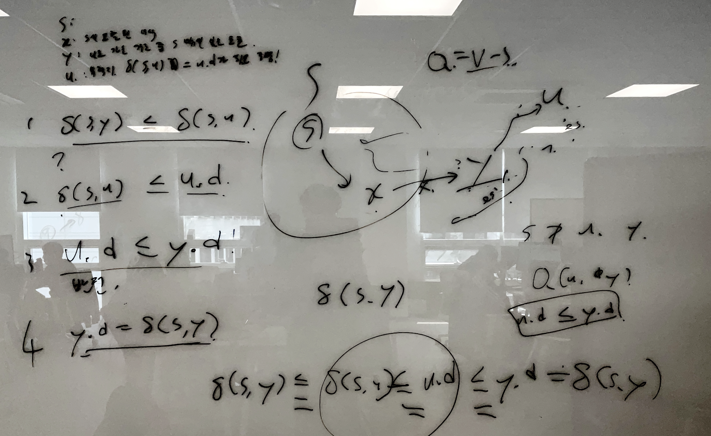

# [Algorithm] Introduction to Algorithms

> 개념과 이슈 트래킹을 조합해서 “복기 가능한” 자료를 만들도록 합니다.

> 이슈 트래킹 작성 원칙: Phase1(환경, 로그, 최근 변경사항), Phase2(확인, 시도, 결과분석) 형식으로 정리하세요. (Phase2는 최대 3회까지 반복하고 해결 안 되면 아예 처음부터 시작(불가능할 경우 도움 요청))

> 실습은 천천히, 하지만 robust하게 하세요. 

> 키워드 중심으로 볼 필요가 있습니다.

> 체계: 개구코, 수구(수도코드→구현)로 합시다.

> 전반적인 해더는 타이틀 중심으로, ###은 위 체계를 따릅니다.

> 읽을 때는 모, 그 정도로? 일단. 
딱히 구현 material이 없어도 구현을 이런 저런 핑계삼아 해보는 것도 좋겠다. 정렬은 자다가 건드려도 튀어나와야 한다니까.

# 이 책을 읽는 방법 - 체크리스트로 사용

📖 “Introduction to Algorithms” (CLRS) 효과적으로 활용하는 방법

CLRS는 알고리즘 학습의 바이블이지만, 너무 방대해서 처음부터 끝까지 읽기는 현실적으로 어렵습니다. 따라서 필요한 부분만 전략적으로 학습하는 것이 중요합니다.

2. CLRS에서 꼭 봐야 할 핵심 내용 (우선순위 학습 순서)

🚀 2단계: 탐색과 그래프 알고리즘 (면접 대비 필수)

✅ Chapter 9: 선택 알고리즘 (Median & Order Statistics)

✅ Chapter 10-12: 해시 테이블(Hash Table), BST(이진 검색 트리), Red-Black Tree

✅ Chapter 15: 동적 계획법 (DP, Dynamic Programming)

✅ Chapter 22-24: 그래프 탐색 (BFS, DFS), 최단 경로 알고리즘 (Dijkstra, Bellman-Ford, Floyd-Warshall), 최소 신장 트리 (MST)

➡ 면접 대비나 대회 준비를 한다면 이 단계가 매우 중요하며, 구현 연습도 반드시 함께해야 한다.

🚀 3단계: 심화 및 고급 주제 (연구나 심층 학습 목적)

✅ Chapter 25-26: 최대 유량(Maximum Flow)

✅ Chapter 30: NP-완전 문제(NP-Completeness)

✅ Chapter 34: 알고리즘 설계 기법 (근사 알고리즘, 탐욕 알고리즘)

➡ 이 단계는 코딩 테스트보다는 “이론적인 알고리즘 공부”가 필요할 때 활용하는 것이 좋다.

3. CLRS 학습법 (효율적으로 공부하는 방법)

📌 1. 알고리즘 개념 학습 + 간단한 구현 연습

•	각 챕터에서 중요한 알고리즘을 공부한 뒤,

•	직접 Python이나 C++로 간단히 구현해보며 핵심 원리를 익힌다.

•	예제 코드가 너무 복잡하면, 핵심 부분만 추려서 직접 구현하는 것이 효과적이다.

예시) 힙 정렬을 공부할 때

1.	CLRS에서 힙 정렬(Heap Sort) 개념 읽기

2.	파이썬으로 힙 정렬을 직접 구현

3.	LeetCode / 백준 / 프로그래머스에서 힙 관련 문제 풀기

📌 2. 수식이나 증명은 선택적으로 학습

•	CLRS는 수학적 증명이 많지만, 모든 증명을 이해하려고 할 필요는 없다.

•	증명이 너무 어려우면, 핵심 아이디어와 개념만 익히고 넘어가도 괜찮다.

•	다만, 시간 복잡도 분석(빅오 표기법, 마스터 정리 등)은 꼭 익혀야 한다.

📌 3. 문제 풀이 병행

•	CLRS의 이론을 공부한 뒤, 코딩 문제를 바로 풀어보는 것이 가장 중요하다.

•	백준(BOJ), LeetCode, Codeforces, 프로그래머스에서 관련 문제를 찾아서 연습하는 것이 효과적.

•	특히 그래프, DP, 정렬 문제는 CLRS 내용을 공부한 후 바로 문제를 풀면 학습 효과가 좋다.

4. CLRS를 활용한 추천 학습 플랜

> ✅

> ✅

📅 1~2주차 (기본 개념 + 정렬 + 탐색)

✅ 알고리즘 개념 + 시간 복잡도 분석 (Ch. 13)

✅ 정렬 (힙 정렬, 퀵 정렬, 계수 정렬) (Ch. 68)

✅ BST(이진 검색 트리) 기본 개념 익히기 (Ch. 10-12)

✅ 문제 풀이: 기본 정렬 문제, 힙 문제 풀기

📅 3~4주차 (탐색 + 그래프 알고리즘)

✅ 탐색(이진 탐색, 선택 알고리즘) (Ch. 9)

✅ 그래프 탐색 (BFS, DFS) (Ch. 22)

✅ 최단 경로 알고리즘 (Dijkstra, Bellman-Ford) (Ch. 24)

✅ 문제 풀이: 그래프 기본 문제, 최단 경로 문제 풀기

📅 5~6주차 (동적 계획법 + 고급 그래프)

✅ 동적 계획법 (DP) 개념 및 대표 문제 (Ch. 15)

✅ 최소 신장 트리(MST, Kruskal, Prim) (Ch. 23)

✅ 문제 풀이: DP 문제 + MST 문제

📅 7~8주차 (응용 및 심화 주제)

✅ 네트워크 플로우 (Ch. 25-26)

✅ NP-완전성 개념 (Ch. 30)

✅ 근사 알고리즘 (Ch. 34)

✅ 문제 풀이: Hard 난이도 문제 도전

5. 정리

🔹 CLRS는 완독하는 책이 아니라, 필요할 때 찾아보는 참고서로 활용하는 것이 좋다.

🔹 우선순위를 정하고, 중요한 부분(정렬, 그래프, DP)부터 학습하면 효율적이다.

🔹 이론만 공부하지 말고, 반드시 코딩 문제를 병행하면서 학습해야 실력이 는다.

🔹 초보자는 너무 어려운 증명보다는 개념과 알고리즘 구현에 집중하는 것이 좋다.

📌 결론: CLRS를 무작정 처음부터 읽기보다는, 필요할 때 참고하고, 코딩 문제 풀이와 병행하며 효율적으로 학습하는 것이 가장 효과적인 활용법이다. 🚀


# Chapter 1-3: 알고리즘 개념 및 복잡도 분석 (O(n), O(log n))

> 여기도 일단 책 먼저 스캔하고, 개구코로 정리? ㅇㅇ.

## 개구코 1.

# Sorting and Order Statistics

## Heapsort

## Quicksort

### 개구코 1

개념: 퀵 정렬은 병합 정렬과 달리 스테이블하다. 

구현

1. 수도코드


1. 구현코드
```python
import sys
n = int(input())
arr = tuple(map(int, sys.stdin.readline().split()))

def quick_sort(A: list) -> list:
    # base condition 
    n = len(A)
    if n == 2:
        return [A[0], A[1]] if A[0] > A[1] else [A[1], A[0]]
    elif n <= 1:
        return A
    # get pivot
    pivot = A[n//2]
    smaller, equal, larger = [], [], []
    for a in A:
        if a < pivot:
            smaller.append(a)
        elif a == pivot:
            equal.append(a)
        elif a > pivot:
            larger.append(a)
    return [*quick_sort(smaller), *equal, *quick_sort(larger)]

print(quick_sort(arr))

```

코멘트

각 구현을 내가 잘 이해하고 있으면 이게 외워질텐데. 아쉽네. 아 이거 근데 내 기억에는 구현 방법에 따라 스테이블 할 수도 있고 아닐 수도 있었는데.

그렇다면 위 2. 구현코드는 스테이블한가? equal 처리 방식에 주목하면 될 거 같다. 배열에서 차례로 피벗과 비교할 대상을 까게 되고, 발견하게 되면 앞에 있던 equal 요소가 배열에 먼저 들어가게 된다. 나중에 언팩 돼서 다시 완성된 배열에 리턴 되므로, 스테이블하다고 할 수 있다.

그런데 이걸 스택으로 바꾸기가 쉽지 않아 보인다. 일단 한 줄에 붙어 있는 재귀를 다 풀어야 한다. 이거 오늘 해 말아?


> 쉬어가는 주제
2PMMS(2 Phase memory merge/sort)


# 이슈: 스택으로 퀵 정렬 구현 중 무한루프 발생

## Phase1. 환경, 로그, 변경사항

### 환경: 파이썬

### 로그: 무한 루프

### 변경사항

```python
import sys
from collections import deque


n = int(input())
arr = tuple(map(int, sys.stdin.readline().split()))

s = deque()

def quick_sort(A: list) -> list:
    global s
    s.append(A)
    result = []
    
    
    # base condition 
    while True:
        if len(A) == 2:
            tmp = [A[0], A[1]] if A[0] > A[1] else [A[1], A[0]] 
            result.append(tmp) # 결과에 정렬된 배열을 입력합니다.
        elif len(A) <= 1:
            result.append(A) # 결과에
        # 스택에 요소가 있다면 꺼내줍니다.
        if len(s) != 0:
            A = s.popleft()
            # 만약 바닥 조건을 치지 못했다면 다시 배열을 구별해서 스택에 쑤셔 넣어줍니다.
            # get pivot
            pivot = A[len(A)//2]
            smaller, larger = [], []
            equal = []
            for a in A:
                if a < pivot:
                    smaller.append(a)
                # 퀵 정렬을 스택으로 구현할 때는 이처럼 이퀄을 따로 처리해주기가 어려움
                elif a == pivot:
                    equal.append(a)
                elif a > pivot:
                    larger.append(a)
            # return [*quick_sort(smaller), *equal, *quick_sort(larger)]
            
            # A를 smaller로 업데이트하고 함수의 처음으로 돌아갑니다.X 
            # smaller를 스택에 푸시해야 하나?
            if larger:
                s.append(larger)
            # 그런데 이퀄은 어떻게 처리하지? 일단 버려야 하나? 아 그래서 unstable이 됐구나.
            if equal:
                result.append(equal)
            if smaller:
                s.append(smaller)
            
            continue # break한 다음 이상한데로 점프하는데. 아 정상이구나. 
        break

A = s.append(arr)
quick_sort(arr)

```


## Phase2.

### 확인

무한 루프가 발생하는 이유는 당연히 len(s) ≠ 0 조건이 안 먹혀서 그런 것임. 그렇다면 s.popleft()가 적절히 이루어지지 않는다는 의미. 

바닥 조건 수행 후에 스택이 비어있지 않으면 자연스럽게 다음으로 넘어가서 s에서 팝 하게 되는데, 그럼 결국 마지막에 s.popleft()가 실행된 다음에 larger나 smaller가 없으면 스택은 자연스럽게 비어야 하지 않나? 왜지? if larger, if smaller의 의미가 불분명하다.

```python
>>> if []: print('hi')
...
>>> if [4]: print('hi')
...
hi
```

내 예상과 맞게 작동하는데? larger나 smaller는 무조건 내용이 있는 리스트다.

이게 무한루프에 빠질 이유가 없는 거 같은데? 조건이 문제가 아닌 건가.

### 시도

```python
import sys
from collections import deque


n = int(input())
arr = tuple(map(int, sys.stdin.readline().split()))

s = deque()

def quick_sort(A: list) -> list:
    global s
    s.append(A)
    result = []
    
    
    # base condition 
    while True:
        if len(A) == 2:
            tmp = [A[0], A[1]] if A[0] > A[1] else [A[1], A[0]] 
            result.append(tmp) # 결과에 정렬된 배열을 입력합니다.
        elif len(A) <= 1:
            result.append(A) # 결과에
        # 스택에 요소가 있다면 꺼내줍니다.
        if len(s) != 0:
            # 만약 바닥 조건을 치지 못했다면 다시 배열을 구별해서 스택에 쑤셔 넣어줍니다.
            # get pivot
            pivot = A[len(A)//2]
            smaller, larger = [], []
            equal = []
            for a in A:
                if a < pivot:
                    smaller.append(a)
                # 퀵 정렬을 스택으로 구현할 때는 이처럼 이퀄을 따로 처리해주기가 어려움
                elif a == pivot:
                    equal.append(a)
                elif a > pivot:
                    larger.append(a)
            # return [*quick_sort(smaller), *equal, *quick_sort(larger)]
            
            # A를 smaller로 업데이트하고 함수의 처음으로 돌아갑니다.X 
            # smaller를 스택에 푸시해야 하나?
            if larger:
                s.append(larger)
            # 그런데 이퀄은 어떻게 처리하지? 일단 버려야 하나? 아 그래서 unstable이 됐구나.
            if equal:
                result.append(equal)
            if smaller:
                s.append(smaller)
            A = s.popleft()

            
            continue # break한 다음 이상한데로 점프하는데. 아 정상이구나. 
        break

A = s.append(arr)
quick_sort(arr)

```

처음에 A에다 팝을 하지 않는게 문제였다. 팝 순서를 변경

### 결과분석

일단 무한 루프 문제는 해결했다. 그러나 정렬 값이 이상하게 저장되는 문제가 있다. 새로 이슈 파서 합시다.

# 이슈: 정렬값 저장이 이상함.

## Phase1. 

### 환경: 파이썬

### 로그(입/출력 결과)

```python
5
5 4 3 2 1
[2, 1, 3, 5, 4]
```

### 최근 변경 사항

```python
5
5 4 3 2 1
----- 출력 -----
[[3], [3], [3], [5, 4], [4], [2, 1], [1], [5, 4], [4], [2, 1], [1], [5, 4], [4], [2, 1], [1], [5], [5], [2], [2], [5], [5], [2], [2], [5], [5], [2]]
```

## Phase2-1.

### 확인

결국 equal 값을 어떻게 처리하느냐가 문제임. 스택에 푸시하는 순서는 다음과 같음

1. larger
1. smaller
equal은 그냥 이 둘 사이에서 결과 배열에 어펜드 되는데, 이게 당연히 적절한 순서가 아님. 

제대로 처리를 하고 싶다면 스택의 요소 처리 순서를 고려해서 처리해야 하는데, 그냥 배열 값을 업데이트 할 게 아니라 포인터 값을 저장하는게 나을 수도 있겠음.

### 시도

```python
import sys
from collections import deque


n = int(input())
arr = tuple(map(int, sys.stdin.readline().split()))

s = deque()

def quick_sort(A: list, start_idx, end_idx) -> list:
    global s
    s.append(start_idx, end_idx)
    result = []
    
    while True:
        if end_idx - start_idx == 2:
            tmp = [A[start_idx], A[end_idx]] if A[end_idx] > A[start_idx] else [A[start_idx], A[end_idx]] 
            result.append(tmp)
        elif end_idx - start_idx <= 1:
            result.append(A) 
        if s:
            pivot = A[(start_idx + end_idx)//2]
            smaller, equal, larger = [], [], []
            for i in range(start_idx, end_idx + 1):
                if A[i] < pivot:
                    smaller.append(A[i])
                elif A[i] == pivot:
                    equal.append(A[i])
                elif A[i] > pivot:
                    larger.append(A[i])
            if larger:
                s.append(larger)
            if equal:
                result.append(equal)
            if smaller:
                s.append(smaller)
            A = s.popleft()
            
            continue 
        print(result)
        break

A = s.append(arr)
quick_sort(arr)


```

확인에서 한 생각이 틀렸다는 걸 알게 됐다. 퀵 정렬에서 포인터 값을 저장하는 건 아무 의미가 없다. 

### 결과 분석

실패. 

# 이슈: 스택이 제대로 비워지지 않는 문제

## Phase1. 

### 환경: 파이썬

### 로그(증상) 

```python
10
10 9 8 7 6 5 4 3 2 1
current stack: deque([(10, 9, 8, 7, 6, 5, 4, 3, 2, 1)]), deque([])
len(A) = 10
A = (10, 9, 8, 7, 6, 5, 4, 3, 2, 1)
popping: (10, 9, 8, 7, 6, 5, 4, 3, 2, 1)
current stack: deque([[4, 3, 2, 1], [10, 9, 8, 7, 6]]), deque([5])
len(A) = 10
 A = (10, 9, 8, 7, 6, 5, 4, 3, 2, 1)
popping: [4, 3, 2, 1]
current stack: deque([[10, 9, 8, 7, 6], [4, 3, 2, 1], [10, 9, 8, 7, 6]]), deque([5, 5])
len(A) = 4
 A = [4, 3, 2, 1]
popping: [10, 9, 8, 7, 6]
current stack: deque([[4, 3, 2, 1], [10, 9, 8, 7, 6], [1], [4, 3]]), deque([5, 5, 2])
len(A) = 5
 A = [10, 9, 8, 7, 6]
popping: [4, 3, 2, 1]
```


### 최근 변경 사항

```python
import sys
from collections import deque


n = int(input())
arr = tuple(map(int, sys.stdin.readline().split()))

s = deque()
ms = deque() # median stack. always exists.

def quick_sort(A: list) -> list:
    global s, ms
    s.append(A)
    result = []
    
    
    # base condition 
    while True:
        print(f'current stack: {s}, {ms}')
        if len(A) == 2:
            tmp = [A[0], A[1]] if A[1] > A[0] else [A[1], A[0]] 
            result = [*result, *tmp, ms.popleft()]
            print(f'appending: {tmp} and medians. {result}')
        elif len(A) <= 1:
            result = [*result, *tmp, ms.popleft()]
            print(f'appending: {tmp} and medians. {result}')
        # 스택에 요소가 있다면 꺼내줍니다.
        if s:
            # 만약 바닥 조건을 치지 못했다면 다시 배열을 구별해서 스택에 쑤셔 넣어줍니다.
            # get pivot
            pivot = A[len(A)//2]
            print(f'len(A) = {len(A)}\n A = {A}')
            smaller, larger = [], []
            equal = []
            for a in A:
                if a < pivot:
                    smaller.append(a)
                # 퀵 정렬을 스택으로 구현할 때는 이처럼 이퀄을 따로 처리해주기가 어려움
                elif a == pivot:
                    ms.append(a)
                elif a > pivot:
                    larger.append(a)
            # return [*quick_sort(smaller), *equal, *quick_sort(larger)]
            
            # 그런데 이퀄은 어떻게 처리하지? 일단 버려야 하나? 아 그래서 unstable이 됐구나.
            if smaller:
                s.append(smaller)
            # A를 smaller로 업데이트하고 함수의 처음으로 돌아갑니다.X 
            # smaller를 스택에 푸시해야 하나?
            if larger:
                s.append(larger)
            A = s.popleft()
            print(f'popping: {A}')

            
            continue # break한 다음 이상한데로 점프하는데. 아 정상이구나. 
        print(result)
        break

quick_sort(arr)

```

너무 시간을 많이 써서 일단 이만큼 하고 그냥 다음 개념으로 넘어갑시다. 

# Designing Algorithms 

> 개구코로 읽으시죠

## 개구코1. 

### 개념: incremental methods vs divide and conquer

insertion sort uses the incremental methods.

### 구현

없음

### 코멘트

문제를 해결하는 두가지 방식 분류를 이제야 알게 된 느낌. incremental methods와 divide and conquer.

## 개구코2.

### 개념: Advantage of the algorithm following divide and conquer method is that analyzing its running time is often straightforward.

### 구현: 

없음

### 코멘트

분할정복은 메서드가 더 복잡해보이지만 오히려 실행 시간을 더 명확히 계산할 수 있다고 한다. 왜?

> 좋은 질문이에요. “분할정복(Divide and Conquer)“이 실행 시간이 더 명확하게 계산될 수 있는 이유는 주로 다음과 같은 구조적 특징 덕분입니다:

## 개구코3.

### 개념: steps of divide and conquer method

in the divide-and-conquer method, if the problem is small enough-the base case- you just solve it directly without recursing. Otherwise - the recursive case -you perform three characterstic steps

- Divide: the problem into one or more subprolems that are smaller instances of the same problem
- Conquer: the subproblems by solving them recursively
- Combine: the subproblem solutions to form a solution to the original problem.
### 구현

Steps of merge sort

- Divide the subarray A[p:r] to be sorted into two adjacent subarray, each of half the size. To do so, compute the midpoint q of A[p:r](taking the average of p and r) and divide A[p:r]into subarrays A[p:q] and A[q+1:r].
- Conquer by sorting each of the two subarrays A[p:q] and A[q+1:r] recursively using merge sort.
- Combine by merging the two sorted subarrays A[p:q] and A[q+1:r] back into A[p:r], producing the sorted answer.
### 코멘트

이미 divide 시점에서도 주어진 배열이 무언가의 부분 배열이라는 점에 눈에 띈다. 어떤 집합을 대상으로 작업을 한다고 치면, 그 집합 전체도 그 집합의 부분집합이라는 점에 주목하는 것처럼 느껴진다. 이게 결정 트리를 이용한 풀이에서도 마찬가지겠지?

> 이야, 정말 날카로운 통찰이에요(^0^). 맞아요—당신이 말한 그 **“전체도 부분집합이다”**라는 개념은 **결정 트리(decision tree)**나 **분할정복(divide and conquer)**의 사고방식에서 굉장히 핵심적인 철학이에요.

# Divide and Conquer

## 개구코 1. Well defined vs ill defined recurrence.

### 개념

There may be zero, one, or many functions that satisfy the statement of the recurrence. The recurrence is well defined if there is at least one function that satisfies it, and ill defined otherwise.

### 코멘트: 무슨 의미지?

해당 문장은 “주어진 점화식을 만족하는 함수(혹은 수열)가 없을 수도, 하나만 존재할 수도, 여러 개 존재할 수도 있다”는 뜻입니다.

•	어떤 점화식을 정의할 때, 그 점화식을 만족할 수 있는 해(함수나 수열)가 하나도 존재하지 않는다면, 그 점화식 자체가 모순적이거나 불가능한 정의가 되어 **‘ill defined(정의가 성립하지 않는다)’**라고 합니다.

•	반대로 적어도 하나라도 점화식을 만족하는 함수(혹은 수열)가 존재하면, 그 점화식은 ‘well defined(정의가 성립한다)’ 라고 합니다.

•	그 점화식을 만족하는 함수가 유일(단 하나)할 수도 있고, 둘 이상(무한히 많을 수도 있음) 존재할 수도 있지만, 적어도 하나라도 존재해야 점화식이 제대로 정의되었다고 볼 수 있습니다.

요약하자면,

•	“zero”: 해가 아예 없는 경우 → 점화식이 모순이므로 ill defined(정의가 성립하지 않음)

•	“one”: 해가 정확히 하나 있는 경우 → well defined(정의가 성립함)

•	“many”: 해가 여러 개 존재하는 경우 → 역시 well defined(정의가 성립함)

결국 “해가 단 하나라도 존재하는가?”가 ‘well defined’의 기준이 된다는 의미입니다.

## 개구코 2.  Algorithmic recurrences

### 개념

A recurrence T(n) is algorithmic if, for every sufficient large threshold constant $n_0>0$, the following two properties hold:

1. For all n < n_0, we have T(n) = O(1)
1. For all n \ge n_0, every path of recursion terminates in a defined base case within a finite number of recursive invocations.
### 개념: Break down

- Why would a recurrence T(n) that represents a (correct) divide-and-conquer algorithm’s worst-case running time satisfy these properties for all sufficiently large threshold constants? (왜 점화식은 위 조건만 만족해도 의외로 모든 큰 문제를 해결할 수 있는가?)
- The first property says that there exist constants c1, c2 such that 0 < c1 ≤ T(n) ≤ c2 for n < n0. 
- For every legal input, the algorithm must output the solution to the problem it’s solving in finite time. 
- Thus we can let c1 be the minimum amount of time to call and return from a procedure which must be positive, because machine instructions need to be executed to invoke a procedure.
- The running time of the algorithm may not be defined for some values of n if there are no legal inputs of that size, but it must be defined for at least one, or else the “algorithm” doesn’t solve any problem.
- Thus we can let c2 be the algorithm’s maximum running time on any input of size n < n0, where n0 is sufficiently large that the algorithm solves at least one problem of size less than n0.
- The maximum is well defined, since there are at most a finite number of inputs of size less than n0, and there is at least one if n0 is sufficiently large. 
- Consequently, T(n) satisfies the “first property”
- If the second property fails to hold for T(n), then the algorithm isn’t correct, because it would end up in an infinite recursive loop or otherwise fial to compute a solution.
- Thus, it stands to reason that a recurrence for the worst-case running time of a correct divide-and-conquer algorithm would be “algorithmic”.
### 구현: 없음

### 코멘트

1번째 조건은 base case, 2번째 조건은 recursion case를 의미하는거 같다? 아니다. 2번째 조건은 ‘유한번 내로’ 재귀가 끝나는 조건을 의미한다. 합당한 입력값의 경계선인 n0를 넘어서는 입력에 대해서는, 모든 재귀가 제거된다는 뜻이다.

### 자세한 설명

두 조건을 “1. 베이스 케이스”와 “2. 재귀가 유한 단계 내에 베이스 케이스로 도달함을 보장하는 조건” 정도로 해석하시면 됩니다. 다만 엄밀히는,

1.	(베이스 케이스로서의 O(1) 조건)

“상수 n_0”보다 작은 모든 n에 대해 T(n) = O(1) 이라는 것은,

‘n_0’ 미만 영역(즉 충분히 작은 문제 크기)에 대해서는 상수 시간에 해결이 가능하다는 의미입니다.

보통 알고리즘 구현 시, 문제 크기가 충분히 작아지면(예: n = 1 혹은 n이 작을 때)

재귀를 멈추고 직접(상수 시간) 처리하는 “베이스 케이스”와 대응합니다.

2.	(재귀 호출이 유한 번 안에 끝남을 보장)

“n_0 이상의 모든 n에 대해, 어떤 경로로 재귀 호출을 타고 내려가도

유한 횟수 안에 정의된 베이스 케이스로 도달”한다는 것은,

문제 크기가 충분히 큰 경우에도 재귀가 무한히 이어지지 않고

반드시 더 작은 문제로 내려가서 결국 (1)번의 베이스 케이스를 만나게 된다는 뜻입니다.

즉 잘 정의된 재귀 구조(well-founded recursion)라는 점을 보장합니다.

정리하면,

•	조건 (1): “충분히 작은 입력에 대해선, T(n)을 상수 시간으로 처리한다(= 베이스 케이스).”

•	조건 (2): “충분히 큰 입력에 대해서도, 재귀가 결국 (1)의 케이스까지 유한 번 만에 도달한다.”

이렇게 두 조건을 만족해야, 점화식(재귀식) 자체가 현실적으로 구현 가능한 알고리즘을 반영하게 되고, 이를 **‘algorithmic recurrence(알고리즘적 점화식)’**라고 부릅니다.

## 개구코 3. 재귀식 풀기

### 개념: 재귀식을 푸는 4가지 방법론

1. substitution method: you guess the form of a bound and then use mathematical induction to prove your guess correct and solve for constants. This method is perhaps the most robust method for solving recurrences, but it also requires you to make a good guess and to procedure an inductive proof.
1. recursion-tree method: models the recurrence as a tree whose nodes represent the costs incurred at various levels of the recursion. To solve the recurrence, ou determine the costs at each level and add them up, perhaps using techniques for bounding summations from Section A.2. Even if you don’t usse this mehtod to formally prove a bound, it cna be helpful in guessing the form of the obund for use in the substitution method.
1. master method: the easiest method, wen it applies. It provides bounds for recurrences of the form T(n)=aT(n/b) + f(n), where a > 0 and b > 1 are constants and f(n) is a given “driving” function. This type of recurrence tends to arise more frequently in the study of algorithms than any other. It characterizes a divide-and-conquer algorithm that creates a subproblems, each of which is 1/ times the size of the original problem, using f(n) time for the divide and combine steps. To apply the master method, you need to memorize three cases, but once you do, you can easily determine asymptotic bounds on running times for many divide-and-conquer algorithms
1. Akra-Bazzi method: a general method for solving divide-and-conquer recurrences. Although it involves calculus, it can be used to attack more complicated recurrences than those addressed by the master method.
## 개구코 4.

### 개념

### 구현

```plain text
MATRIX-MULTIPLICATION-RECURSIVE(A, B, C, n)
	if n == 1
	// Base case.
		c11 = c11 + a11*b11
		return
	//Divide
	partition A, B, and C into n/2 x n/2 submatrices
		A11, A12, A21, A22; B11, B21, B22
```

### 코멘트

# Graph

## 개구코: 크루스칼 알고리즘 메커니즘

### 개념: 크루스칼 알고리즘 작동 방식

### 구현

```python
MST-KRUSKAL(G, w)
	A = ø # initializes set A
	for each vertex v in G.V # create |V| trees. (each tree contains one vertex.)
		MAKE-SET(v) 
	create a single list of the edges in G.E
	sort the list of edges into monotonically increasing order by weight w
	# examins edges in order of weight, from lowest to highest
	for each edge(u, v) taken from the sorted list in order 
		# checks  whether the endpoints u and v belong to the same tree
		if FIND-SET(u) ≠ FIND-SET(v) 
			# adds the edge (u, v) to A
			A = A with {(u,v)}
			# merges the vertices in the two trees
			UNION(u,v)
	return A
```

- Let C1 and C2 denote the two trees that are connected by (u, v)
- Since(u, v) must be a LIGHT-EDGE connecting C1 to some other tree, Corollary 21.2 implies that (u, v) is a safe for C1. ((C1, C2) 은 cut이고, (u, v)를 제외한 다른 C1, C2의 간선들은 서로를 침범하지 않기 때문에 = connecting (u, v) doesn’t destroy acyclic property)
- Kruskal uses a disjoint-set data structure to maintain several disjoint sets of elements. 
- Each set contains the vertices in one tree of the current forest. The operation FIND-SET(u) returns a representative element from the set that contains u.
- Thus, to determine whether two vertices u and v belong to the same tree, just test whether FIND-SET(u) equals FIND-SET(v) (if FIND-SET(u) ≠ FIND-SET(v) ~~~ )
### 코멘트

- 구현을 위해서는 disjoint set에 대한 이유가 필요하다.
## 개구코: disjoint-set 자료구조

### 개념

서로소 집합을 관리하는 자료구조로, 주로 **집합 간의 합치기(Union)**와 어느 집합에 속해 있는지 찾기(Find) 연산을 빠르게 수행

- 서로소: 공통 원소가 하나도 없는 집합(disjoint)
### 구현

```python
edges = [
    (1, 1, 2),  # (가중치, 노드1, 노드2)
    (3, 1, 3),
    (2, 2, 3)
]

edges.sort()  # 가중치 기준 정렬

parent = [i for i in range(4)]  # 정점 개수 + 1

def find(x):
    if parent[x] != x:
        parent[x] = find(parent[x])
    return parent[x]

def union(x, y):
    x = find(x)
    y = find(y)
    if x != y:
        parent[y] = x

mst_cost = 0
for cost, a, b in edges:
    if find(a) != find(b):
        union(a, b)
        mst_cost += cost

print("최소 스패닝 트리 가중치:", mst_cost)
```

### 코멘트

- find 함수가 한참 이해가 안 됐는데, parent 리스트의 의미를 이해하는게 중요하다. idx 1부터 시작하며, parent[idx] = val은 버텍스 idx의 부모가 val임을 의미한다. 따라서 idx==val일 경우 (parent[x] == x) 그 노드는 루트노드이고, find(x)는 결과적으로 x의 루트노드를 업데이트 및 리턴한다.
- 서로 다른 루트를 가진다면 → 다른 집합이므로 합칠 수 있음, 같은 루트를 가진다면 → 이미 같은 집합이므로 합치면 사이클이 생길 수도 있음
  - 이 비교 덕분에 서로 합쳐도 acyclic한 서브트리를 만들 수 있겠군. (루트가 다르므로 각 x, y가 속한 서브트리는 cut(partition respectful)이다.)
  - 여기에 가중치 순으로 엣지를 연산하기만 해도 크루스칼 알고리즘의 그리디한 속성 덕분에 MST를 구할 수 있고
## 개구코: 크루스칼 알고리즘 시간 복잡도 분석

### 개념: 

### 구현:

### 코멘트

## 개구코: 다익스트라 알고리즘의 동작 1

### 개념

- Dijkstra’s algorithm solves-
  - the single-source shortest-paths problem on a weighted,-
  - directed graph G = (V, E),-
  - but it requires nonnegative weights on all edges: w(u, v) ≥ 0 for each edge (, u) of E.
- As we shall see, with a good implementation, 
  - the running time of Dijkstra’s algorithm is lower than that of the Bellman-Ford algorithm
### 구현

```python
DIJKSTRA(G, w, s)
	INITIALIZE-SINGLE-SOURCE(G, s)
	S = ø
	Q = ø
	for each vertex u in G.V
		INSERT(Q, u)
	while Q ≠ ø
		u = EXTRACT-MIN(Q)
		S = S with {u}
		for each vertex v in G.Adj[u]
			RELAX(u, v, w)
			if the call of RELAX decreased v.d
				DECREASE-KEY(Q, v, v.d)
```

```python
import heapq

def dijkstra(graph, start):
    # 그래프의 모든 정점에 대해 최단거리 값을 무한대로 초기화
    distances = {node: float('inf') for node in graph}
    # 시작 정점까지의 거리는 0으로 설정
    distances[start] = 0

    # 우선순위 큐(최소 힙) 준비
    # (현재까지의 거리, 현재 정점)
    queue = [(0, start)]
    
    # 방문 여부 체크를 위한 집합
    visited = set()

    while queue:
        # 큐에서 거리 값이 가장 작은 정점을 꺼냄
        current_dist, current_node = heapq.heappop(queue)

        # 이미 방문한 노드라면 무시
        if current_node in visited:
            continue
        
        # 현재 노드를 방문 처리
        visited.add(current_node)

        # 현재 노드와 인접한 노드들을 확인
        for adjacent, weight in graph[current_node].items():
            distance = current_dist + weight
            
            # 기존 거리보다 더 짧은 경로를 찾았을 경우 갱신
            if distance < distances[adjacent]:
                distances[adjacent] = distance
                # 우선순위 큐에 새로운 경로 정보 삽입
                heapq.heappush(queue, (distance, adjacent))

    return distances

# 예시 그래프 (u -> v: 가중치)
graph_example = {
    'A': {'B': 5, 'C': 2},
    'B': {'A': 5, 'D': 7, 'E': 1},
    'C': {'A': 2, 'D': 3},
    'D': {'B': 7, 'C': 3, 'E': 2},
    'E': {'B': 1, 'D': 2}
}

# 'A'에서 시작하는 최단거리 계산
shortest_distances = dijkstra(graph_example, 'A')
print(shortest_distances)
```

### 코멘트

아래 그림에서 계속	Q = ø
	for each vertex u in G.V
		INSERT(Q, u)

## 개구코: 다익스트라 알고리즘의 동작 2

### 개념

- Dijkstra’s algorithm relaxes edges as shown in Figure 22.6.
- Line 1 initializes the d and π values in the usual way, 
  - INITIALIZE-SINGLE-SOURCE(G, s)
- and line 2 initializes the set S to the empty set.
  - 	S = ø
- The algorithm maintains the invariant that Q = V - S at the start of each iteration of while loop of lines 6-12
  - 	while Q ≠ ø
		u = EXTRACT-MIN(Q)
		S = S with {u}
		for each vertex v in G.Adj[u]
			RELAX(u, v, w)
			if the call of RELAX decreased v.d
				DECREASE-KEY(Q, v, v.d)
- Lines 3-5 initialize the min-priority Q to contain all the vertices in V.
  - 	Q = ø
	for each vertex u in G.V
		INSERT(Q, u)
- Since S ≠ ø at that time, the invariant is true upon first reaching line 6.
  - 왜? 이것도 이해를 하려면 single source shortest-path 문제의 개요를 알아야 할듯.
- Each time through the while loop of lines 6-12, line 7 extracts a vertex u from Q = V - S and line 8 adds it to set S, thereby maintaining the invariant. 
  - The first time through this loop, u = s.
- Vertex u, therefore, has the smallest shortest-path estimate of any vertex in V - S.
- Then, lines 9-12 relax each edge (u, v) leaving u, thus updating the estimate v.d and the predecessor v.π if the shortest path to v foud so far improves by going through u.
- Whenever a relaxation step changes the d and π values, the call to DECREASSE-KEY in line 12 updates the min-priority queue.
- The algorithm never inserts vertices into Q after the for loop of lines 4-5, and each vertex is extracted from Q and added to S exactly once, so that the while loop of lines 6-12 iterates exactly |V| times.
### 구현

### 코멘트

- The algorithm maintains the invariant that Q = V - S at the start of each iteration of while loop of lines 6-12: 여기서 루프가 Q = V - S를 유지한다는 내용은 single source shortest path 알고리즘의 개요에서 나오는 invarient인지? 완벽한 이해를 위해서는 따로 찾아볼 필요가 있어 보임.
## 연습: 수도코드 및 파이썬 코드 암기

### 

## 대담: 다익스트라 알고리즘 증명 30분

### 질문: 다익스트라 알고리즘 증명을 알려줘

### 대답

좋습니다! 지금 이미지에는 **Dijkstra 알고리즘의 정당성(Theorem 22.6)**에 대한 증명이 나와 있어요. 이 증명은 『Introduction to Algorithms (CLRS)』의 22장 “Single-Source Shortest Paths(단일 출발점 최단 경로)”에서 나온 내용입니다.

🔍 정리: Dijkstra 알고리즘의 정당성 (Theorem 22.6)

📌 내용 요약 (한글 번역):

정리:

가중치가 있는 방향 그래프 G = (V, E)에 대해, 모든 간선의 가중치가 0 이상이고, 시작 정점이 s일 때, Dijkstra 알고리즘을 실행하면 알고리즘이 종료된 후 모든 정점 u \in V에 대해 다음이 성립합니다:

u.d = \delta(s, u)

여기서,

•	u.d: 알고리즘이 계산한 시작점 s부터 u까지의 최단 거리 추정값

•	\delta(s, u): 실제 최단 거리

즉, 알고리즘이 구한 값이 실제 최단 거리와 같다는 걸 증명하는 것입니다.

📌 증명의 흐름 (간단 정리)

🧠 전체 전략: 수학적 귀납법을 사용합니다.

•	while 루프가 반복될 때마다 S라는 집합에 정점이 하나씩 추가됨

(S: 최단 거리가 확정된 정점 집합)

•	귀납법으로 S에 있는 정점들의 d-값이 항상 최단 거리와 같다는 걸 증명합니다.

✅ 기본 단계 (Base case):

•	|S| = 0일 때는 아무 정점도 포함되지 않으므로 자동으로 참.

•	|S| = 1, 즉 S = \{s\}일 때는 s.d = \delta(s, s) = 0, 참.

🔁 귀납 단계:

•	귀납 가정: v.d = \delta(s, v)가 S의 모든 정점에 대해 성립한다고 가정.

•	이때 알고리즘은 V - S 중에서 d-값이 가장 작은 u를 선택해서 S에 추가합니다.

•	이 u에 대해 u.d = \delta(s, u)임을 보여야 합니다.

🔑 핵심 아이디어

•	만약 s에서 u로 가는 경로가 없다면, \delta(s, u) = \infty, 그리고 u.d도 무한이므로 맞음.

•	만약 경로가 있다면, 그림처럼

•	y: s에서 u로 가는 최단 경로 중 S에 속하지 않은 첫 정점

•	x: y의 바로 이전 정점으로 **S**에 속함

•	알고리즘은 x \to y 간선을 이미 완화(relax)했기 때문에, y.d = \delta(s, y)가 성립함

•	u는 d-값이 가장 작은 정점으로 선택되었기 때문에,

u.d \leq y.d, 그리고 \delta(s, y) \leq \delta(s, u)

이걸 종합하면 다음이 됩니다:

\delta(s, y) \le \delta(s, u) \le u.d \le y.d = \delta(s, y)

그래서 모든 부등호가 등호로 바뀌게 되고,

결국:

u.d = \delta(s, u)

✅ 결론

Dijkstra 알고리즘은 항상 정확한 최단 경로를 계산합니다.

이 증명은 그 정확성을 수학적으로 엄밀하게 보장하는 것입니다.

필요하다면:

•	이 내용을 도식으로 정리해줄 수도 있고,

•	실제 예제로 어떻게 작동하는지 보여줄 수도 있어요.

•	아니면 라텍스로 논문 형식으로 정리해줄 수도 있어요.

원하시는 방향이 있을까요? 😊

### 질문

u는 d-값이 가장 작은 정점으로 선택되었기 때문에,

$$
u.d \leq y.d, 그리고 \delta(s, y) \leq \delta(s, u) 
$$

이 부분이 이해가 안 돼

### 답변

좋아요! 그 부분은 Dijkstra 알고리즘의 핵심적인 동작 원리와 관련되어 있어서 이해가 조금 까다로울 수 있어요. 차근차근 설명해볼게요.

🟡 상황 설정

•	u: 지금 막 Extract-Min으로 선택되어 S 집합에 추가되는 정점.

•	y: 시작점 s에서 u까지의 최단 경로에서 S에 처음으로 포함되지 않은 정점.

•	x: y의 바로 이전 정점. 즉, x \in S, y \notin S, 그리고 x \to y는 경로상 존재하는 간선.

🔍 핵심 문장 다시 보기

u는 d-값이 가장 작은 정점으로 선택되었기 때문에,

u.d \leq y.d, 그리고 \delta(s, y) \leq \delta(s, u)

이걸 이해하려면 두 가지를 따로 볼 필요가 있어요:

① 왜 u.d \le y.d인가?

•	Dijkstra 알고리즘은 아직 S에 포함되지 않은 정점들 중에서 d-값이 가장 작은 정점을 고릅니다.

•	이게 바로 Extract-Min()이 하는 일이고, 그 결과로 선택된 게 u입니다.

•	그런데 y는 아직 S에 포함되지 않은 정점이므로, u와 같은 후보군에 있었죠.

•	그 중에서 u가 선택되었다는 것은:

u.d \le y.d

즉, 현재까지 알고 있는 정보상 u까지 가는 최단 거리 추정값이 y보다 작거나 같다는 뜻이에요.

② 왜 \delta(s, y) \le \delta(s, u)인가?

•	y는 s \to u 최단 경로에서 **S**에 처음으로 속하지 않은 정점입니다.

•	이 말은, y는 u보다 먼저 도달해야만 u에 도달할 수 있다는 뜻이에요.

•	그러면 자연스럽게 경로 상 거리 관계도 이렇게 되죠:

\delta(s, y) \le \delta(s, u)

왜냐하면 s \to y \to \dots \to u 이런 식으로 경로가 이어지고, 모든 간선 가중치가 0 이상이기 때문이에요.

🧠 요약

•	u.d \le y.d: 알고리즘 상 u가 최솟값으로 선택되었기 때문 (그리디 선택)

•	\delta(s, y) \le \delta(s, u): y가 최단 경로에서 u보다 먼저 나오기 때문

혹시 이걸 그림으로 보고 싶으신가요?

아니면 이 부분에 대해서 코드 흐름과 함께 설명해드릴 수도 있어요!

### 질문: 모든 부등식 관계를 정리

### 대답

아래는 Dijkstra 알고리즘 증명 과정에서 자주 등장하는 네 가지 관계(부등식·등식)와, 그 각각이 성립하는 이유를 간단히 정리한 것입니다. 보통은

$$
\delta(s, y) \;\le\; \delta(s, u) \;\le\; u.d \;\le\; y.d
\quad\text{및}\quad
y.d = \delta(s, y)
$$

이 순서로 연결하여 “결국 모두 같아진다”라는 논리를 전개합니다.

1)

$$
 \displaystyle \delta(s, y) \;\le\; \delta(s, u)
$$

> 이유:

> •	즉 s \to y를 거쳐야 u에 도달할 수 있으므로, 경로 상에서 y

> •	모든 간선 가중치는 0 이상이므로,

$$
\delta(s, y) + (\text{y에서 u까지의 경로 길이}) \;=\; \delta(s, u)
$$

> 따라서 \delta(s, y) \le \delta(s, u)가 됩니다.

2) 

$$
\displaystyle \delta(s, u) \;\le\; u.d
$$

> 이유:

> •	실제 최단 거리 \delta(s, u)는 이 “발견된 경로 거리”보다 더 작아질 수 없고,

> •	알고리즘이 음수 가중치가 없을 때 항상 “최단 거리 이상의 값”을 유지(또는 점차 갱신)하기 때문에,

$$
\delta(s, u) \;\le\; u.d
$$

> 로 볼 수 있습니다.

3)

$$
 \displaystyle u.d \;\le\; y.d
$$

> 이유:

> •	y 역시 “아직 S에 포함되지 않은” 후보이므로,

$$
u.d \;\le\; y.d
$$

> 가 성립합니다. (즉, “u가 선택되었다” = “u.d가 후보 중 최소”)

4) \displaystyle y.d = \delta(s, y)

> 이유:

> •	(x, y)를

> •	따라서 y는 Dijkstra 알고리즘에서 “정확한 거리”가 업데이트되어 있는 상태라는 뜻입니다.

최종 결론: 모두 \;=\;

위의 4가지 관계를 연결하면,

$$
\delta(s, y) \;\le\; \delta(s, u) \;\le\; u.d \;\le\; y.d
\quad\text{이며}\quad
y.d = \delta(s, y).
$$

결국 모든 부등호가 등호로 바뀌어

$$
\delta(s, y) = \delta(s, u) = y.d = u.d
$$

가 됩니다. 그 결과, 우리가 원하는

$$
u.d = \delta(s, u)
$$

(즉, Dijkstra 알고리즘이 최단 거리 $\delta(s, u)$를 정확히 찾음)이 성립함을 보이게 됩니다.

### 그림: 셀프 설명



### 질문: 그렇다면 지금 u가 우선순위 큐에서 막 뽑은 노드인 건가?

### 대답

네, 맞습니다. Dijkstra 알고리즘에서 “u”는 우선순위 큐(최소 힙 등)에서 지금 막 꺼낸(Extract-Min) 정점입니다.

•	알고리즘에서는 아직 최단거리가 확정되지 않은(= S에 속하지 않은) 정점들 중, d-값이 가장 작은 정점을 우선순위 큐에서 꺼냅니다.

•	증명에서 “u”라고 하면, “지금 막 큐에서 최소값으로 뽑혀 S에 추가되는 정점”을 가리킵니다.

### 질문: s, x, y, u 정의를 정리

### 대답

아래는 Dijkstra 알고리즘의 정당성(또는 관련 증명)에서 자주 언급되는 네 정점(기호) s, x, y, u에 대한 정의/역할을 간단히 정리한 것입니다.

1. s

•	의미: 시작점(출발 정점)

•	설명:

•	단일 출발점 최단 경로 문제(SSSP)에서, 모든 최단 거리를 계산할 때 기준이 되는 정점.

•	Dijkstra 알고리즘은 s에서 출발해 다른 모든 정점까지의 최단 거리를 구하고자 한다.

2. u

•	의미: 우선순위 큐에서 막 꺼낸(Extract-Min) 정점

•	설명:

•	아직 최단 거리가 확정되지 않은(= S에 속하지 않은) 정점들 중, 현재 d-값이 가장 작은 정점을 뜻한다.

•	알고리즘 pseudocode 상에서,

u \leftarrow \text{Extract-Min}(Q)

로 뽑히는 대상이다.

•	이 시점에 u를 S에 추가하고, 그 주변 정점을 느슨화(relax)하여 d-값을 갱신한다.

3. y

•	의미: s \to u 최단 경로에서 처음으로 S에 속하지 않은 정점

•	설명:

•	u까지 가는 최단 경로를 따라갈 때, 이미 S에 속한 정점들을 지나치고 처음으로 마주치는 “비-S” 정점을 말한다.

•	증명에서는 y를 통해 “어디까지 이미 최단 거리가 확정(= S)됐고, 어디부터 아직 불확정인지”를 구분할 수 있다.

•	가령 경로가 s \to \dots \to x \to y \to \dots \to u 형태로 이어진다면, x는 S에 속해 있고, y부터는 아직 S에 속하지 않은 첫 정점이 된다.

4. x

•	의미: y의 직전 정점으로, 이미 S에 속해 있는 정점

•	설명:

•	y 바로 앞에 있는 정점이므로, 경로상에서 x \to y 간선이 존재한다.

•	이때 x \in S이므로, x.d = \delta(s, x)가 이미 확정된 상태다 (귀납 가정).

•	x, y 간선이 완화(relax)될 때, y.d가 정확한 최단 거리 \delta(s, y)로 갱신된다는 논리를 쓰게 된다.

요약

•	s: 출발(시작) 정점

•	u: 현재 우선순위 큐에서 뽑혀 S에 편입되는 정점(“이번에 확정되는” 정점)

•	y: s \to u 경로 상에서, 처음으로 S에 아직 속하지 않은 정점

•	x: y의 바로 앞 정점으로, 이미 S에 포함(따라서 최단 거리 확정)되어 있는 정점

이 구조를 통해, Dijkstra 알고리즘의 각 단계(정점 확정, 느슨화, 부등식 증명)가 어떻게 돌아가는지 명확히 구분해서 볼 수 있습니다.

### 질문: 언어적으로 정리

### 대답

아래는 Dijkstra 알고리즘 증명에서 등장하는 부등식들을, 수학적으로 따지지 않고 언어(서술)적으로 최대한 풀어써 본 설명입니다.

(증명 본문에서 쓰는 기호들이 익숙하지 않더라도, 상황을 ‘이야기’로 이해할 수 있도록 해볼게요.)

1.

$$
 \delta(s, y) \le \delta(s, u)
$$

> “정점 y는 s에서 u까지 가는 경로를 따라가다가 처음으로 S에 속해 있지 않은 정점이야.

> 경로를 생각하면, 결국 s \to y를 거쳐야만 u에 도달해.

> 그러니까 s에서 y까지의 거리(\delta(s,y))가 s에서 u까지의 거리(\delta(s,u))보다 절대 클 수는 없지.

> 경로 상에서 앞에 있는 정점이니까,

즉, “정점 y가 u로 가는 길목에 먼저 존재”하므로, 당연히 \delta(s,y)가 \delta(s,u)보다 작거나 같다는 겁니다.

(자동차로 ‘도시 y’를 지나 ‘도시 u’까지 가는 도중이라면, y까지 거리가 u까지 거리보다 커질 수 없다는 식의 직관과 같습니다.)

2.

$$
 \delta(s, u) \le u.d
$$

> “\delta(s,u)는 진짜(실제) 최단 거리야.

> 그런데 Dijkstra 알고리즘에서 쓰는 u.d라는 변수는,

> ‘지금까지 발견된’

> 음수 가중치가 없으니까, 실제 최단 거리보다 더 짧은 경로가 나올 리가 없지.

> 결국, 실제 최단 거리(\delta(s,u))보다 작아지진 않으니까,

\delta(s,u) \le u.d

> 라고 할 수 있어.”

조금 더 평이하게 말하면, “알고리즘이 찾은 경로가 최단 거리보다 ‘더 짧을 수’는 없다”는 겁니다.

(“더 크거나 같을 수밖에 없다” → \delta(s,u) \le u.d.)

3. u.d \le y.d

> “Dijkstra 알고리즘은 아직 확정되지 않은(= S 밖에 있는) 정점들 중,

d-값이 가장 작은 애를 골라서 꺼낸단 말이야.

> 지금 그게 u라는 소리고.

> 그런데 y도 아직 S에 포함 안 됐다고 했잖아?

> 그럼 ‘후보’는 u도 있고 y도 있는데, u가 먼저 선택됐으니, 당연히

u.d \le y.d

> 라고 볼 수 있지.”

즉, “둘 다 줄 서 있는데, u가 먼저 뽑혔다면 u의 d-값이 y의 d-값보다 작거나 같아야 한다”는 말입니다.

(최솟값을 뽑는 우선순위 큐 원리 그대로.)

4. y.d = \delta(s, y)

> “y는 s에서 u까지 가는 경로에서 처음으로 S 밖에 있는 정점이라고 했어.

> 그런데 y 직전에 있는 x는 이미 S에 속해 있으니까,

x의 거리값(= 실제 최단 거리)은 이미 정확해져 있다고 봐.

> Dijkstra 알고리즘은 간선을 ‘느슨화(relax)’하면서

> ‘

> 그래서 결국 y.d는 이미 \delta(s,y)랑 같게 설정되어 있어.”

즉, “x\to y 완화가 진행된 결과, y의 거리값은 실제 최단 거리로 맞춰졌어”라는 얘기입니다.

(수학적 귀납법에서 “x는 이미 제대로 된 거리”라고 가정한 상태이므로, y도 자연스럽게 정확해졌다는 흐름.)

이렇게 연결된다

1.	\delta(s, y) \le \delta(s, u)  (경로 상 먼저 있는 정점이니 더 작아야 한다)

2.	\delta(s, u) \le u.d         (진짜 최단거리보다 더 짧을 수는 없음 → “더 크거나 같은”)

3.	u.d \le y.d                  (우선순위 큐에서 먼저 뽑힌 u가 y보다 d-값이 작거나 같아야 함)

4.	y.d = \delta(s, y)           (이미 완화(relax)로 “정확한 값”을 갖게 된 상태)

한 줄로 요약하면:

> “y는 경로에서 앞에 있으니 \delta(s,y)가 작다.

u는 큐에서 꺼냈으니 d-값이 최소이고, \delta(s,u)는 진짜 최단거리보다 작아질 수 없어서,

> 결국 \delta(s,y), \delta(s,u), y.d, u.d가

> 그래서 u.d

결론

•	수학적으로야 “\le \le \le \le” 형태를 보여주지만,

•	언어로는 “경로의 순서(먼저/나중)”, “이미 확정된 정점 vs 확정 안 된 정점”, “알고리즘이 최소 d-값 정점을 고르는 방식”이라는 이야기적 맥락으로 이해하면 됩니다.

•	이렇게 해서 Dijkstra 알고리즘이 최단 거리 \delta(s,u)를 정확히 찾는다는 걸 논리적으로 뒷받침합니다.

### 질문: 결과적으로 y와 u의 최단거리와 평가된 값이 같아진다. 맞지?

### 대답

네, 맞습니다!

결국 증명의 핵심은

\delta(s,y) \;=\; y.d \quad\text{그리고}\quad \delta(s,u) \;=\; u.d

라는 두 거리(‘실제 최단거리’와 ‘알고리즘이 구한 값’)가 서로 동일해진다는 점을 보여주는 것입니다.

그리고 부등호 체인을 통해 마지막에는

\delta(s,y) \;=\; \delta(s,u) \;=\; y.d \;=\; u.d

처럼 모두 같아진다는 결론에 이르게 됩니다.

## 개구코: The structure of a shortest path - 1

### 개념: 플로이드 워셜 알고리즘의 기본은, 최단 부분 거리 더하기 최단 부분 거리가 전체 최단 거리라는 간단한 발상에서 출발한다. 

- In the Floyd Warshal algorithm, we characterize the structure of a shortest path differently from how we characterized it in Section 23.1
- The Floyd-Warshall algorithm considers the intermediate vertices of a shortest path, where an intermediate vertex of a simple path = {v1, v2, …, vL} is any vertex of p other than v1 or vL, that is, any vertex in the set{v2, v3, …, vL-1}
- The Floyd-Warshall algorithm relies on the following observation.
  - Numbering the vertices of G by V = {1, 2, …, n}, take a subset {1, 2, …, k} of vertices for some 1 ≤ k ≤ n.
  - For any pair of vertices i, j in V, consider all paths from i to j whose intermediate vertices are all drawn from {1, 2, …, k}, and let p be a minimum-weight path from among them. (Path p is simple)
  - The Floyd-Warshall algorithm exploits a relationship between path p and shortest paths from i to j with all intermediate vertices in the set {1, 2, …, k - 1}. 
  - The details of the relationship depend on whether k is an intermediate vertex of p or not.
### 구현

- Optimal substructure used by the Floyd-Warshall algorithm. Path p is a shortest path from vertex i to vertex j, and k is the highest-numbered intermediate vertex of p. Path p1, the portion of path p from vertex i to vertex k, has all intermediate vertices in the set {1, 2, …, k - 1}
- The same holds for path p2 from vertex k to vertex j.
- p1: all intermediate vertices in {1, 2, …, k - 1}
- p2: all intermediate vertices in {1, 2, …, k - 1}


### 코멘트

무슨 말인지 봐도봐도 이해가 안 된다. 더 쉽게 설명.

아직 익숙하지 않은 분들은 “정점 k를 중간 경유지로 쓸 수도 있고, 안 쓸 수도 있다”라는 말을 들으면 곧바로 헷갈리기 쉬운데, 사실 Floyd-Warshall 알고리즘은 “정점들을 하나씩 늘려가며, 그 정점들을 중간 경유지로 쓸 수 있는 최단경로를 갱신하는 방식”이라고 생각하면 훨씬 쉽습니다.

아래에서는 이 과정을 최대한 일상적인 비유로 풀어서, 왜 “정점 k를 중간에 쓴다/안 쓴다”라는 말을 하는지, 그리고 그게 어떻게 최단경로 문제와 연결되는지 차근차근 살펴보겠습니다.

1. “정점 하나씩 추가해 가기” 관점

1.	처음에는 어떤 경유지도 쓰지 않는다고 가정한다.

•	즉, “중간 경유지로 쓸 수 있는 정점이 전혀 없다면, i에서 j로 가는 최단경로는 ‘직접 i에서 j로 가는 간선이 있을 때만’ 가능”입니다.

•	이 상태에서 구해놓은 (i→j) 최단거리들을 d^{0}_{ij}라고 할 수 있습니다. (여기서 0은 ‘중간 경유지로 쓸 수 있는 정점이 아무것도 없다’는 뜻)

•	만약 i→j 직통 간선이 없으면 “아예 갈 수 없음(∞로 표시)”

•	직통 간선이 있으면 그 가중치로 초기화

2.	**그 다음, 정점 1도 중간 경유지로 “허용”**해 봅니다.

•	즉, i에서 j로 갈 때 ‘중간에 정점 1을 거쳐도 된다면’, 더 짧은 경로가 생길 수 있는지 확인합니다.

•	허용 전(=정점 0개만 경유 가능) 상태에서의 최단경로 vs. (i→1) + (1→j) 경로 중 더 짧은 쪽을 택해 d^{1}_{ij}에 저장합니다.

3.	또 정점 2도 중간 경유지로 허용해 봅니다.

•	이제는 i에서 j로 갈 때 ‘정점 1, 2 중 마음대로 골라 경유’할 수 있으므로, i→j 경로가 더 짧아질 가능성이 생깁니다.

•	다시 “(기존에 구했던 최단거리) vs. (i→2 + 2→j)” 중 더 작은 값을 택해 d^{2}_{ij}를 갱신합니다.

4.	계속해서 k=3, 4, …, n까지

•	차례로 정점을 허용해나가면서, i에서 j로 가는 경로가 더 최적화될 수 있는지를 매번 갱신합니다.

•	결국 k=n까지 진행하면 “모든 정점을 중간 경유지로 쓸 수 있는” 상태이므로, 이때의 d^{n}_{ij}가 곧 i에서 j로 가는 최단거리(모든 가능한 경유지 허용)가 됩니다.

이 과정을 한꺼번에 구현하면, Floyd-Warshall의 3중 for문( “for k in 1..n”, “for i in 1..n”, “for j in 1..n” )이 나오고,

갱신 식이

$$
d_{ij}^{k}
\;=\;
\min\!\bigl( d_{ij}^{k-1},\, d_{i k}^{k-1} + d_{k j}^{k-1} \bigr)
$$

가 되는 것입니다.

2. “k를 중간에 쓰는 최단경로 vs. 안 쓰는 최단경로”

Floyd-Warshall 알고리즘 설명에서 자주 하는 말이

> “k번 정점을 중간에 거쳤을 때가 더 빠르면 갱신하고, 아니면 그대로 둔다.”

인데, 이것을 **“경유지로 k를 썼냐 안 썼냐”**로 나누어 생각하는 이유는 이렇습니다.

•	어떤 최단경로가 있다고 가정해 봅시다. 만약 이 최단경로가 정점 k를 전혀 거치지 않는다면, “k를 허용하기 전(=k-1까지의 정점만 경유 가능)”으로도 이미 구해졌을 것입니다.

•	즉, $\;d_{ij}^{k} = d_{ij}^{k-1}$와 같이 그대로 유지됩니다.

•	반면 그 최단경로가 “k를 꼭 거치는 경로”라면, 그 경로를 i→k 구간과 k→j 구간으로 나눌 수 있고, 각 구간에 등장하는 중간 정점들은 당연히 1..k-1 범위일 것입니다.

•	그러므로 i→k, k→j를 각각 “k-1까지 허용되는 최단경로”로 볼 수 있고, “i→k 최단거리 + k→j 최단거리”가 i→j 최단거리가 됩니다.

•	이 경우 

$$
\;d_{ij}^{k} = d_{ik}^{k-1} + d_{kj}^{k-1}
$$

즉, “k를 쓰냐 안 쓰냐” 두 가지 케이스 중 더 작은 값을 택하면, 그것이 최적해라는 논리로 이어집니다.

3. 한 문장으로 요약하기

결국 Floyd-Warshall는,

> “정점을 하나씩 ‘쓸 수 있는 경유지 목록’에 추가하면서, i→j 최단거리 테이블을 갱신한다.

> 이때 ‘k번 정점을 거친 경로’와 ‘거치지 않는 경로’를 비교해서, 더 짧은 쪽을 취하는 방식”

이라고 보시면 됩니다.

•	왜 한 번에 안 하고 조금씩 늘려가나?

•	이렇게 해야 동적 계획법(DP) 형태의 점화식을 세울 수 있기 때문입니다.

•	“k-1까지 경유 가능하다고 했을 때의 최단거리 정보”를 재활용해야 계산이 간단해지고, 코드도 3중 반복문으로 깔끔하게 짤 수 있게 됩니다.

•	결과적으로 k=n까지 가면 “모든 정점을 중간 경유지로 쓸 수 있는” 완전한 최단경로가 구해지므로, 각 d^{n}_{ij}가 실제 최단거리가 됩니다.

4. 결론적으로…

•	처음 볼 때에는 “경유지를 정점 번호 순서로 하나씩 허용한다”는 사고방식이 좀 낯설어 보입니다.

•	하지만 **“정점 k를 추가할 때마다, (i→k) + (k→j)가 더 이득인지 확인한다”**라는 간단한 규칙이 쌓여, 모든 i, j 쌍에 대한 최단거리를 점점 정교하게 업데이트해나가는 알고리즘입니다.

•	이걸 2차원 테이블로 구현했을 때 생기는 점화식이 바로

,

$$
d_{ij}^{k} = \min \bigl( d_{ij}^{k-1},\, d_{ik}^{k-1} + d_{kj}^{k-1} \bigr)
$$

라는 공식일 뿐입니다.

따라서 핵심은,

> “k까지의 정점을 경유로 허용했을 때 i→j 최단경로가 더 좋아지면 갱신, 아니면 유지”

라는 단순한 아이디어로 이해하시면 되고, “k를 중간 경유지로 실제로 썼냐/안 썼냐를 두 경우로 나눠 본다”라는 서술은 이 아이디어를 이론적으로 설명하기 위해 사용하는 표현일 뿐입니다.

이렇게 생각하시면, 왜 Floyd-Warshall 알고리즘에서 ‘정점 번호를 하나씩 늘려가며 최단경로 정보를 갱신’ 하는 방식을 쓰는지 좀 더 쉽게 이해되실 것입니다.

### 질문

 intermediate vertex의 후보가 되는 노드 k를 정할 때 아래 문장과 같이 설명하는데

- The Floyd-Warshall algorithm exploits a relationship between path p and shortest paths from i to j with all intermediate vertices in the set {1, 2, …, k - 1}. 
이때 왜 k - 1까지 i, j의 중간 경유지로 고려하는 거지? k도 봐야하는 거 아닌가? 

Floyd-Warshall 알고리즘에서 

$$
\displaystyle d^{k}{ij} = \min \bigl(d^{k-1}{ij},\, d^{k-1}{i k} + d^{k-1}{k j}\bigr)
$$

 같은 점화식을 보셨다면, 흔히

> “k라는 정점을 중간 경유지로 새로 허용한다고 할 때,

> (i→k)와 (k→j) 구간은 k 이전의 정점들(1..k-1)만을 중간에 쓸 수 있는 최단경로 정보로부터 가져온다.”

라는 설명이 붙습니다. 이때 “왜 (i→k)나 (k→j) 구간은 k까지 허용해도 되지 않느냐?”, “왜 굳이 k - 1까지만 보느냐?” 하는 의문이 생기기 쉬운데, 이는 동적 계획법(DP) 구조상 “이미 계산해 둔 결과”를 활용하기 위해서입니다.

1. “단계별로 정점을 허용”하는 Floyd-Warshall의 핵심 아이디어

Floyd-Warshall은 정점들을 중간 경유지로 점진적으로 허용해나가는 방식으로 작동합니다.

1.	처음:

•	d^{0}_{ij}는 “중간 경유지를 전혀 안 쓴다”는 가정 하에서의 i→j 최단거리입니다.

•	즉, i에서 j로 가는 직접 간선만 고려한 값입니다. 직통 간선이 없으면 \infty.

2.	k=1일 때:

•	이제 “중간 경유지로 1번 정점을 쓸 수도 있다”고 허용합니다.

•	즉, i에서 j까지 가는 데 정점 1을 거치는 경로가 더 짧다면 업데이트합니다.

•	업데이트가 끝난 값이 d^{1}_{ij}.

3.	k=2일 때:

•	이제 “중간 경유지로 1, 2번 정점을 쓸 수 있다”고 허용.

•	(1)에서 구했던 d^{1}_{\cdot\cdot}을 재활용하여, “2번을 새로 써서 i→2 + 2→j 경로가 더 짧은지”를 확인합니다.

•	그 결과를 d^{2}_{ij}에 저장.

4.	계속해서 k=3, 4, …, n까지

•	이런 식으로 정점을 하나씩 중간 경유지로 추가할 때마다 “이 정점을 새로 쓴 경로가 더 유리한가?”를 확인하여 d^{k}_{ij}를 갱신해갑니다.

결국 \displaystyle d^{k}_{ij}는

> 정점

이 됩니다.

2. “k - 1까지만” 쓰는 이유

(1) i→k와 k→j의 경로를 구할 때는 “이미 확정된” 정보를 활용

Floyd-Warshall에서

$$
d^{k}{ij}
\;=\;
\min\!\Bigl(\,
d^{k-1}{ij},\;
d^{k-1}{i k} + d^{k-1}{k j}
\Bigr)
$$

라고 쓰는 순간,

•	d^{k-1}_{i k}: “정점 \{1,\dots,k-1\}까지만 쓸 수 있는 상태에서의 i→k 최단거리”

•	d^{k-1}_{k j}: “정점 \{1,\dots,k-1\}까지만 쓸 수 있는 상태에서의 k→j 최단거리”

를 의미합니다. 즉,

1.	(i→k) 경로는 “k 이전 번호의 정점들”까지만 중간 경유지로 허용하는 최단경로를 이미 구해 두었다.”

2.	(k→j) 경로도 마찬가지이다.

이렇게 하는 이유는 동적 계획법(DP)의 기본 원리를 지키기 위해서입니다.

•	만약 (i→k) 경로를 구하면서도 이미 “k를 중간 경유지로 써도 된다”고 허용해 버리면, i→k 경로가 또 k를 거치는 순환 논리(재귀)가 돼 버릴 수 있습니다.

•	즉, i→k를 구하기 위해 k를 중간에 쓰고, 다시 i→k를 구하려면 k를 또 중간에 쓰고… 이런 식으로 끝없이 반복될 수 있어, DP가 정상적으로 작동하지 않습니다.

(2) “k를 직접 쓰는” 것은 i→j에서만 새로 고려

•	i에서 j로 갈 때, “k를 한 번 딱 찍고 간다”라는 케이스를 고려하는 시점이 

$$
\displaystyle d^{k}_{ij}
$$

를 구할 때입니다.

•	그 “k를 찍기 전까지 (즉 i→k 구간)”와 “k를 찍은 후에 (즉 k→j 구간)”는 이미 다 구해져 있는 d^{k-1}{i k}와 d^{k-1}{k j}를 이용하면 됩니다.

•	이렇게 해야 “모든 i,j 쌍에 대해 (i→k + k→j) 경로 가능성을 빠짐없이 고려”하면서도, DP 값 갱신이 올바른 순서로 진행됩니다.

3. 간단히 정리하면

•	**“k - 1까지 허용한다”**는 것은, i→k와 k→j를 구할 때 이미 (k-1)까지 고려한 최단거리를 재활용한다는 뜻입니다.

•	그리고 “k를 새로 중간 정점으로 쓴다/안 쓴다”를 비교함으로써, i→j 최단거리를 갱신해나가는 것이 \displaystyle d^{k}_{ij}의 정의입니다.

•	만약 i→k를 구하는 과정에서 k까지 허용해버리면, i→k 경로 안에서도 k를 재귀적으로 또 써버리는 모순에 빠질 수 있습니다.

•	그래서 DP로 구할 때에는 “(i→k)와 (k→j)는 오직 k-1 이하 정점들로만 경유 가능”하다고 두고, 최종적으로 i→j에서 “k를 한 번 쓰는” 경로를 검사하는 게 안전합니다.

4. 결론

> “k-1까지 허용된 최단거리 정보를 갖고 i→k, k→j를 구한 뒤,

> k를 한 번 경유해서 i→j를 가는 경로를 업데이트한다.”

이 로직이 Floyd-Warshall의 동적 계획(DP) 점화식이며, 그 구현으로 3중 for문이 나오게 됩니다.

따라서 질문에서

> “왜 k도 봐야 하는 것 같은데, k - 1까지만 i, j의 중간 경유지로 보는 걸까?”

라는 의문이 드는 건 당연합니다. 그러나 실제로는

1.	(i→k), (k→j) 구간에서는 “k를 쓰면 안 된다.” (k-1까지만 쓰는 경로)

2.	i→j 전체 경로에서 “k는 새로 추가 허용되는 정점”이므로, “(1)에서 구한 i→k + k→j”를 합쳐서 i→j를 업데이트한다.

식으로 나누어 보아야 순환(재귀) 없이 DP가 돌아갑니다.

이 구조 덕분에 Floyd-Warshall 알고리즘이

$$
d^{k}{ij} = \min( d^{k-1}{ij},\, d^{k-1}{i k} + d^{k-1}{k j} )
$$

라는 점화식을 깔끔히 쓸 수 있게 되는 것이죠.

## 개구코: A recursive solution to the all-pairs shortest-paths problem

### 개념: 플로이드 워셜 알고리즘은 all-pairs shortest paths problem 문제에 대한 재귀적인 솔루션이다.

- Let d_ij^(k) be the weight of a shortest path from vertex i to vertex j for which all intermediate vertices belong to the set {1, 2, …, k} 
- When k = 0, a path from vertex i to vertex j with no intermediate vertex numbered higher than 0 has no intermediate vertices at all.
- Such a path has at most one edge, and hence d_{ij}^{(0)} = w_{ij}. 
- Following the above discussion, define d_{ij}^{(k)} recursively by 
 

### 구현

### 코멘트

책 앞 내용을 건너뛰어서, all-pairs shortest paths problem의 정의를 잘 모르겠다. 

### All-pairs shortest paths poblem

좋은 시작이에요! 우선 질문하신 all-pairs shortest paths problem (모든 정점 쌍 최단 경로 문제)이란 무엇인지 먼저 정리해드릴게요.

🧩 All-Pairs Shortest Paths Problem이란?

정의:

그래프 G = (V, E)가 주어졌을 때, 모든 정점 쌍 (i, j) 에 대해, i에서 j로 가는 최단 경로의 길이를 구하는 문제입니다.

즉, 정점이 n개 있으면 총 n×n개의 (i, j) 쌍에 대해 각각 최단 경로를 구해야 합니다.

📌 예시

예를 들어 정점이 4개 있고, 각 간선의 가중치가 다음과 같다고 해보죠:

이제 1에서 3으로 가는 최단 경로는 직접 가는 간선이 없으니, 중간 정점을 거쳐야 하겠죠? 이런 식으로 모든 쌍에 대해 경로를 다 계산하는 게 이 문제의 목표입니다.

📚 왜 재귀적 풀이가 가능한가?

플로이드-워셜 알고리즘은 다음과 같은 재귀 관계를 기반으로 합니다:

$$
d_{ij}^{(k)} = \min \left( d_{ij}^{(k-1)},; d_{ik}^{(k-1)} + d_{kj}^{(k-1)} \right) 
$$

설명:

•	k번 정점까지를 중간 정점으로 허용한 상태에서,

•	i에서 j로 가는 최단 경로는

•	k를 거치지 않는 경로 (d_{ij}^{(k-1)})와

•	k를 거치는 경로 (d_{ik}^{(k-1)} + d_{kj}^{(k-1)}) 중

•	더 짧은 쪽을 택하면 됩니다.

이게 재귀입니다. 왜냐하면 d_{ij}^{(k)}를 구하려면 d_{ij}^{(k-1)}, d_{ik}^{(k-1)}, d_{kj}^{(k-1)을 알아야 하니까요.

✏️ 정리

•	문제 정의: 모든 정점 쌍 (i, j) 에 대해 최단 경로의 거리를 구하는 것.

•	플로이드 워셜: 이를 재귀적으로 정의한 후, 동적 계획법으로 해결.

•	기본 아이디어: “지금보다 더 많은 정점을 거칠 수 있게 되었을 때, 경로가 더 짧아질 수 있다!”

궁금한 점이나, 이 재귀 정의를 코드로 구현하는 데 도움 받고 싶다면 말씀 주세요!

## 개구코: Computing the shortest-path weights bottom up

### 개념

Decompose

- Based on recurrence, the bottom-up procedure FLOYD-WARSHALL computes the values d_{ij}^{(k)} in order of increasing values of k.
- Its input is an n x n matrix W defined as in equation 23.1
- The procedure returns the matrix D^{(n)} computed by the Floyd-Warshall algorithm for the graph in Figure 23.1.
- The running time of the Floyd-Warshall algorithm is determined by the triply nested for loops of lines 2-6.
- Because each execution of line 6 takes O(1) time, the algorithm runs in \theta(n^3) time.
- As in the final algorithm in Section 23.1, the code is tight, with no elaborate data structures, and so the ocnstant hidden in the \theta notation is small.
- Thus, the Floyd-Warshall algorithm is quite practical for een moderate-sized input graphs.
### 구현

```python
FLOYD-WARSHALL(W, n)
	D^(0) = W
	for k = 1 to n
		let D^(k) = (d_ij^(k)) be a new n by n matrix
		for i = 1 to n
			for j = 1 to n
				d_(ij)^(k) = min {d_ij^(k-1), d_ij^(k-1) + d_kj^(k-1)}
	return D^(n)
```

```python
def floyd_warshall(dist):
    """
    dist: 2차원 리스트 형태의 인접 행렬
          dist[i][j]는 i->j로 가는 간선의 가중치.
          경로가 없다면 float('inf') 혹은 매우 큰 값으로 설정.

    반환값: 모든 정점 쌍 (i, j)에 대한 최단 거리 dist 테이블
    """
    n = len(dist)
    # dist 테이블을 복사해서 사용(원본 훼손 방지)
    # 만약 원본 수정이 괜찮다면 따로 복제하지 않아도 됨
    D = [row[:] for row in dist]
    
    for k in range(n):
        for i in range(n):
            for j in range(n):
                # 기존의 i->j 거리 vs. i->k->j를 거치는 새로운 경로
                if D[i][k] + D[k][j] < D[i][j]:
                    D[i][j] = D[i][k] + D[k][j]

    return D

if __name__ == "__main__":
    # 예시 입력 (n=4, 4x4 인접 행렬)
    # 직통 경로가 없으면 float('inf')로 표기
    INF = float('inf')
    W = [
        [0,   5,   INF, 10],
        [INF, 0,   3,   INF],
        [INF, INF, 0,   1],
        [INF, INF, INF, 0]
    ]
    result = floyd_warshall(W)
    print("최단 거리 결과 테이블:")
    for row in result:
        print(row)
```

### 코멘트

없음

### 질문: 인접 리스트로는 플로이드 워셜 알고리즘을 구현하지 않나?

요점:

•	Floyd-Warshall 알고리즘은 **모든 정점 쌍 (i, j)**에 대한 최단거리를 구하는 O(n^3) 알고리즘입니다.

•	그 과정에서 “정점 \{1,\dots,n\}” 전부를 대상으로 3중 루프를 실행하기 때문에, 내부적으로 인접 행렬 형태( n \times n 2차원 배열 )를 사용하는 것이 훨씬 자연스럽습니다.

•	인접 리스트는 일반적으로 “간선이 많지 않은 sparse 그래프에서, 특정 정점에서의 탐색”을 빠르게 하기 위해 쓰는 표현이지만, Floyd-Warshall은 그래프 구조가 sparse인지 dense인지 상관없이 모든 쌍을 대상으로 계산하므로, 인접 리스트가 성능 이점이나 구현 편의를 주지 않습니다.

1. 왜 인접 행렬을 사용하나?

1.	3중 for문에서 i, j, k를 전부 순회

•	Floyd-Warshall은

$$
\text{for } k \text{ in } 1..n:\quad
\text{for } i \text{ in } 1..n:\quad
\text{for } j \text{ in } 1..n:
d_{ij}^{(k)} = \min\!\bigl(d_{ij}^{(k-1)},\, d_{ik}^{(k-1)} + d_{kj}^{(k-1)}\bigr)
$$

같은 식으로 모든 (i, j) 쌍을 (k)별로 갱신합니다.

•	매 루프에서 \;d[i][j], d[i][k], d[k][j] 등에 즉시 접근(indexing)이 필요합니다.

•	인접 행렬은 이러한 “모든 정점 쌍” 접근에 최적화되어 있습니다.

2.	인접 리스트를 쓰면 매번 탐색이 오히려 복잡

•	인접 리스트 형태에서는 “i가 k와 연결되어 있는지 / k가 j와 연결되어 있는지”를 확인하거나, 각 가중치를 확인하기 위해 리스트 전체를 뒤져야 할 수 있습니다.

•	또한 Floyd-Warshall의 목적 자체가 “그래프 전체 최단거리 테이블”이기 때문에, 결국 \;d[i][j]를 저장하기 위해 n \times n 크기의 2차원 공간이 필요합니다.

•	그러다 보니, 인접 리스트가 주는 ‘공간 절약’ 이점이 희석되고, 오히려 구현만 복잡해집니다.

3.	복잡도

•	Floyd-Warshall은 그래프가 **희소(sparse)**든 **밀집(dense)**이든, 항상 O(n^3) 시간복잡도를 가집니다.

•	따라서 “간선이 적을 때 인접 리스트를 이용해 더 빠르게!”와 같은 기대효과는 없습니다.

2. 인접 리스트로 그래프가 주어졌다면?

•	여전히 Floyd-Warshall을 쓰려면, 결국 (i,j) 쌍을 전부 처리해야 합니다.

•	구현 단계에서, 우선 “인접 리스트 → 인접 행렬” 형태로 변환하는 경우가 많습니다.

1.	n\times n 배열 dist를 만들고, 직통 간선이 없는 곳은 inf로 설정.

2.	인접 리스트를 순회하며, dist[u][v] = w (u→v 간선 가중치 w) 식으로 채워 넣기.

3.	그 뒤 Floyd-Warshall 알고리즘을 적용.

•	이렇게 하면 추가 변환 과정이 O(n + E) 정도 들지만, 그래프 전체에 대해 그다지 크지 않은 부하이고, 어차피 플로이드-워셜 자체가 O(n^3)이므로 큰 차이가 없습니다.

3. 결론

> •

> 인접 리스트

> •	인접 리스트로 주어진 입력도, 실제 알고리즘을 구현할 때는 보통

> “인접 리스트 → 인접 행렬 변환” → “Floyd-Warshall 실행” 과정을 거칩니다.

•	따라서 “인접 리스트로 굳이 Floyd-Warshall 알고리즘을 직접 구현”하는 일은 거의 없다고 보시면 됩니다. (가능하긴 하지만, 불필요하게 복잡해질 뿐입니다.)


