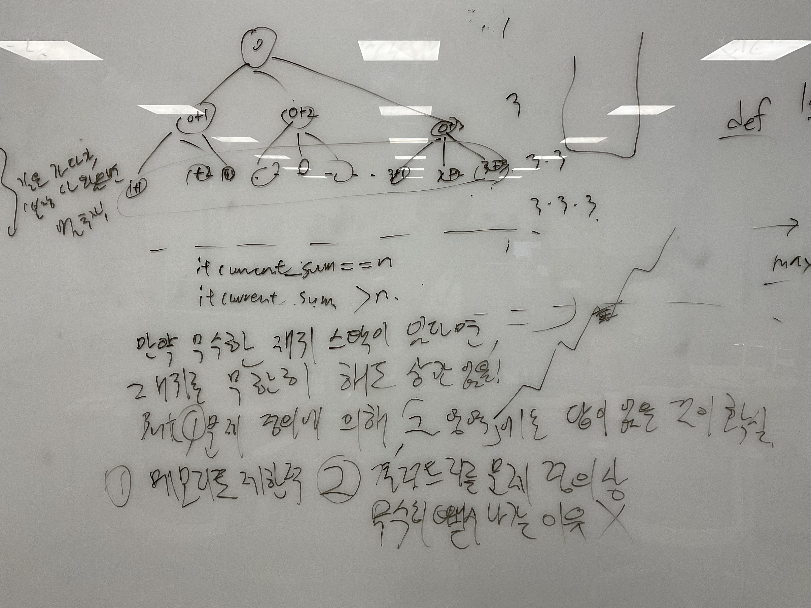

# [Algorithm] Python - 2


> 개념과 이슈 트래킹을 조합해서 “복기 가능한” 자료를 만들도록 합니다.

> 이슈 트래킹 작성 원칙: Phase1(환경, 로그, 최근 변경사항), Phase2(확인, 시도, 결과분석) 형식으로 정리하세요. (Phase2는 최대 3회까지 반복하고 해결 안 되면 아예 처음부터 시작(불가능할 경우 도움 요청))

> 실습은 천천히, 하지만 robust하게 하세요. 


# 재귀: 쿼드트리

https://www.acmicpc.net/problem/1992

## 문제

흑백 영상을 압축하여 표현하는 데이터 구조로 쿼드 트리(Quad Tree)라는 방법이 있다. 흰 점을 나타내는 0과 검은 점을 나타내는 1로만 이루어진 영상(2차원 배열)에서 같은 숫자의 점들이 한 곳에 많이 몰려있으면, 쿼드 트리에서는 이를 압축하여 간단히 표현할 수 있다.

주어진 영상이 모두 0으로만 되어 있으면 압축 결과는 "0"이 되고, 모두 1로만 되어 있으면 압축 결과는 "1"이 된다. 만약 0과 1이 섞여 있으면 전체를 한 번에 나타내지를 못하고, 왼쪽 위, 오른쪽 위, 왼쪽 아래, 오른쪽 아래, 이렇게 4개의 영상으로 나누어 압축하게 되며, 이 4개의 영역을 압축한 결과를 차례대로 괄호 안에 묶어서 표현한다

위 그림에서 왼쪽의 영상은 오른쪽의 배열과 같이 숫자로 주어지며, 이 영상을 쿼드 트리 구조를 이용하여 압축하면 "(0(0011)(0(0111)01)1)"로 표현된다. N ×N 크기의 영상이 주어질 때, 이 영상을 압축한 결과를 출력하는 프로그램을 작성하시오.

## Phase1. 직접 풀기

생각보다는 쉽게 풀렸다. 단, 괄호를 출력하는 부분에서 재귀의 순서를 제대로 생각하지 않아서 조금 헤맸다. Z보다 좀 더 쉬웠는데, 사실 거의 동일한 문제인 거 같다.

```javascript
# 1. 문제 읽기
# 2. 문제 풀기
# 3. 수도 코드
# 4. 코드 구현

def is_base(A: list, r: int, c: int, n: int):
    """A 배열의 r, c를 시작점으로 하는 n 영역의 합을 구하고, 0이거나 n^2이면 True를 리턴"""
    pixels = 0
    for i in range(r, r+n):
        for j in range(c, c+n):
            pixels += A[i][j]
    if pixels == 0: return 0
    elif pixels == n**2: return 1
    return -1

def recur(A: list, r, c, n):
    pixels = is_base(A, r, c, n)
    if pixels != -1:
        print(pixels, end='')
        return
    # 1 사분면 재귀
    half = n//2
    print('(', end='')
    recur(A, r, c, half)
    # 3 사분면 재귀
    recur(A, r, c+half, half)
    # 2 사분면 재귀
    recur(A, r+half, c, half)
    # 4 사분면 재귀
    recur(A, r+half, c+half, half)
    print(')', end='')
        

n = int(input())
arr = [
    tuple(map(int, list(input())))
    for _ in range(n)
]

recur(arr, 0, 0, n)

```

## Phase2. 피드백

아래는 쿼드 트리(BOJ 1992) 문제를 해결한 코드와 그에 대한 상세 피드백입니다.

1. 전체 코드 리뷰

제시하신 코드는 다음과 같습니다:

```python
def is_base(A: list, r: int, c: int, n: int):
    """A 배열의 r, c를 시작점으로 하는 n×n 영역의 모든 원소를 합한다.
       합이 0이면 모두 0, n^2이면 모두 1, 그 외에는 -1을 반환."""
    pixels = 0
    for i in range(r, r+n):
        for j in range(c, c+n):
            pixels += A[i][j]
    if pixels == 0:          # 모두 0
        return 0
    elif pixels == n**2:     # 모두 1
        return 1
    return -1                # 0, 1 섞여 있음

def recur(A: list, r: int, c: int, n: int):
    pixels = is_base(A, r, c, n)
    if pixels != -1:
        print(pixels, end='')  # 압축 결과(0 또는 1)를 바로 출력
        return

    # 0,1이 섞여 있으므로 4등분
    half = n // 2
    print('(', end='')

    # [1] top-left
    recur(A, r, c, half)
    # [2] top-right
    recur(A, r, c + half, half)
    # [3] bottom-left
    recur(A, r + half, c, half)
    # [4] bottom-right
    recur(A, r + half, c + half, half)

    print(')', end='')


n = int(input())
arr = [tuple(map(int, list(input()))) for _ in range(n)]

recur(arr, 0, 0, n)
```

•	is_base 함수: 주어진 구역(r,c 부터 n×n)을 순회하며 합이 0이면 전부 0, 합이 n^2이면 전부 1, 섞여 있으면 -1.

•	배열에 0과 1밖에 없으므로, 합을 통해 “모두 0 or 모두 1”을 빠르게 판별할 수 있습니다.

•	recur 함수:

1.	is_base로 현재 구역이 전부 0 혹은 전부 1인지 확인.

2.	전부 같은 값이면(0 또는 1) 바로 출력.

3.	아니면 4개로 쪼개어 각각 재귀 호출하고, 사이에 괄호를 출력.

정상 동작 및 출력 순서

•	쿼드 트리 문제에서 요구하는 순서(왼쪽 위, 오른쪽 위, 왼쪽 아래, 오른쪽 아래)대로 재귀가 진행되므로 문제 사양과 일치합니다.

•	출력 형식((0(0011)(0(0111)01)1))도 괄호를 열고 닫는 순서가 맞다면 정상적인 결과를 얻습니다.

2. 세부 피드백

2.1 사분면(쿼드) 순서와 주석

코드에서 사분면을 호출하는 순서는:

1.	recur(A, r, c, half) → top-left

2.	recur(A, r, c+half, half) → top-right

3.	recur(A, r+half, c, half) → bottom-left

4.	recur(A, r+half, c+half, half) → bottom-right

그런데 주석에서 “1사분면, 3사분면” 식으로 표현하셨다면, 수학적 좌표계나 일반적 쿼드트리 표기와 약간 다를 수 있어서 혼동될 여지가 있습니다.

•	보통 “1사분면(top-left), 2사분면(top-right), 3사분면(bottom-left), 4사분면(bottom-right)”라는 식으로 명명하면, 순서와 주석이 어긋날 수 있습니다.

•	문제에서 요구하는 처리 순서는 “왼위, 오른위, 왼아래, 오른아래”이므로, 코드처럼 명확히 주석을 달아두면 좋습니다(예: “top-left”, “top-right”, “bottom-left”, “bottom-right”).

2.2 시간 복잡도: 모든 분할 시 매번 합 계산

•	현재 코드는 매 분할마다 n×n 원소를 전부 순회(is_base)하고, 0/1 판별 후 필요시 4분할을 합니다.

•	최악의 경우(모두 서로 다른 패턴)에는 각 분할마다 n×n을 스캔 → 분할이 log(n) 단계(2차원적)로 진행 → 대략 O(n^2 log n) 이 될 수 있습니다.

•	N 최대 64 정도라면 전혀 문제 없고, 일반적인 BOJ 1992 제한(N ≤ 64) 안에서는 충분히 빠릅니다.

•	만약 N이 더 커진다면 프리픽스 합(2D prefix sum) 등을 이용해 서브 구역의 합을 O(1)에 구하면 더 효율적이긴 하지만, 이 문제에선 필요 없습니다.

2.3 “모두 같은 값” 판별하는 다른 방법

•	합을 사용하지 않고, “첫 번째 원소를 기준으로 전부 비교”해서 다른 값이 하나라도 나오면 분할” 하는 식도 있습니다:

```python
first_val = A[r][c]
all_same = True
for i in range(r, r+n):
    for j in range(c, c+n):
        if A[i][j] != first_val:
            all_same = False
            break
    if not all_same:
        break

if all_same:
    print(first_val, end='')
    return
# else 분할
```

•	성능상 큰 차이는 없고(역시 O(n^2)), 0/1만 다루는 문제에서는 합을 통해 n^2과 비교하는 방법이나, 모든 값이 동일한지 비교하는 방법이나 자유롭게 선택 가능합니다.

2.4 출력 방식(문자열 vs print)

•	현재는 함수 내에서 print(..., end='')로 바로바로 출력하고 있습니다.

•	BOJ 환경에서는 이렇게 해도 문제 없지만, 문자열을 모아 마지막에 한 번에 출력하는 방식을 선호하는 경우도 있습니다(성능 및 유지보수).

•	원하시면 return 값으로 문자열을 넘기고 최종에 print(result_str)를 한 번에 찍는 방식으로 바꿀 수도 있습니다.

예시 (문자열 합치는 버전):

```python
def quad_tree(A, r, c, n):
    val = is_base(A, r, c, n)
    if val != -1:
        return str(val)
    half = n // 2
    top_left = quad_tree(A, r, c, half)
    top_right = quad_tree(A, r, c + half, half)
    bottom_left = quad_tree(A, r + half, c, half)
    bottom_right = quad_tree(A, r + half, c + half, half)
    return "(" + top_left + top_right + bottom_left + bottom_right + ")"
```

이렇게 하면 마지막에 print(quad_tree(A, 0, 0, n))로 깔끔하게 한 번에 출력 가능합니다.

3. 결론 정리

1.	코드 기능: 요구 사항대로 잘 동작합니다.

2.	사분면 순서: 문제에서 제시한 “왼위, 오른위, 왼아래, 오른아래” 순서를 정확히 준수하면 됩니다.

3.	시간 복잡도: N=64 이하라면 현재 구현(매 분할 시 n×n 스캔)도 성능상 충분합니다.

4.	출력 방식: 지금처럼 print를 재귀 안에서 바로 쓰는 것도 문제 없지만, 문자열을 합쳐서 한 번에 출력하는 패턴도 좋습니다.

전체적으로 “쿼드 트리” 문제 의도에 맞는 전형적인 재귀 구현이며, 로직은 완벽하게 작성되었다고 볼 수 있습니다.

주석과 변수명만 조금 더 명확하게 정리하면, 가독성과 유지보수성이 좋아질 것입니다. 축하드립니다!

# 재귀: 이진 검색 트리 

https://www.acmicpc.net/problem/5639

이진 검색 트리를 전위 순회한 결과가 주어졌을 때, 이 트리를 후위 순회한 결과를 구하는 프로그램을 작성하시오.

## Phase1. 누더기 코드 

```python
"""
1. 문제 읽기 
그냥 재귀를 하는데, 후위는 빠져나올 때 프린트 하면 됨.
그런데 입력이 전위순회 결과라서. 아 그냥 빈 배열 하나 만들고, 
전위 순회 타이밍에 그냥 삽입하면 안 되나, 안 된다. 완전 이진 트리가 아니다!

2. 문제 풀기

3. 수도 코드

4. 코드 구현
"""

import sys


def post_search(idx: int):
    global arr
    """크기가 n인 배열의 idx 번째 요소를 후위순회 합니다."""
    # 만약 왼쪽 자식이 존재 하면
    if idx >= len(bt): return
    post_search(idx*2+1)
    post_search(idx*2+2)
    if bt[idx] != 0: print(bt[idx])


def insert_binary_tree(val: int):
    print(f'inserting: {val}')
    global bt
    if bt[0] == 0: 
        bt[0] = val # 첫 번째 값 삽입
        return
    ptr = 0
    while True:
        print(f'current ptr: {ptr}')
        if val < bt[ptr]: # 왼 자식으로 삽입
            if bt[ptr*2+1] != 0: # 왼쪽 자식이 존재하면 그쪽으로 포인터 이동
                ptr = ptr*2+1
                print('moving to left child')
                continue
            else: #왼쪽 자식이 없으면 거기에 삽입
                bt[ptr*2+1] = val
                print(f'inserting {val} as left child of {bt[ptr]}')
                break
        elif val > bt[ptr]: # 오른 자식으로 삽입
            print(f'{val} > {bt[ptr]}')
            if bt[ptr*2+2] != 0:
                ptr = ptr*2+2
                print('moving to right child')
                continue
            else:
                bt[ptr*2+2] = val
                print(f'inserting {val} as right child of {bt[ptr]}')
                break


arr = []
for line in sys.stdin:
    # line은 '\n'을 포함하므로 line.strip()으로 개행 제거
    arr.append(int(line.strip()))

n = len(arr)
bt = [0]*(n**4) # 모두 양의 정수만 입력됨
for a in arr:
    insert_binary_tree(a)

post_search(0)


"""
이슈: binary search tree에 값 인서트가 이상하게 됨
Phase1.
환경: 파이썬
로그: '50', '30', '98', '24', '5', '52', 0, 0, '28', '45', 0, 0, '60'
최근 변경 사항: 이진트리 삽입 부분 구현

def insert_binary_tree(val: int):
    print(f'inserting: {val}')
    global bt
    if bt[0] == 0: 
        bt[0] = val # 첫 번째 값 삽입
        return
    ptr = 0
    while True:
        if val < bt[ptr]: # 왼 자식으로 삽입
            if bt[ptr*2+1] != 0: # 왼쪽 자식이 존재하면 그쪽으로 포인터 이동
                ptr = ptr*2+1
                continue
            else: #왼쪽 자식이 없으면 거기에 삽입
                bt[ptr*2+1] = val
                break
        elif val > bt[ptr]: # 오른 자식으로 삽입
            if bt[ptr*2+2] != 0:
                ptr = ptr*2+2
                continue
            else:
                bt[ptr*2+2] = val
                break
Phase2.
확인: 오른쪽 자식으로 가는 부분이 좀 이상한 거 같은데. 문자열을 그대로 쑤셔박으니 그렇지!

moving to left child
current ptr: 1
5 > 30
inserting 5 as right child of 30

로그 확인 결과 이런 기가막힌 연산을 하고 있었음을 확인. 이건 그냥 디버거 봤으면 더 빨리 캐치했을 거 같기도 하고.
이슈방지위원회, 줄여서 이방위를 열어야겠다.
시도: 정수형으로 입력값 캐스팅
결과: 해결

이슈: 후위순회가 안 돼요
Phase1. 
환경: 파이썬
로그: 잘못된 후위 순위 검색 결과
최근 변경 사항: 없음

Phase2.
확인: 재귀 과정을 확인하고, 출력문을 찍으면 좋을 적절한 타이밍을 탑다운 방식으로 분석해보기.
시도: 그냥 배열과 인덱스를 통째로 잘못 참조하고 있었음. 
결과 분석: 해결. 코드의 로직은 구현 완료. 그런데 누더기로 작성한 자료구조 덕분에 메모리 초과가 발생

"""
```

### 로그 없는 버전

```python
"""
1. 문제 읽기 
그냥 재귀를 하는데, 후위는 빠져나올 때 프린트 하면 됨.
그런데 입력이 전위순회 결과라서. 아 그냥 빈 배열 하나 만들고, 
전위 순회 타이밍에 그냥 삽입하면 안 되나, 안 된다. 완전 이진 트리가 아니다!

2. 문제 풀기

3. 수도 코드

4. 코드 구현
"""

import sys


def post_search(idx: int):
    global arr
    """크기가 n인 배열의 idx 번째 요소를 후위순회 합니다."""
    # 만약 왼쪽 자식이 존재 하면
    if idx >= len(bt): return
    post_search(idx*2+1)
    post_search(idx*2+2)
    if bt[idx] != 0: print(bt[idx])


def insert_binary_tree(val: int):
    global bt
    if bt[0] == 0: 
        bt[0] = val # 첫 번째 값 삽입
        return
    ptr = 0
    while True:
        if val < bt[ptr]: # 왼 자식으로 삽입
            if bt[ptr*2+1] != 0: # 왼쪽 자식이 존재하면 그쪽으로 포인터 이동
                ptr = ptr*2+1
                continue
            else: #왼쪽 자식이 없으면 거기에 삽입
                bt[ptr*2+1] = val
                break
        elif val > bt[ptr]: # 오른 자식으로 삽입
            if bt[ptr*2+2] != 0:
                ptr = ptr*2+2
                continue
            else:
                bt[ptr*2+2] = val
                break


arr = []
for line in sys.stdin:
    # line은 '\n'을 포함하므로 line.strip()으로 개행 제거
    arr.append(int(line.strip()))

n = len(arr)
bt = [0]*(n**2) # 모두 양의 정수만 입력됨
for a in arr:
    insert_binary_tree(a)

post_search(0)


```

## Phase2. 피드백 및 반성

### 반성

1. 인덱스 이름, 함수 이름만 좀 길게 써도 많은 삽질을 피할 수 있을 거 같다. 구체적으로 쓰면 인지가 되는데, 그냥 알파벳만 작성하면 개념이 안 잡히고, 잘못 적힌 인덱스도 알아보기 어렵다.
1. 이진 탐색 트리 자료구조를 전혀 구현하지 못하겠다. 위의 배열을 활용한 구조는 공간복잡도가 정신 나간다.
1. 입력 값의 개수가 주어지지 않고 입력마다 개행문자가 있는 경우의 입력 매커니즘을 잘 모르겠다. sys.stdin은  line1\n, line\n 이렇게 주어지고, 각 줄에 주어진 입력을 이터레이션하며 line.strip() 작업을 하여 whitespace를 제거하는가?
### 피드백

아래 내용은 이진 검색 트리(BST) 문제(BOJ 5639)를 풀 때 흔히 겪는 문제점(배열 인덱스로 구현 시 메모리 낭비, 전위순회 입력에서 트리를 복원하는 방법 등)에 대한 피드백과, 권장 구현(노드 기반 + 재귀 복원) 예시입니다.

1. 현재 코드(배열 사용) 문제점과 개선 방향

1.1 배열 인덱스 기반 ‘완전이진트리’ 방식의 비효율성

•	현재 시도하신 방식은 “배열 인덱스를 이용해 왼쪽 자식 = 2i+1, 오른쪽 자식 = 2i+2” 구조를 흉내 내며 BST를 구성하고 있습니다.

•	BST가 편향되었을 때, n^2, 심지어 n^4 같은 큰 배열을 잡아야 하고, 실제로는 대부분 비어 있을 수 있어 메모리 낭비 가 심각합니다.

•	노드가 1만 개만 되어도, 완전이진트리 인덱스를 쓰려면 엄청난 크기의 배열이 필요해질 수 있습니다.

1.2 전위순회 결과로부터 BST 복원 시의 일반적인 접근

•	주어진 입력은 BST를 전위순회(Pre-order)한 결과입니다.

•	우리는 이 배열(전위순회 결과)로 트리를 복원한 뒤, 후위순회(Post-order) 결과를 출력해야 합니다.

•	가장 흔한 방법은 **“노드 기반(Node class) + 재귀”**로 직접 BST를 구성한 뒤, 후위순회를 수행하는 것입니다.

> 결론

2. 권장 구현: 노드 기반 BST 복원 + 후위순회

2.1 로직 개요

1.	입력: 전위순회 결과 preorder[] (예: 50, 30, 24, 5, 28, 45, 98, 52, 60, …)

2.	BST 구성: 전위순회 특성상,

•	첫 번째 원소 = 루트 값

•	이후 “루트보다 작은 값들”은 왼쪽 서브트리, “루트보다 큰 값들”은 오른쪽 서브트리

3.	하지만, 단순히 “작은 거 전부 왼쪽, 큰 거 전부 오른쪽”으로 구간을 나누면 최악 O(n^2).

•	문제에선 N 최대 10,000까지 가능.

•	다행히, **“BST 전위순회 배열”**에서 “루트보다 큰 값이 처음 나오는 지점”이 곧 오른쪽 서브트리의 시작 지점이 됩니다.

4.	더 효율적인 방법: 상한(bound)을 이용한 재귀. 전위 순회를 왼→오른쪽 순으로 탐색하며, “현재 만들어야 할 서브트리 값이 bound(부모보다 큰 값 한계)”를 넘어서면 stop 하는 기법이 자주 사용됩니다.

2.2 예시 코드: Bound 기법 (전위순회 → BST)

```python
import sys
sys.setrecursionlimit(10**9)  # 혹시 깊은 트리 대비

preorder = []
for line in sys.stdin:
    val = line.strip()
    if val == '':  # 공백 라인 방어
        continue
    preorder.append(int(val))

# 전위순회 리스트
n = len(preorder)

# 전위순회 배열을 재귀적으로 읽어가며 트리 복원
# index는 preorder를 순회하는 인덱스
index = 0

class Node:
    __slots__ = ('val', 'left', 'right')  # 메모리 절약 (선택사항)
    def __init__(self, val):
        self.val = val
        self.left = None
        self.right = None

def buildBST(bound):
    """
    bound보다 큰 값이 나오면(= 현재 subtree 범위를 벗어남)
    재귀를 멈춘다.
    """
    global index
    if index >= n:  # 더 이상 원소가 없으면 None
        return None

    root_val = preorder[index]
    # 만약 현재 값이 bound보다 크면, 이 subtree에 속할 수 없음
    if root_val > bound:
        return None

    # 현재 값이 subtree에 속한다면, 노드 생성
    node = Node(root_val)
    index += 1

    # 왼쪽 서브트리: bound = node.val
    #   => node.val보다 큰 값이 나오면 왼쪽 subtree 불가
    node.left = buildBST(node.val)

    # 오른쪽 서브트리: bound = 상위 bound
    #   => "node.val < X <= bound" 범위의 값은 오른쪽 subtree
    node.right = buildBST(bound)

    return node

# 1) 트리 구성 (최대값을 아주 크게 잡는다)
root = buildBST(bound=10**10)  # 문제에서 값이 1,000,000까지 가능하므로 더 큰 수 잡기

# 2) 후위순회
def postorder(node):
    if not node:
        return
    postorder(node.left)
    postorder(node.right)
    print(node.val)

postorder(root)
```

동작 설명

•	buildBST(bound) 함수는 preorder 배열을 왼→오른쪽으로 스캔(index 전역변수)하면서 노드를 생성합니다.

•	현재 노드값이 bound를 초과하면, “이 값은 상위(혹은 다른) 서브트리로 가야 한다” → None 리턴하여 재귀를 종료합니다.

•	이렇게 하면 전위순서에 맞춰 왼쪽 subtree(node.val을 bound로), 오른쪽 subtree(상위 bound 그대로) 순으로 채워나가면서도, 값이 범위를 벗어나면 자연스럽게 재귀를 종료해 “부모의 오른쪽 subtree”로 넘어갈 수 있습니다.

•	이 알고리즘은 각 노드가 정확히 한 번씩만 재귀 처리되므로, 최악의 경우(편향 트리)라도 O(n)에 가까운 성능을 냅니다(실제로는 평균 O(n), 특정 편향 패턴에서도 빠르게 동작).

> 이 로직은 **“BST 전위순회 + 상한(bound) 기법”**으로 알려진 전형적인 트리 복원 방법입니다.

3. 추가 사항

3.1 “입력 개수 미지정” → sys.stdin 사용 시

•	문제에서 입력 줄 수가 따로 안 주어지면, 보통 EOF까지 읽어야 합니다.

•	for line in sys.stdin: 사용 시, 빈 줄이나 개행을 처리하고 싶다면 line.strip() 후 조건 검사하면 됩니다.

3.2 파이썬 재귀 제한

•	기본적으로 파이썬 재귀 한도는 약 1000이므로, 노드가 1만 개 이상이고 편향 트리가 된다면 RecursionError 가 날 수 있습니다.

•	문제 5639에서는 최대 10,000개 입력이 가능하므로, sys.setrecursionlimit(10**9) 정도로 여유를 주는 게 안전합니다. (메모리 내에서 처리 가능)

3.3 후위순회 출력

•	문제 요구사항대로, 각 노드를 후위순회 시 방문할 때마다 출력하면 됩니다.

•	“print(node.val)”을 찍을 때 개행으로 구분하면 정답 포맷에 부합합니다.

3.4 “배열 인덱스를 좀 더 명확히…”에 대한 팁

•	변수명을 idx, start, end 등으로 길게 써주거나, 주석을 부지런히 달면 디버깅 시 혼선을 줄일 수 있습니다.

•	또한, (node-based)트리를 구성하면, “왼쪽·오른쪽”을 직관적으로 코드로 표현할 수 있어, 인덱스 연산 실수를 줄이는 데 도움이 됩니다.

4. 마무리

1.	문제(5639) 핵심: 전위순회 배열로부터 BST를 재구성 후, 후위순회 출력.

2.	가장 간단한 정석 접근: 노드 기반으로 트리를 만들고, 후위순회를 재귀로 구현.

3.	배열 인덱스 기반의 완전이진트리는 BST에는 비효율적(편향 트리 시 메모리 폭증).

4.	EOF 입력 처리:

```plain text
import sys
arr = []
for line in sys.stdin:
    val = line.strip()
    if val == '':
        continue
    arr.append(int(val))
```

이렇게 하면 파일 끝(EOF)까지 읽어들일 수 있습니다.

> 결론적으로,


# 재귀: 1, 2, 3 더하기

https://www.acmicpc.net/problem/9095

정수 n이 주어졌을 때, n을 1, 2, 3의 합으로 나타내는 방법의 수를 구하는 프로그램을 작성하시오.

## Phase1.

```python
"""
1. 문제 읽기: 3
2. 문제 풀기
3이면 1 1 1, 1 2, 2 1, 3
간단한 백 트래킹 문제다. 1 2 3 중 여러개를 써도 상관이 없다.
3. 수도 코드
바닥조건은 무엇인가? 매개로 넘어온 정수형 합이 n과 같으면 카운터 증가시키고 리턴.
재귀 조건은: 그냥 1, 2, 3 리스트에서 반복 돌려서 더해서 재귀 보내면 됨.
4. 코드 구현
"""

import sys

def recur(current_sum: int, n: int):
    global cnt
    if current_sum == n:
        cnt += 1
        return
    if current_sum > n:
        return
    for e in [1, 2, 3]:
        recur(current_sum+e, n)


t = int(sys.stdin.readline().strip())
cnt = 0
for _ in range(t):
    n = int(sys.stdin.readline().strip())
    recur(0, n)
    print(cnt)
    cnt = 0

"""
이슈: 재귀 초과 오류
Phase1.
환경: 파이썬
로그: 재귀 초과 오류
최근 변경사항: 재귀함수 작성
Phase2.
확인: current_sum이 n과 다르면 바닥 조건에 계속 걸리지 않게 됨. 
current_sum > n에 대해서도 종료 조건을 달면 되겠다.
시도: 베이스 컨디션 추가
if current_sum > n:
        return
결과분석: 성공
"""
```

## Phase2. 백 트래킹이 뭔가요?

문제 풀이 내용을 발표하던 중 이 질문을 받았는데, 제대로 된 답을 하지 못했다. 그래서 생각해본 끝에 아래와 같은 결론에 도달. 

(결정 트리를 안다고 가정하고) 재귀는 문제를 해결하기 위해 무수히 많은 결정트리를 만들어가게 되고, 이 코드의 경우 depth가 깊어질 수록 리프 노드가 3배씩 늘어난다. 그런데 문제 정의 상으로, 더해지는 숫자는 1, 2, 3으로 모두 양수고, 만약 현재 노드에서 매개로 받은 정수 값이 n보다 크다면 결정 트리상으로 이 노드의 하위에 올 자식 노드들은 전부 정답이 아닌게 확실하다. 

따라서! 재귀로 인해 무한히 생겨날 수 있는 결정트리를 제어하기 위해 필요 없는 가지를 잘라내는 방법을 백트래킹이라 할 수 있을 것 같다.



## Phase3. 답에 대한 피드백

1. 백트래킹 정의와 설명

•	백트래킹은 **“불필요한 탐색을 가지치기(Pruning)하여 탐색 속도를 향상시키는 기법”**입니다.

•	특히, 결정 트리(Decision Tree) 탐색 과정에서 불필요한 분기를 조기에 종료하는 것을 의미합니다.

•	즉, 가능한 모든 경우를 탐색하는 완전 탐색(Brute-force) 방식을 개선하는 기법입니다.

2. 본인의 설명 피드백

> “재귀는 문제를 해결하기 위해 무수히 많은 결정 트리를 만들어가게 되고, 이 코드의 경우 depth가 깊어질수록 리프 노드가 3배씩 늘어난다. 그런데 문제 정의 상으로, 더해지는 숫자는 1, 2, 3으로 모두 양수고, 만약 현재 노드에서 매개로 받은 정수 값이 n보다 크다면 결정 트리상으로 이 노드의 하위에 올 자식 노드들은 전부 정답이 아닌 게 확실하다. 따라서! 재귀로 인해 무한히 생겨날 수 있는 결정 트리를 제어하기 위해 필요 없는 가지를 잘라내는 방법을 백트래킹이라 할 수 있을 것 같다.”

✅ 좋은 점

•	백트래킹의 핵심 개념인 **“불필요한 가지를 잘라내는 과정”**을 잘 설명했다.

•	결정 트리에서 분기가 불필요하게 증가하는 부분을 잘 인식하고 있음.

•	현재 풀이에서 if current_sum > n: 부분이 백트래킹의 역할을 한다는 점을 잘 설명했다.

🔍 보완하면 좋은 점

•	백트래킹은 단순히 “불필요한 경우를 제거”하는 것뿐만 아니라, **“정답이 될 가능성이 있는 경우만 선택”**하는 방식도 포함된다.

•	탐색을 최적화하는 것이 핵심인데, 현재 설명은 “불필요한 경우를 제거한다”는 관점에 초점이 맞춰져 있음.

•	예를 들어, “N-Queen 문제”에서는 특정 조건(같은 열에 놓이지 않기, 대각선 충돌 방지 등)을 만족하는 경우에만 탐색을 진행하는 것도 백트래킹의 중요한 특징이다.

💡 보완된 설명 예시

> “백트래킹은 가능한 모든 경우를 탐색하는 것이 아니라, 유망하지 않은 경우를 조기에 포기하여 탐색 효율을 높이는 기법이다. 이 문제에서는 결정 트리에서 current_sum > n인 경우 이후의 탐색이 무의미하므로 탐색을 중단한다. 이를 통해 탐색 공간을 줄이고, 불필요한 연산을 방지하는 것이 백트래킹의 핵심이다.”

3. 코드에 대한 피드백

현재 코드는 백트래킹 개념을 적용했지만, DP(동적 계획법, Dynamic Programming)로 더 효율적인 풀이가 가능합니다.

이 문제는 중복되는 부분 문제(overlapping subproblems)와 최적 부분 구조(optimal substructure)를 가지므로 DP가 더 적절합니다.

✅ DP 풀이 (Bottom-Up)

```plain text
import sys

def solve():
    dp = [0] * 11  # 문제에서 n은 최대 10
    dp[1], dp[2], dp[3] = 1, 2, 4  # 기본 케이스

    for i in range(4, 11):  # 점화식 적용
        dp[i] = dp[i-1] + dp[i-2] + dp[i-3]

    t = int(sys.stdin.readline().strip())
    for _ in range(t):
        n = int(sys.stdin.readline().strip())
        print(dp[n])

solve()
```

•	시간 복잡도: O(N), 재귀 풀이보다 훨씬 효율적임.

결론

1.	백트래킹의 개념 설명은 좋았지만, **“가능성이 있는 경우만 탐색한다”**는 부분도 강조하면 더 좋다.

2.	이 문제는 백트래킹으로 풀 수 있지만, DP가 더 적합한 풀이 방법이다.

3.	같은 유형의 문제에서 백트래킹과 DP 중 어떤 것이 더 적절한지 판단하는 연습을 하면 더욱 좋을 것! 🚀

# 탐색: 수 찾기

## Phase1. 풀이 성공. 

탐색 방식을 잘못 골라서 오래 걸렸다. 문제의 조건을 잘 읽고, 적절한 탐색 방식을 선택해야 함.

```python
"""
보류
사유: 이분탐색을 모르면 제대로 풀 수 없음

import sys

n = int(sys.stdin.readline().strip())
arr = list(map(int, sys.stdin.readline().split()))
m = int(sys.stdin.readline().strip())
search_list = list(map(int, sys.stdin.readline().split()))
for val in search_list:
    if val in arr: print(1)
    else: print(0)

이건 내 지식으로 푼 오답 코드.

"""

"""
1. 문제 읽기: 어..이거 그냥 입력받고 in 연산자 쓰면 안 되나? 안 됨. 정렬한 다음 이진탐색해야 할듯
2. 문제 풀기: 
3. 수도 코드:
4. 코드 구현: 
"""

# def bin_search(A: list, val: int):
    
#     left = 0
#     right = len(A) - 1
#     while left <= right: # 파티션이 유효한 동안. 
#         center = (left+right)//2
#         idx = center # 영역의 절반을 인덱스로 고정
#         if A[idx] > val: # 답이 왼쪽 영역에 있음.
#             right = center # right idx를 반으로 감소
#         elif A[idx] < val: # 답이 오른쪽 영역에 있음.
#             left = center+1 # left를 높여서 영역을 반 좁히기
#         elif A[idx] == val: 
#             return 1
#     return 0

import sys

dictionary = {}


n = int(sys.stdin.readline().strip())
arr = list(map(int, sys.stdin.readline().split()))
for a in arr:
    dictionary[a] = True
m = int(sys.stdin.readline().strip())
search_list = list(map(int, sys.stdin.readline().split()))

for key in search_list:
    if dictionary.get(key, False): print(1)
    else: print(0)

"""
이슈: 무한 루프
Phase1.
환경: 파이썬
로그: 없음
최근 변경 사항: bin_search 이진 탐색 함수 작성
Phase2.
확인: 루프에 중단점 ㄱㄱ
배열 안에 값이 없을 경우 무한 루프를 돈다. 인덱싱을 하다가 
자연스럽게 파티션이 엇갈리면 끝나야 하는데, 파티셔닝 인덱스에 문제가 있다.
left, right 인덱스가 3, 4일때 무한 반복 발생.
center = 3(3.5)
left가 계속 3으로 업데이트 됨. 와 이거 어떻게 파티셔닝 해야 해결할 수 있지? 
작아지는 경우는 문제가 없는데, 중간값을 기준으로 크고, 배열에 없는 값을 구할 때 
left right 인덱스가 좁혀지지 않는다. 
인덱스를 잡을 때 '다음 왼쪽 영역을 left, center로 잡고, 
다음 오른쪽 영역을 center+1, right로 잡으니 해결
시도: 
    while left <= right: # 파티션이 유효한 동안. 
        ...
        elif A[idx] < val: # 답이 오른쪽 영역에 있음.
            left = center+1 # left를 높여서 영역을 반 좁히기

결과 분석: 정렬은 성공. 그런데 시간초과 발생. 정렬을 최적화해야 한다. 우선순위 큐를 써야 하나? 
한 라인에 입력돼서, 이게 sort 함수 쓰는게 제일 빠를텐데. 

이슈: 시간 초과 문제
Phase1
환경: 파이썬
로그: 시간 초과
최근 변경 사항: bin_search 로직 픽스 
Phase2.
확인:
정수의 범위는 엄청 넓다. 주어지는 자연수 리스트도 십만이다. 
현재 시간 복잡도: 정렬에 nlogn
탐색 시간 복잡도: logn
O(nlogn) + O(logn)
이걸 어떻게 개선하지? 입력에 필요한 오버헤드를 개선해야 하나? 근데 그런식의 문제는 아닐 거 같음.
시도: 맵을 써봐야 하나? 하긴 이 문제는 데이터의 수정/삭제가 필요 없다. 아 뭐야 그럼 맵이네!
아래 구현.
for key in search_list:
    if dictionary.get(key, False): print(1)
    else: print(0) 
    
분석: 성공!!


"""
```

# 이진탐색: 나무 자르기

https://www.acmicpc.net/problem/2805

상근이는 나무 M미터가 필요하다. 근처에 나무를 구입할 곳이 모두 망해버렸기 때문에, 정부에 벌목 허가를 요청했다. 정부는 상근이네 집 근처의 나무 한 줄에 대한 벌목 허가를 내주었고, 상근이는 새로 구입한 목재절단기를 이용해서 나무를 구할것이다.

목재절단기는 다음과 같이 동작한다. 먼저, 상근이는 절단기에 높이 H를 지정해야 한다. 높이를 지정하면 톱날이 땅으로부터 H미터 위로 올라간다. 그 다음, 한 줄에 연속해있는 나무를 모두 절단해버린다. 따라서, 높이가 H보다 큰 나무는 H 위의 부분이 잘릴 것이고, 낮은 나무는 잘리지 않을 것이다. 예를 들어, 한 줄에 연속해있는 나무의 높이가 20, 15, 10, 17이라고 하자. 상근이가 높이를 15로 지정했다면, 나무를 자른 뒤의 높이는 15, 15, 10, 15가 될 것이고, 상근이는 길이가 5인 나무와 2인 나무를 들고 집에 갈 것이다. (총 7미터를 집에 들고 간다) 절단기에 설정할 수 있는 높이는 양의 정수 또는 0이다.

상근이는 환경에 매우 관심이 많기 때문에, 나무를 필요한 만큼만 집으로 가져가려고 한다. 이때, 적어도 M미터의 나무를 집에 가져가기 위해서 절단기에 설정할 수 있는 높이의 최댓값을 구하는 프로그램을 작성하시오.

## Phase1. 직접 풀기(성공!)

```python
"""
1. 문제 읽기: 이게 어떻게 이분 탐색이지? 
2. 문제 풀기
2-1. 아이디어 브레인 스토밍
가. prefix sum을 쓰기: 말도 안 됨.
나. 완전탐색: 아래가 정답이다.
import sys

MAX_INT = sys.maxsize

n = 5
m = 20
trees = [4, 42, 40, 26, 46]

def cut_sum(height: int):
    sum_tmp = 0
    for tree in trees:
        sum_tmp += tree - height if tree > height else 0
    return sum_tmp

h_x = 0
prev_difference = MAX_INT

for i in range(0, max(trees)):
    cut_amount = cut_sum(i)
    difference = abs(cut_amount-m)
    if difference < prev_difference: # update
        prev_difference = difference
        h_x = i

# print(h_x)

다. 인크레멘탈 메서드에서 분할정복으로!

위 코드에 대한 분석: 문제에 대한 incremental method다. 이걸 divide and conquer 
방식으로 바꿔야 문제를 해결할 수 있을 것.
여기서 incremental한 요소는 i이다.

이제 이것을 정리해 보았을 때 cut_sum(i)-m이라는 우하향 함수가 있다. 
(i가 incremental 하다고 가정.)
그럼 다음과 같이 분기
cut_sum(i)-m > 0: 오른쪽 영역 디바이드
cut_sum(i)-m < 0: 왼쪽 영역으로 디바이드


3. 수도 코드

"""

import sys

n, m = tuple(map(int, sys.stdin.readline().split()))
trees = tuple(map(int, sys.stdin.readline().split()))


def f(height: int):
    """
    f의 정의: height에 대해 나무를 잘랐을 때 얻게 되는 나무들의 길이에서 목표 길이를 뺀 것.
    """
    sum_tmp = 0
    for tree in trees:
        sum_tmp += tree - height if tree > height else 0
    return sum_tmp - m

def bin_search():
    """목표: f(h_x)를 최소화 하는 h_x 찾기"""
    left, right = 0, 1_000_000_001
    prev_center = None
    while left < right:
        # print(f'{left} --- {right}')
        i_center = (left+right)//2 # i for representing incremental parameter
        difference = f(i_center)
        # print(f'difference is {difference}.')
        if difference < 0: 
            # print(f'conquer left')
            left, right = left, i_center 
            if left >= right:  # 나무를 자르지 않는 높이에서, 다음 턴에 탐색을 마친다면!
                return prev_center # 아, 둘 다 그거일 수 있구나. 두 턴 다 음수가 나올 수도 있음.
        elif difference > 0: 
            # print(f'conquer right')
            left, right = i_center+1, right
            prev_center = i_center
            # 이때는 i_center가 무조건 나무를 잘라가는 것을 보장 여기서 갱신 필요
        else: # 차이가 0과 같음(best case)
            return i_center
    return i_center

ans = bin_search()

print(ans)

"""
이슈: 무한 루프

Phase1.
환경: 파이썬
로그: 무한 루프
최근 변경 사항: 이진 탐색 코드 작성

Phase2-1
확인: 로그를 어디 찍어야 하지? 
비교 로직이 좀 잘못 됐다. 
1. 구한 결과의 높이 차이를 구한다.
시도:
분할 정복 로직이 잘못돼 있었음. 함수의 우하향을 고려하지 않고, 잘못 작성.
그리고 절대값도 씌우면 안 됐음
if difference < 0: 
    # print(f'conquer left')
    left, right = left, i_center
elif difference > 0: 
    # print(f'conquer right')
    left, right = i_center + 1, right
else: # 차이가 0과 같음(best case)
    return i_center
결과 분석: 예제는 다 맞추지만 틀리는 테스트 케이스 존재.

이슈: 오답 발생
Phase1.
환경: 파이썬
로그: 틀렸습니다
최근 변경 사항: 이진 탐색 코드 로직 수정.

Phase2-1
확인: 이럴 땐 문제 조건을 타이핑하고, 경계값으로 테스트
1 <= N <= 1,000,000
1 <= M <= 2000000000 (잘라 가야 하는 나무 )
각 나무의 높이(i_center) 0 ~ 1,000,000,000 
각 나무의 높이가 0일수도 있다. 근데 나무 높이의 합은 항상 M보다 크다 했다.
M이 1 이상이니까 나무 높이의 합도 1 이상일 것.
찾았다.
2 1 <= 나무의 갯수 2, 잘라가야 하는 나무 값 1
2 2 <= 각 나무의 높이 2.
2 <= 설정한 커팅 높이: 2. 이러면 0에 수렴하긴 하겠지만, 문제의 조건과 다름. 
정답 커팅 높이: 1. 그러면 얼마를 자르지? 2를 자름. 
높이    자른 합    정답과 차이
2       0       1
1       2       1
0       4       3
i_center가 작을수록 나무가 커짐. 내 생각에는 인덱스 분할할 때 인덱스가
왼쪽 영역 / 오른쪽 영역 이렇게 잡히는게 좋은데?
적어도 M미터!!!!!!!!!!!!!!!!!!!!
마지막에 difference를 >= 0으로 만들때만 끝내야 한다!
안 자르는게 나은 경우가 생겨버리는데, 더 자르게 하는 방법은 없나? 이럴 땐 조건을 
찾아야 한다.

어쩄든 차이가 0보다 작을 때는 
일단 가져가긴 해야 함.
그러면.. 조건을 어떻게 잡지? 인덱스를... 1씩 바꿔 볼까
아 이거 어떡하지. 결과 값이 0일 수는 없는 건데. 만약 0일때는 i 값을 
시도: 위 코드.
결과 분석: 성공!
"""
```

## Phase2. 풀이 과정 정리(느낀점)

### 독서는 중요하다: Incremental to divide-and-conquer

어떤 문제를 incremental method로 풀이하는 방식을 이해해야, divide-and-conquer 방식을 어디에 적용할지 생각할 수 있다(Introduction to Algorithm를 통해 incremental method역시 하나의 방식임을 이해한 덕분에 이런 발상이 나왔다). 이 문제의 경우 incremental method를 아래와 같이 구현할 수 있다.

(엄밀히 따지면 틀린 방식을 따르고 있음)

```python

def cut_sum(height: int):
    sum_tmp = 0
    for tree in trees:
        sum_tmp += tree - height if tree > height else 0
    return sum_tmp

h_x = 0
prev_difference = MAX_INT

for i in range(0, max(trees)):
    cut_amount = cut_sum(i)
    difference = abs(cut_amount-m)
    if difference < prev_difference: # update
        prev_difference = difference
        h_x = i

# print(h_x)
```

이때 i(나무를 자르는 높이)가 증가하게 되면 cut_sum(i) 값은 아래와 같이 우하향 그래프를 그리게 된다. 


그렇다면, cut_sum(i)의 리턴 값과 구해야 하는 m값을 비교하여 f(x)에 대해 f(x)-m 값을 0으로 만들어주는 x값을 이진 탐색 알고리즘을 적용하여 구할 수 있다.(재밌다!)

### 조건은 중요하다

‘적어도 m 길이 이상의 나무를 잘라간다’는 조건을 생각하지 않았다가 아래와 같은 테스트케이스에서 오답을 내는 코드를 작성했다.

나무의 개수: 2(상관 없음)

잘라야 하는 길이: 1

각 나무 높이: 2 2

이때 제대로 된 정답은 높이 1에서 잘라서 2의 나무를 얻는 것이지만, 무식한 이진 탐색 알고리즘은 그런 거 상관 없이 f(x)-m을 절대값 무시하고 0으로 수렴시키는 탐색을 해버린다. 그래서 디버깅 끝에 조건을 고려한 코드를 작성했다. (자르는 높이가 0이하라는 결론이 나면 이전에 저장한 양의 값을 불러오는 코드를 작성)

```python
		
		while left < right:
        # print(f'{left} --- {right}')
        i_center = (left+right)//2 # i for representing incremental parameter
        difference = f(i_center)
        # print(f'difference is {difference}.')
        if difference < 0: 
            # print(f'conquer left')
            left, right = left, i_center 
            if left >= right:  # 나무를 자르지 않는 높이에서, 다음 턴에 탐색을 마친다면!
                return prev_center # 아, 둘 다 그거일 수 있구나. 두 턴 다 음수가 나올 수도 있음.
        elif difference > 0: 
            # print(f'conquer right')
            left, right = i_center+1, right
            prev_center = i_center
            # 이때는 i_center가 무조건 나무를 잘라가는 것을 보장 여기서 갱신 필요
        else: # 차이가 0과 같음(best case)
            return i_center
    return i_center
```

## Phase3. 피드백

정말 훌륭한 접근과 정리였어요. 문제를 incremental 방식에서 출발해 divide-and-conquer의 본질적 사고방식으로 전환해낸 과정이 인상 깊고, 특히 **함수의 단조성(우하향)**을 바탕으로 이진 탐색이 왜 가능한지를 정확히 이해하고 적용한 점이 좋습니다.

💡 코멘트 몇 가지 드리자면:

1. f(x) 정의와 단조성

•	f(x) = (잘린 나무 총합) - M

•	이 함수는 x가 커질수록 점점 작아지며, 이는 단조 감소 함수입니다.

•	단조함수의 성질이 이진탐색을 가능하게 만드는 핵심이에요.

→ 이렇게 단조 증가/감소 여부를 판단하는 감각은 다른 문제에도 적용할 수 있습니다.

2. 정답을 업데이트하는 방식

```plain text
elif difference > 0:
    left, right = i_center+1, right
    prev_center = i_center
```

•	이 부분에서 prev_center에 값을 저장한 건 아주 센스 있는 예외 처리였습니다.

•	정확히는 “f(center) >= 0인 지점 중 가장 큰 값”을 찾는 것이므로, cut_sum(center) >= M일 때마다 그 값을 기록해두는 방식은 완전히 맞는 전략이에요.

📌 Tip: 정석 이진탐색에선 보통 “조건을 만족하는 최대(또는 최소)의 값”을 구할 때 결과값을 별도로 저장해 둡니다.

3. 리팩토링 여지

이진 탐색 로직을 아래처럼 조금 정리하면 더 깔끔해질 수 있어요:

```plain text
def binary_search():
    left, right = 0, max(trees)
    result = 0  # cut_sum >= M을 만족하는 높이 중 가장 큰 값

    while left <= right:
        mid = (left + right) // 2
        if cut_sum(mid) >= m:
            result = mid  # 조건 만족하므로 저장하고, 더 높여보자
            left = mid + 1
        else:
            right = mid - 1
    return result
```

이 방식도 결국 본질은 같지만, 코드 가독성과 종료 조건 처리 면에서 안정성이 좀 더 있습니다. 특히 left <= right 패턴은 더 자주 사용되는 방식이에요.

4. 시각화 감각

직접 cut_sum(i) 그래프가 우하향 함수라는 점을 깨닫고, 이진 탐색이 적용 가능하다는 결론을 이끌어낸 사고 흐름은 진짜로 중요합니다. 알고리즘 문제 풀이에서 “함수 시각화 → 성질 파악 → 탐색 가능 여부 판단”은 매우 핵심적인 전략이기 때문이에요.

✅ 피드백 요약

혹시 다음 문제로 연습해보고 싶은 이진 탐색 유형 있으면 추천도 해줄게요 :)

또는 위 내용을 기술 면접/포트폴리오처럼 정리해도 멋진 자산이 될 수 있어요.

# 이진탐색: 공유기 설치

## Phase1. 실패

```python
"""
1. 문제 읽기: 
2. 문제 풀기
2-1. recursive method. 거리 배열을 써야할 거 같은데. 
import sys
sys.setrecursionlimit(10**8) # 10^8 까지 늘림.

n, c = tuple(map(int, sys.stdin.readline().split()))

X = [
    int(sys.stdin.readline().strip())
    for _ in range(n)
]

X.sort()

def get_min_distance(A:list):
    '''집에 배치하는 경우 거리의 최소값 구하기'''
    if len(A) >= 2:
        min_dist = sys.maxsize
        for i in range(1, len(A)):
            min_dist = min(min_dist, A[i]-A[i-1])
        return min_dist 
    return 0

memo = {}
def set_router_recursively(A: list, X: list, idx_house: int, num_router: int):
    '''재귀적으로 X에서 라우터를 놓는 모든 경우를 A에 구합니다.'''
    '''바닥 조건: 마지막 집에 라우터 배치하는 경우에서 재귀했을 때, 라우터가 다 배치됐다면'''
    # 바닥 조건의 경우를 메모에 저장해놓고, 메모에 있는 경우 재귀 안 하면 안 되나.
    min_dist = get_min_distance(A)
    if memo.get(min_dist, False): 
        return
    if idx_house == len(X)-1:
        if num_router <= 0:
            memo[min_dist] = True
        return
    # idx_house에 배치하는 경우
    set_router_recursively([*A, X[idx_house]], X, idx_house+1, num_router-1)
    # idx_house에 배치 안 하는 경우
    set_router_recursively(A, X, idx_house+1, num_router)

set_router_recursively([], X, 0, c)
print(max(memo.keys()))

1 2 4 8 9
그 서브 값도 오름차순이 아닐 것임 .
0 그다음 최적의 값을 모름

이진탐색을 활용한 백트래킹? 

다음 체계는? 

3. 수도 코드

4. 코드 구현

"""
import sys
sys.setrecursionlimit(10**8) # 10^8 까지 늘림.

n, c = tuple(map(int, sys.stdin.readline().split()))

X = [
    int(sys.stdin.readline().strip())
    for _ in range(n)
]

X.sort()

def get_min_distance(A:list):
    '''집에 배치하는 경우 거리의 최소값 구하기'''
    if len(A) >= 2:
        min_dist = sys.maxsize
        for i in range(1, len(A)):
            min_dist = min(min_dist, A[i]-A[i-1])
        return min_dist 
    return 0

memo = {}
max_min_dist = -sys.maxsize
def set_router_recursively(A: list, idx_house: int, num_router: int):
    global max_min_dist
    '''재귀적으로 X에서 라우터를 놓는 모든 경우를 A에 구합니다.'''
    '''바닥 조건: 마지막 집에 라우터 배치하는 경우에서 재귀했을 때, 라우터가 다 배치됐다면'''
    # 바닥 조건의 경우를 메모에 저장해놓고, 메모에 있는 경우 재귀 안 하면 안 되나.
    print('recursion call')
    min_dist = get_min_distance(A)

    if memo.get(min_dist, False): 
        return
    if idx_house == len(X)-1:
        if num_router <= 0:
            memo[min_dist] = True
            max_min_dist = max(max_min_dist, min_dist)
        return
    # idx_house에 배치하는 경우
    array_A = [*A, X[idx_house]]
    min_dist_A = get_min_distance(array_A)
    if min_dist_A > max_min_dist:
        set_router_recursively(array_A, idx_house+1, num_router-1)
    # idx_house에 배치 안 하는 경우 -> 이때는 모름. 그냥 가야 함.
    # 근데 그거일 수도 있지. 남은 집 개수 <= 남은 라우터 여야만 가야지
    if len(X) - (idx_house+1) >= num_router: # 남은 집 개수 = 전체 집 개수(len(X)) - 이제 보려는 집 번호
        set_router_recursively(A, idx_house+1, num_router)

set_router_recursively([], 0, c)
print(max(memo.keys()))

"""
이슈: 메모리 초과 발생
Phase1.
환경: 파이썬
로그: 메모리 초과
최근 변경 사항: 재귀적으로 최선의 경우 탐색하는 알고리즘 작성
Phase2.
확인: recursion case에서 이진 탐색처럼 조건을 걸어서 하면 되나?
시도:
결과 분석:
"""
```

## Phase2. Introduction to Algorithm의 분할 정복 파트 읽어보기


