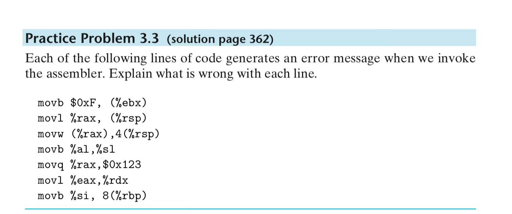

# [CS] CSAPP - 2

> 개념과 이슈 트래킹을 조합해서 “복기 가능한” 자료를 만들도록 합니다.

# Program Encoding

## 1. C code file

```bash
root@a0fd357a556d:/test# cat mstore.c
long mult2(long, long);

void multstore(long x, long y, long *dest) {
	long t = mult2(x, y);
	*dest = t;
}
```

## 2. Generate assembly code

gcc command generates mstore.s 


generated asm file.

CSAPP의 예제와 매우 다르다! 맥북의 도커 우분투 서버에서 실행했기 때문인가?

```python
	.arch armv8-a
	.file	"mstore.c"
	.text
	.align	2
	.global	multstore
	.type	multstore, %function
multstore:
.LFB0:
	.cfi_startproc
	stp	x29, x30, [sp, -32]!
	.cfi_def_cfa_offset 32
	.cfi_offset 29, -32
	.cfi_offset 30, -24
	mov	x29, sp
	str	x19, [sp, 16]
	.cfi_offset 19, -16
	mov	x19, x2
	bl	mult2
	str	x0, [x19]
	ldr	x19, [sp, 16]
	ldp	x29, x30, [sp], 32
	.cfi_restore 30
	.cfi_restore 29
	.cfi_restore 19
	.cfi_def_cfa_offset 0
	ret
	.cfi_endproc
.LFE0:
	.size	multstore, .-multstore
	.ident	"GCC: (Ubuntu 13.3.0-6ubuntu2~24.04) 13.3.0"
	.section	.note.GNU-stack,"",@progbits
```

네, CS:APP (Computer Systems: A Programmer’s Perspective) 책에서 나오는 어셈블리 코드 예제와

지금 도커 우분투에서 생성한 어셈블리 코드가 다르게 보이는 이유는,

당신의 도커 우분투가 ARM 기반이기 때문입니다. 정확히는 ARM64 (AArch64, armv8-a) 아키텍처로 컴파일되고 있어요.

✅ 차이의 원인 정리

즉, CSAPP는 x86-64용 어셈블리를 다루는 반면,

당신의 컴파일 환경은 ARM64 기반이기 때문에 결과물이 전혀 다른 형태인 거예요.

✅ 확인 포인트: 어셈블리 첫 줄

```plain text
.arch armv8-a
```

→ 이건 명백히 ARM 아키텍처용 코드임을 보여주죠.

x0, x19, x29 같은 레지스터 명도 ARM 전용입니다.

(x86 계열이라면 rax, rdi, rbp 같은 이름이 나와야 하죠.)

🧪 해결 방법 ①: x86-64 환경에서 컴파일하기 (정석)

CSAPP 책과 동일하게 보기 위해선, x86-64 환경에서 컴파일해야 합니다. 방법은:

방법 1: x86 기반 리눅스 머신 or 클라우드 사용

•	AWS EC2 / Google Cloud / WSL on Intel PC 등

•	또는 Intel CPU 맥북에서 도커 사용

방법 2: --platform 옵션으로 도커 x86 에뮬레이션

M1/M2 맥에서 다음처럼 도커 컨테이너를 x86 에뮬레이션으로 실행할 수 있어요:

```plain text
docker run --platform=linux/amd64 -it ubuntu
```

그리고 안에서 gcc 설치하고 사용하면, x86-64용 어셈블리 코드가 나옵니다.

✳️ 해결 방법 ②: 그냥 ARM 어셈블리 공부하기

물론 ARM 어셈블리 자체도 좋은 공부가 되며, 특히 모바일/임베디드 쪽에 관심 있다면 유익합니다.

다만 CSAPP나 시스템프로그래밍 과목은 대부분 x86-64 기준이라 그쪽에 맞춰보는 게 유리하긴 하죠.

🔁 참고로: x86 어셈블리 예시 (CSAPP 기준)

```plain text
multstore:
    pushq   %rbp
    movq    %rsp, %rbp
    movq    %rdx, -8(%rbp)
    call    mult2
    movq    -8(%rbp), %rax
    movl    %eax, (%rax)
    popq    %rbp
    ret
```

결론

> 당신의 어셈블리 코드가 CSAPP와 다른 이유는

> 도커 우분투가 ARM64 (Apple Silicon 기반)에서 실행되고 있기 때문

필요하시면:

•	x86-64 컨테이너 세팅법

•	objdump, gdb로 어셈블리 분석하는 법

•	ARM ↔ x86 어셈블리 대응표

도 제공해 드릴게요 :)

어떤 쪽으로 더 공부하고 싶은지도 알려주세요!

### 이슈: 우분투 컨테이너 플랫폼 설정을 amd로 바꿔서 테스트한 결과

이제 예제와 똑같다.

```python
root@a0fd357a556d:/test# cat mstore.s
	.file	"mstore.c"
	.text
	.globl	multstore
	.type	multstore, @function
multstore:
.LFB0:
	.cfi_startproc
	endbr64
	pushq	%rbx
	.cfi_def_cfa_offset 16
	.cfi_offset 3, -16
	movq	%rdx, %rbx
	call	mult2@PLT
	movq	%rax, (%rbx)
	popq	%rbx
	.cfi_def_cfa_offset 8
	ret
	.cfi_endproc
.LFE0:
	.size	multstore, .-multstore
	.ident	"GCC: (Ubuntu 13.3.0-6ubuntu2~24.04) 13.3.0"
	.section	.note.GNU-stack,"",@progbits
	.section	.note.gnu.property,"a"
	.align 8
	.long	1f - 0f
	.long	4f - 1f
	.long	5
0:
	.string	"GNU"
1:
	.align 8
	.long	0xc0000002
	.long	3f - 2f
2:
	.long	0x3
3:
	.align 8
4:
```

## 3. 컴파일과 어셈블

```python
linux> gcc -Og -c mstore.c
```

오브젝트 코드 파일이 완성됨


compile: c 파일을 s 파일(어셈블리 파일)로

asmble: s 파일(어셈블리 파일)을 o 파일(오브젝트 코드 파일(binary))로

## 4. Inspecting machine code files

disassembler: 어셈블리 코드와 비슷한 형식의 기계 코드를 생산한다.

리눅스에서 OBJDUMP 가 이 역할을 함.

```bash
root@a0fd357a556d:/test# objdump -d mstore.o

mstore.o:     file format elf64-x86-64


Disassembly of section .text:

0000000000000000 <multstore>:
   0:	f3 0f 1e fa          	endbr64
   4:	53                   	push   %rbx
   5:	48 89 d3             	mov    %rdx,%rbx
   8:	e8 00 00 00 00       	call   d <multstore+0xd>
   d:	48 89 03             	mov    %rax,(%rbx)
  10:	5b                   	pop    %rbx
  11:	c3                   	ret
root@a0fd357a556d:/test#
```

## 5. linker

링커를 쓰기 위해서는 오브젝트 파일에 메인 메서드가 있어야 한다.

```c
root@a0fd357a556d:/test# cat main.c
#include <stdio.h>

void multstore(long, long, long *);

int main(){
	long d;
	multstore(2, 3, &d);
	printf("2 * 3 --> %ld/n", d);
	return 0;
}

long mult2(long a, long b) {
	long s = a * b;
	return s;
}

```

파일 용량이 증가한 것을 볼 수 있음. 왜? since it contains not just the machine code for the procedures we provided but also code used to start and terminate the program as well as to interact with the OPERATING SYSTEM.

```bash
root@a0fd357a556d:/test# ls -l
total 32
-rw-r--r-- 1 root root   205 Apr  3 09:34 main.c
-rw-r--r-- 1 root root   107 Apr  3 08:52 mstore.c
-rw-r--r-- 1 root root  1360 Apr  3 08:55 mstore.o # <-- 앞서 생산한 오브젝트 파일에 비해
-rw-r--r-- 1 root root   580 Apr  3 08:53 mstore.s
-rwxr-xr-x 1 root root 16112 Apr  3 09:34 prog # <-- 프린트 때문에 더 커진 용량 확인 가능.
```

```bash
00000000000011d8 <multstore>:
    11d8:	f3 0f 1e fa          	endbr64 
    11dc:	53                   	push   %rbx
    11dd:	48 89 d3             	mov    %rdx,%rbx
    11e0:	e8 e7 ff ff ff       	call   11cc <mult2>
    11e5:	48 89 03             	mov    %rax,(%rbx)
    11e8:	5b                   	pop    %rbx
    11e9:	c3                   	ret
```

위의 multstore는 이전의 mstore의 오브젝트 코드와 두 가지 차이점이 있음

1. the addresses listed along the left are different: the linker has shifted the locatino of this code to a different range of address that the callq instruction should use in claling the function mult2
  1. task for the linker is to match function calls with the locations of the executable code for those functions
1. we see two additional lines of code. (??왜 내 코드에서는 이 추가 라인이 안 보이는지 모르겠다.) These instructions will have no effect on the program, since they occur after the return instruction(line 7). They have been inserted to grow the code for the function to 16 bytes, enabling a better placement of the next block of code in terms of memory system performance.
### 의문: 왜 내 코드에서는 메모리 블럭 최적화를 위해 코드를 늘린 부분이 존재하지 않는지?

이런 차이가 생기는 이유는 주로 컴파일러/링커 버전, 최적화 옵션, 또는 정렬(alignment) 방식의 차이 때문입니다. 즉, 함수의 끝에 패딩(padding) 명령어가 삽입되는지 여부는 컴파일러와 링커가 함수를 어떤 방식으로 정렬하고 최적화를 수행하는지에 따라 달라집니다. 주요 원인은 다음과 같습니다:

1.	컴파일러 및 링커 버전 차이

오래된 버전의 도구 체인(toolchain)에서는 함수 단위를 16바이트 단위로 정렬하기 위해 ret 이후에 추가 명령어(예: nop 또는 비어 있는 placeholder 명령어)를 넣어 두는 경우가 있습니다. 반면 최신 버전의 GCC나 Clang에서는 이런 패딩을 굳이 넣지 않을 수도 있습니다.

2.	최적화 옵션

•	최적화 수준이 높을 때(-O2, -O3): 불필요한 코드나 패딩이 최대한 제거됩니다.

•	최적화가 꺼져 있을 때(-O0): 컴파일러가 명령어를 간단한 형태로 배치하지만, 꼭 패딩을 넣어야 한다고 판단되지 않으면 생략할 수 있습니다.

3.	함수 정렬 vs. 섹션 정렬

함수마다 16바이트 정렬을 적용하는 방식도 있지만, 섹션 단위로 정렬해 전체 바이너리를 배치할 수도 있습니다. 이 과정에서 이전 함수 끝에 패딩을 넣는 대신 다음 함수 시작 위치를 정렬하거나, 특정 섹션 전체가 정렬되도록 관리하기도 합니다.

4.	도구 체인 또는 운영체제별 관례 차이

특정 시스템에서는 함수가 16바이트 경계에 맞춰 시작하기만 하면 충분하다고 보고, 함수 끝 부분에는 추가 패딩 명령어를 넣지 않습니다. 어떤 시스템에서는 (특히 64비트 환경에서) 함수 시작을 정렬해 캐시 효율을 높이는 전략을 취하므로, 함수 끝에 별도 패딩이 붙지 않을 수 있습니다.

결국, 함수 끝에 패딩 명령어가 있는지 여부는 컴파일러 및 링커 조합, 최적화 옵션, 정렬 정책 등이 종합적으로 작용해 결정됩니다. 코드에 아무 문제가 없고, 성능에도 크게 영향을 주지 않으므로, 보이는 차이는 단지 빌드 환경 차이일 뿐입니다.

## Notes on  Formatting

- 웹 부록1: IA32. 기계어 코드 설명
- 웹 부록2: c 코들을 어셈블리어 코드에 병합하는 방법
  - 어셈블리어로 최적화된 코드를 C에 쓰는 법: 그냥 어셈블리어로 쓰고 링킹 단계에서 병합된 어셈블리 코드를 생산하거나, c 파일에 임베딩 하는 방법이 있다.


# Data Formats

## Word

인텔 16비트 아키텍처에서 처음 16비트 데이터 타입을 일컬은 데서 시작돼서 32비트 데이터 타입을 더블 워드, 64비트 데이터 타입을 쿼드 워드로 부르기 시작함.

### 의문:  8-byte quad word는 그냥 쿼드 워드 자체의 바이트 수가 8이라서 그렇게 부르는 건가?

네, 맞습니다.
“8-byte quad word”는 8바이트(64비트)로 구성되어 있다는 뜻에서 “quad word”라고 부릅니다.
역사적으로, “word”라는 용어는 컴퓨터의 기본 데이터 단위를 의미하며, 보통 x86 아키텍처에서는 word가 2바이트를 의미합니다. 이에 따라 2바이트인 word, 4바이트인 double word, 8바이트인 quad word로 정의됩니다.

즉, 8바이트의 데이터가 quad word로 불리는 것은 단순히 그 크기가 8바이트이기 때문입니다.

## 표: Sizes of C data types in x86-64

With a 64-bit machine, pointers are 8 bytes long.


floating point numbers come in two principal formats: single precision values

이 표를 기준으로 어셈블리 코드의 데이터 타입을 이해할 수 있음

movb: move byte

movw: move word

movl: move double word

movq: move quad word

이때 ‘l’은 double word와 double precision 모두에서 사용 가능.

### 의문

데이터 타입의 사이즈는 다르지만…어떻게 같이 쓸 수 있는 거지? 바이너리 단위에서 구별하기 귀찮을 거 같은데. 용량이 다르잖아.

### 답변

이 질문의 핵심은 “l” 접미사가 32비트 데이터를 이동한다는 점에 있습니다. CSAPP에서는 IA32 환경에서 double precision 값(실제로 64비트)이 두 개의 32비트 조각으로 나뉘어 저장되므로, 각각의 32비트를 이동할 때 movl 명령어를 사용합니다. 즉, “l”은 double word(32비트)를 의미하지만, double precision 값은 두 개의 double word로 취급할 수 있기 때문에 같은 접미사를 사용해도 문제가 없는 것입니다.

요약하면:

•	movl: 32비트(4바이트) 데이터를 이동

•	double precision 값: 64비트이지만, IA32에서는 32비트 단위(두 번의 movl)로 처리

따라서, 데이터 타입의 전체 크기가 다르더라도 IA32에서는 double precision 값을 두 개의 32비트 단위로 다루기 때문에 같은 “l” 접미사를 사용할 수 있습니다.

> The assembly code uses the suffix ‘l’ to denote a 4-byte integer as well as an 8-byte double-precision floating point number.

### 의문: double precision을 처리할 때는 double word 둘을 처리한다는 개념인가?

### 답변

네, 맞습니다. IA32 환경에서는 64비트인 double precision 값을 두 개의 32비트 double word로 나누어 처리하는 개념입니다. 그래서 movl 명령어가 32비트씩, 즉 double word 단위로 데이터를 이동시키는데 사용됩니다. 이 방식으로 double precision 값을 처리하면, 64비트 데이터를 두 번의 movl로 다루게 되는 것입니다.

### Floating point numbers에 대한 주의

소수 표현에는 두 가지 자료 형식 있음

1. single precision = c의 float
1. double precision = c의 double
그런데! 원래 x86 마이크로 프로세서 패밀리는 역사적으로 80bit 소수 형식을 썼음. 이건 지금도 c에서 long double이라는 타입으로 쓸 수 있음. 하지만 비추. 왜? 요즘 잘 안 씀.

# Accessing Information

## Practice 3.1

### 아래 주어진 operand forms와 address value 테이블을 확인하여 각 operand 값 계산해보기


### 계산 과정


## Practice 3.2

### 주어진 인수를 바탕으로 mov 연산 클래스의 suffix 완성해보기

### 풀이


## 64 O Practice 3.3

### 의문: mov의 접미사는 출발 메모리 기준인가 도착 메모리 기준인가

### 답변

x86 계열(특히 AT&T 문법)에서 movb, movw, movl, movq 같은 접미사는 “어느 쪽 기준으로” 선택되는 것이 아니라, **“이동하려는 데이터 크기(연산 크기)”**에 의해 결정된다고 보시면 됩니다. 즉,

•	movb는 8비트(1바이트) 단위 전송

•	movw는 16비트(2바이트) 단위 전송

•	movl는 32비트(4바이트) 단위 전송

•	movq는 64비트(8바이트) 단위 전송

을 의미합니다. 원천(Source)과 목적지(Destination)의 크기가 항상 일치해야 하므로, “접미사가 출발 메모리 기준인가 도착 메모리 기준인가?”라고 묻는 것은 사실 큰 의미가 없습니다. 왜냐하면 x86에서는 보통 8비트 레지스터라면 8비트 메모리와만, 16비트 레지스터라면 16비트 메모리와만 매칭하는 식으로 사용하기 때문입니다.

예컨대 다음과 같은 AT&T 문법을 보면:

```plain text
movb  (%eax), %bl
movw  (%eax), %bx
movl  (%eax), %ebx
```

•	(%eax)에서 8비트를 읽어 bl(8비트 레지스터)로 옮길 때는 movb

•	(%eax)에서 16비트를 읽어 bx(16비트 레지스터)로 옮길 때는 movw

•	(%eax)에서 32비트를 읽어 ebx(32비트 레지스터)로 옮길 때는 movl

처럼, 어떤 레지스터 또는 메모리를 대상으로 하느냐가 이미 그 연산 크기를 결정하고, 그에 맞춰 접미사가 선택되는 구조입니다. 따라서 “접미사가 어느 쪽(출발/도착 메모리) 기준이냐”라고 묻기보다는, **“레지스터 또는 메모리가 몇 바이트(몇 비트)짜리인가”**에 따라 접미사가 붙는다고 보시면 됩니다.

### 문제와 풀이


## 개구코1. 데이터 이동 예시

### 개념: long 자료형 값을 교환하는 함수를 통한 데이터 이동 과정 살펴보기

- exchange 함수는 세 명령어로 구성됨.
  - 두 개의 데이터 이동과 리턴
- 함수는 값을 %rax에 넣어서 리턴시킴. or in one of the low-order portions of this register
- Procedure
  - 매개변수 xp, y가 레지스터 %rdi, %rsi에 각각 저장됨
  - 인스트럭션 2가 메모리에서 %rdi가 가리키는 메모리 위치를 읽어와서 레지스터 %rax 위치에 값을 저장. (x = *xp)
  - %rax는 나중에 값을 리턴하기 위해 쓰일 것.
  - 인스트럭션3(movq %rsi, (%rdi))는 %rdi가 가리키는 메모리 위치에 %rsi 값(y)을 저장(*xp = y)
### 구현

```c
// C code
long exchange(long *xp, long y) // xp에 있는 값을 x에 저장하고, 새로운 y값을 저장한 후 원래 xp에 있던 오래된 값, 지금은 x값을 리턴
{ 
	long x = *xp;
	*xp = y;
	return x;
}
// Assembly code
// long exchange(long *xp, long y)
// xp in %rdi, y in %rsi
exchange:
	movq (%rdi), %rax   // x를 xp로 가져옴. return 값으로 설정
	movq %rsi, (%rdi) // y를 xp에 저장
	ret
```

### 코멘트

아래는 exchange 함수와 그에 대응하는 어셈블리 코드를 이해하기 위한 간단한 복습 문제 3가지입니다.

1. exchange 함수에서 매개변수 xp와 y는 각각 어떤 레지스터에 전달되나요?
  1. %rdi, %rsi
1. 함수가 반환하는 값은 어느 레지스터에 저장되며, 왜 이 레지스터를 쓰나요?
  1. %rax. 이 레지스터를 쓰는 이유는 모르겠음
  1. %rax 레지스터를 리턴 값으로 사용하는 이유**는, x86-64 System V ABI(리눅스 등에서 사용하는 표준 호출 규약)에서 함수의 반환값(정수, 포인터, long 등)이 기본적으로 %rax 레지스터를 통해 전달되도록 정해져 있기 때문입니다.
1. 어셈블리 코드에서 movq (%rdi), %rax와 movq %rsi, (%rdi)는 각각 어떤 동작을 수행하나요?
  1. movq (%rdi), %rax 
    1. %rdi가 가리키는 주소의 값, 즉 xp가 가리키는 메모리의 값을 %rax 레지스터에 저장(x = *xp)
  1. movq %rsi, (%rdi)
    1. 메모리 주소 y의 값을 xp가 가리키는 메모리에 저장. (*xp = y)
## 개구코2. 포인터 예제

### 개념

- Pointer dereferencing: long x = *xp라고 할 때, ‘*’를 붙이면 pointer dereferencing을 수행하여 xp가 가리키는 위치의 값을 참조. 오른쪽에 있으면 쓰기 연산을 수행하게 됨.
- pointer creation: &연산자. 하는 일이 뭐지?
  - &(address-of) 연산자는 변수의 메모리 주소를 얻을 때 사용합니다. 예를 들어 long a = 4; 가 있을 때 &a는 a가 저장된 메모리의 주소(포인터)가 됩니다.
  - 즉, exchange(&a, 3) 라고 호출하면,
  - &a가 a의 주소(포인터)를 제공하고,
  - 함수 내부에서는 이 주소를 통해 a의 값에 직접 접근하거나 변경할 수 있게 됩니다.
### 구현

```c
long x = *xp // we should read the value stored in the location designated by x and store it as a local variable named x.
*xp = y // 정반대의 역할. 이것도 포인터 dereferencing의 일종이지만, dereferencing이 왼쪽에 있으면 쓰기 연산을 수행함.
```

```c
long a = 4;
long b = exchange(&a, 3);
printf("a = %ld, b = %ld\verb@\@n", a, b); 
--> a = 3, b = 4
```


### 코멘트

진짜 어렵다

## Practice 3.4

### 문제

Assume variables sp and dp are declared with types
src_t *sp;
dest_t *dp;
where src_t and dest_t are data types declared with typedef. We wish to use the appropriate pair of data movement instructions to implement the operation


*dp = (dest_t) *sp;

Assume that the values of sp and dp are stored in registers %rdi and %rsi, respectively. For each entry in the table, show the two instructions that implement the specified data movement. The first instruction in the sequence should read from memory, do the appropriate conversion, and set the appropriate portion of register %rax. The second instruction should then write the appropriate portion of %rax to memory. In both cases, the portions may be %rax, %eax, %ax, or %al, and they may differ from one another. 

Recall that when performing a cast that involves both a size change and a change of “signedness” in C, the operation should change the size first (Section
2.2.6).

### 답안

### 풀이

1. movb: char는 byte이므로 (%rdi)에 저장된 char 값은 movb로 가져와서 return의 low order portion인 %al에 저장. 그 후 목적지의 자료형인 int에 맞춰 movl 명령어로 %al의 값을 (%rsi)로 복사한다.
  1. 틀린 풀이. 부호/무부호 확장을 통해 자료의 크기를 맞춰야 한다. 제대로된 답은 아래와 같음
    1. movsbl (%rdi), %eax
    1. movl %eax, (%rsi)
1. unsigned: 일반적으로 부호 없는 정수형을 의미. 정확히는 unsigned int. 따라서, movzbl로 무부호 확장하여 진행. → 정답
1. movzbq: char는 byte, long은 quad word이므로 movzbq를 통해 무부호 확장으로 (%rdi) 값을 %rax에 복사. 그리고 나서 %rax 값을 그대로 (%rsi)로 복사해주면 됨 → 정답!
1. int → char할 때는?: C 언어에서 **“더 큰 정수형(int) → 더 작은 정수형(char)”**으로 캐스팅할 때는, 단순히 **하위 바이트(8비트)**만 취급하면 됩니다.
  1. movb %eax, (%rsi)는 틀린 연산! 그냥 return 의 바이트 사이즈에 해당하는 low order portion인 %al 값만을 (%rsi)로 복사하면 됨
1. 위와 동일한 규칙 적용
1. short: data type은 Word, assembly code suffix는 w, 사이즈는 16. 8비트에서 16비트로 확장해야 함.
  1. 논리적으로는 다음과 같은 과정일 거 같음: movsbw %al, (%rsi)
  1. 오류! 목적지가 레지스터일 때만 확장이 가능하다! 따라서 다음 과정으로 정정해야 함
    1. movsbw (%rdi), %ax
    1. movw %ax, (%rsi)
  1. 아래도 동일한 기능을 한다고 함. 어차피 low portion만 최소한으로 맞추면 되기 때문에 여러 연산에 대한 여러 인스트럭션 사용이 가능한가? → 맞음
    1. movsbl (%rdi), %eax
    1. movw %ax, (%rsi)
### 피드백: 풀이 1에 대한 피드백

우선 표에 제시된 “두 개의 명령어”로 “char → int” 변환을 구현할 때, 주의해야 할 중요한 점이 ‘부호(sign)’ 처리와 레지스터 사용입니다.

1. “movl %al, (%rsi)”가 실제로는 유효하지 않음

일반적인 AT&T 문법에서

```plain text
movb  (%rdi), %al
movl  %al,   (%rsi)
```

와 같은 코드는 두 가지 문제가 있습니다.

1.	**부호 확장(또는 부호 없는 확장)**이 이루어지지 않는다.

•	movb (%rdi), %al은 8비트만 읽어서 %rax의 하위 8비트(%al)에 저장하지만, 어떤 부호 확장도 수행하지 않습니다.

2.	오류 혹은 의도치 않은 저장

•	movl %al, (%rsi)라는 명령 자체가 (GNU 어셈블러 기준) 잘못된 형태입니다.

•	“movl”은 32비트(4바이트)를 저장해야 하는데, 원본으로 “%al” (8비트 레지스터)만 지정했다는 점에서 문제가 됩니다.

•	설령 어셈블러가 movl %al, (%rsi)를 받아준다고 해도 실제로는 올바른 32비트 저장을 하지 못합니다.

2. 올바른 접근: 부호 확장(또는 무부호 확장) + 32비트 저장

C에서 char -> int 변환은 “(signed) char”인지 “(unsigned) char”인지에 따라 달라집니다.

1.	(signed) char를 int로 캐스팅할 경우 ⇒ 부호 확장(Sign Extension) 필요

•	x86-64에서 8비트를 32비트로 부호 확장하는 명령어는 movsbl입니다.

•	예)

```plain text
movsbl  (%rdi), %eax   // 메모리의 8비트 값을 부호 확장하여 %eax(32비트)에 저장
movl    %eax,   (%rsi) // %eax에 있는 32비트 값을 메모리에 저장
```

2.	(unsigned) char를 int로 캐스팅할 경우 ⇒ 무부호 확장(Zero Extension) 필요

•	x86-64에서 8비트를 32비트로 무부호 확장하는 명령어는 movzbl입니다.

•	예)

```plain text
movzbl  (%rdi), %eax   // 메모리의 8비트를 무부호 확장하여 %eax(32비트)에 저장
movl    %eax,   (%rsi) // %eax에 있는 32비트 값을 메모리에 저장
```

여기서 %eax는 레지스터 %rax의 하위 32비트 구역이므로, 결과적으로 **32비트 자료형(int)**에 해당하는 값이 %eax에 들어가게 되고, 이를 그대로 movl을 통해 메모리에 써주면 됩니다.

3. 정리

•	“char → int”로 복사할 때 단순 movb → movl 조합이 아니라, 반드시 부호(또는 무부호) 확장 명령어를 써야 합니다.

•	따라서, 표에 들어갈 두 줄은 다음과 같이 작성하는 것이 일반적입니다.

```c
// (signed) char -> int의 경우
1) Instruction1: movsbl (%rdi), %eax   // 8비트를 32비트로 '부호 확장'
   Instruction2: movl   %eax,   (%rsi) // 32비트 값을 메모리에 저장

// (unsigned) char -> int의 경우
1) Instruction1: movzbl (%rdi), %eax   // 8비트를 32비트로 '무부호 확장'
   Instruction2: movl   %eax,   (%rsi) // 32비트 값을 메모리에 저장
```

이와 같은 패턴이 x86-64 System V ABI 하에서 C 언어의 캐스팅 규칙(부호 확장, 무부호 확장)에 맞는 정석적인 구현입니다.

> 결론적으로 “movb (%rdi), %al / movl %al, (%rsi)”와 같은 단순 명령어 조합은

> 1.	확장 처리를 누락하고

> 2.	AT&T 문법에서 잘 맞지 않는 구문

> 이므로, 올바른 코드는

### 의문: char에 부호가 있다는 말은 무슨 의미인가

C 언어에서 char 타입은 “작은 정수형”으로 취급됩니다. 그런데 C 표준상 char가 반드시 부호를 갖는(signed)지, 혹은 부호 없는(unsigned)지는 구현(컴파일러)마다 달라질 수 있습니다. 즉,

•	signed char: 8비트 정수로서 -128 ~ +127 범위를 표현

•	unsigned char: 8비트 정수로서 0 ~ 255 범위를 표현

을 의미합니다.

컴파일러 옵션에 따라 char가 기본적으로 signed가 되기도, unsigned가 되기도 합니다. 따라서 어떤 컴파일러에서는 char가 signed char처럼 -128 ~ +127 범위를, 다른 컴파일러에서는 unsigned char처럼 0 ~ 255 범위를 가지도록 구현될 수 있습니다.

> “char에 부호가 있다”는 말은,

### 의문: char는 문자 하나를 표현하는데, 이 문자도 2의 보수법으로 표현되기 때문에, 부호 확장이 필요할 수도 있다, 이말인가?

네, 맞습니다. C 언어에서 char 자료형은 “문자 한 개”를 표현하기 위해 사용하지만, 실제로는 그 내부 표현이 8비트 정수 형태(이진수)입니다. 그리고 컴파일러나 시스템 설정에 따라 char가 signed 혹은 unsigned 정수로 취급될 수 있습니다.

•	(signed) char인 경우

•	내부 표현이 2의 보수법(two’s complement)을 사용하여 -128 ~ +127 사이의 값을 표현합니다.

•	8비트를 32비트 등 더 큰 정수로 변환할 때, **부호 확장(sign extension)**이 필요합니다.

•	(unsigned) char인 경우

•	0 ~ 255 사이의 값을 표현하는 무부호 8비트 정수입니다.

•	더 큰 정수로 변환할 때는 **무부호 확장(zero extension)**을 합니다.

따라서 char를 상위 정수형으로 캐스팅할 때, “2의 보수법을 기반으로 음수가 저장되어 있을 수도 있다”는 점 때문에 부호 확장이 필요할 수 있다는 뜻입니다.

### 피드백: 6번 풀이에 대한 정정

일반적인 x86-64 환경에서 “8비트 char → 16비트 short” 변환은 **부호 확장(sign extension)**을 통해 이루어집니다. 다만, 주의해야 할 점은 movsbw 명령어의 사용 방식입니다.

1. 왜 movb (%rdi), %al; movsbw %al, (%rsi)는 문제가 될까?

```plain text
movb   (%rdi), %al
movsbw %al,    (%rsi)   // ← 이렇게 바로 메모리에 쓰는 형태
```

•	movsbw(AT&T 표기) 또는 MOVSX r16, r/m8(Intel 표기)는 8비트 값을 받아서 16비트 레지스터로 부호 확장해 주는 명령어입니다.

•	즉, 목적지(DEST)는 반드시 레지스터여야 하며, 메모리에 직접 쓰는 형태(movsbw %al, (%rsi))는 유효하지 않습니다.

2. 올바른 방법 1: “메모리 → 레지스터 확장 → 메모리”

두 가지 대표적인 방법이 있습니다.

(A) 2단계 방식 — 바로 메모리에서 16비트 레지스터로 확장한 뒤 저장

```plain text
movsbw (%rdi), %ax    // 메모리의 char(8비트)를 %ax(16비트)로 부호 확장
movw   %ax,     (%rsi) // %ax(16비트)를 메모리에 저장 (short)
```

•	첫 번째 명령어가 메모리의 8비트를 읽어오면서 곧바로 16비트로 부호 확장해 %ax에 저장합니다.

•	두 번째 명령어는 %ax를 메모리에 short 크기로 씁니다.

(B) 2단계 방식 — 8비트를 32비트로 확장 후, 하위 16비트만 저장

```plain text
movsbl (%rdi), %eax   // 메모리의 char(8비트)를 32비트로 부호 확장 (%eax)
movw   %ax,     (%rsi) // %ax (하위 16비트)를 메모리에 저장
```

•	이 방법도 내부적으로는 8비트 → 32비트 확장을 한 뒤, 최종적으로 %ax(하위 16비트 부분)만 메모리에 저장합니다.

•	결과적으로 16비트(short) 저장과 동일한 효과를 냅니다.

3. 정리

•	“char에서 short로” 캐스팅할 때는 부호 확장(signed char일 경우)이 필요합니다.

•	x86-64에서 이를 구현하려면 메모리 → 레지스터 (확장 포함) → 메모리 순으로 처리해야 하며,

•	목적지가 메모리인 상태로 “movsbw %al, (%rsi)”처럼 직접 확장·저장은 불가능합니다(목적지가 레지스터여야 함).

따라서 가장 간단한 형태는 아래 두 줄 중 하나를 쓰는 것입니다:

```plain text
movsbw (%rdi), %ax
movw   %ax,     (%rsi)
```

또는

```plain text
movsbl (%rdi), %eax
movw   %ax,     (%rsi)
```

이 방식이 8비트 → 16비트 확장을 올바르게 수행한 뒤 메모리에 저장하는 “정답”이 됩니다.

### 질문: 어차피 low portion만 최소한으로 맞추면 되기 때문에 여러 연산에 대한 여러 인스트럭션 사용이 가능한가?

네, 맞습니다.

1.	목적지가 레지스터여야 확장 명령을 쓸 수 있다는 것이 핵심입니다. 그래서

•	movsbw (%rdi), %ax

•	movw %ax, (%rsi)

이런 식으로 8비트 → 16비트 부호 확장 후 %ax를 메모리에 저장해야 합니다.

2.	movsbl (%rdi), %eax 로 8비트 값을 먼저 32비트로 확장한 뒤, %ax의 16비트 부분만 메모리에 저장(movw %ax, (%rsi))하는 방식도 같은 결과를 얻습니다.

즉, 하위 8비트(=char)를 하위 16비트(=short)로 옮길 때는,

•	메모리 → 확장(어떤 크기로든) → 목적지 크기만큼 메모리에 저장

의 과정을 거치면 되며, 중간에 어떻게 확장하든(16비트든 32비트든) 결과의 하위 16비트만 쓴다는 점이 변함없기 때문에 다양한 조합이 가능하다는 뜻입니다.

## Practice 3.5

### 문제

아래 어셈블리 코드에 상응하는 c코드를 작성해보기

void decode1(long *xp, long *yp, long *zp)

xp in %rdi, yp in %rsi, zp in %rdx

```c
decode1:
	movq (%rdi), %r8
	movq (%rsi), %rcx
	movq (%rdx), %rax
	movq %r8, (%rsi)
	movq %rcx, (%rdx)
	movq %rax, (%rdi)
	ret
```

### 정답

```c
void decode1(long *xp, long *yp, long *zp) {
	x = *xp
	y = *yp
	z = *zp
	*yp = x
	*zp = y
	*xp = z
	return z
}
```

### 풀이


### 피드백

먼저 주어진 어셈블리를 단계별로 해석해 보겠습니다.

(레지스터 대응: xp -> %rdi, yp -> %rsi, zp -> %rdx)

```plain text
decode1:
    movq (%rdi), %r8   // *xp를 읽어 r8에 저장
    movq (%rsi), %rcx  // *yp를 읽어 rcx에 저장
    movq (%rdx), %rax  // *zp를 읽어 rax에 저장
    movq %r8, (%rsi)   // r8(원래 xp의 값)을 *yp에 저장
    movq %rcx, (%rdx)  // rcx(원래 yp의 값)을 *zp에 저장
    movq %rax, (%rdi)  // rax(원래 zp의 값)을 *xp에 저장
    ret
```

결과적으로,

•	xp에 있던 값 → yp가 가리키는 메모리

•	yp에 있던 값 → zp가 가리키는 메모리

•	zp에 있던 값 → xp가 가리키는 메모리

로 옮기는 “3개 변수의 cyclic shift” 작업을 수행합니다.

C 코드로 옮기면?

함수 원형이 void decode1(long *xp, long *yp, long *zp) 이므로 반환값은 없습니다(void).

중간 임시 변수 세 개(x, y, z)를 사용해서 다음과 같이 작성하면 됩니다.

```c
void decode1(long *xp, long *yp, long *zp) {
    long x = *xp;   // 1) xp가 가리키는 값을 x에 저장
    long y = *yp;   // 2) yp가 가리키는 값을 y에 저장
    long z = *zp;   // 3) zp가 가리키는 값을 z에 저장

    *yp = x;        // 4) yp가 가리키는 메모리에 x 저장
    *zp = y;        // 5) zp가 가리키는 메모리에 y 저장
    *xp = z;        // 6) xp가 가리키는 메모리에 z 저장
}
```

함수 시그니처가 void이므로, return z; 같은 별도의 반환 구문은 쓰지 않습니다.

어셈블리 코드 마지막에 %rax를 다른 곳에 쓰긴 하지만, x86-64 ABI에서 “함수 반환값”으로 %rax를 쓰는 것과는 별개로, 여기서는 단순히 *xp에 저장하기 위한 용도로만 사용된 것입니다.

> 즉, “void decode1이므로 ‘return z’는 필요 없다.”가 핵심 포인트입니다.

### 질문: 함수에서 처음 선언된 지역변수가 무조건 %rax인 건가?

아닙니다. “함수에서 처음 선언된 지역 변수가 무조건 %rax에 대응된다”는 규칙은 없습니다.

•	x86-64 호출 규약(System V ABI)에서 반환값(return value)을 저장하는 레지스터가 %rax이지만,

•	로컬 변수는 반드시 특정 레지스터에 매핑된다는 보장이 없습니다.

컴파일러는 레지스터 할당 최적화를 통해 각 로컬 변수를 어느 레지스터에 둘지(혹은 스택에 저장할지)를 결정하며, “처음 선언된 지역변수”가 %rax에 배정된다는 정해진 규칙은 없습니다.

•	여러 개의 지역 변수가 모두 레지스터에 들어갈 수도 있고,

•	일부는 스택 프레임에 저장될 수도 있습니다.

•	심지어 사용 중간에 특정 변수만 레지스터에 올렸다가 다시 스택으로 내리기도 합니다.

결국, “지역변수가 어느 레지스터에 들어갈지”는 컴파일러와 최적화 단계, 상황(사용 패턴, 최적화 옵션 등)에 따라 달라지며, “처음 선언된 변수 → %rax” 같은 단순 규칙은 존재하지 않습니다.

## Pushing and Popping Stack Data

### 하나만 기억하기! 레지스터에서 주소를 가리키는 값들은 바이트를 최소 단위로 가진다!

### 의문: 왜 쿼드 워드에서 스택에 push/pop 연산할 때 즉시값 8을 더하고 빼면 되는가?

x86-64 환경에서 “쿼드 워드(quad word)”는 64비트(8바이트) 크기를 의미합니다. 스택 포인터(%rsp)는 8바이트 단위로 관리되는데, push나 pop 명령어를 사용할 때마다 스택 포인터가 8바이트씩 이동하는 이유가 바로 이것입니다.

•	push 연산:

1.	%rsp를 8만큼 감소(sub)

2.	감소된 주소에 8바이트(쿼드 워드) 데이터를 저장

•	pop 연산:

1.	8바이트(쿼드 워드) 데이터를 %rsp가 가리키는 곳에서 읽어옴

2.	%rsp를 8만큼 증가(add)

따라서, 스택에서 64비트(쿼드 워드) 단위를 다룰 때는 즉시값 8을 더하거나 빼서 %rsp를 조정하게 됩니다. C 언어의 long(리눅스 x86-64 기준)도 기본적으로 8바이트(64비트)이기 때문에, 스택에 long 변수를 할당하거나 스택에서 꺼낼 때도 마찬가지로 8바이트만큼 스택 포인터가 이동하게 됩니다.

### 의문: 그럼 레지스터에서 주소를 가리키는 값들은 바이트를 최소 단위로 가지는 거야?

네, 그렇습니다.

•	x86-64 아키텍처에서 레지스터(예: %rsp, %rbp, %rdi 등)에 들어 있는 주소(포인터) 값은 메모리에서 “바이트(byte)” 단위로 인덱싱됩니다.

•	즉, 주소를 1 증가시키면 실제로는 다음 바이트의 메모리 주소로 이동하는 것이고,

•	8을 더하면 8바이트(1쿼드 워드) 뒤의 메모리 주소가 됩니다.

스택 관련 예시로, push/pop이 8씩 %rsp를 조정하는 이유도 64비트(8바이트) 단위를 사용하기 때문입니다. (x86-64에서는 스택으로 쿼드 워드를 푸시/팝 할 때마다 8바이트 단위로 이동)

# Arithmetic and Logical Operations

## LEA에 대해(Load Effective Address)

### 의문:  leaq s, d는 s자체를 주소값으로 효율적으로 계산해서 d에 저장한다고 말하면 되나?

네, 거의 맞습니다! 정확히 표현하면 다음과 같습니다:

✅ leaq s, d의 의미:

•	leaq = Load Effective Address (of s) into d

•	s는 메모리 주소 계산식(예: 오프셋 + 베이스 + 인덱스 * 스케일)이고,

이 주소 자체를 계산해서 값으로 d에 저장합니다.

•	실제로 메모리 접근은 하지 않습니다!

→ 즉, leaq는 데이터를 “가져오는(load)” 명령이 아니라, 계산만 하는 산술 명령어에 가깝습니다.

예시 1: 단순 주소 계산

```plain text
leaq (%rdi), %rax
```

•	%rdi가 가리키는 주소값을 %rax에 그대로 복사

•	즉: %rax = %rdi

예시 2: 오프셋 있는 주소 계산

```plain text
leaq 8(%rsp), %rax
```

•	%rax = %rsp + 8 (주소 계산만 하고, 해당 메모리를 읽지 않음)

예시 3: 배열 인덱싱처럼 사용

```plain text
leaq (%rdi,%rsi,4), %rax
```

•	%rax = %rdi + (%rsi * 4)

•	배열의 특정 요소 주소를 계산할 때 매우 효율적!

✅ 정리

> leaq s, d는

> 따라서

> 단,

필요하다면:

•	movq s, d → 실제로 메모리에서 데이터를 읽어옴

•	leaq s, d → 주소값만 계산해서 저장

둘을 구분해 기억하면 좋아요!

## Practice 3.6

### 문제

%rbx holds value p

%rdx holds value q

Fill in the table with formulas indicating the value that will be stored in register %rax for each of the given assembly-code instructions.

### 풀이

### 피드백

모두 정답

## Practice 3.7

### 문제

```c
short scale3(short x, short y, short z) {
	short t = ____;
	return t;
}
```

일때, 아래와 같은 어셈블리 코드가 컴파일 됐다면 빈칸에 들어갈 c 코드는?

```c
scale3:
	leaq (%rsi, %rsi, 9), %rbx
	leaq (%rbx, %rdx), %rbx
	leaq (%rbx, %rdi, %rsi), %rbx
	ret
```

### 풀이 및 정답 


```c
((y + y * 9) + z) + x * y
```

### 정답 확인


정답은 10 * y + z + y * x라고 한다. 

### 의문: 왜 10*y가 (%rsi, %rsi, 9)로 표현되는 거지? 그냥 (, %rsi, 10)으로 하면 되지 않나?

요약: 하드웨어는 스케일 값으로 10을 지원하지 않음!

In x86-64, the LEA (load effective address) instruction only permits scale factors of 1, 2, 4, or 8 for the index register. In other words, you can’t directly do something like (%rsi, %rsi, 10) because 10 is not an allowed scale. The compiler or disassembler you’re looking at is simply expressing “10 × rsi” as (%rsi, %rsi, 9), but under the hood this typically translates to a combination of valid scale factors and/or additional additions.

A more typical approach you might see is splitting 10×rsi into a sequence like “rsi + 8×rsi + (another add)” or similar. The key point is that the hardware does not support 10 as a single scale factor, so the compiler/disassembler uses tricks (or multiple steps) to compute 10×rsi while emitting something that looks like (%rsi, %rsi, 9).

## Practice 3.8

### 풀이


### 답안지


0x100 - 0x3을 편하게 계산하려면 어떻게 해야 하지?

아래와 같이 하면 됨

0x100 - 0x3
= 0x0FF + 0x1 - 0x3
= 0x0FF - 0x2
= 0xFD

일단 1을 빼주고, FF에 대해 정리하면 됨.

## Practice 3.9

### 문제

아래 c 코드에 대한 어셈블리어 코드 완성하기 

```c
long shift_left4_right(long x, long n)
{
	x <<= 4;
	x >>= n;
	return x;
}
```

```assembly
shift_left4_rightn:
	movq %rdi, %rax
	salq $4, %rax
	movl %esi, %ecx
	sarq %cl, %rax
```

### 풀이


처음에 mov연산을 써서 %cl에 값을 로드해야 하는줄 알았는데, 어셈블리 코드 맥락상 그럴 필요는 없었다. 첫 번째 쉬프트 연산의 경우 즉시값 쉬프트하면 되므로 그냥 salq $4, %rax를 수행하면 되고, 두 번째 쉬프트 연산의 경우 쉬프트 전에 movl %esi, %ecx 연산을 통해 이미 32비트 레지스터에 쉬프트 값을 로드하여 하위 부분인 %cl 레지스터에 원하는 값이 있는 상황이다. 따라서 sarq %cl, %rax로 충분하다.

### 의문: %cl 레지스터는 8비트 레지스터임에도 sarq 연산자를 쓰면 되는 건가?

x86-64 어셈블리에서 sarq는 64비트(‘quad word’) 크기의 오퍼렌드에 대해 산술적 오른쪽 시프트를 수행하는 명령어입니다. 여기서 “q” 접미사는 Shift 대상이 64비트 레지스터(RAX, RBX, RCX, RDX 등)를 의미합니다. 반면, 실제 시프트 양(shift count)을 지정하는 레지스터가 %cl(8비트)인 것은 정상적인 동작입니다.

즉,

•	sarq %cl, %rdx 와 같이 쓰면, 64비트 레지스터 %rdx를 %cl(8비트)에 담긴 값만큼 산술적 오른쪽 시프트하겠다는 의미입니다.

•	이때 8비트인 %cl 레지스터에서 필요한 만큼(하위 5비트~6비트 정도)만 실제 시프트 크기로 사용합니다. (64비트 이상 시프트 요청 시에도 하위 몇 비트만 적용됩니다.)

따라서 %cl은 8비트 레지스터임에도, sarq 명령어에서 시프트 카운트를 전달할 수 있습니다. 이는 어셈블리에서 오랫동안 써온 표준 규약으로, 별다른 문제 없이 정상적으로 동작합니다.

## Practice 3.10

### 문제

어셈블리 코드를 보고 c 프로그램 코드 유추하기

조건

short arith3(short x, short y, short z)

x in %rdi, y in %rsi, z in %rdx

```assembly
arith3:
	orq %rsi, %rdx
	sarq $9, %rdx
	notq %rdx
	movq %rdx, %bax
	subq %rsi, %rbx
	ret
```

```c
short arith3(short x, short y, short z)
{
	short p1 = y | z
	short p2 = p1 >> 9
	short p3 = ~p2
	short p4 = y - p3
	return p4
}
```

### 풀이


어셈블리 코드의 최적화를 생각하지 못한 풀이


### 의문: 대체 왜  movq %rdx, %bax /  subq %rsi, %rbx 이게  short p4 = y - p3인지 모르겠다. 

문제 오류! 

문제가 되는 부분은 **subq %rsi, %rbx**입니다.

•	일반적인 x86-64 함수 반환 규약에서는 **반환값이 반드시 %rax**에 있어야 합니다.

•	%rbx는 “callee-saved register”로, 함수를 호출하는 쪽(Caller)이 아니라 함수(수신자, Callee) 쪽에서 함부로 망가뜨리지 않고 복원해주어야 하는 레지스터에 해당합니다.

•	이 코드에서는 %rbx가 최종 결과와 어떻게 연결되는지, 혹은 다른 용도로 쓰이는지 전혀 알 수가 없습니다.

즉, **“subq %rsi, %rbx가 왜 y - p3를 의미하느냐?”**고 묻는다면,

•	“정상적인 최적화된 코드”라면 subq %rsi, %rax 형태로 나오는 것이 자연스럽습니다(최종 결과를 %rax에 둬야 하니까).

•	그런데 예시 코드에선 %rbx를 수정하고 있기 때문에, 이 부분이 단순히 잘못 적혔거나(오타), 또는 함수 일부만 잘려온 코드일 가능성이 높습니다.

### 의문: 위 코드에서 %rdx에 논리합을 집어넣어 버리면 매개변수 z값이 덮어씌워져버리지 않나?

먼저 x86-64 SysV Calling Convention(리눅스, macOS 등)에서 함수의 인자(매개변수)는 “호출 시점”에만 보장된 위치에 놓입니다. 함수 본문 내부로 들어오면, 컴파일러(또는 어셈블러)는 이미 매개변수가 담겨 있던 레지스터를 자유롭게 재활용할 수 있습니다. 즉, “원래 z가 %rdx에 있으니 %rdx를 건드리면 안 된다”는 개념이 아니라, 컴파일러가 z 값이 더 이상 필요하지 않다면 해당 레지스터를 다시 써도 아무 문제가 없습니다.

핵심 개념

1.	호출 규약

•	x86-64 SysV 규약에 따르면, 일반적으로 C 함수의 첫 6개 정수형 매개변수는 순서대로

\%rdi, \%rsi, \%rdx, \%rcx, \%r8, \%r9

레지스터에 담겨 들어옵니다.

•	함수 진입 시점에는

```plain text
x -> %rdi
y -> %rsi
z -> %rdx
```

와 같이 대입되어 있을 것입니다.

2.	함수 내부에서의 레지스터 사용

•	매개변수는 “호출 직후”까지만 %rdx에 들어있다고 볼 수 있고, 그 이후에는 컴파일러가 계산에 따라 필요한 데이터만 임의의 레지스터나 메모리로 옮기고 %rdx를 새로 써도 됩니다.

•	즉 함수 내부에선 “매개변수 = 특정 레지스터” 관계가 고정되지 않습니다.

3.	OR 연산 후 덮어씌우는 이유

•	컴파일러가 y | z를 구할 때, “이미 z가 %rdx에 있으니, 거기에 y(%rsi)를 OR 해버리면 연산 결과를 바로 저장할 수 있겠군.” 하고 판단하는 것입니다.

•	이후 코드에서 “z의 원래 값”이 필요 없다면, 굳이 z를 다른 곳에 보존할 이유가 없으니 그대로 %rdx에 덮어써서 효율적으로 계산합니다.

예시 코드 해석

```plain text
arith3:
    orq %rsi, %rdx      ; %rdx ← %rdx | %rsi   (z | y)
    sarq $9, %rdx       ; %rdx ← %rdx >> 9     (산술 시프트)
    notq %rdx           ; %rdx ← ~%rdx
    movq %rdx, %bax     ; %rax ← %rdx          (함수 반환값 레지스터)
    subq %rsi, %rbx     ; ??? (의미 불분명, 예시 코드 상 어색)
    ret
```

•	함수에 진입했을 때:

•	x → %rdi

•	y → %rsi

•	z → %rdx

•	orq %rsi, %rdx 명령어로 %rdx에 (z | y)를 계산해 덮어씁니다.

•	이후 연산들은 %rdx 레지스터에 누적된 값을 대상으로 진행합니다.

•	“원래 %rdx 안에 있던 z”는 재사용할 일이 없으므로, 사라져도 문제되지 않습니다.

> “매개변수 z가 덮어씌워진다”고 표현할 수도 있지만,

결론

•	어셈블리 함수 내부에서 매개변수로 쓰던 레지스터를 덮어쓰는 것은 정상적인 동작입니다.

•	C 언어 관점에서 “z가 들어 있던 레지스터를 수정하면 어떡하지?” 라고 염려할 필요가 없습니다. 컴파일러는 z가 더 이상 필요 없을 때 덮어쓰기를 하기 때문에, 결과적으로 함수가 의도한 대로 동작합니다.

•	즉, “매개변수로 사용했던 레지스터를 마음껏 쓰면 된다는 것”이 x86-64 함수 호출 규약과 컴파일러 최적화의 기본 원리입니다.

## Practice 3.11

### 문제

아래 코드의 의미

```c
xorq %rcx, %rcx
```

A. 코드의 의미를 설명하고 어떤 유용한 연산을 이것이 구현하는지 설명

%rcx 레지스터의 모든 비트를 0으로 설정한다. x = 0을 구현한 것.

B. 더 직관적인 어셈블리 코드를 설명

movq $0, %rcx

(leaq $0, %rcx 는 안 된다. 첫 번째 인수로 주소 리터럴만 허용되기 때문. 즉시값 하나는 거기에 해당 안 됨.)

C. 동일한 연산을 수행하는 세 가지 다른 구현 중 임의의 두 개를 선택하여 해당 명령어들을 인코딩하는데 필요한 바이트 수를 비교(??)   


## 개구코 3. 특별 산술 연산 - 큰 수 곱하기 

### 개념


### 구현: c 코드에서의 사용 예시(mulq)

```c
#include <inttypes.h>

typedef unsigned __int128 uint128_t;

void store_uprod(uint128_t *dest, uint64_t x, uint64_t y) {
	*dest = x * (uint128_t) y;
}
```

```c
// void store_uprod(uint128_t *dest, uint64_t x, uint64_t y)
// dest in %rdi, x in %rsi, y in %rdx
store_uprod:
	movq %rsi, %rax // copy x to multiplicand
	mulq %rdx // Multiply by y
	movq %rax, (%rdi) // Store lower 8 bytes at dest
	movq %rdx, 8(%rdi) // Store upper 8 bytes at dest+8
	ret
```


### 코멘트 1. 일반적인 곱셈 산술 연산과 달리 인수가 하나밖에 없다. 즉 128비트 하나의 수에 대한 최대 2^64 값의 S로 나누기 및 곱셈을 한 연산을 저장하는 목적인 듯하다. 이게 맞나?

말씀하신 대로 이 명령들은 일반적인 2항 산술 연산과 달리 오퍼랜드 지정 방식과 결과 레지스터가 고정되어 있다는 점이 핵심입니다. 특히 RDX:RAX 레지스터 쌍을 128비트로 보고 여기에 곱셈이나 나눗셈을 수행하는 방식을 이해하면, 왜 해당 명령들이 ‘단항(single-operand) 산술 연산’인지 자연스럽게 납득할 수 있죠.

•	mulq/imulq: RAX(묵시적) × (명시된 피연산자) → 결과 128비트(상위 RDX, 하위 RAX)

•	divq/idivq: RDX:RAX(묵시적) ÷ (명시된 피연산자) → 몫 RAX, 나머지 RDX

결과 저장 레지스터가 고정되어 있다는 점에서 “특별 산술 연산”으로도 불리는 만큼, 컴파일러가 64비트 정수의 128비트 곱셈이나 나눗셈이 필요할 때 매우 요긴하게 쓰이게 됩니다. 말씀하신 요점을 잘 짚어주셔서, 이 주제를 처음 접하는 분들도 한 번에 이해하기 좋을 것 같네요!

### 코멘트 2.하나의 곱셈 결과를 저장하기 위해서 아래 부분을 %rdi가 가리키는 64비트 메모리 주소에, 그리고 그 위 부분을 %rdi에서 quad word size 떨어진 주소에 저장한다, 이거 아냐?

네, 정확히 그렇습니다.

곱셈 결과 128비트 중 하위 64비트는 (%rdi)에, 상위 64비트는 8(%rdi)(즉 dest+8)에 쓰이므로,

결과적으로 %rdi가 가리키는 메모리 구역(연속된 16바이트)을

“하위 64비트 + 상위 64비트” 순으로 채우게 됩니다.

## 개구코 4. 특별 산술 연산 2

### 개념: 나누기

- idivl은 피제수(dividend, 나눠지는 수)를 %rdx(high-order 64 bits)와 %rax(low-order 64 bits)에 저장
- 제수(divisor, 나누는 수)는 instruction operand로 주어짐
- idivl은 나누기 연산 후 몫을 %rax, 나머지를 %rdx에 저장.
- 대부분의 경우 dividend는 64비트 값으로 주어짐. 그러면 high-order 64 bits를 저장하기 위한 %rdx 레지스터는 쓸 일이 없음 이때 %rdx 레지스터를 채우는 두 가지 방식이 있음
  - unsigned arithmetic: 전부 0으로 채움
  - signed arithmetic: sign bit of %rax로 채움
- 이때, signed arithmetic의 동작을 cqto로 수행할 수 있음. 이 친구는 아무 인수도 받지 않음. 그저 %rax의 사인 비트를 읽어서 %rdx에 갖다 채워버림(코멘트 1.).
### 구현: idivq 사용 예시

```c
void remdiv(long x, long y, long *qp, long *rp) {
	long q = x/y;
	long r = x%y;
	*qp = q;
	*rp = r;
}
```

```assembly
// void remdiv(long x, long y, long *qp, long *rp)
// x in %rdi, y in %rai, qp in %rdx, rp in %rcx
remdiv:
	movq %rdx, %r8 // copy qp
	movq %rdi, %rax   // move x to lower 8 byte of dividend(설명 1.)
	cqto // sign-extend to upper 8 bytes of divdend
	idivq %rsi // divide by y
	movq %rax, (%r8) // store quotient at qp
	movq %rdx, (%rcx) // store remainder at rp
	ret
```

설명 1. movq %rdi, %rax를 수행하는 이유

이 경우, 인수 rp는 다른 레지스터(이 경우 %r8)로 복사돼야 함. 왜? 기존에 이 친구가 저장된 %rdx는 dividend의 high-order 64bits를 저장하기 위한 레지스터기 때문! 

나머지는 어렵지 않음.

### 코멘트: 그렇다면 128비트 수를 연산하지 않는 경우, 64비트 이하의 수를 연산할 때도 cqto 연산을 수행해서 %rdx 레지스터까지 비트를 확장시켜야 하는 건가? 꽤 낭비인 거 같은데.

x86-64 아키텍처에서 idivq(혹은 divq) 명령어를 사용할 때는 상위 64비트를 어떤 방식(부호 확장인지, 0 확장인지)으로든 초기화해 주어야 합니다. 64비트 정수 나눗셈을 하더라도 CPU는 항상 “128비트”(%rdx:%rax)를 피제수로 간주하기 때문입니다.

즉, 다음 두 경우가 존재합니다.

1.	Signed division(idivq)

•	상위 64비트는 cqto(C onvert Q word T o O ctword) 명령어로 부호 확장됩니다.

•	cqto는 %rax의 사인 비트를 읽어, %rdx를 모두 해당 비트로 채웁니다.

2.	Unsigned division(divq)

•	상위 64비트는 0으로 채워야 합니다.

•	흔히 xorq %rdx, %rdx 같은 식으로 간단히 0을 채웁니다.

따라서 “64비트 이하의 값이라 실제로 128비트가 필요 없다” 하더라도, x86-64 하드웨어 레벨에서 idivq/divq는 항상 상위 64비트까지 고려하는 형식으로 정의되어 있습니다. 결과적으로 64비트 나눗셈을 하려면 부호 여부에 맞춰서 무조건 상위 64비트를 초기화(cqto 혹은 xorq %rdx, %rdx) 해야 합니다. 한 줄짜리 보조 명령어일 뿐이라 성능상 부담도 크지 않으며, 이것이 해당 아키텍처의 규약입니다.

## Practice 3.12

### 문제

```assembly
void uremdiv(unsigned long x, unsigned long y, unsigned long *qp, unsigned long *rp) {
	unsigned long q = x/y;
	unsigned long r = x%y;
	*qp = q;
	*rp = r;
}
```

이 경우에 맞춰 unsigned arithmetic을 수행하는 어셈블리 코드로 위 코드를 변경해보기.

### 풀이

그냥 0으로 %rdx를 채워버리면 되지 않나? 아래와 같이 수정

```assembly
// void remdiv(long x, long y, long *qp, long *rp)
// x in %rdi, y in %rai, qp in %rdx, rp in %rcx
remdiv:
	movq %rdx, %r8 // copy qp
	movq %rdi, %rax   // move x to lower 8 byte of dividend(설명 1.)
	xorq %rdx, %rdx // unsign-extend to upper 8 bytes of divdend
	idivq %rsi // divide by y
	movq %rax, (%r8) // store quotient at qp
	movq %rdx, (%rcx) // store remainder at rp
	ret
```

그런데 정답은 다르다. (movl $0, %edx)

### 의문: 왜 xorq %rdx, %rdx가 아니라 movl $0, %edx지? 

상관 없다. 그냥 컴파일 차이. 기능은 동일함

### 코멘트: movl $0, %edx 는 하위 32비트가 바뀌면 상위 32비트는 자동으로 0으로 바꾸는 아키텍처를 활용한 연산이겠구나

맞습니다. x86-64 아키텍처에서 32비트 레지스터(예: %edx)에 값을 쓰면 상위 32비트(즉 %rdx의 상위 절반)가 자동으로 0으로 채워집니다. 이 점을 이용해 movl $0, %edx 명령으로 전체 64비트(= %rdx)를 0으로 만들 수 있는 것이죠. (단, 16비트나 8비트 레지스터는 이런 자동 확장이 적용되지 않습니다.)

## 개구코 4. 조건 코드

### 개념: 데이터 기반 제어를 위한 첫 번째 요소

CF: carry flag. 최근 연산의 제일 높은 비트에서 발생한 캐리아웃을 감지. unsigned operation의 오버 플로우 감지

ZF: zero flag. 최근의 연산이 0을 리턴했는지 감지

SF: sign flag. 최근 연산이 음수 값을 리턴했는지 감지

OF: overflow flag. 최근 연산이 2의 보수법 오버플로우를 냈는지 감지. (음수 양수 상관 없음)

### 구현:

```assembly
CF: (unsigned) t < (unsigned) a // unsigned overflow
ZF: (t == 0) // zero
SF: (t < 0 ) // negative
OF: (a < 0 == b < 0) && (tj < 0 != a < 0) signed overflow
```

이게 다 뭐시다냐. 차근차근 책을 읽어 봅시다.

1. leaq를 제외한 모든 연산이 위 상태코드를 설정한다.
1. XOR과 같은 논리연산자: OF, CF가 0으로 설정 된다. (For the logical operations, such as XOR, the carry and overflow flags are set to zero.)
1. 쉬프트 연산자: OF는 0으로 설정되고, CF는 튀어나온 마지막 비트로 설정된다(의문 1.). (For the shift operations, the carry flag is set to the last bit shifted out, while the overflow flag is set to zero.)
1. INC, DEC: OF, ZF를 갱신한다. 하지만 우리가 더 알아보지 않을 이유로 인해(뭐지?) CF는 갱신되지 않는다. 상식적으로, INC와 DEC는 정수를 변환하는 연산이기 때문에 OF, ZF는 충분히 발생 가능함. 그런데 CF는 왜 안 되지? 일단 패스.(For reasons that we will not delve into, the INC and DEC instructions set the overflow and zero flags, but they leave the carry flag unchanged. )
### 의문 1:  쉬프트 연산자가 쉬프트로 튀어나온 마지막 비트를 CF로 설정한다면, shift left 경우에만 CF가 바뀌는 건가? shift right에서는 튀어나오는 비트 위치가 첫 부분이잖아.

결론: 아무 방향 쉬프트든 튀어나온 친구가 CF에 들어간다.

x86 계열에서 “마지막으로 밀려 나간 비트(last bit shifted out)를 CF에 저장한다” 라는 규칙은 다음과 같이 해석할 수 있습니다.

•	왼쪽 쉬프트(SHL)

•	최상위 비트(MSB)가 “밀려나가는 비트”가 됩니다. 즉, (결과적으로) 오버플로 되어서 사라지는 비트가 CF에 들어갑니다.

•	오른쪽 쉬프트

•	SHR(논리적 오른쪽 쉬프트) : 최하위 비트(LSB)가 “밀려나가는 비트”가 되어 CF에 들어갑니다.

•	SAR(산술적 오른쪽 쉬프트) : 이때도 LSB가 떨어져 나가고 CF에 들어갑니다. (MSB 쪽은 원래의 부호 비트를 채워 넣음)

즉,

•	왼쪽 쉬프트 : 상위 비트가 CF로

•	오른쪽 쉬프트 : 하위 비트가 CF로

가 됩니다. “튀어나오는 마지막 비트”는 쉬프트 방향에 따라 다르므로, 왼쪽 쉬프트라고 해서만 CF가 바뀌는 것은 아니고, 오른쪽 쉬프트에서도 마찬가지로 떨어진 LSB가 CF에 기록됩니다.

## 개구코 5. Comparison and Test instructions

### 개념: 이 명령어들은 목적지 값을 바꾸지 않고 상태 코드를 업데이트할 수 있음

CMP: SUB와 같음. 하지만 목적지 값을 바꾸지 않음

TEST: AND와 같음. 하지만 목적지 값을 바꾸지 않음.

### 구현

b, w, l, q 접미사 생략. 

### 코멘트

없음.

## 개구코 6. The set instructions

### 개념: single byte를 상태코드의 특정 조합에 의거해 0이나 1로 채워버릴 수 있음.

상태 코드를 바로바로 쓰는 것보다는 세 가지 활용 방법이 있음. 그중 첫 번째가 set instructions. 

### 구현:

논리식을 하나 하나 이해하는건 좀 미루는게 좋을 것 같고(어련히 맞겠지) 구체적인 사용 사례를 보자.

```assembly
// int comp(data_t a, data_t b)
// a in %rdi, b in %rsi
comp:
	cmpq %rsi, %rdi //compare a:b
	setl %al // set low-order byte of %eax to 0 or 1 (코멘트 1.)
	movzbl %al, %eax // clear rest of %eax (and rest of %rax) (코멘트 2.)
	ret
```

### 코멘트 1. 

set 연산은 모두 싱글 바이트에 대한 연산이기 때문에 사용하는 레지스터도 싱글 바이트여야 함

### 코멘트 2.

set %al 연산은 %rax 레지스터의 상위 비트들을 그대로 남겨두기 때문에, 이를 ‘클리어’해서 완전히 업데이트하기 위해서는 하위 32비트까지 업데이트하는 movzbl 연산을 수행해야 함. (movzbl %al, %eax)

### 코멘트 3. 종합

컴파일러는 셋 인스트럭션의 동의어를 알아서 선택할 수 있음.(명령어에게 왜 동의어가 있지? 아무튼)

## Practice 3.13

### 문제

```assembly
// a in portion of %rdx b in portion of %rsi
int comp(data_t a, data_t b) {
	return a COMP b;;
}
```

위와 같은 코드가 있을 때, 아래 어셈블리 코드가 컴파일된 경우 

1. 어떤 비교를 COMP가 했는지
1. data_t의 데이터 타입은 무엇인지
### 문제를 제대로 푸는 방법

1. cmp 명령어의 suffix 확인
1. set 명령어의 singed/unsigned 연산 여부 확인.
### 풀이


## Practice 3.14

### 문제


위와 동일 


# Procedures

## 중요한 개념들

- Procedure란? 의도된 매개변수와 옵셔널한 리턴 값을 구현한 코드 패키지를 제공. (provide a way to package code that implements some functionality with a designated set of arguments and an optional return value)
- Attributes of procedures: procedure P가 procedure Q를 부른 후 P로 돌아온다고 할 때,
  - passing control: 프로그램 카운터는 Q의 시작지점으로 설정되었다가 Q가 리턴될 때 P의 명령어로 설정돼야 함
  - passing data: P는 하나 이상의 매개변수를 Q로 전달할 수 있어야 함. 그리고 Q는 값을 P로 돌려줄 수 있어야 함
  - Allocating and deallocating memory: Q는 지역변수를 위한 공간을 배당받고, 리턴되기 전에 이걸 다시 내뱉어야 함
## 개구코 1. 런타임 스택

### 개념

passing control, passing data, allocating and deallocating memory를 위한 저장소. 

- 데이터들은 pushq, popq를 통해 스택에 저장되거나 회수될 수 있음(Data can be stored on and retrieved from the stack using the pushq and popq instructions.)
- 특정한 초기값 없이 공간 초기화는 그냥 스택 포인터 값을 감소시켜서 수행할 수 있음(deallocation은 반대로)
어떤 procedure가 레지스터로 홀드할 수 있는 이상의 저장소를 필요로 한다면 스택에 공간을 할당. 이 공간을 procedure의 stack frame이라고 함.

어떤 procedure들은 6개 이하의 인수가 있고, 모두 레지스터로 바로 집어 넣을 수 있음. 그래서  스택 프레임 자체가 필요 없을 수도 있음.

### 구현


### 코멘트

없음

## 개구코 2. 제어 전달 

### 개념

P가 Q를 호출했다고 할 때 프로세서는 P가 어디서 계속되어야 하는지 저장해야 함.(the processor must have some record of the code location where it should resume the execution of P.) 이를 call Q가 저장

call Q: 주소 A(P의 현재 실행 지점)를 리턴 주소로 스택에 푸시하고 PC를 Q의 시작지점으로 설정

ret: 주소 A를 스택에서 팝 해서 프로그램 카운터를 A로 설정


### 구현

명령어들

그림: call, ret 예시


그림: 위 스택 그림의 코드 예시


그림: 더더더 구체적인 procedure calls and returns 묘사


### 코멘트

아 진짜 어렵네. %rsp와 *%rsp의 의미가 혼동된다(의문 2.)

### 의문 1. procedure calls and returns 표에서 *%rsp 값이 resume address로 초기화되는 이유

요약: call func 하면 이 call 연산자가 알아서 복귀 위치를 스택에 푸시하는데, 푸시 연산은 당연히 %rsp를 decrement시킴. 그래서 스택 포인터 값을 디레퍼런싱하면 복귀 위치로 돌아오게 됨. 

x86-64에서 함수 호출(call)과 복귀(ret)가 이루어지는 방식을 간단히 정리하면 다음과 같습니다:

1.	call 명령어가 수행되면

•	현재 실행 위치(다음에 실행될 명령어의 주소, 즉 resume address)를 스택에 푸시(push).

•	PC(프로그램 카운터)를 호출하려는 함수의 시작 주소로 점프.

2.	ret 명령어가 수행되면

•	스택에서 8바이트(64비트)를 팝(pop)하여, 그 값을 PC(프로그램 카운터)에 로드.

•	즉, 스택 꼭대기에 있던 주소(= call이 저장해두었던 “resume address”)로 복귀.

왜 *%rsp가 곧 “resume address”가 되는가?

•	call이 실행될 때, “호출 직후에 돌아올 곳(PC)”의 주소를 스택에 저장(푸시)합니다.

•	이때 스택 포인터 %rsp가 가리키는 최상단 위치에 바로 그 주소가 들어가게 됩니다.

•	따라서 “*%rsp” (스택의 최상단에 있는 값)는 곧 “복귀할 주소(resume address)”가 되는 것입니다.

이후 ret이 실행되면,

•	pop을 통해 *%rsp에 있던 주소를 꺼내 PC에 넣고,

•	%rsp를 8 증가시켜 스택을 되돌립니다.

즉, x86-64 호출 규약에서 call → 스택에 복귀 주소 저장 → ret → 스택에서 복귀 주소 읽어오기라는 흐름을 따르기 때문에,

- *“*%rsp가 곧 다음에 복귀해야 할 주소(resume address)”**로 초기화된 상태가 된다고 볼 수 있습니다.
### 의문 2. *%rsp값을 복귀 주소로 쓰는 건 알겠는데, 이 말은 함수 하나의 실행이 끝나고 나면 스택 포인터는 무조건 복귀 주소를 가리키게 된다, 그 말인가? call 연산자가 최초에 복귀 주소를 푸시한 덕분에 그냥 스택 할당 공간을 모두 털어버리면 자동으로 이게 되는 건가?

우선 결론부터 말씀드리면 **“함수 실행이 끝나 ‘ret’ 직전에 이르면, 스택 포인터(%rsp)는 반드시 복귀 주소를 가리키도록 복원되어 있어야 한다”**고 볼 수 있습니다. 따라서 ret 명령어가 실행될 순간에는 *%rsp가 곧 복귀(return)할 주소가 됩니다.

왜 항상 스택 포인터가 복귀 주소를 가리키게 되는가?

1.	call 명령어가 복귀 주소를 스택에 푸시

•	함수를 호출할 때, call func가 현재 “다음에 실행할 명령어 주소(PC)”를 스택에 저장합니다.

•	이때 %rsp는 “복귀 주소”가 들어 있는 메모리 위치를 가리키게 됩니다.

2.	함수 내부에서 스택 프레임을 만들고 해제

•	일반적인 x86-64 관례(System V ABI 등)에서, 함수 진입 시 “프로로그(prologue)” 과정에서

```plain text
pushq   %rbp       ; (옛 RBP를 스택에 저장)
movq    %rsp, %rbp ; (RBP를 현재 스택 주소로 갱신)
subq    $…, %rsp   ; (지역 변수 / 임시 공간 할당)
```

와 같은 식으로 스택에 일부 공간을 할당(= 스택 포인터를 아래로 내림)합니다.

•	반대로 리턴하기 직전 “에필로그(epilogue)”에서는

```plain text
movq    %rbp, %rsp ; (스택 포인터를 RBP가 있던 위치로 복원)
popq    %rbp       ; (옛 RBP 값을 복원, %rsp는 8바이트 올라감)
```

처럼 함수 실행 중 추가로 잡아 두었던 스택 공간을 모두 해제(= 스택 포인터를 다시 올림)해버립니다.

•	이 에필로그를 마치면, 스택 포인터(%rsp)는 다시 “복귀 주소”가 들어 있는 지점을 가리키게 됩니다.

3.	ret 명령어

•	마지막에 ret은 pop과 같은 동작을 수행하여, (%rsp)(= 복귀 주소)를 꺼내 PC(프로그램 카운터)로 로드합니다.

•	이렇게 함으로써 호출한 함수로 복귀(return)하게 되죠.

즉, 함수는 자기 스택 프레임을 사용하기 전(프로로그)과 사용한 뒤(에필로그)에 스택 포인터를 적절히 조정하고, 최종적으로 “복귀 주소”가 저장된 지점으로 %rsp를 되돌려 놓습니다. 바로 이 덕분에, 함수가 끝나면(정확히는 ret 직전) *%rsp가 복귀 주소가 되는 것입니다.

“그냥 스택 할당 공간을 모두 털어버리면 자동으로 되는 건가?”에 대해

•	“자동”이라기보다는, 함수 에필로그(또는 명시적 pop / leave 등)에서 ‘직접’ 스택 포인터를 원래 위치로 되돌려 놓는 것입니다.

•	이 과정을 “스택 프레임 해제”라고 부르며, 결과적으로 %rsp가 함수 시작 시점과 같은 위치(복귀 주소가 있는 위치)로 복원됩니다.

•	그렇게 복원된 상태에서 ret을 실행하면, *%rsp(=복귀 주소)가 pop되어 PC로 들어가므로 호출한 쪽으로 돌아가게 되죠.

정리하자면,

1.	call이 복귀 주소를 스택에 푸시한다.

2.	함수는 스택 프레임을 만들기 위해 %rsp를 더 내려 쓰지만, 나중에 되돌려 놓는다.

3.	함수가 끝날 때는 %rsp가 복귀 주소가 들어 있는 곳을 다시 가리키게끔 “직접” 되돌리는 코드가 들어 있다.

4.	ret은 그 위치(*%rsp)를 꺼내 프로그램 카운터에 로드함으로써 복귀한다.

이런 일련의 과정을 통칭해 **“호출 규약(calling convention)”**이라고 하며, 모든 C 컴파일러가 이 규약에 맞춰 코드를 생성하기 때문에 “함수 끝에서 %rsp가 복귀 주소를 가리키게 된다”는 사실이 보장됩니다.

### 의문 3. %rsp와 *%rsp의 의미가 혼동된다

%rsp는 “스택 포인터” 레지스터 자체(64비트 주소값)이고, *%rsp(혹은 (%rsp))는 그 레지스터가 가리키는 메모리 위치에 저장된 실제 데이터(8바이트)입니다.

•	%rsp (스택 포인터 레지스터)

스택에서 “최상단(top)”이 어디인지 가리키는 64비트 주소값을 담습니다. 즉, 스택에 push를 하면 %rsp가 8만큼 감소하고, pop을 하면 8만큼 증가합니다.

•	*%rsp (메모리 참조, (%rsp)로 쓰기도 함)

%rsp가 가리키는 주소에 저장된 메모리 내용을 의미합니다. 예를 들어 movq (%rsp), %rax는 “스택의 top(현재 %rsp가 가리키는 곳)에 있는 8바이트를 읽어서 %rax 레지스터에 가져온다”라는 뜻입니다.

정리하자면,

•	%rsp는 “스택의 어디에” 데이터를 넣거나 꺼낼지를 가리키는 주소값.

•	*%rsp 혹은 (%rsp)는 그 주소에 있는 실제 데이터를 의미합니다.

## Practice 3.32

### 문제

아래 연산에서 흐름을 추적하기.


### 풀이


틀린점: 레지스터 값은 명령어 실행 뒤에 바뀐다!

## Practice 3.33

### 문제

c code와 assembly 코드가 다음과 같을 때

```assembly
*u += a;
*v += b;
return sizeof(a) + sizeof(b)

// assembly
procrob:
	movslq %edi, %rdi
	addq %rdi, (%rdx)
	addb %sil, (%rcx)
	movl $6, %eax
	ret		
```

네 변수의 가능한 순서와 타입을 정의하기

### 풀이

매개변수 레지스터는 다음과 같음


## 개구코 3. 매개변수 전달에 대해

### 개념

### 구현

예제 설명: 다양한 타입의 여러 인수를 가진 함수 예시 (example of function with multiple arguments of different types.) 인수 1-6은 레지스터로 바로, 나머지 친구들은 스택으로 패스 된다. (Arguments 1-6 are passed in registers, while arguments 7-8 are passed on the stack.)

```assembly
(a) C code
void proc(long a1, long *a1p, 
					int a2, int *a2p,
					short a3, short *a3p,
					char a4, char *a4p)
{
	*a1p += a1;
	*a2p += a2;
	*a3p += a3;
	*a4p += a4;	
}

(b) Generated aassembly code
void proc(a1, a1p, a2, a2p, a3, a3p, a4, a4p)
Arguments passed as follows:
	a1 in %rdi (64 bits)
	a1p in %rsi (64 bits)
	a2 in %edx (32 bits)
	a2p in %rcx (64 bits)
	a3 in %r8w (16 bits)
	a3p in %r9 (64 bits)
	a4 at %rsp+8 (8 bits)
	a4p at %rsp+16 (64 bits)

proc:
	movq 16(%rsp), %rax // Fetch a4p (64 bits) <---- 스택에서 가져오기
	addq %rdi, (%rsi) // *a1p += a1 (64 bits) 
	addl %edx, (%rcx) // *a2p += a2 (32 bits)
	addw %r8w, (%r9) // *a3p += a3 (16 bits) <--- 이까지는 그냥 인수 레지스터로 넘겨받은 것들. 
	movl 8(%rsp), %edx // Fetch a4 (8 bits)  <--- 다시 스택에서 가져오기.
	addb %dl, (%rax) // *a4p += a4 (8 bits) <--- 원하는 연산 수행.
ret // return
```

그림: proc의 스택 프레임. 인수 a4와 a4p는 스택으로 넘겨진다. 


### 코멘트

오케이, 가져오는 건 이해했어. 이제 이걸 가져오기 위해 저장하는 과정을 봐야 한다.(스택의 로컬 스토리지 사용 방법)

## 개구코 4. 

### 개념

어떤 경우에 로컬 데이터는 (레지스터가 아닌) 메모리에 저장돼야 한다.

- 그냥 변수가 너무 많아서 레지스터가 부족할 때 there are not enough registers to hold all of the local data
- 주소 연산자 &를 써야 하는데, 레지스터를 상대로 이걸 쓸 수는 없음. the address operator & is applied to a local variable, and hence we must be able to generate and address for it
- 배열이나 구조체 같은 큰 친구들을 지역변수로 써야 할 때, 이런걸 레지스터에 넣을 수도 없음. some of the local variables are arrays or structures and hence must be accessed by array or structure references. We will discuss this possibility when we describe how arrays and structures are allocated.
### 구현

```assembly
(a) code for swap_add and calling function
long swap_add(long *xp, long *yp)
{
	long x = *xp;
	long y = *yp;
	*xp = y;
	*yp = x;
	return x + y
}

long caller()
{
	long arg1 = 534;
	long arg2 = 1057;
	long sum = swap_add(&arg1, &arg2);
	long diff = arg1 - arg2;
	return sum * diff;
}
```

```assembly
(b) Generated assembly code for calling function
long caller()
caller:
	subq $16, %rsp // allocate 16 bytes for stack frame
	movq $534, (%rsp) // store 534 in arg1 (푸시 연산 안 하는 대신 rsp 주소 리터럴을 직접 가산해서 저장 중)
	movq $1057, 8(%rsp) // store 1057 in arg2
	leaq 8(%rsp), %rsi // compute &arg2 as second argument
	movq %rsp, %rdi // compute &arg1 as first argument
	call swap_add // call swap_add(&arg1, &arg2)
	movq (%rsp), %rdx // get arg1
	subq 8(%rsp), %rdx // compute diff = arg1 - arg2
	imulq %rdx, %rax // compute sum * diff
	addq $16, %rsp // deallocate stack frame
	ret // return
```

### 코멘트

없음. 아래에 더 복잡한 예시를 볼 것.

## 개구코 5. 스택의 로컬 스토리지 2 (매개변수 전달과 연관지어 이해해야 함)

### 개념

### 구현

```c
(a) C code for calling function
long call_proc()
{
	long x1 = 1; int x2 = 2;
	short x3 = 3; char x4 = 4;
	proc(x1, &x1, x2, &x2, x3, &x3, x4, &x4);
	return (x1+x2)*(x3-x4)
}
```

```assembly
long call_proc()
call_proc:
	set up argument to proc
	subq $32, %rsp // allocate 32-byte stack frame
	movq $1, 24(%rsp) store 1 in &x1
	movl $2, 20(%rsp) store 2 in &x2
	movw $3, 18(%rsp) store 3 in &x3
	leaq 17(%rsp), %rax create &x4  <- 현재 스택 포인터에서 17칸 아래의 주소를 rax에 저장하고, 
	movq %rax, 8(%rsp) store &x4 as argument 8 그 주소를 다시 스택 포인터에서 8칸 아래에 저장.
	movl $4, (%rsp) store 4 as argument 7. 4를 rsp가 가리키는 값으로 추가
	leaq 18(%rsp), %r9 pass &x3 as argument 6. 
	movl $3, %r8d pass 3 as argument 5
	leaq 20(%rsp), %rcx pass %x2 as argument 4
	movl $2, %edx pass 2 as argument 3
	leaq 24(%rsp), %rsi pass &x1 as argument 2
	movl $1, %edi pass 1 as argument 1
	call proc
	movslq 20(%rsp), %rdx Get x2 and convert to long
	addq 24(%rsp), %rdx compute x1 + x2
	movswl 18(%rsp), %eax get x3 and convert to int
	movsbl 17(%rsp), %ecx get x4 and convert to int
	subl %ecx, %eax compute x3-x4
	cltq convert to long
	imulq %rdx, %rax compute (x1+x2) * (x3-x4)
	addq $32, %rsp deallocate stack frame
	ret return
	
```

그림: 위 코드의 인수들이 저장된 런 타임 스택. 지역변수들과, 인수로 넘어가는 값들이 return address 위에 저장된 모습을 볼 수 있음.


### 코멘트 1. 그렇다면 런 타임 스택에서 return address 상단에 caller의 지역변수가 저장되고, 그 위에 레지스터로 넘어가지 못한, callee로 넘겨줄 인수들이 저장되는 건가?

한 줄 요약: 맞음.

일반적인 x86-64 함수 호출 규약(System V ABI)을 기준으로 설명하면, 질문하신 **“스택 프레임 내에서 지역변수와 스택에 쌓인 함수 인수의 상대적 위치”**는 대략 다음과 같은 순서를 따릅니다.

1. 큰 흐름 (콜러와 콜리의 스택 프레임)

함수 A(콜러)가 함수 B(콜리)를 호출한다고 할 때,

1.	A가 호출 준비를 하면서 필요한 인수(특히 레지스터로 다 담지 못하는 나머지)를 스택에 저장

2.	A가 call B를 실행하면,

•	“복귀 주소(return address)”가 스택에 push

•	PC(프로그램 카운터)는 B 함수로 점프

3.	B는 자신이 필요로 하는 스택 공간(지역 변수 등)을 %rsp를 조정하여 할당

4.	B가 일을 마치고 ret을 실행

5.	스택에서 복귀 주소를 pop 후, 프로그램 흐름이 다시 A로 복귀

6.	A가 더 이상 필요 없는 스택 공간을 회수(addq $..., %rsp 등)

이런 식으로 각 호출마다 스택 프레임이 **“쌓였다(pushed)”**가 함수가 끝나면 **“해제(pop)”**되는 구조입니다.

2. 구체적으로 “return address 위에 지역 변수와 함수 인수가 놓이나?”를 살펴보기

질문에서 주어진 코드(call_proc)를 살펴보면,

```plain text
call_proc:
    subq $32, %rsp                ; (1)  32바이트 스택 할당
    movq $1, 24(%rsp)             ; (2)  long x1 = 1
    movl $2, 20(%rsp)             ; (3)  int  x2 = 2
    movw $3, 18(%rsp)             ; (4)  short x3 = 3
    ...
    call proc                     ; (N)  다른 함수 proc 호출
    ...
    addq $32, %rsp                ; 스택 공간 해제
    ret
```

•	함수 시작 시점에 이미 스택에는 “call_proc”을 호출한 측이 저장한 return address가 있습니다. (더 아래 주소 쪽에 있음)

•	subq $32, %rsp 이후의 공간이 call_proc 함수(콜러)의 지역변수와 “함수 proc에 넘길 인수” 등을 놓는 구역이 됩니다.

•	그러므로 “return address 바로 위(더 높은 메모리 주소) 쪽에 call_proc이 임시로 쓸 데이터들(지역 변수, 스택으로 넘어가는 인수)이 배치된다”라고 볼 수 있습니다.

즉, 스택 기준으로 낮은 쪽(주소가 작은 쪽)에는 return address가 있고, 그 위쪽(주소가 큰 쪽)에 caller의 지역 변수 및 스택 인수가 놓입니다.

(1) Return address가 이미 스택에 있음

call call_proc이 실행될 때 자동으로 push 된 값:

```plain text
                ...
                |               | <- 높은 주소
                +---------------+
                |  지역 변수     |  (call_proc이 subq로 확보)
                |  인수 backup  |
                +---------------+
                | return addr   |  (call call_proc 시 push된 복귀 주소)
                +---------------+
                | ...           |
                +---------------+ <- 낮은 주소
```

•	그림에서 return addr은 콜러(= call_proc을 부른 쪽)가 call call_proc을 실행하면서 스택에 쌓인 값.

(2) call_proc이 subq $32, %rsp`로 32바이트 확보

•	이 32바이트는 call_proc 함수가 마음대로 쓰는 공간입니다. 예: 지역 변수 x1, x2, x3, x4를 저장하거나, 다른 함수에 넘길 스택 인수를 임시로 두는 등.

(3) call_proc이 스택 공간 일부에 지역 변수를 저장

•	예: movq $1, 24(%rsp) → 스택 프레임의 특정 오프셋(24) 위치에 x1=1을 기록

(4) 추가로, 넘어갈 인수도 스택에 배치

•	6번째 이후 인수부터는 레지스터 대신 스택에 놓여야 하거나

•	혹은 컴파일러가 “굳이 레지스터 인수도 임시로 스택에 쓰자”라고 판단할 수도 있음 (ABI나 최적화 옵션에 따라 달라짐).

3. 결론적으로 “콜러의 지역 변수, 그리고 스택 인수가 return address 위에 위치하느냐?”

•	네, 보통은 “return address보다 높은 주소 쪽”(= 스택 프레임 상단부)에 Caller의 지역 변수와 스택 인수들이 놓입니다.

•	즉, 아래쪽(낮은 주소)에 return address가 깔려 있고, 그 위에 caller가 사용하는 임시 공간이 오는 구조입니다.

•	함수가 끝날 땐 이 임시 공간을 addq $..., %rsp로 해제하면 다시 return address가 스택 top이 되고, 최종 ret이 그 주소를 pop하여 복귀하게 됩니다.

보충) x86-64 System V 함수 호출 규약 요약

1.	최대 6개의 정수/포인터형 인자는 레지스터(%rdi, %rsi, %rdx, %rcx, %r8, %r9)를 통해 전달.

2.	나머지 인자(7번째 이후)나, 일부 부동소수점 인자는 스택 공간에 놓인다.

3.	Caller(함수를 부르는 쪽)는 call 명령어 직전, 필요한 스택 인수를 (종종) caller 자신의 스택 프레임 위쪽에 쌓아둔다.

4.	call 명령으로 return address가 push 된다.

5.	Callee(호출된 함수)는 진입 후 스택 프레임을 만들고, 필요한 지역 변수만큼 %rsp를 감소시켜 사용한다.

6.	함수 종료 시 Callee가 %rsp를 복원 → ret → Caller로 복귀.

이런 식으로, 질문에서 “런 타임 스택에서 return address 상단에 caller의 지역변수 + (스택으로 넘어가는) 인수들이 할당되는 구조인가?”라는 의문은 “맞다” 라고 보시면 됩니다. 스택의 낮은 주소(아래)에서부터 차례대로 [ ... | return address | caller의 임시 및 인수 | ... ] 식으로 쌓이는 셈입니다.

## 개구코 6. 레지스터 로컬 저장소

### 개념

이럴수가! 레지스터도 로컬 저장소로 쓸 수 있다니!  

콜리는 콜러가 사용하려고 남겨둔 레지스터 값을 침범해서는 안 됨. x86-64은 레지스터 사용을 모든 프로시져에 대해 리스펙 하도록 하는 규약을 적용함.

레지스터 값을 스택에 푸시하는 연산은, 위~에 그림에 나온 saved registers 영역을 만들어내는 기능을 한다. (The pushing of register values has the effect of creating the portion of the stack frame labeled “saved registers” in Figure 3.25. )

이 관행 덕분에, P의 코드는 안전하게 callee saved register에 값을 저장하고(물론 이전 값들을 스택에 저장한 후) Q를 부르고, 그리고 나서 레지스터에 있는 오염되지 않은 값들을 쓸 수 있다. (with this convention, the code for p can safely store a value in a callee saved register (after saving the previous value on the stack, of course), call Q, and tehn use the value in the register without risk of it having been corrupted.)


%rsp를 제외한 모든 레지스터가 caller-saved registers다. 

caller saved라는 이름은 Procedure P가 로컬 데이터를 가지고 있는 상태에서 Q를 부르는 맥락에서 이해될 수 있다. (The name “caller saved” can be understood in the context of a procedure P having some local data in such a register and calling procedure Q.)

Q가 레지스터를 자유롭게 쓸 수 있기 때문에, 미리미리 로컬 데이터를 저장해 두는 건 P의 책임이다. (Since Q is FREE to alter this register, it is incumbent upon P (the caller) to first save the data before it makes the call.)

### 구현

```assembly
(a) calling function
long P(long x, long y)
{
	long u = Q(y);
	long v = Q(x);
	return u + v;
}
```

```assembly
(b) Generated assembly code for the calling function
long P(long x, long y)
x in %rdi, y in %rsi
P:
	pushq %rbp // save %rbp <-- 뭐가 들어 있었는지는 모르지만 아무튼 레지스터가 담고 있던 로컬 데이터를 안전하게 보관하기 위해 하는 거지?(의문 1.)
	pushq %rbx // save %rbx
	subq $8, %rsp // align stack frame
	movq %rdi, %rbp // save x
	movq %rsi, %rdi // move y to first argument
	call Q // call Q(y)
	movq %rax, %rbx // save result
	movq %rbp, %rdi // move x to first argument
	call Q // call Q(x)
	addq %rbx, %rax // add saved Q(y) to Q(x)
	addq $8, %rsp // deallocate last part of stack
	popq %rbx // restore %rbx
	popq %rbp // restore %rbp
	ret
```

이 경우 GCC는 두 개의 callee saved registers를 쓰는 코드를 생성. %rbp to hold x, %rbx to hold 계산된 Q(y) 값.

- 함수의 시작에서 이 두 레지스터의 값을 스택에 저장(이따 쓰기 위해)
- Q(y)를 호출하기 전에 x의 값을 %rbp로 저장.
- 두 번째 함수를 호출하기 전에 %rax 값을 %rbx로 저장
- 함수의 막바지에서 복구.
### 코멘트

### 의문 1. pushq %rbp 는 뭐가 들어 있었는지는 모르지만 아무튼 레지스터가 담고 있던 로컬 데이터를 안전하게 보관하기 위해 하는 거지?

네, 맞습니다.
pushq %rbp는 현재 %rbp에 저장되어 있는 값(보통 이전 프레임 포인터, 즉 caller의 중요한 데이터)을 스택에 저장하여 나중에 복원할 수 있도록 하는 동작입니다.
x86-64 호출 규약에서는 %rbp와 같이 callee-saved(registers)는 호출된 함수(콜리)가 사용하기 전에 그 값을 보존해야 하며, 함수가 끝난 후에는 원래 값으로 복원해야 합니다.
즉, 함수 시작 시점에 pushq %rbp를 사용해서 caller의 %rbp 값을 안전하게 스택에 저장하고, 이후 함수의 스택 프레임을 설정한 다음, 함수 종료 전에 해당 값을 다시 복원하는 식으로 caller의 데이터를 보호하는 것입니다.

## Practice 3.34

### 문제

프로시저 P에 지역 변수 a0~a8까지 있고, GCC 는 아래 어셈블리어 코드를 만들었다.

1. 어떤 지역 변수가 callee saved register에 저장됐는지 확인
  1. a0~a4
  1. %rdi에 저장된 x를 %rbx에 저장후, callee saved register에 %rdi+1부터 차례로 5개를 callee saved register에 저장함.
  1. 여기서 callee는 P인가?(의문 1.) 맞음. 자세한 내용은 아래 답변 참조.
1. 어떤 지역변수가 스택에 저장됐는지 확인
  1. a5, a6.
  1. %rdi의 6번째, 7번째 값을 스택에 차례로 저장했음.
1. 왜 프로그램이 모든 지역변수를 callee saved register에 저장할 수 없었나?
```assembly
long P(long x)
x in %rdi
P:
	pushq %r15
	pushq %r14
	pushq %r13
	pushq %r12
	pushq %rbp
	pushq %rbx
	subq $24, %rsp
	mov %rdi, 
	leaq 1(%rdi), %r15
	leaq 2(%rdi), %r14
	leaq 3(%rdi), %r13
	leaq 4(%rdi), %r12
	leaq 5(%rdi), %rbp
	leaq 6(%rdi), %rax
	movq %rax, (%rsp)
	leaq 7(%rdi), %rdx
	movq %rdx, 8(%rsp)
	movl $0, %eax
	call Q
```


### 의문: 위 사례에서 callee saved register가 가리키는 callee는 procedure P인가? P는 지금 Q를 부르는 caller 입장이 아닌가?

Callee‐saved registers는 “호출된 함수(즉, callee)가 자신을 부른 함수(caller)의 문맥을 보존하기 위해 반드시 유지해야 하는 레지스터”를 의미합니다.

여기서 중요한 점은, 함수 P는 두 가지 역할을 동시에 합니다.

1.	P는 callee입니다.

함수 P는 P를 호출한 측에게 호출 규약에 따라 callee‐saved registers(예, %rbx, %rbp, %r12, %r13, %r14, %r15)를 그대로 보존해 돌려줘야 합니다. 그래서 P의 프로로그에서는 자신의 caller가 사용하던 callee-saved 레지스터들의 값을 스택에 푸시(push)하여 보존합니다.

2.	P는 caller 역할도 합니다.

P는 내부에서 Q를 호출하므로, Q는 caller로서의 P가 보유한 데이터 중 caller-saved 레지스터(예, %rdi, %rsi, %rdx, %rcx, %r8, %r9 등)를 덮어쓸 수 있습니다. 그러나 callee-saved 레지스터는 Q가 호출 규약을 지켜야 하므로 Q에 의해 바뀌지 않습니다.

즉, 위 어셈블리 코드에서 P가

•	시작 부분에 pushq %r15, pushq %r14, pushq %r13, pushq %r12, pushq %rbp, pushq %rbx를 수행하는 것은 P가 자신의 caller(즉, P를 부른 함수)의 callee-saved 레지스터 값을 안전하게 보존하기 위함입니다.

•	이것은 P가 Q를 호출하기 전 후에도, P를 부른 함수가 기대하는 문맥(레지스터 값)을 유지하기 위한 표준 절차입니다.

따라서, 질문에서 “callee saved register가 가리키는 callee는 procedure P인가?”라는 의문은

•	예, P는 자신의 caller에게 callee로서 보존해야 할 레지스터들을 저장합니다.

•	P는 Q를 호출하는 입장(즉, caller)이지만, 동시에 P 자신은 P를 호출한 함수에게 callee이므로, callee-saved 레지스터들을 보호해야 할 책임이 있습니다.

정리하면, callee-saved 레지스터는 호출 규약에 따라 P가 자신의 caller의 문맥을 보존하기 위해 사용하는 것이며, 이는 P가 Q를 호출한다고 해서 달라지는 것이 아닙니다.

즉, P는 caller인 동시에 자신의 caller에게는 callee인 함수이므로, 위 코드에서 보존한 레지스터들은 P가 callee로서 보존해야 하는 대상입니다.

## 개구코 7. 재귀적 프로시저

### 개념

지금까지 본 레지스터와 스택 사용 방식 덕분에 재귀적인 프로시저 호출도 가능함.

### 구현

```assembly
(a) C code
long rfact(long n)
{
	long result;
	if (n <= 1)
		result = 1;
	else
		result = n * rfact(n-1);
	return result;
}
```

```assembly
(b) Generated assembly code
long rfact(long n)
n in %rdi
rfact: 
	pushq %rbx // save %rbx
	movq %rdi, %rbx // store n in callee saved register
	movl $1, %eax // set return value = 1
	cmpq $1, %rdi // compare n:1
	jle .L35 // if <=, goto done
	leaq -1(%rdi), %rdi // compute n-1
	call rfact // call rfact(n-1) <---- !!!!
	imulq %rbx, %rax // multiply result by n
.L35:  done:
	popq %rbx // restore %rbx
	ret  // return
```

- line2. we can see that the assembly code uses register %rbx to hold the parameter n, after first saving the existing value on the stack
- line11. and later restoring the value before returning
- line 9. due to the stack discipline, and the register saving conventions, we can be assured that when the recursive call to rfact(n-1) returns line 9 that the result of the call will be held in register %rax
- and the value of argument n will held in registser %rbx.
### 코멘트

팩토리얼 어셈블리 코드를 이해하면 프로시저의 재귀를 제대로 이해할 수 있긴 하겠다. 이걸 어떻게 공부하면 좋을까? 일단 외우는 것으로 스타트를 끊어볼까?

(사진 첨부: rfact 어셈블리 코드 암기)


## Practice 3.35

### 위에서 팩토리얼 제대로 이해했으면 쉬움


