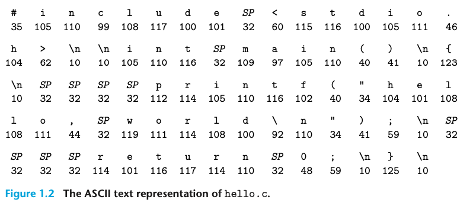
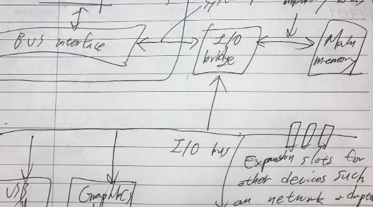
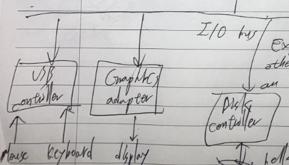
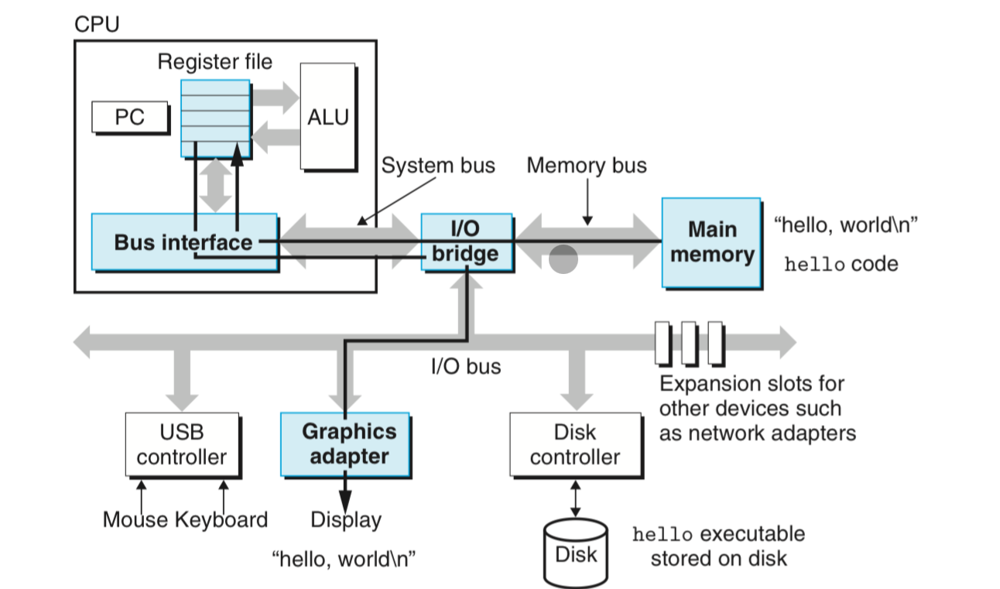
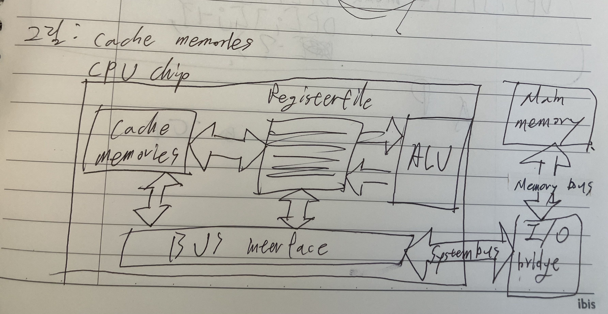
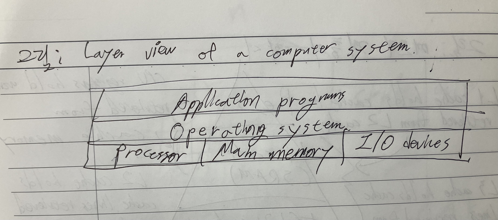
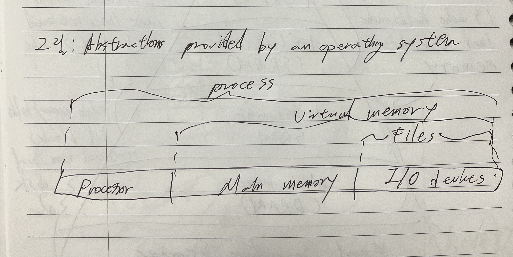

# [CS] Computer Systems A Programmer’s Perspective


> 개념과 이슈 트래킹을 조합해서 “복기 가능한” 자료를 만들도록 합니다.

> 이슈 트래킹 작성 원칙: Phase1(환경, 로그, 최근 변경사항), Phase2(확인, 시도, 결과분석) 형식으로 정리하세요. (Phase2는 최대 3회까지 반복하고 해결 안 되면 아예 처음부터 시작(불가능할 경우 도움 요청))

> 버텀업 스타일 독서 정리. 

> #: 이름, 그림, 표, 명제

> 읽기 과정의 정의. 영어 공부랑 똑같이 해볼까? 
개념, 예시, 코멘트
그러나 여기서는, 예시가 ‘구현’이 되겠지. 
읽는 과정은 그걸 하나씩 체크하는 거고.(모)
체크 카테고리: 모(모르는 것), 그(그림)
정리할 때는 개구코 (개념, 구현, 코멘트)


# A Tour of Computer Systems

## Information is Bits + Context

### code: The hello program

```c
#include <stdio.h>
 
int main()
{
    printf("hello, world\n");
    return 0
}
```

### figure: The ASCII text representation of hello.c 



- Files such as hello.c that consist exclusively of ASCII characters are known as text files.
## Programs Are Translated by Other Programs into Different Forms

> meaning Compilation System.

### 그림: 컴파일 시스템


## 명제들

- On a Unix system, the translation from source file to object file is performed by a compiler driver
- Four phases of the compilation system
  - Preprocessor
  - Compiler
  - Assembler
  - Linker
- Preprocessing: 
### 코드: assembly language of the main method(printing hello)

```c
main:
	subq $8, %rsp
	movl $ .LCO, %edi
	call puts
	movl $0, %eax
	addq %8, %rsp
	ret
```

## It Pays to Understand How Compilation Systems Work

### 명제

- Understanding compilation system pays on…
  - Optimizing program performance.
  - Understanding link-time errors. 
  - Avoiding security holes.
## Processors Read and Interpret Instructions Stored in Memory

### 그림: 일반적인 컴퓨터 시스템의 하드웨어 구성


### 개구코 1

개념: Buses are typically designed to transfer fixed size chunks of bytes known as words

구현

그림에 보이는 모든 화살표들이 버스.



코멘트: 버스가 컴퓨터 시스템의 모듈을 연결하는 선 정도로 알고 있었는데, 정확히 설명하면 words를 전달하는 electrical conduits(유채를 전달하는 통로)라고 한다.

### 개구코2

개념: words are fixed size chunks of bytse. The word size(number of bytes in a word) is a fundamental system parameter that varies across systems.

구현

없음

코멘트: 컴퓨터 아키텍처에서 흔히 거론되는 32bit, 64bit가 이 워드 사이즈를 의미한다. 랜덤 액세스 메모리도 이 워드사이즈에 맞춰서 디자인 돼야 하지 않나?

이와 관련한 GPT의 설명

> 네, 맞습니다! 컴퓨터 아키텍처에서 “word size”는 CPU가 한 번에 처리할 수 있는 데이터의 크기를 의미하며, 일반적으로 32비트(4바이트)나 64비트(8바이트)로 표현됩니다.

그렇다면 워드 사이즈와 메모리 아키텍처의 한 슬롯 사이즈가 반드시 동일하진 않겠군? 그냥 8의 공배수이기만 하면 되는 것 아닌가?

> 맞습니다! 워드 사이즈(Word Size)와 메모리 아키텍처의 슬롯(Slot) 크기가 반드시 동일할 필요는 없습니다.


### 개구코 3

개념

- The distinction between ‘controller’ and ‘adapter’ is mainly one of packaging. 
- Controllers are chip sets in the device itself or on the system’s main printed circuit board(motherboard)
- An adapter is a card that plugs into a slot on the motherboard.
구현



코멘트

둘 다 패키징 상의 차이가 있을 뿐, 개념적으로 역할은 동일하다: to transfer information back and forth between the I/O bus and an I/O devices.

### 개구코 4

개념: The main memory is a temporary storage device that holds both a program and the data it manipulates while the processor is executing the program

- Physically, main memory consists of a collection of dynamic random access memory(DRAM)
- Logically, memory is organized as a linear array of bytes, each with its own unique address (array index) starting at zero.
구현

코멘트

램의 물리적, 개념적 정의 차이를 묻는다면 위의 내용을 참고로 대답해야 한다. 메인 메모리의 물리적 이름은 디램이라고 할 수 있습니다. dynamic random access memory, 즉 말 그대로 동적으로 랜덤한 메모리에 접근할 수 있는 정보 저장장치이기 때문에 컴퓨터 아키텍처에서 로지컬 메모리로 활용될 수 있습니다. 로지컬 메모리는 개념적으로 연속된 배열이지만, 역시 랜덤하게 특정 메모리 포인트에 접근할 수 있습니다.

### 개구코 5

개념: At CPU’s core is a word-size storage device (or register) called the program counter(PC)

구현


코멘트

왜 PC를 word-size storage device라고 하는 거지? PC는 그냥 메모리 주소를 포인팅하는 레지스터 아닌가? word-size가 PC와 무슨 상관이지? 

> 좋은 질문입니다! 왜 프로그램 카운터(PC, Program Counter)를 “word-size storage device”라고 하는지 살펴보겠습니다.

“워드 크기가 곧 메모리 주소 크기다” 이게 말로만 알겠고 잘 이해가 안 된다. 아무튼 이 전제가 맞다고 하면, 워드 사이즈는 ‘컴퓨터 아키텍처의 인스트럭션 하나의 크기’를 의미하기도 하고, ‘표현할 수 있는 메모리 주소 범위’를 의미하기도 하는 건가?

> 네, 핵심을 잘 짚었습니다! **워드 크기(Word Size)**는 단순히 하나의 개념이 아니라, CPU 아키텍처에서 다양한 의미를 가질 수 있는 개념입니다. 이를 명확하게 정리해볼게요.

그래서 워드 사이즈를 fundamental system parameter라고 한 거구나.

### 개구코 6

개념: Instruction set architecture defines very simple instruction executing model. A processor appears to operate according to this model. (In this model, instructions execute in strict sequence, and executing a single instruction involves performing a series of step)

The processor …

1. reads the instruction from memory pointed at by the program counter(PC)
1. interprets the bits in the instruction
1. performs some simple operation dictated by the instruction
1. and then updates the PC to point to the next instruction(which may or may not be contiguous in memory to the instruction that was just executed)
구현: 없음

코멘트

아직 의미를 잘 모르겠다. 

### 개구코 7

개념:  we can distinguish the processor’s …

- instruction set architecture: describes the effect of each machine-code instruction
- microarchitecture: describes how the processor is actually implemented
구현: 없음

코멘트: 이것도 잘 모르겠다.

### 그림: Reading the hello command from the keyboard


### 개구코 8

개념: the processor begins executing the machine-language instructions in the hello program’s main routine. These machine-language instructions copy the bytes in the ‘hello, world\n’ string from memory to the register file, and from there to the display device, where they are displayed on the screen. 

구현

- loading the executable from disk into main memory


- Writing the output string from memory to the display


코멘트

주체를 외우는게 중요하다. ‘프로세서’는 ‘기계 언어 인스트럭션’을 실행한다. ‘기계 언어 인스트럭션’은 우선 디스크에 있는 데이터를 메모리로 복사하고, 메모리에 있는 ‘hello, world\n’ 텍스트를 레지스터 파일로 복사한다. 그리고 다시 기계어 인스트럭션은 이 복사된 파일을 스크린으로 복사한다. 

# 2주차 임시 구분 타이틀

## 개구코1. 프로그램은 복사를 통해 실행된다.

### 개념: From a programmer’s perspective, much of this copying is overhead that slows down the real work of the program.

Copying process: instructions are copied from main memory into the processor. Similarly, the data string originally on disk, is copied to main memory and then copied from main memory to the display device.

### 구현

### 코멘트

hello world 텍스트를 디스플레이에 올리기 위해 많은 복사 작업이 필요하다. 이걸 위해서 등장하는 개념이 바로바로…

## 개구코2. 캐시의 등장 배경

### 개념: 캐시가 등장한 물리적 배경이 있다.

1. register file stores only a few hundred bytes of information opposed to billions of bytes in the main memory.
1. as semiconductor technology progress over the years, this processor-memory gap continues to increase.(it is easier to make processors run faster than it is to make main memory run faster)
### 구현

없음

### 코멘트

없음. 다 아는 내용이긴 한데 그냥 다시 정리함.

### 개념: cache serves as temporary staging areas for information that the processor is likely to need in the near future.

### 구현(그림)



### 코멘트

processor-memory gap이라는 개념을 이해하는 것이 중요할 거 같다. 두 가지 gap이 있다.

1. byte per cost의 차이: 가격적인 이유로 인해 프로세서의 레지스터는 용량이 작고, 디스크와 메인 메모리는 용량이 크다. 
1. 기술 발달 속도의 차이: 반도체 기술 발달에도 불구하고 이 cost 차이가 커지기만 한다.
## 개구코 4.

### 개념: 캐쉬 계층

- L1 cache: holds tens of thousands of bytes and can be accessed nearly as fast as the register file(빠르고 용량도 제법 됨(레지스터 파일 대비))
- L2 cache: hundraeds of thousands to millionsn of bytes is connected to the processor by a special bus. It might take 5 time longer for the processor to access the L2 cache than the L1 cache, but this is still 5 5o 10 times faster than accessing the main memory. 
- Both of above are implemented with a hardware technology known as static random access memory.(SRAM)
### 구현(그림)


### 코멘트

SRAM은 DRAM과 뭐가 다른가? 

> SRAM과 DRAM의 차이점

## 개구코 5. 메모리 계층은 모든 계층을 일종의 ‘캐시’로 만든다.

### 개념: The main idea of a memory hierarchy is that storage at one level serves as a cache for storage at the next lower level.

### 구현: 없음

### 코멘트

이 생각이 맞나? 

> 🔍 메모리 계층이 모든 계층을 ‘캐시’로 만든다는 개념이 맞는가?

## 개구코 6. OS는 응용프로그램과 하드웨어 사이에 놓인 소프트웨어 레이어로 볼 수도 있다.

### 개념

when the hello program printed its message, neither program accessed thekeyboard, display, dis, or main memory directly. Rather, they relied on the services provided by the operating system.

### 구현: 



### 코멘트

이것도 중요한 개념이긴 한데 또 이렇게만 보니 잘 안 와 닿는다.

> 📌 OS를 소프트웨어 레이어로 보는 것이 잘 와닿지 않는다면?

## 개구코 7. OS의 목표

### 개념: 하드웨어 보호 및 응용 프로그램의 로우 레벨 하드웨어 조작 메커니즘 제공

1. to protect the hardware from misuse by runaway application 
1. to provide applications with simple and uniform mechanisms for amnipulating complicated and often wildly different low level hardware devices.
  1. this is done by following abstractions…
  1. process: : abstraction for the processor, main memory, and I/O devices
  1. virtual memory: abstraction for both the main memory and disk I/O devices
  1. files: abstractions for I/O devices
### 구현



### 코멘트

1. 가상 메모리가 디스크까지 포함하는 개념인 줄은 몰랐다. 그렇다면 이론적으로 운영체제는 가상메모리를 메인 메모리와 동일하게 취급할 수 있도록 도와주나?
1. I/O 장치가 파일로 추상화 된다는 건 매번 잘 안 와닿는다. 마우스와 파일이 완전 다르게 느껴진다. 모든 I/O 장치가 메모리에서 자기만의 영역을 차지하는게 이것 때문인가?
> 📌 1. 가상 메모리가 디스크까지 포함하는 개념이라면, 운영체제가 가상 메모리를 메인 메모리와 동일하게 취급할 수 있도록 도와주나?

## 개구코 8. Process의 정의

### 개념: Process = the operating system’s abstraction for a “running program”

### 구현: 없음

### 코멘트 

## 개구코 9. Context Switching

### 개념: context switching = processor switching = interleaving(=삽입, 프로세스를 프로세서에 삽입)

- The operating system performs executing multiple processes concurrently by having the processor switching among them interleaving with a mechanism known as context switching
- To simplify the rest of this discussion, we consider only a uniprocessor system containing as single CPU
### 구현


그림에 대한 설명

1. There are two concurrent processes in our example scenario: the shell process and the hello process.
1. Initially, the shell process is running alone, waiting for input on the command line.
1. When we ask it to run the hello program, the shell carries out our request by invoking a special function known as a system call that passes control to the operating system. 
1. The operating system saves the shell’s context, creates a new hello process and its context, and then passes control to the new hello process. 
1. After terminates, the operating system restores the context of the shell process and passes control back to it, where it waits for the next command-line input
### 코멘트

1. 그림에서 유저 코드와 커널 코드가 의미하는 바를 잘 모르겠음
1. 커널 코드가 실행되면 컨텍스트 스위칭이 일어나는 건가?
### 피드백

아래 내용을 참고해 보시면 좋겠습니다.

1. 그림에서 유저 코드와 커널 코드가 의미하는 바(본질적으로 모두 기계어 코드라고 함! - 작성자)

•	유저 코드(User Code)

•	일반적으로 사용자 프로그램이 수행하는 코드입니다.

•	예를 들어 hello 프로그램이나 shell 프로그램처럼, 운영체제가 아닌 일반 어플리케이션(프로세스)이 수행하는 코드가 모두 여기에 해당합니다.

•	CPU가 *사용자 모드(User Mode)*에서 실행하며, 시스템 콜, 인터럽트 등의 특별한 이벤트가 발생하기 전까지는 운영체제(커널)와 직접 소통하지 않습니다.

•	커널 코드(Kernel Code)

•	운영체제 자체가 수행하는 코드입니다.

•	프로세스 관리를 비롯해 파일 시스템, 메모리 관리, 네트워크 스택, 디바이스 드라이버 등 핵심 기능을 제공합니다.

•	CPU가 *커널 모드(Kernel Mode)*에서 실행하며, 이때는 하드웨어 자원에 대한 완전한 접근 권한을 가집니다.

•	사용자 프로그램이 시스템 콜을 호출하거나, 인터럽트가 발생할 때, CPU는 사용자 모드에서 커널 모드로 전환되어 커널 코드를 실행합니다.

즉, 그림에서 “유저 코드” 부분은 일반 사용자 프로그램이 실행 중인 부분을, “커널 코드” 부분은 운영체제가 개입하여 무언가 처리를 하고 있는 부분을 나타냅니다.

2. “커널 코드가 실행되면 컨텍스트 스위칭이 일어나는가?”에 대한 이해

•	컨텍스트 스위칭(Context Switching)

•	현재 CPU를 사용하던 프로세스(혹은 스레드)의 *실행 상태(레지스터, PC, 스택 포인터 등)*를 저장하고,

•	다른 프로세스(또는 스레드)의 실행 상태를 복원한 뒤, 그 프로세스를 CPU에 할당하는 과정입니다.

•	운영체제는 커널 모드에서(즉 커널 코드 실행 중일 때) 이 작업을 수행합니다.

•	중요한 점

•	커널 코드가 실행되는 모든 순간에 컨텍스트 스위칭이 일어나는 것은 아닙니다.

•	커널이 실행 중이라고 해서 반드시 현재 프로세스를 바꿔야 하는 것은 아니므로, “커널 코드 실행 = 컨텍스트 스위칭”은 성립하지 않습니다.

•	컨텍스트 스위칭은 “운영체제가 어떤 프로세스에서 다른 프로세스로 CPU를 넘겨주기로 결정했을 때” 일어나는 작업입니다.

•	예: 시분할 스케줄링으로 인해 일정 시간이 지났거나(time slice 만료), I/O 요청 후 대기 중이던 프로세스가 준비 완료 상태가 되었거나, 우선순위가 더 높은 프로세스가 깨어났을 때 등.

정리하자면, 컨텍스트 스위칭은 커널 모드에서 진행되는 작업이지만, “커널 코드가 실행되면 무조건 발생한다”는 것은 아니고, “스케줄러가 프로세스 전환을 결정했을 때”에만 이뤄지는 것입니다.

요약

1.	유저 코드(User Code): 사용자 프로그램(프로세스)의 코드, 사용자 모드에서 실행.

2.	커널 코드(Kernel Code): 운영체제(OS)의 코드, 커널 모드에서 실행.

3.	컨텍스트 스위칭: 커널 코드가 스케줄링에 의해 현재 실행 중인 프로세스를 다른 프로세스로 바꿔야 한다고 결정했을 때 이루어짐.

•	커널 모드에 진입하는 모든 경우가 곧바로 컨텍스트 스위칭으로 이어지는 것은 아님.

추가 Tip

•	실제로는 시스템 콜, 인터럽트, 예외(Exception) 등이 발생하면 사용자 모드에서 커널 모드로 진입하여 커널 코드를 잠깐 수행한 뒤, 다시 해당 프로세스의 사용자 모드 코드로 돌아가는 경우가 많습니다(즉, 컨텍스트 스위칭 없이 원래 프로세스가 계속 CPU를 점유).

•	컨텍스트 스위칭은 보통 스케줄러가 “지금 실행 중인 프로세스를 바꿀 것”이라고 결정해야만 발생합니다. 예를 들어 시분할(time-sharing) 환경에서 타이머 인터럽트가 발생하여 커널에 들어왔다면, 스케줄러는 “시간이 다 되었다”고 판단하고 프로세스 전환을 수행할 수도 있습니다.

•	반대로 단순한 read, write 같은 시스템 콜을 처리만 하고 다시 원래 프로세스로 돌아가는 경우엔, 컨텍스트 스위칭 없이 같은 프로세스가 계속 실행됩니다.

## 개구코 10. 커널

### 개념: The kernel is the portion of the operating system code that is “always resident in memory”

kernel manages the transition from one processor to another.

### 구현: 커널 동작 묘사

- When an application program requires some action by the operating system, such as to read or write a file, it executes a special system call instruction, transferring control to the kernel.
- The kernel then performs the requested operation and returns back to the application program
- Note that the kernel is not a separate process
- Instead, it is a collection of code and data structures that the system uses to manage all the processes.
### 코멘트

- 커널이 분리된 프로세스가 아니라, 코드와 데이터의 집합이라고 한다. 운영체제 코드와 데이터의 집합 중 메모리에 상주하는 것, 정도로 이해하고 넘어가면 될까?
### 피드백

네, 그렇게 이해하시면 됩니다.

커널은 “프로세스 형태의 독립된 실행 체(Entity)”가 아니라, 운영체제의 핵심 기능을 수행하기 위한 “코드와 데이터 구조의 집합”입니다. 그리고 이 커널이 항상 메모리에 상주(resident) 하고 있어서, 사용자 모드에서 커널 모드로 진입할 때(예: 시스템 콜, 인터럽트, 예외) 필요할 때마다 즉시 접근할 수 있습니다.

핵심 포인트 정리

1.	커널 = 코드와 데이터 구조의 집합

•	운영체제가 프로세스를 관리하기 위한 가장 핵심적인 기능들이 구현되어 있는 곳

•	CPU가 커널 모드(Kernel Mode)에서 실행할 수 있는 기계어 코드 + 이 코드가 참조하는 각종 자료구조

•	예) 스케줄러, 메모리 관리, 디바이스 드라이버, 파일시스템, 네트워크 스택, 각종 테이블 등

2.	항상 메모리에 상주하는 영역

•	커널 영역은 CPU가 사용자 모드에서 커널 모드로 전환되면 바로 접근하여 실행해야 하므로, 디스크에서 다시 불러오는 과정 없이 항상 RAM 상주

•	따라서 용량이 매우 중요하게 다뤄집니다(그래서 커널 최적화가 필요).

3.	“커널은 별도 프로세스가 아니다”

•	사용자 프로세스처럼 커널이 “PID 하나를 가지는 독립 실행 중인 프로세스”가 아님

•	대신, 어떤 프로세스가 시스템 콜이나 인터럽트 등을 통해 커널 모드로 전환되면, 그 프로세스의 실행 흐름이 곧바로 커널의 코드(함수)로 옮겨간 뒤 해당 작업을 처리하고, 다시 사용자 모드로 돌아옴

•	즉, 커널은 사용자 프로그램과 주소 공간이 다른 ‘분리된’ 영역을 갖고는 있지만, 프로세스 형태는 아니다.

4.	운영체제의 나머지 부분과 커널

•	일반적으로 “운영체제 = 커널 + (기타 유틸, 서비스 등)” 으로 분리해 생각할 수 있음

•	OS의 일부 프로그램은 유저 모드에서 동작하는 형태로 제공될 수도 있는데, 이들은 실제 커널 바깥에서 “시스템 관리, 서비스 데몬” 등의 형태로 실행되는 일종의 배경 프로세스(데몬)입니다.

예시로 살펴보기 (리눅스 기준)

•	커널: /boot/vmlinuz-... 형태의 컴파일된 이미지(기계어 코드)와 이 코드가 다룰 데이터 구조들

•	시스템 콜: 예) read(), write(), fork(), exec() …

•	사용자 프로세스가 이 함수를 호출하면, CPU가 커널 모드로 진입해 커널 내부의 해당 함수 구현부를 실행한 뒤 완료 시점에 돌아옴.

•	데몬(기타 유틸): 예) sshd, cron, systemd, udevd 등

•	유저 모드에서 돌고 있으나, OS 기능과 긴밀하게 연동됨.

“운영체제 코드와 데이터의 핵심 집합 중, 항상 메모리에 상주하며, 사용자 모드 프로그램들이 시스템 콜 등을 통해 필요 시 제어권을 넘기면 해당 요청을 처리하고 다시 돌아오는 구조.”

“분리된 프로세스”가 아니라, CPU가 커널 모드로 전환되었을 때 실행할 일련의 코드와 자료구조라는 점을 기억하시면 됩니다.

## 개구코 11. 쓰레드

### 개념: thread(the multiple execution units) consists a process.

- Although we normally think of a process as having a single control flow, in modern systems a process can actually consist of multiple execution units, called thread, each running in the context of the process and sharing the same code and global data.
- Threads are an increasingly important programming model because of the requirement for concurrency in network servers, because it is easier to share data between multiple threads than between multiple processes, 
- and beccause threads are typically more efficient than processes.
- Multi-threading is “also” one way to make programs run faster when multiple processors are available
### 구현: 없음

### 코멘트: 없음

## 개구코 12. 가상 메모리

### 개념: 가상 메모리는 각 프로세스가 자기만의 메모리 공간을 가지고 있다고 착각하게 한다.

- Virtual memory is an abstraction that provides each process with the illusion that it has exclusive use of the main memory.
- Each process has the same uniform view of memory, which is known as its virtual address space
- The lower region of the address space holds the code and data defined by the user’s process.
- Note that addresses in the figure increase from the bottom to the top.
### 구현: 


### 코멘트: 없음

## 개구코 13. Brief introduction of virtual address space of virtual memory

### 개념

The virtual address space seen by each process consists of a number of well defined areas, each with a specific purpose. 

### 구현

- Program code and data: code begins at the same fixed address for all processes, followed by data locations that correspond to global C variables. The code and data areas are initialized directly from the content of an executable object file-in our case, the hello executable.
- Heap: The code and data areas are followed immediately by the run-time heap. Unlike the code and data areas, which are fixed in size once the process begins running, the heap expands and contracts dynamically at run time as a result of calls to C standard library routines such as malloc and free. 
- Shared libraries: Near the middle of the address space is an area that holds the code and data for shared libraries such as the C standard library and the math library. The notion of a shared library is a powerful but somewhat difficult concept
- Stack: At the top of the user’s virtual address space is the user stack that the compiler uses to implement function calls. Like the heap, the user stack expands and contracts dynamically during the execution of th eprogram. In particular, each time we call a function., the stack grows. `
### 코멘트

- 코드가 모두 고정된 주소, 전역 C 변수를 사용한다면, 어떤 응용 프로그램의 소스 코드든 다 같은 주소 공간에 존재한다는 말인가?
# 이슈: 실습을 위한 도커 우분투 실행 중, 컨테이너를 실행하면 바로 중지되는 현상

## Phase1.

### 환경: macOS, ARM, docker, container image: ubuntu:latest

### 로그: 따로 없음. 컨테이너가 바로 중지됨

### 최근 변경 사항: ubuntu 이미지로 컨테이너 생성

## Phase2-1

### 확인: 컨테이너가 계속 유지되도록 하려면, 아래와 같이 bash를 유지해줍니다.

```c
docker run -dit --name myubuntu ubuntu bash
```

-d: 백그라운드 실행 옵션

bash: 이 명령어를 통해 쉘로 접속해야 프로세스가 유지되면서 컨테이너가 살아 있음

위 두 조합을 쓰면 백그라운드에서 배쉬 실행중인 도커 컨테이너가 만들어짐. 일단 이렇게 해결할 수 있을것.

그렇다면 궁금증: 이미 종료된 우분투 컨테이너는 어떻게 다시 접속할 수 있어?

> 컨테이너의 기본 프로세스가 bash가 아니라면 접속 즉시 종료될 수 있습니다.
이럴 땐 컨테이너를 새로 만들어 bash를 유지하도록 해야 합니다.

그냥 버려야 한다. 

### 시도: 

```c
$ docker run -dit --name myubuntu ubuntu bash
$ docker exec -it myubuntu bash
```

### 결과분석: 

잘 됨.

주의사항! bash 가 메인 프로세스로 실행 될 때 exit으로 종료하면 다시 접속할 방법이 없다. 그냥 실습할 때마다 새로 만드는게 낫다.


