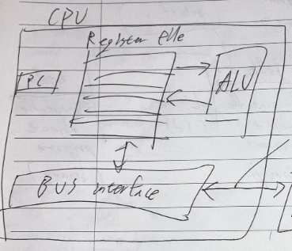

# [CS] Computer Systems A Programmer’s Perspective


> 개념과 이슈 트래킹을 조합해서 “복기 가능한” 자료를 만들도록 합니다.

> 이슈 트래킹 작성 원칙: Phase1(환경, 로그, 최근 변경사항), Phase2(확인, 시도, 결과분석) 형식으로 정리하세요. (Phase2는 최대 3회까지 반복하고 해결 안 되면 아예 처음부터 시작(불가능할 경우 도움 요청))

> 버텀업 스타일 독서 정리. 

> #: 이름, 그림, 표, 명제

> 읽기 과정의 정의. 영어 공부랑 똑같이 해볼까? 
개념, 예시, 코멘트
그러나 여기서는, 예시가 ‘구현’이 되겠지. 
읽는 과정은 그걸 하나씩 체크하는 거고.(모)
체크 카테고리: 모(모르는 것), 그(그림)
정리할 때는 개구코 (개념, 구현, 코멘트)


# A Tour of Computer Systems

## Information is Bits + Context

### code: The hello program

```c
#include <stdio.h>
 
int main()
{
    printf("hello, world\n");
    return 0
}
```

### figure: The ASCII text representation of hello.c 


- Files such as hello.c that consist exclusively of ASCII characters are known as text files.
## Programs Are Translated by Other Programs into Different Forms

> meaning Compilation System.

### 그림: 컴파일 시스템


## 명제들

- On a Unix system, the translation from source file to object file is performed by a compiler driver
- Four phases of the compilation system
  - Preprocessor
  - Compiler
  - Assembler
  - Linker
- Preprocessing: 
### 코드: assembly language of the main method(printing hello)

```c
main:
	subq $8, %rsp
	movl $ .LCO, %edi
	call puts
	movl $0, %eax
	addq %8, %rsp
	ret
```

## It Pays to Understand How Compilation Systems Work

### 명제

- Understanding compilation system pays on…
  - Optimizing program performance.
  - Understanding link-time errors. 
  - Avoiding security holes.
## Processors Read and Interpret Instructions Stored in Memory

### 그림: 일반적인 컴퓨터 시스템의 하드웨어 구성


### 개구코 1

개념: Buses are typically designed to transfer fixed size chunks of bytes known as words

구현

그림에 보이는 모든 화살표들이 버스.


코멘트: 버스가 컴퓨터 시스템의 모듈을 연결하는 선 정도로 알고 있었는데, 정확히 설명하면 words를 전달하는 electrical conduits(유채를 전달하는 통로)라고 한다.

### 개구코2

개념: words are fixed size chunks of bytse. The word size(number of bytes in a word) is a fundamental system parameter that varies across systems.

구현

없음

코멘트: 컴퓨터 아키텍처에서 흔히 거론되는 32bit, 64bit가 이 워드 사이즈를 의미한다. 랜덤 액세스 메모리도 이 워드사이즈에 맞춰서 디자인 돼야 하지 않나?

이와 관련한 GPT의 설명

> 네, 맞습니다! 컴퓨터 아키텍처에서 “word size”는 CPU가 한 번에 처리할 수 있는 데이터의 크기를 의미하며, 일반적으로 32비트(4바이트)나 64비트(8바이트)로 표현됩니다.

그렇다면 워드 사이즈와 메모리 아키텍처의 한 슬롯 사이즈가 반드시 동일하진 않겠군? 그냥 8의 공배수이기만 하면 되는 것 아닌가?

> 맞습니다! 워드 사이즈(Word Size)와 메모리 아키텍처의 슬롯(Slot) 크기가 반드시 동일할 필요는 없습니다.


### 개구코 3

개념

- The distinction between ‘controller’ and ‘adapter’ is mainly one of packaging. 
- Controllers are chip sets in the device itself or on the system’s main printed circuit board(motherboard)
- An adapter is a card that plugs into a slot on the motherboard.
구현


코멘트

둘 다 패키징 상의 차이가 있을 뿐, 개념적으로 역할은 동일하다: to transfer information back and forth between the I/O bus and an I/O devices.

### 개구코 4

개념: The main memory is a temporary storage device that holds both a program and the data it manipulates while the processor is executing the program

- Physically, main memory consists of a collection of dynamic random access memory(DRAM)
- Logically, memory is organized as a linear array of bytes, each with its own unique address (array index) starting at zero.
구현

코멘트

램의 물리적, 개념적 정의 차이를 묻는다면 위의 내용을 참고로 대답해야 한다. 메인 메모리의 물리적 이름은 디램이라고 할 수 있습니다. dynamic random access memory, 즉 말 그대로 동적으로 랜덤한 메모리에 접근할 수 있는 정보 저장장치이기 때문에 컴퓨터 아키텍처에서 로지컬 메모리로 활용될 수 있습니다. 로지컬 메모리는 개념적으로 연속된 배열이지만, 역시 랜덤하게 특정 메모리 포인트에 접근할 수 있습니다.

### 개구코 5

개념: At CPU’s core is a word-size storage device (or register) called the program counter(PC)

구현



코멘트

왜 PC를 word-size storage device라고 하는 거지? PC는 그냥 메모리 주소를 포인팅하는 레지스터 아닌가? word-size가 PC와 무슨 상관이지? 

> 좋은 질문입니다! 왜 프로그램 카운터(PC, Program Counter)를 “word-size storage device”라고 하는지 살펴보겠습니다.

“워드 크기가 곧 메모리 주소 크기다” 이게 말로만 알겠고 잘 이해가 안 된다. 아무튼 이 전제가 맞다고 하면, 워드 사이즈는 ‘컴퓨터 아키텍처의 인스트럭션 하나의 크기’를 의미하기도 하고, ‘표현할 수 있는 메모리 주소 범위’를 의미하기도 하는 건가?

> 네, 핵심을 잘 짚었습니다! **워드 크기(Word Size)**는 단순히 하나의 개념이 아니라, CPU 아키텍처에서 다양한 의미를 가질 수 있는 개념입니다. 이를 명확하게 정리해볼게요.

그래서 워드 사이즈를 fundamental system parameter라고 한 거구나.

### 개구코 6

개념: Instruction set architecture defines very simple instruction executing model. A processor appears to operate according to this model. (In this model, instructions execute in strict sequence, and executing a single instruction involves performing a series of step)

The processor …

1. reads the instruction from memory pointed at by the program counter(PC)
1. interprets the bits in the instruction
1. performs some simple operation dictated by the instruction
1. and then updates the PC to point to the next instruction(which may or may not be contiguous in memory to the instruction that was just executed)
구현: 없음

코멘트

아직 의미를 잘 모르겠다. 

### 개구코 7

개념:  we can distinguish the processor’s …

- instruction set architecture: describes the effect of each machine-code instruction
- microarchitecture: describes how the processor is actually implemented
구현: 없음

코멘트: 이것도 잘 모르겠다.

### 그림: Reading the hello command from the keyboard


### 개구코 8

개념: the processor begins executing the machine-language instructions in the hello program’s main routine. These machine-language instructions copy the bytes in the ‘hello, world\n’ string from memory to the register file, and from there to the display device, where they are displayed on the screen. 

구현

- loading the executable from disk into main memory


- Writing the output string from memory to the display


코멘트

주체를 외우는게 중요하다. ‘프로세서’는 ‘기계 언어 인스트럭션’을 실행한다. ‘기계 언어 인스트럭션’은 우선 디스크에 있는 데이터를 메모리로 복사하고, 메모리에 있는 ‘hello, world\n’ 텍스트를 레지스터 파일로 복사한다. 그리고 다시 기계어 인스트럭션은 이 복사된 파일을 스크린으로 복사한다. 


# 이슈: 실습을 위한 도커 우분투 실행 중, 컨테이너를 실행하면 바로 중지되는 현상

## Phase1.

### 환경: macOS, ARM, docker, container image: ubuntu:latest

### 로그: 따로 없음. 컨테이너가 바로 중지됨

### 최근 변경 사항: ubuntu 이미지로 컨테이너 생성

## Phase2-1

### 확인: 컨테이너가 계속 유지되도록 하려면, 아래와 같이 bash를 유지해줍니다.

```c
docker run -dit --name myubuntu ubuntu bash
```

-d: 백그라운드 실행 옵션

bash: 이 명령어를 통해 쉘로 접속해야 프로세스가 유지되면서 컨테이너가 살아 있음

위 두 조합을 쓰면 백그라운드에서 배쉬 실행중인 도커 컨테이너가 만들어짐. 일단 이렇게 해결할 수 있을것.

그렇다면 궁금증: 이미 종료된 우분투 컨테이너는 어떻게 다시 접속할 수 있어?

> 컨테이너의 기본 프로세스가 bash가 아니라면 접속 즉시 종료될 수 있습니다.
이럴 땐 컨테이너를 새로 만들어 bash를 유지하도록 해야 합니다.

그냥 버려야 한다. 

### 시도: 

```c
$ docker run -dit --name myubuntu ubuntu bash
$ docker exec -it myubuntu bash
```

### 결과분석: 

잘 됨.

주의사항! bash 가 메인 프로세스로 실행 될 때 exit으로 종료하면 다시 접속할 방법이 없다. 그냥 실습할 때마다 새로 만드는게 낫다.


