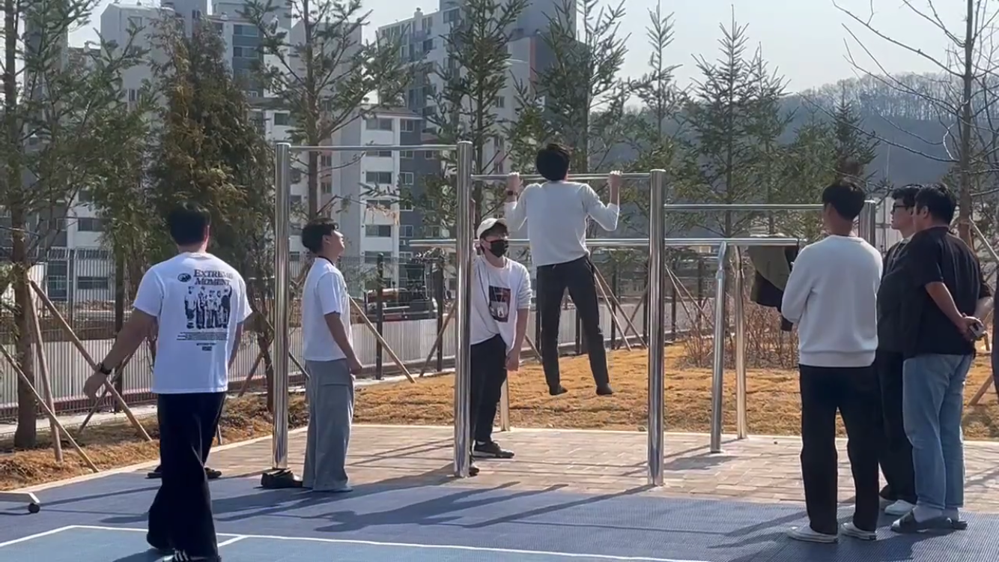
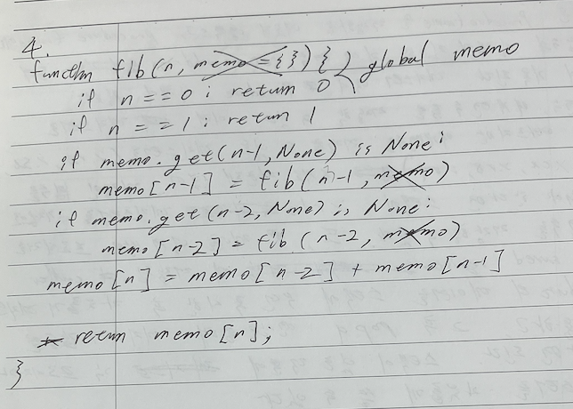

# [Essay] 정글 일지 4월


> 개념과 이슈 트래킹을 조합해서 “복기 가능한” 자료를 만들도록 합니다.

> 이슈 트래킹 작성 원칙: Phase1(환경, 로그, 최근 변경사항), Phase2(확인, 시도, 결과분석) 형식으로 정리하세요. (Phase2는 최대 3회까지 반복하고 해결 안 되면 아예 처음부터 시작(불가능할 경우 도움 요청))

> 실습은 천천히, 하지만 robust하게 하세요. 

# 일지: 2025.04.01. 화

## 오늘 한 일

1. GPT와 다익스트라 증명에 대한 대담 - Introduction to Algorithm에 정리
## 알고리즘 풀이 커리큘럼 업데이트

일단 푼다. 30분. 실패하면 피드백을 받는다. 재도전한다. 이걸 무한 반복으로 바꾸도록 한다. 알고리즘 시험 전날에는 그냥 답을 보도록 한다. ㅇㅋ? ㅇㅋ.

이 방법 별로인 거 같다. 그냥 스트레스만 많이 받고

## 현재 진행 상황

### 남은 문제

5639 이진 트리 검색: 2회 시도했는데 실패. 동료의 아이디어를 받음

2655 미로 만들기: 1회 시도 후 실패

7569 토마토: 1회 시도 후 실패

3055 탈출: 여러번 시도했는데 디버깅 실패

2637 장난감 조립: 2회 시도 후 실패

1432 그래프 수정: 아직 시도 안 함

1948 임계경로: 아직 시도 안 함

### 개념 공부

- 위상정렬
- 최단거리 경로 계산
## 깨달음

코드를 디버깅할 때, 주석에 예상 값을 인덱스로 적고, 내가 완벽히 이해하며 중단점을 따라가야 의미있는 디버깅을 할 수 있다. 아래는 예시.

```python
#  **************************************************************************  #
#                                                                              #
#                                                       :::    :::    :::      #
#    Problem Number: 2637                              :+:    :+:      :+:     #
#                                                     +:+    +:+        +:+    #
#    By: joho54 <boj.kr/u/joho54>                    +#+    +#+          +#+   #
#                                                   +#+      +#+        +#+    #
#    https://boj.kr/2637                           #+#        #+#      #+#     #
#    Solved: 2025/03/30 22:45:21 by joho54        ###          ###   ##.kr     #
#                                                                              #
#  **************************************************************************  #
# 아니 이거는 그거잖아. 
#  위상정렬을 하고, shortest path estimate 대신 all paths estimate로 노드를 업데이트하면
# 되지 않겠나?

import sys
from collections import deque, defaultdict
# 그래프 표현 컨벤션을 너무 섞어 쓰는 거 같다.
def topological_sort(V: int, E):
    # 내적 초기화
    # e. in_degree = [0, 0, 0, 0, 0, ]
    in_degree = [0]*(V+1)
    # 인접 리스트 초기화
    adj = defaultdict(list)
    # v 초기화
    V_ = [i for i in range(V+1)]
    # 가중치
    weights = defaultdict(int)
    
    # p1. 5, 1, 2
    # p2. 5, 2, 2
    # p3. ...
    for v, u, w in E:
        adj[u].append(v)
        in_degree[v] += 1
        weights[(u,v)] = w
    result = []
    # 내적이 0인 버텍스 초기화
    
    initials = [v for v in V_ if in_degree[v] == 0]
    # initials = [1, 2, 3, 4]
    for i in initials:
        p[i-1][i-1] = 1 # 자기자신을 만들 때 하나씩 필요

    que = deque(initials)
    que.popleft() # 0 제거
    # que = deque([1, 2, 3, 4])
    while que:
        # p1. u = 1
        u = que.popleft()
        # p1. result = [1]
        result.append(u)
        # 내적을 제거하고 위상정렬. v를 만드는데 u가 가중치만큼 필요할 것.
        # pick: u = 6
        for v in adj[u]:
            # v 내적 제거
            # v 부품 만들때 필요한 정보 업데이트. u번째 부품이 몇 개 필요한가?
            # 기존 u의 내적값...아 여기서 모든 부품에 대한 이터레이션 필요
            # p1. i = 0 
            # p2. i = 1
            # n = 7
            # 6번 부품이 7번부품 만들 때 몇개 필요한지 반영이 안 됨
            # pick: 
            for i in range(n):
                # i = 0
                # p[v-1=6][0~6] += p[5][0~6]*weight
                p[v-1][i] += p[u-1][i]*weights[(u,v)]
            
            in_degree[v] -= 1
            if in_degree[v] == 0:
                que.append(v)

    for i in initials:
        if i != 0:
            print(i, p[n-1][i-1] )

def dag_shortest_path(s:int, adj: list, weights: list):
    """뭐 어떻게 하면 되지? 일단 하나의 버텍스를 기준으로? 그냥 모든 간선을 돌면서?"""
    p[s] = 1
    que = deque([s])
    while que:
        u = que.popleft()
        for v in adj[u]:
            
            que.append(v)


if __name__ == '__main__':	
    input = sys.stdin.readline
    # n = 7
    n = int(input().strip()) 
    # m = 8
    m = int(input().strip())
    # E = [(5, 1, 2), ...]
    # 
    E = [ 
        tuple(map(int, input().split()))
        for _ in range(m)
    ]
    # p는? i번째 부품을 만드는데 m번째 부품이 몇 개 필요한지 계산.
    """
    p = [ 
        [0, 0, 0, 0, 0, 0, 0],
        [0, 0, 0, 0, 0, 0, 0],
        [0, 0, 0, 0, 0, 0, 0],
        [0, 0, 0, 0, 0, 0, 0],
        [0, 0, 0, 0, 0, 0, 0],
        [0, 0, 0, 0, 0, 0, 0],
        [0, 0, 0, 0, 0, 0, 0],
    ]
    """
    p = [[0 for j in range(n)] for _ in range(n)]
    topological_sort(n, E)
    # for s in p:
    #     print(s)
    # for s in initials:
    #     p = [0 for _ in range(n+1)]
    #     dag_shortest_path(s, adj, weights)
    #     print(f'{s} {p[n]}')

"""
이슈: 시간초과

Phase1.
환경: 파이썬
로그: 
최근 변경 사항: 

Phase2.
확인: 
시도: 
p 초기화 함수 삭제,
relax 함수 삭제

분석: 의미 없음
"""
```

# 일지: 2025.04.03. 

## 4주차에 접어들며




디버깅이라는 수확을 얻고, 마지막 알고리즘 주차로 넘어간다. 이번 주차는 CSAPP 공부 비중도 늘려야 한다. 일단 개선할 점 몇 가지를 정리해보려고 한다.

### TIL에 대해

나는 공부 내용을 바로바로 TIL에 정리하려고 하는 편이다. 단, 최근 TIL이랍시고 작성한 문서들은 너무 무성의하게 작성된 감이 있다. 나중에 다시 봤을 때 무슨 말인지 모르겠고, 쓸데 없이 내용만 길다면 기록으로써의 가치가 떨어질 수밖에 없다.

일단 TIL의 퀄리티 향상을 위한 몇 가지 개선 방안을 생각해봤다. 

1. GPT 답변을 첨부할 때는 추론모델을 사용: 4o 모델은 추론 모델에 비해 일반적인 정보 검색 기능으로서 뛰어나다. 하지만 상황 맞춤형으로 답을 주지 못하고, 아무리 봐도 디자인 자체가 주접을 떨어서 사용자를 만족시키는데 집중하는 것 같다. 퀄리티 향상을 위해서는 ai 답변 비중을 추론 모델 중심으로 줄일 필요가 있다.
# 일지: 2025.04.05. 토

## 자 이제 어떻게 할까

동적 계획법 문제가 10개 남았다. 이번 주차 종료까지는 5일이 남았고.

문제: 하루에 2개씩. 단, 오늘은 개수를 맞춰놓기 위해 최대한 1개 더 풀고 퇴근

CLRS: 동적 계획 파트 매우 중요할 듯 하다. 지금 아니면 읽을 시간 잘 없을테니 2시간씩은 읽을 것

CSAPP: 이것도 매우 중요한 상황이므로 하루 2챕터 기준으로 읽을 것. CLRS보다 진도를 맞추는게 중요

연결 리스트도 봐주면 좋은데, 이건 내 생각엔 좀 미뤄 놓는게 나을 거 같다.


# 일지: 2025.04.08. 화

## 4주차 퀴즈

다른 건 크게 중요하지 않았고, python의 mutable 자료형 속성을 헷갈려서 쪽팔리는 오답을 냈다. 피보나치 수열을 탑다운 방식의 동적 프로그래밍으로 연산하는 문제였는데, 매개변수로 들어간 메모가 다른 콜스택에서도 함께 갱신되는지 헷갈려서 문제의 조건을 막 수정하고 난리도 아니었다(메모가 원래 인수로 들어가 있는데 탑다운에서는 전역으로 가야 하는 줄 알고 헤맸다.)



그런데 저것만 그대로 뒀으면, 좀 아쉽긴 해도 그럭저럭 작동하는 코드였다.

```python
def fib(n, memo={}) 
	if n == 0 : return 0
	if n == 1: return 1
	if memo.get(n-1, None) is None:
		memo[n-1] = fib(n-1, memo)
	if memo.get(n-2, None) is None:
		memo[n-2] = fib(n-2, memo)
	memo[n] = memo[n-2] + memo[n-1]
	return memo[n]
```

여기서 n이 메모에 있는지만 체크해주면 완벽했음. 

```python
def fib(n, memo={}) 
	if n in memo: return memo[n]
	if n == 0 : return 0
	if n == 1: return 1
	if memo.get(n-1, None) is None:
		memo[n-1] = fib(n-1, memo)
	if memo.get(n-2, None) is None:
		memo[n-2] = fib(n-2, memo)
	memo[n] = memo[n-2] + memo[n-1]
	return memo[n]
```

참고로 제시된 정답은 다음과 같다

```javascript
function fib(n, memo = {}) { 
    if (n <= 1) return n; 
    if (memo[n]) return memo[n]; 
    memo[n] = fib(n - 1, memo) + fib(n - 2, memo); 
    return memo[n]; 
}
```

## 남은 4주차 공부에 대해

일단 지금까지 CSAPP을 열심히 읽었는데, 그 때문에 동적 계획법과 그리디 알고리즘을 완전히 미루고 있었다. 플로이드 워셜도 그래프 알고리즘이긴 하지만, 이번 퀴즈에 포함되어 조금 공부하다 말았는데 증명을 더 따라가지 못해 아쉽다. 

독서의 경우 알고리즘 문제 풀이처럼 고도의 집중력이 필요한 건 아니라고 생각해서 그냥 루틴 신경 안 쓰고 쭉 읽었는데, 사실, 이것도 그다지 좋은 생각은 아니었던 거 같다. 온 몸으로 집중하면서 내용을 정리하고, 문제를 풀고 넘어가는게 오히려 빠르지, 쭉 읽고 이해 못해서 다시 보면 시간이 더 걸린다. ‘전공서 독서’라는 새로운 문제에 있어 시행착오를 한 것으로 생각하자. 

남은 시간은 어떻게 해야 할까? 일단 책은 좀 미루도록 한다. 다음 주에 다시 읽게 된다면, 그때는 독서를 노션 개구코 정리 및 고도의 집중 및 문제 풀이와 동일시 여겨야 한다. 이제 알고리즘 문제는, 지난주에 했던 것처럼 하자. 고도의 집중력 유지를 위한 루틴을 수행하고(30분 집중, 5분 휴식), 또 너무 막힐 경우 다른 문제로 넘어가는 식으로 진행한다. 오케이. 바로 시작.

# 일지: 2025.04.09. 수


## 새로운 루틴의 필요성

집에 들어가서 운동하고 개인 시간을 보내고 나면 자정이 좀 넘는다. 그리고 잠이 바로 안 온다. 보통은. 다른 말로, 다른 무언가를 하고 싶어서 서성이는 시간이 생긴다는 말이다. 이때 다시 교육장으로 와서 CLRS나 CSAPP을 30분만 읽어도 꽤 도움이 될 거다. 아니면 차라리 산책을 할까? 좀 고민이다. 일단 오늘은 한번 다시 나와서 CSAPP을 읽어보자. 시도해보고, 일상의 집중력에 영향을 주면 그만둬도 괜찮다.


