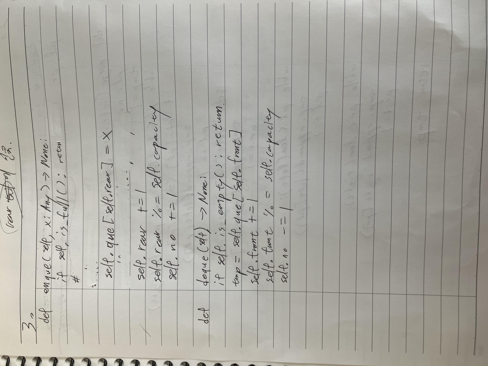

# [Essey] 정글 일지


> 개념과 이슈 트래킹을 조합해서 “복기 가능한” 자료를 만들도록 합니다.

> 이슈 트래킹 작성 원칙: Phase1(환경, 로그, 최근 변경사항), Phase2(확인, 시도, 결과분석) 형식으로 정리하세요. (Phase2는 최대 3회까지 반복하고 해결 안 되면 아예 처음부터 시작(불가능할 경우 도움 요청))

> #: 질문, 일기, 목표


# 일기: 1주차 프로젝트를 마친 소회 2025.03.13.

## 개발자라는 직무의 복잡성에 대해

개발자는 극도로 복잡한 소프트웨어를 생산 관리하는 직업이다. 인문학적인 용어로 치환하면, 혼돈 속에서 질서를 건져내야 하는 사람들이다. 결국에는 이 질서 유지 능력이 있는 사람과 없는 사람으로 나뉠거다. 그 능력이 있다면, 개발자는 경영인이 되려 할 거다. 크래프톤 정글의 OT에서 크래프톤 의장님의 이야기를 들으면서 든 생각이기도 하다. 본인의 성장 과정은 어떤 면에서 혼돈의 기억으로 남을 수도 있었다. 하지만 그렇게 놔두는 대신 분석하고 통찰해서 정글의 5개월 과정에 그 혼돈을 ‘커리큘럼’이라는 이름으로 정리했다. 

‘커리큘럼’이란 뭔가. 누군가 먼저 걸은 길을 재구성한 거다. 지식의 대물림을 위한 체계화다. 크래프톤 정글은 그 체계화를 내가 봤을 땐 아주 잘 한 편이다. 

크래프톤 정글의 방식에서는 넛지도 빼놓을 수 없다.

기숙사에는 의자가 없다. 침대와 화장대만 있다. 이건 더 말해봤자 입만 아픈 훌륭한 넛지다. 사람들은 깨어 있는 동안에는 교육장에 오도록 아주 강한 넛지를 받는다. 

# 질문: 취업 산업 도메인을 콘텐츠 말고 물류 같은 분야로 가고 싶은데 진로 설정을 어떻게 해야할지 잘 모르겠어요

## Phase1. 답

# 일지: 2025.03.14. 

## 알고리즘

백준 풀고 리뷰하기

## CSAPP 읽기

책 읽어야 할 곳: WEEK01 ~1.4 프로세서는 메모리에 저장된 인스트럭션을 읽고 해석한다. 이까지 읽고 정리하면 된다 이거지? 오케이.

## JWT 복습

## 목표: 일단 쉬운 백준 문제는 다 풀었다. 이제 할 일 정리

사실, 쉬운 문제가 아니라 생각하지 않고 풀어도 되는 문제들이었다. 그러니까, 이제 머리를 쓰기 시작해야 한다. 30분 동안 머리를 쓰고 문제를 풀어본다. 30분 후에 가닥이 안 잡히면 책을 본다. 책이 없을 경우는 일단 보류. 이것도 시간이 많이 걸릴 거 같으니까. 

## 아포리즘

- 앉아 있을 때 허리 쪽을 손으로 짚으면 허리 근육에 힘을 줄 수 있어서 허리가 덜 아프고 자세가 유지된다.
- 절박함을 모방할 수는 없지만, 조장할 수는 있을 거 같다. ‘전쟁’을 머릿속으로 되뇌이면 된다. 전쟁 전쟁 전쟁.
# 일지: 2025.03.15. 

## 목표 환기

> 첫 4주에 여러분들이 익혀 주셔야 하는 것은 현실의 문제를 컴퓨터에게 효율적으로 빠르게 떠넘기는 능력입니다. 컴퓨터에게 일을 시키기 위해서 자료구조와 알고리즘의 공부는 필수입니다.

일단 큰 갈래 세 개가 남았다. 문제 부분에서는: 재귀, 정렬, 완전탐색. 

정렬은 일단 문제를 탑다운으로 더 풀어보고, 해결 안 되면 공부를 좀 하자. 재귀는 공부 할 만큼 했는데, 문제를 혼자 풀 수 있기 전까지는 끝낼 수 없다. 완전탐색은 그냥 문제가 어려운게 둘 있어서 고민. 일단 정렬 하고 나서 생각하기.

오후 5시, 일단 내 지식으로 주어진 문제는 리미트까지 푼 거 같다. 이제 공부하자.

으아 지루해. 문제풀고 싶다. 재귀 문제 다시 구현해보자. 

# 일지: 2025.03.15. 일

## 공부 계획

1. 키워드들
  1. 배열, 문자열
  1. 반복문과 재귀함수
  1. 복잡도(BigO, 시간, 공간)
  1. 정렬
  1. 완전탐색
1. 알고리즘 책
  1. 키워드 중심으로 볼 필요가 있습니다.
  1. 그냥 든 아이디어인데, 어려운 문제들을 놓고 수도코드 → 구현 연습을 반복하는 것도 좋을 거 같아요.
  1. 그러면 있잖아요, 일단 반복문이랑 재귀함수는 그럭저럭 된 거 같은데, 뭘 더 볼까요? 정렬? 정렬을 보면서, 수도코드 → 구현 연습을 하는 것도 좋을 거 같습니다. 
  1. 체계: 개구코, 수구(수도코드→구현)로 합시다.
1. CSAPP
  1. 이거는 그냥 버텀 업 방식으로
  1. 그리고 이런 교제들은 이제 homework가 있으니까 참조할 것.
1. 퀴즈
  1. 일단 남은 퀴즈 3개는 내가 30분도 안 풀어봤던 것들이라, 일단 고민하는 시간 필요
## 느낀점: 재귀와 스택의 관계를 이해하는게 좋다! 

그림으로 각 구현의 콜스택을 트래킹 해보고, 재귀 코드를 스택 코드로 바꿔보는 연습을 할 것.

# 일지: 2025.03.15.

## 공부 계획

1. CSAPP
  1. 일단은 다 읽었는데 더 할게 있을라나
1. Introduction to Algorithm
  1. 키워드 중심: 배열/문자열, 반복문과 재귀함수, 복잡도(BigO, 시간, 공간), 정렬, 완전탐색
  1. 체계: 개구코, 수구(수도코드→구현)로 합시다.
1. Do IT! 자료구조로 배우는 알고리즘
  1. 키워드 중심: 배열/문자열, 반복문과 재귀함수, 복잡도(BigO, 시간, 공간), 정렬, 완전탐색
  1. 체계: 개구코, 수구(수도코드→구현)로 합시다.
1. 퀴즈
  1. 위에거 다 하면 다시 풀어보는 것도 좋을듯.


건의사항: 맨 양 끝 자리가 화이트보드가 바로 뒤에 있어서 바로바로 이용하기가 좋고, 그만큼 의견 나누는 분위기가 쉽게 조성이 되는데 지금 한 쪽은 이용을 안 하고 있어서 아쉬운 거 같습니다. → 근데 뭐 그냥…바로바로 보여줘. 내가 좀 멀리 있는 거지 뭐

공부가 좀 늘어지는 거 같다. 일단 오늘 내일의 목표는 정렬을 전부 구현할 수 있게 되는 거다. 수도코드로 다 작성하고, 구현까지. 

## 아포리즘

알람을 7시 반에 고정해놓는게 좋겠다. 그리고 전쟁 경보 같은 소리로 설정해 놔야 일어난다. 아침에는 30분 조깅을 한 다음 씻고 8시 30분까지 교육장에 나오자.

그러면 오전 3시간 반

오후 5시간

저녁에 11시까지 하면? 4시간

12시간 반. 

11시까지 공부하고, 바로 30분 근력운동 하고 씻고 12시까지 눕고. 한 시간 더 일찍 일어나면? 6시 반에 일어나야 함.

13시간 반. 그럼 실질적으로 14시간은 하는 걸로 생각할 수 있겠다. 점심 먹고 바로 공부하는데 일괄적으로 2시간 빼고 뜨니까. 그럼 난 13시간 반 채우는 걸 목표로 해야겠다.  하 쉽지 않네. 오늘도 8시 반에 일어났는데. 

# 일지: 2025.03.16. 화

## 공부계획

### 어제 정리한 recur()와 partitioning() 스택으로 구현하는 과정 화이트보드에 다시 정리하고 사진 찍으세요!


저녁에 다시 했는데 또 까먹었다. 그래서 다시 복습.


## 아포리즘: 키워드는 구체화된 질문으로 치환해서 날 몰아붙여야 한다.

배열/문자열

1.	배열 회전을 최소한의 공간으로 수행하는 방법은 무엇인가?

2.	주어진 문자열에서 가장 긴 회문(팰린드롬) 부분 문자열을 찾는 알고리즘을 구현할 수 있나요?

3.	두 개의 정렬된 배열을 추가적인 공간 없이 하나의 정렬된 배열로 병합하는 방법은 무엇인가?

반복문과 재귀함수

1.	팩토리얼을 반복문과 재귀로 각각 구현하고, 성능 차이를 비교할 수 있나요?

2.	하노이 탑 문제를 재귀로 해결하고, 그 과정에서 이동 순서를 출력할 수 있나요?

3.	재귀 호출을 반복문으로 변환할 때의 기준과 적용 사례는 무엇인가?

복잡도 (Big-O, 시간, 공간)

1.	O(n log n) 시간 복잡도를 갖는 알고리즘을 설계하고, 그 이유를 설명할 수 있나요?

2.	공간 복잡도를 O(1)로 유지하면서 중복 없는 가장 긴 부분 문자열을 찾을 수 있나요?

3.	최악의 경우 O(n²) 알고리즘을 O(n log n)으로 최적화할 수 있는 방법은 무엇인가?

정렬

1.	퀵 정렬과 병합 정렬의 차이를 설명하고, 각각의 최적 및 최악의 경우를 비교할 수 있나요?

2.	계수 정렬(Counting Sort)을 활용하여 중복된 숫자가 포함된 배열을 정렬할 수 있나요?

3.	힙 정렬을 구현하고, 그 과정에서 힙이 어떻게 유지되는지 설명할 수 있나요?

완전탐색

1.	백트래킹을 활용하여 N-Queen 문제를 해결할 수 있나요?

2.	모든 가능한 문자열 조합을 생성하는 알고리즘을 구현하고, 중복을 제거할 수 있나요?

3.	0-1 배낭 문제를 완전탐색으로 해결한 후, 동적 프로그래밍으로 최적화할 수 있나요?


## 오늘 퀴즈 복습

또 뭐 하실까요. 또? 퀴즈 복습합시다. 

일단 피보나치 반복문은 의외로 맞췄고, 재귀는 수열 구하는 문제가 생각해본 적이 없어서 잘 모르겠다. ‘수열’을 구해야 하는 문제에서 그냥 요소 값을 리턴하는 함수를 짜버렸다. 그냥 매개변수로 n을 주면 되지 않나? 그렇게도 구현할 수 있고, print를 차례로 찍도록 구현할 수도 있을거 같은데

```python

def fibo_recur(n):
    if n == 1: return 1
    if n == 0: return 1
    return fibo_recur(n-1) + fibo_recur(n-2)
    
```

# 이슈: 재귀 형식으로 피보나치 '수열’을 저장하는 법

## Phase1. 

### 환경: 파이썬

### 로그

[2, 3, 2, 5, 2, 3, 8, 2, 3, 2, 5, 13, 2, 3, 2, 5, 2, 3, 8, 21, 2, 3, 2, 5, 2, 3, 8, 2, 3, 2, 5, 13, 34, 2, 3, 2, 5, 2, 3, 8, 2, 3, 2, 5, 13, 2, 3, 2, 5, 2, 3, 8, 21, 55, 2, 3, 2, 5, 2, 3, 8, 2, 3, 2, 5, 13, 2, 3, 2, 5, 2, 3, 8, 21, 2, 3, 2, 5, 2, 3, 8, 2, 3, 2, 5, 13, 34, 89]

### 최근 변경 사항

```python

def fibo_recur(n):
    global a
    if n == 1:
        return 1
    if n == 0:
        return 1
    val = fibo_recur(n-1)  + fibo_recur(n-2)
    a.append(val)
    return val
```

## Phase2-1

### 확인

배열에 추가하는 타이밍과 리턴하는 타이밍을 잘 모르겠다. 

추가는 결국 피보나치 항이 완성된 시점에 해야 한다. 그런데 항을 완성하기 위해 재귀를 할 때 추가하게 된다. 

→ 플래그를 쓰면 해결될듯

### 시도

```python

a = []
# 
def fibo_recur(n):
    global a, flag
    if n == 1:
        return 1
    if n == 0:
        return 1
    val = fibo_recur(n-1)  + fibo_recur(n-2)
    if flag[n] == False:
        a.append(val)
        print(f'appending {val}')
        flag[n] == True
    return val
    
    
```

### 결과분석: 실패인줄 알았으나 오타 수정 후 해결

실패. 

```python
[2, 3, 2, 5, 2, 3, 8, 2, 3, 2, 5, 13, 2, 3, 2, 5, 2, 3, 8, 21, 2, 3, 2, 5, 2, 3, 8, 2, 3, 2, 5, 13, 34, 2, 3, 2, 5, 2, 3, 8, 2, 3, 2, 5, 13, 2, 3, 2, 5, 2, 3, 8, 21, 55, 2, 3, 2, 5, 2, 3, 8, 2, 3, 2, 5, 13, 2, 3, 2, 5, 2, 3, 8, 21, 2, 3, 2, 5, 2, 3, 8, 2, 3, 2, 5, 13, 34, 89]
```

결과 값이 완전히 같다. 왜지?  플래그가 의미가 없나? 중단점 찍으면서 플래그가 업데이트 되는 모습을 봐야겠다.

아 진짜 대입 연산자를 왜 짜꾸 쩌렇게 쓰세요! 오타 수정 후 바로 해결 됐음.

```python
[2, 3, 5, 8, 13, 21, 34, 55, 89]
```

1, 1이 나오지 않아서 수열의 앞 부분에서 1, 1로 시작하는 코드 추가

```python
def fibo_recur(n):
    global a, flag
    if n == 1 or n == 0:
        if flag[n] == False:
            a.append(1)
            flag[n] = True
        return 1
    val = fibo_recur(n-1)  + fibo_recur(n-2)
    if flag[n] == False:
        a.append(val)
        flag[n] = True
    return val
```

수열 전체를 출력하려니, 생각보다 재귀로는 작성해야 하는 코드가 많다. 원래 이랬던가?

> 재귀로 피보나치 수열을 저장하는 것은 가능하지만, 재귀의 특성상 중복 호출이 많아지고, 추가적인 관리 코드가 필요해지는 경우가 많습니다. 특히 중복된 계산을 피하기 위해 메모이제이션이 필수적이고, 리스트에 값을 저장하는 타이밍을 신경 써야 합니다.

메모이제이션을 활용할 줄 알긴 해야하는데… 이건 근데 거의 디피 부분이니까 일단 보류?

풀었던 문제 리뷰하는 시간? 

책 읽는 시간? 

문자열 관련 책을 읽어 봐? 

# 2025.03.19.

## 공부 후보

> 웬만하면 다 구현해보는 연습이 좋은 거 같기도 하고. 

1. 복습 구현: 퀵 정렬, 병합정렬, 힙정렬 복습 구현
1. 스택 구현
1. 풀었던 문제를 다시 정의하고 풀어보기: 이것도 좋긴 해
1. 기초 정렬 구현: 버블 정렬, 삽입 정렬, 쉘 정렬, 이런 건 문제가 더 나을 거 같기도 하고.
1. 탐색 공부: 책 보고
1. 책 읽으면서 더 공부할 내용 정리하기
1. 큐 구현


## 궁금한 점: 풀었던 문제를 다시 풀어 볼까 아니면 새로운 문제를 풀까

### 답변

어떤 문제든 한 번 푼 뒤 완벽히 이해한 것처럼 느껴도, 실제로는 시간이 지날수록 기억이 희미해지고 풀이 방법의 중요한 포인트를 놓칠 수 있습니다. 따라서 **“이미 풀었던 문제를 다시 풀어 보는 것”**은 생각보다 많은 장점이 있습니다. 그렇다고 **“항상 똑같은 문제만 반복”**해서는 실력이 확장되지 않으니, 적절한 균형이 중요합니다.

1. 이미 풀었던 문제를 다시 풀어보는 장점

1.	기억 보강 & 단단한 이해

•	한 번 풀었던 문제도 시간이 흐르면 풀이 과정을 완벽히 잊곤 합니다.

•	다시 풀어보면서 “이 문제의 포인트가 무엇이었는지” 확인하고, 부족했던 부분을 보완할 수 있습니다.

2.	복습을 통한 속도 향상

•	같은 유형 문제에서 자주 쓰이는 아이디어(예: 특정 알고리즘/자료구조)를 더 빠르고 정확하게 적용하게 됩니다.

•	코딩 테스트 등에서 제한 시간이 중요한 경우, 한 문제를 반복하여 풀이 속도를 높이는 것은 큰 이점이 있습니다.

3.	함정/실수 포인트 재확인

•	과거에 실수했던 부분이나 헷갈렸던 점을 다시 한 번 점검할 수 있어, 다른 문제를 풀 때 같은 실수를 예방할 수 있습니다.

2. 새로운 문제를 푸는 장점

1.	새로운 알고리즘/자료구조 익히기

•	계속 새로운 문제를 접해야, 모르는 알고리즘이나 기법을 배우고 적용할 기회가 생깁니다.

•	다양한 유형을 다뤄야 ‘문제 해결 능력’ 자체가 전반적으로 향상됩니다.

2.	응용력과 사고 확장

•	새로운 문제는 예상 못 했던 아이디어가 필요할 수 있습니다.

•	스스로 문제 풀이 스펙트럼을 넓히려면 새로운 유형에 끊임없이 도전해야 합니다.

3.	지루함 방지

•	같은 문제만 자주 반복하면 의욕이 떨어질 수 있습니다.

•	흥미 유지를 위해 신선한 문제를 동시에 풀어주는 것이 좋습니다.

3. 언제 ‘다시 풀기’가 효과적인가?

1.	한두 달 이상 지나 문제 아이디어가 흐릿해졌을 때

•	“이 문제를 어떻게 풀었더라?” 정도로 생각날 때 복습하면, 실력을 확실히 굳힐 수 있습니다.

2.	비슷한 유형에서 자주 실수할 때

•	알고리즘 개념/구현이 헷갈리는 유형이라면, 이미 풀어 본 문제로 복습해 보는 게 좋습니다.

3.	정말 중요한 문제(대표 유형)

•	예: 특정 알고리즘(세그먼트 트리, LCA 등)의 전형적 문제로 꼽히는 것들은 여러 번 풀어서 손에 익히는 게 도움이 됩니다.

4. 추천 학습 전략

1.	혼합 방식

•	새로운 문제를 꾸준히 풀어서 문제 풀이 스펙트럼을 넓히되,

•	일정 주기(예: 2~3주마다)로 예전에 풀었던 문제 중 중요한 것들을 다시 풀어보며 복습한다.

2.	리스트/노트 활용

•	복습할 문제를 별도의 ‘즐겨찾기’나 노트에 정리해 두고, 주기적으로 돌아보면 놓치지 않고 복습할 수 있습니다.

3.	문제별 태그/난이도 체계

•	예전에 ‘이 문제는 낮은 난이도지만 특정 알고리즘 구현에 매우 적합하다’는 식으로 태그해두면, 나중에 빠르게 찾아서 복습하기 좋습니다.

결론

•	**“이미 풀었던 문제를 다시 한 번 풀어 보며 실수를 줄이는 연습”**과 **“새로운 문제를 접해 다양한 문제 유형과 사고법을 익히는 학습”**이 모두 필요합니다.

•	본인이 취약한 유형의 문제나, 특히 중요한 대표 문제는 꼭 주기적으로 복습해서 실력을 단단히 다져두고, 동시에 새로운 문제도 병행하여 풀이 역량을 넓히는 식이 가장 효율적입니다.

### 나의 결론: 그렇다면 지금은 새로운 거 풀고, 다음 주에 이번주 거를 시간 나면 다시 풀어 보자. 지금은 새 문제를 풀어 보자.

# 일지: 2025.03.20.

## 생활 패턴에 대해

7시 반에 일어나야 하는 이유: 이게 내가 일어날 수 있는 리미트 시간이다.

그럼 언제 퇴근할 것인가가 고민이다. 언제? 어떻게? 10시에 같이 가서 운동을 할까? 11시까지 윤석, 구철과 강도 높게 운동을 하고 씻고 20분 정도 연락하다가 자는게 좋은 거 아닐까? 그러면 8시 반부터 공부한다고 쳐서, 언제까지? 10시까지 총 오전 3시간 반, 오후 6시간, 밤 4시간, 하루 13시간 반을 하게 된다. 주 100시간을 채우지는 못하지만, 충분히 할만 할 지도. 일단 81시간을 채우게 되고, 주일에는 이번 주는 거의 못하는데… 평소에도 교회 갔다 오면 …모르겠다. 토요일은 운동 스킵데이? 그래도 되고. 

## 발제 정리

재귀는 사람이 생각하는 방법이다. 그래서 컴퓨터를 모르는, 인간적인 사고방식에 익숙한 사람이 오히려 잘 푼다. 그러니까 재귀를 공부한다는 건, 컴퓨터를 사람의 방식으로 사용하는 방법을 연습하는 거다. 

재귀로 문제를 푸는 방식: 함수가 달라지는게 아니다. 방향이 바뀌는 거다. 함수는 재귀를 하며 방향이 바뀌는 거다.

현실에서 재귀를 쓰는 이유: 우리는 땅을 파고 내려가는데, 얼마나 내려가야 하는지 모른다. 알았으면 그냥 루프를 썼지. 모르니까 쓰는 거다.

## 2주차 발제 및 정리

### 주제

이분 탐색, 분할 정복, 스택, 큐, 우선순위 큐, 연결 리스트, 해시 테이블

> 목~토에는 이론 공부를, 일~수에는 문제 풀기를 추천합니다!

### 책 범위

WEEK02: 1.5. 캐시가 중요하다 ~ 1.7. 운영체제는 하드웨어를 관리한다

## 오늘의 공부 키워드

1. 이분탐색: 어떻게 공부하지? 이것도 일단 시작은 개구코.
1. CSAPP 범위 개구코? 로 읽기.
# 일지: 2025.03.21. 금

## 현재 진행 상황 정리

1. 키워드 공부: 개구코 공부
1. 책 범위: 개구코 독서
1. 문제 풀기
  1. 이분탐색
    1. 수 찾기
    1. 나무 자르기
    1. 공유기 설치
    1. 두 용액
    1. 가장 긴 증가하는 부분 수열
    1. 사냥꾼
  1. 분할정복
    1. 색종이 만들기
    1. 곱셈
    1. 히스토그램에서 가장 큰 직사각형
    1. 행렬 제곱
    1. 가장 가까운 두 점
  1. 스택
    1. 스택
    1. 제로
    1. 괄호
    1. 막대기
    1. 탑
    1. 원 영역
    1. 괄호의 값
    1. 크게 만들기
  1. 큐
    1. 큐2
    1. 카드2
    1. 요세푸스 문제 0
    1. 뱀
  1. 우선순위 큐
    1. 최대 힙
    1. 가운데를 말해요
    1. 카드 정렬하기
    1. 철로
# 일지: 2025.03.22 토

일단 문제를 내 능력 선에서는 다 푼 거 같다. 막대기? 이건 될 거 같긴 한데. 일단은 그런데 너무 머리 아프니까, 알고리즘 책을 쭉 읽어보고, (증가하는 부분 수열은 신찬수 교재를 참고해보자)

1. Do it 해시법 개구코
  1. 해시법을 개구코로 어떻게 해야 할지 모르겠다. 구현해보자니 전혀 머리에 안 들어오고. 
  1. 수도코드를 작성해봐야 하나? 
  1. 그거 있잖아. 머리가 나쁘면 몸이 고생한다 공부법. 그걸로 해도 괜찮겠다. 
  1. 일단 Chained Hash 는 완료. 
  1. Open addressing 해야함. 이것도 같은 메서드로 공부하면, 1시간 반은 걸릴 것.
1. Introduction to algorithm: divide and conquer 개구코. ㄱㄱ
1. 일단 30분 풀이법 하고 빠르게 다 넘어가자. 못 풀면? 간단하지 뭐! ‘머리가 나쁘면 몸이 고생한다’ 방법으로 간다. 머나몸고 공부법 ㄷㄷ. 개구코와 머나몸고의 조합.
# 일지: 2025.03.24. 월

## 진행 상황 점검

### 퀴즈

일단 문제를 하나씩 돌리고, 아직 한번도 보지 못한 문제는?

1. 이진탐색: 다 봤음
1. 분할 정복
  1. 행렬제곱
  1. 가장 가까운 두 점
1. 스택
  1. 괄호의 값
  1. 크게 만들기
1. 큐
  1. 뱀
1. 우선순위 큐: 다 봤음
일단 이렇게 한번씩은 다 봤지만 풀지 못한 문제가 반 이상일 것임. 그것들에 대해서 Phase2.를 어떻게 진행할지 고민인데, 일단

1. 정답 없이 힌트만 제시한 GPT 응답을 보고 2차 풀이 30분 시도
1. 풀이 시도 해보고, 진행 안 되면 머나몸고 공부법으로 넘어가기. 
시간은 많이 걸리겠지만, 되겠지? ㄱㄱ 오늘은 좀 달리자.

### 키워드

1. 이분탐색: 개념은 솔직히 다 본 거 같은데
1. 분할 정복: 이건 <Introduction to Algorithm> 더 보면 좋을 거 같음
1. 스택: 직접 구현 다 해봄.
1. 큐: 직접 구현 다 해봄
1. 우선순위 큐: 이것도 뭐, 힙 직접 구현해봤으니 패스
1. 연결 리스트: 아직 안 해봄. 근데 어려운건 아니긴 함
1. 해시 테이블: 체인드 해시는 구현해봄, open address는 못해봄. 일단 open address 머나몸고 공부법 해볼까? 이렇게 하고 해시 테이블 넘어가자.
# 일지: 2025.03.25. 화

## 퀴즈를 앞두고

퀴즈 공지는 다음과 같음 “

내일 퀴즈에는 자료구조 직접 구현 문제와 분할 정복을 활용한 정렬 알고리즘 관련 문제가 출제될 예정입니다. 미리 준비해 두시기 바랍니다.

오전에 연결 리스트랑 트리를 다 보는게 좋겠습니다. 

## 퀴즈 후기

### 큐 구현이 좀 긴가민가. enque, deque 코드를 다시 볼 것. 아래는 내가 작성한 정답



### 쓰레드의 정의가 무엇인가!

내가 작성한 정답: 하나의 프로세스가 가질 수 있는 여러 작업 분기.

> 쓰레드는 **하나의 프로세스 내에서 실행되는 독립적인 실행 흐름(실행 단위)**입니다.

(CSAPP 정리에서 참조) 개구코 11. 쓰레드

개념: thread(the multiple execution units) consists a process.

- Although we normally think of a process as having a single control flow, in modern systems a process can actually consist of multiple execution units, called thread, each running in the context of the process and sharing the same code and global data.
- Threads are an increasingly important programming model because of the requirement for concurrency in network servers, because it is easier to share data between multiple threads than between multiple processes, 
- and beccause threads are typically more efficient than processes.
- Multi-threading is “also” one way to make programs run faster when multiple processors are available
# 일지: 2025.03.27. 

## 발제 전 화두 정리

### 1. 파이썬 맵은 콜리젼을 어떻게 해결하며 키로 무엇을 쓰는가

좋은 질문이에요! Python에서 map이라는 단어는 보통 두 가지로 쓰입니다:

1.	map() 함수: 함수형 프로그래밍 도구

2.	dict 자료형 (해시 맵): 키-값 쌍 저장 자료구조 — 이걸 물어보신 것 같아요!

아래는 파이썬에서의 딕셔너리(dict) 자료구조, 즉 해시 맵의 동작 원리에 대해 설명드릴게요.

🧠 파이썬 딕셔너리(dict) = 해시 맵

🔑 키로 무엇을 쓸 수 있는가?

•	해시 가능한 (hashable) 객체만 키로 사용할 수 있어요.

•	대표적으로:

•	int, float, str, tuple(불변 요소만 포함한) ✅

•	list, dict, set ❌ (mutable → hashable 하지 않음)

```plain text
d = {
    42: 'int key',
    "hello": 'string key',
    (1, 2): 'tuple key'
}
```

💥 콜리전(충돌)은 어떻게 처리되는가?

•	파이썬 dict는 해시 충돌(collision) 발생 시 다음 방식으로 처리합니다:

1. 해시 계산

•	hash(key)를 이용해 해시 값을 얻고, 내부 배열 인덱스를 결정

2. 충돌 발생 시?

•	open addressing 방식 사용 (구체적으로는 probing)

•	즉, 충돌하면 다음 빈 공간을 찾아 저장

3. __eq__로 비교

•	해시값이 같은 경우, 동일한 객체인지 == 연산으로 비교

•	같으면 덮어씀, 다르면 다음 슬롯을 탐색

📦 예시

```python
class MyKey:
    def __init__(self, val):
        self.val = val
    def __hash__(self):
        return 42  # 일부러 충돌 발생!
    def __eq__(self, other):
        return self.val == other.val

a = MyKey(1)
b = MyKey(2)

d = {}
d[a] = 'first'
d[b] = 'second'

print(d[a])  # first? second? → second는 b로 들어감
print(d[b])  # second
```

•	a와 b는 같은 해시값이지만, __eq__에서 다르다고 판단되므로 다른 슬롯에 저장

🔒 요약

필요하다면 딕셔너리 내부 구조를 그림으로 설명해드릴 수도 있어요!


### 2. 파이썬 array는 연결리스트인가 무엇인가, 어떤 자료구조로 구현된 것인가.

좋은 질문이에요!

결론부터 말하자면:

> **파이썬의 리스트(list)는 연결 리스트(linked list)가 아니라, 동적 배열(dynamic array)**입니다.

🔍 파이썬 리스트(list)의 자료구조

✅ 내부 구현: Dynamic Array (동적 배열)

•	C로 구현된 연속된 메모리 공간에 요소들을 저장

•	C의 배열 + 메모리 재할당 로직으로 구성된 구조

```plain text
arr = [1, 2, 3, 4]
```

•	실제 메모리 상에는 [1][2][3][4][ ][ ][ ] 처럼 빈 슬롯이 더 있을 수 있어요.

•	새로운 값이 추가될 때 공간이 부족하면 더 큰 공간을 재할당하고 복사하는 식으로 작동해요.

⚙️ 동적 배열 vs 연결 리스트

📦 메모리 재할당 예시

```python
import sys

a = []
print(sys.getsizeof(a))  # 리스트의 초기 메모리 크기

a.append(1)
print(sys.getsizeof(a))  # 더 커진 공간 확보

a.append(2)
a.append(3)
print(sys.getsizeof(a))  # 공간이 미리 확장되었을 수도 있음
```

→ 리스트는 요소를 추가할수록 재할당하며 공간을 확장해 나갑니다.

💡 관련 키워드

•	파이썬 리스트 = vector (C++), ArrayList (Java)와 유사

•	연결 리스트 구현을 원한다면 collections.deque나 직접 Node 클래스 만들기

필요하면, 연결 리스트와 파이썬 리스트의 성능 차이 실험 코드도 도와드릴게요!

### 3. 리스트 컴프리헨션: range와 리스트의 차이는 무엇인가.

1. range와 리스트의 차이는 뭔가
좋은 질문이에요!

결론부터 말하자면:

> **파이썬의 리스트(list)는 연결 리스트(linked list)가 아니라, 동적 배열(dynamic array)**입니다.

🔍 파이썬 리스트(list)의 자료구조

✅ 내부 구현: Dynamic Array (동적 배열)

•	C로 구현된 연속된 메모리 공간에 요소들을 저장

•	C의 배열 + 메모리 재할당 로직으로 구성된 구조

```plain text
arr = [1, 2, 3, 4]
```

•	실제 메모리 상에는 [1][2][3][4][ ][ ][ ] 처럼 빈 슬롯이 더 있을 수 있어요.

•	새로운 값이 추가될 때 공간이 부족하면 더 큰 공간을 재할당하고 복사하는 식으로 작동해요.

⚙️ 동적 배열 vs 연결 리스트

📦 메모리 재할당 예시

```python
import sys

a = []
print(sys.getsizeof(a))  # 리스트의 초기 메모리 크기

a.append(1)
print(sys.getsizeof(a))  # 더 커진 공간 확보

a.append(2)
a.append(3)
print(sys.getsizeof(a))  # 공간이 미리 확장되었을 수도 있음
```

→ 리스트는 요소를 추가할수록 재할당하며 공간을 확장해 나갑니다.

💡 관련 키워드

•	파이썬 리스트 = vector (C++), ArrayList (Java)와 유사

•	연결 리스트 구현을 원한다면 collections.deque나 직접 Node 클래스 만들기

필요하면, 연결 리스트와 파이썬 리스트의 성능 차이 실험 코드도 도와드릴게요!

1. 제너레이터가 무엇인가
파이썬에서 **제너레이터(generator)**는

> 값을 하나씩 ‘생산’해내는 함수 또는 객체

> 일반 함수처럼 한 번에 모든 결과를 반환하지 않고,

> 필요할 때마다 하나씩 값을 만들어주는

✅ 제너레이터란?

•	yield 키워드를 사용하여 하나의 값을 반환하고 함수 실행을 ‘멈춤’

•	다음 값이 필요하면 다시 그 위치부터 실행을 재개

•	메모리를 적게 사용하면서 **이터러블(iterable)**한 객체를 생성함

🧪 예시: 일반 함수 vs 제너레이터 함수

```python
# 일반 함수: 모든 결과를 한꺼번에 계산 후 반환
def get_numbers():
    return [1, 2, 3]

# 제너레이터 함수: 값을 하나씩 yield함
def gen_numbers():
    yield 1
    yield 2
    yield 3

print(get_numbers())      # [1, 2, 3]
print(gen_numbers())      # <generator object ...>

for num in gen_numbers():
    print(num)            # 1, 2, 3
```

📦 제너레이터의 장점

✨ 실전 예시: 큰 수열 다루기

```python
def count_up_to(n):
    i = 1
    while i <= n:
        yield i
        i += 1

gen = count_up_to(1000000)  # 리스트로 만들면 메모리 터짐
print(next(gen))  # 1
print(next(gen))  # 2
```

🚀 한 줄 제너레이터 표현식

```python
squares = (x*x for x in range(5))
print(next(squares))  # 0
print(next(squares))  # 1
```

> [] 대신 ()를 쓰면

💡 요약

•	yield를 쓰면 제너레이터 함수

•	next()로 값을 하나씩 꺼냄

•	for문에서 자동으로 next() 호출

•	메모리 효율적이고 지연 계산이 가능함

필요하다면 yield와 return의 차이나, send() 같은 고급 제너레이터 기능도 알려드릴게요!

### 셋과 맵의 차이.

### 정리

1. set은 벨류 없는 해쉬다. → 메모리 효과적.
## 발제

1. 이미지를 코드로 옮기는 연습을 하라
1. 막막함? 뭐 오케이.
# WEEK03 학습 일정

좋아, 그래프 알고리즘을 7일 동안 집중적으로 복습하고 문제도 푸는 일정으로 짜볼게. 문제풀이 중심(8):이론학습(2)의 비율을 반영하면서, 하루 학습 시간을 약 4~5시간으로 가정하고 커리큘럼을 제안할게.

🔥 그래프 알고리즘 7일 집중 커리큘럼 (목~수)

📅 Day 1 (목): 그래프 기초 & DFS, BFS 복습

•	이론 (1시간)

•	그래프 용어 정리 (vertex, edge, node, adjacency list/matrix 등)

•	DFS, BFS 개념 복습

•	DFS/BFS 구현 방식 차이 (stack/queue)

•	문제 풀이 (3시간)

•	DFS/BFS 기초 문제 5문제

•	대표 문제 예시: 백준 1260, 2178, 1012 등

•	목표: 그래프 탐색 기본 감각 회복

📅 Day 2 (금): 위상 정렬 (Topological Sort)

•	이론 (1시간)

•	위상 정렬 개념, 사이클 유무 체크

•	인접리스트 + 진입차수 배열 활용한 구현 방식

•	문제 풀이 (3시간)

•	위상 정렬 문제 3~4문제

•	예시: 백준 2252, 1766, 2623 등

•	목표: 위상정렬 알고리즘 구조 체득 + 사이클 감지 이해

📅 Day 3 (토): 다익스트라 알고리즘

•	이론 (1시간)

•	다익스트라 개념, 우선순위 큐 사용 이유

•	인접 리스트 vs 인접 행렬, 시간 복잡도 비교

•	문제 풀이 (3시간)

•	다익스트라 문제 4~5문제

•	예시: 백준 1753, 1916, 11779 등

•	목표: 다익스트라 구현 익숙해지기 (힙큐 꼭 활용)

📅 Day 4 (일): 플로이드-워셜 알고리즘

•	이론 (1시간)

•	플로이드-워셜 개념: 모든 정점 간 최단거리

•	3중 for문 구현 방식, 음수 가중치 허용

•	문제 풀이 (3시간)

•	플로이드-워셜 문제 2~3문제

•	예시: 백준 11404, 11403, 1956 등

•	목표: 전체 경로 기반 최단거리 개념 정립

📅 Day 5 (월): 최소 신장 트리 (MST)

•	이론 (1시간)

•	MST 개념, 크루스칼 vs 프림 알고리즘 비교

•	유니온 파인드, 간선 정렬 이해

•	문제 풀이 (3시간)

•	MST 문제 3~4문제

•	예시: 백준 1197, 4386, 1922 등

•	목표: Union-Find, Greedy 기반 트리 구성 이해

📅 Day 6 (화): 종합 복습 + 중급 문제 도전

•	이론 (0.5시간)

•	개념 간 연결 정리 (탐색 ↔ 최단거리 ↔ MST)

•	문제 풀이 (4시간 이상)

•	혼합 유형 문제 4~5문제

•	예시: 백준 1238, 13549, 14284, 1647 등

•	목표: 문제 유형 구분 없이 그래프 문제 해결 능력 강화

📅 Day 7 (수): 모의 테스트 + 보완

•	모의 테스트 (2시간)

•	제한 시간 내 그래프 알고리즘 3문제 풀기

•	오답 정리 & 보완 (2~3시간)

•	취약한 알고리즘 집중 복습

•	목표: 실전 감각 익히기 + 마지막 취약점 메우기

필요하다면 각 날짜에 맞는 구체적인 추천 문제 리스트나, 오답 기록용 양식도 따로 제공해줄 수 있어. 이 일정으로 하면 일주일 안에 탄탄하게 그래프 실력을 복구할 수 있을 거야. 준비됐으면 바로 목요일부터 시작해보자!

### 위 키워드에는 옵셔널 키워드가 제외됐음. 최대한 빨리 진행 후 옵셔널 키워드 공부도 할 것.

