# [Kubernetes] 1

> ê°œë…ê³¼ ì´ìŠˆ 트ë˜í‚¹ì„ ì¡°í•©í•´ì„œ “복기 가능한†ì료를 만들ë„ë¡ í•©ë‹ˆë‹¤.

> ì´ìŠˆ 트ë˜í‚¹ ì‘성 ì›ì¹™: Phase1(환경, 로그, 최근 변경사항), Phase2(확ì¸, ì‹œë„, 결과분ì„) 형ì‹ìœ¼ë¡œ 정리하세요. (Phase2는 최대 5회까지 반복하고 í•´ê²° 안 ë˜ë©´ ë„움 요청.)

> ì‹¤ìŠµì€ ì²œì²œíˆ, 하지만 robust하게 하세요. 

# Q&A

- 사ì´ë“œì¹´ê°€ ë­ì•¼?
  - í•˜ë‚˜ì˜ Pod 내부ì—ì„œ ë©”ì¸ ì»¨í…Œì´ë„ˆì™€ 함께 실행ë˜ëŠ” ë³´ì¡° 컨테ì´ë„ˆ.
- 왜 사ì´ë“œì¹´ë¥¼ 사용해?
  - 기능분리: 어플리케ì´ì…˜ 코드와 무관하게 새로운 ê¸°ëŠ¥ì„ ì¶”ê°€í•  수 ìˆìŒ.
  - 유지보수 ìš©ì´: 애플리케ì´ì…˜ì„ 수정하지 ì•Šê³  새로운 ê¸°ëŠ¥ì„ ì¶”ê°€í•  수 ìˆìŒ
- ë¦¬í”Œë¦¬ì¹´ì…‹ì´ ë­ì•¼?
  - 쿠버네티스ì—ì„œ ë™ì¼í•œ Pod를 ì¼ì • ê°œìˆ˜ë§Œí¼ ìœ ì§€í•˜ëŠ” 컨트롤러.
  - 리플리카셋만 ë”°ë¡œ 쓰는 경우는 ì˜ ì—†ê³ , 디플로ì´ë¨¼íŠ¸ 컨트롤러 ì•ˆì— í¬í•¨ì‹œì¼œì„œ 쓴다.
- 디플로ì´ë¨¼íŠ¸ë„ 컨트롤러ì¸ë°, ê°™ì€ ì»¨íŠ¸ë¡¤ëŸ¬ì¸ ë¦¬í”Œë¦¬ì¹´ì…‹ë„ ë””í”Œë¡œì´ë¨¼íŠ¸ ì•ˆì— ìˆë‹¤ê³ ? 컨트롤러 ì•ˆì— ì»¨íŠ¸ë¡¤ëŸ¬ê°€ ìˆëŠ” ì…ˆì¸ê°€?
  - ë§ë‹¤.
- 드레ì´ë‹ì´ ë­ì•¼?
  - 쿠버네티스ì—ì„œ 특정 노드를 비우는 과정. 해당 노드ì—ì„œ ì‹¤í–‰ì¤‘ì¸ ëª¨ë“  Pod를 종료하고 다른 노드로 ì´ë™ì‹œí‚¤ëŠ” ì‘ì—…
  - 사용ìê°€ 결제를 í•˜ë˜ ì¤‘ 파드가 내려가버리면 파드(컨테ì´ë„ˆë“¤)ì˜ ë°ì´í„°ê°€ 날아가며 문제가 ìƒê¸¸ 수 ìˆìŒ. ì•ˆì „ì„ ìœ„í•´ 트ë˜í”½ì„ 비우는 ê³¼ì •ì´ ë“œë ˆì´ë‹.
- 디플로ì´ë¨¼íŠ¸ ì „ëµì´ ë­ì•¼?
  - 애플리케ì´ì…˜ì˜ 새로운 ë²„ì „ì„ ë°°í¬í•  ë•Œ, 기존 버전과 새로운 ë²„ì „ì„ ì–´ë–»ê²Œ êµì²´í• ì§€ 결정하는 ë°©ì‹.
- ë¡¤ë§ ì—…ë°ì´íŠ¸ ì „ëµì—ì„œ maxSurge와 maxUnavailable ì „ëµ ì„¤ëª…
  - maxSurge: 새롭게 ìƒì„±í•  수 ìˆëŠ” 추가 Pod 개수 (최대 몇 ê°œ ë” ë§Œë“¤ 수 ìˆëŠ”지)
  - maxUnavailable: ë™ì‹œì— ë¹„í™œì„±í™”ë  ìˆ˜ ìˆëŠ” 기존 Pod 개수(í•œ ë²ˆì— ëª‡ ê°œ 삭제할 수 ìˆëŠ”지)
- 쿠버네티스ì—ì„œ ì„œë¹„ìŠ¤ì˜ ì •ì˜
  - ë™ì ìœ¼ë¡œ 변경ë˜ëŠ” Podë“¤ì˜ ë„¤íŠ¸ì›Œí¬ ì ‘ê·¼ì„ ì•ˆì •ì ìœ¼ë¡œ 제공하는 ë„¤íŠ¸ì›Œí¬ ì˜¤ë¸Œì íŠ¸.
  - 변하는 Podë“¤ì˜ IP 대신, í´ëŸ¬ìŠ¤í„° 내부 ë˜ëŠ” 외부ì—ì„œ í•­ìƒ ë™ì¼í•œ ë°©ì‹ìœ¼ë¡œ 접근할 수 ìˆë„ë¡ í•´ì£¼ëŠ” ì—­í• .
- 서비스 타ì…ì˜ ì •ì˜ì™€ 종류
  - 서비스 타ì…ì€ ë§ ê·¸ëŒ€ë¡œ ì„œë¹„ìŠ¤ì˜ íƒ€ì….
  - 종류로는, ClusterIP, NodePort, LoadBalancer, ExternalNameì´ ìˆë‹¤.
- EKS2048ì´ ë­ì•¼?
  - Amazon Elastic Kubernetes Service(EKS)ì—ì„œ 2048 게ì„ì„ ë°°í¬í•˜ì—¬ EKS ê¸°ëŠ¥ì„ í•™ìŠµí•˜ê³  ì‹¤ìŠµí•˜ëŠ”ë° ì‚¬ìš©ë„는 샘플 애플리케ì´ì…˜
- ì‰ê·¸ë ˆìŠ¤ì˜ ì •ì˜
  - 쿠버네티스ì—ì„œ í´ëŸ¬ìŠ¤í„° ì™¸ë¶€ì˜ HTTP(S) 트ë˜í”½ì„ 내부 서비스로 ë¼ìš°íŒ…하는 ì—­í• ì„ í•˜ëŠ” 리소스
- ì‰ê·¸ë ˆìŠ¤ê°€ ìˆìœ¼ë©´ 서비스가 í•„ìš” 없나?
  - 아니, ì‰ê·¸ë ˆìŠ¤ëŠ” 트ë˜í”½ì„ ì§ì ‘ Podë¡œ 보내지 못하고 반드시 서비스를 통해야 한다. ë”°ë¼ì„œ ì‰ê·¸ë ˆìŠ¤ëŠ” 외부 트ë˜í”½ì„ 쿠버네티스 ë‚´ë¶€ì˜ ì„œë¹„ìŠ¤ë¡œ 전달하는 역할만 수행할 ë¿, 서비스 ì—†ì´ ë‹¨ë…으로 ì¡´ì¬í•  수 ì—†ìŒ.
- 왜 디플로ì´ë¨¼íŠ¸ ìƒíƒœë¥¼ 확ì¸í•˜ëŠ” 코드가 kubectl get deploy,po야?
  - deploy: deploymentì˜ ë‹¨ì¶• ì´ë¦„. ë°°í¬ ë¦¬ì†ŒìŠ¤ë¥¼ ì˜ë¯¸.
    - 그렇다면 여기서 deployment는 ë°°í¬ ë¦¬ì†ŒìŠ¤ì´ì§€ 컨트롤러가 ì•„ë‹ˆë€ ë§ì¸ê°€? 그렇다. deployment ë°°í¬ ë¦¬ì†ŒìŠ¤ëŠ” 애플리케ì´ì…˜ì˜ ì›í•˜ëŠ” ìƒíƒœë¥¼ ì„ ì–¸ì ìœ¼ë¡œ ì •ì˜í•˜ëŠ” ê°ì²´ì´ì§€, deployment 컨트롤러와는 다르다.
  - po: podsì˜ ì•½ì–´. pods는 워낙 ì주 쓰는 ìì›ì´ê¸° ë•Œë¬¸ì— ë„¤ 글ì ë°–ì— ì•ˆ ë¨ì—ë„ ì´ë ‡ê²Œ 단축했다고 한다. ê·¸ëŸ°ë° ì‚¬ì‹¤ ì´í•´ê°€ 안 ëœë‹¤. pods나 po나. ì–¸ì–´ì  ì‚¬íšŒì„±ì„ ê³ ë ¤í•˜ì§€ ì•Šì€ í˜•í¸ì—†ëŠ” 단축어다.
- Manifestì˜ ì •ì˜
  - í´ëŸ¬ìŠ¤í„° ë¦¬ì†ŒìŠ¤ì˜ êµ¬ì„±ê³¼ ìƒíƒœë¥¼ ì„ ì–¸ì ìœ¼ë¡œ 기술한 설정 파ì¼
  - 그렇다면 리소스를 ìƒì„±í•  ë•Œ ê°€ì¥ ë¨¼ì € manifest를 ì‘성해야겠군? ë§ë‹¤.


# í…Œì´ë¸”: 서비스 타ì…


# 그림들

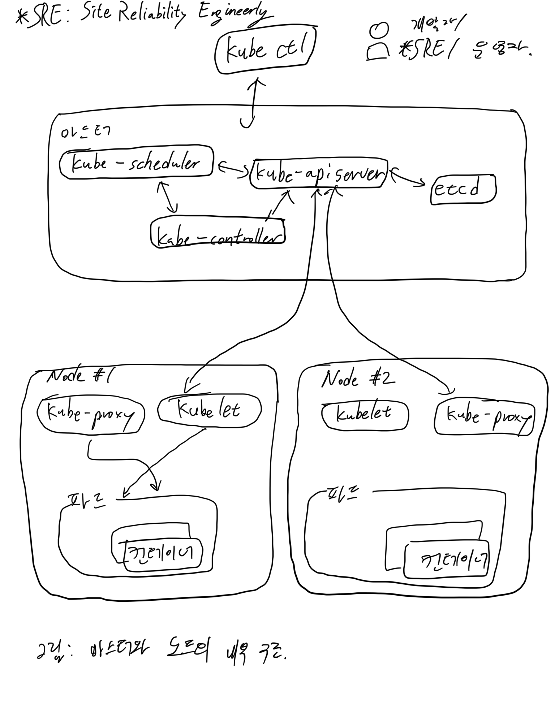

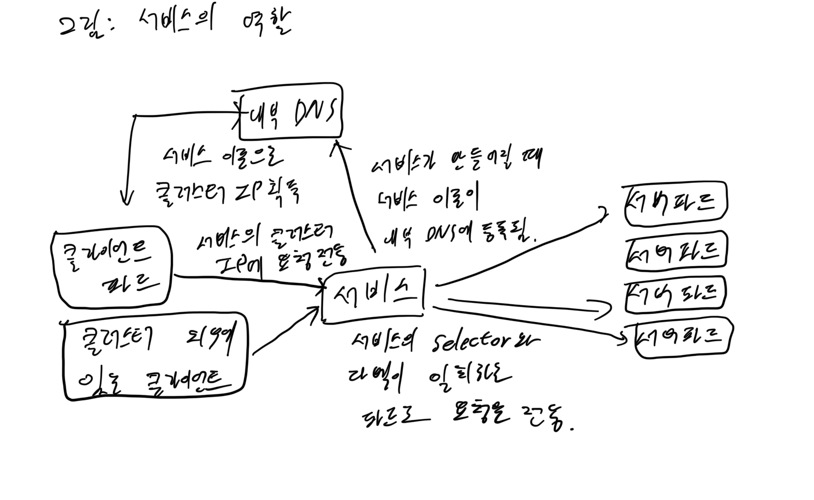


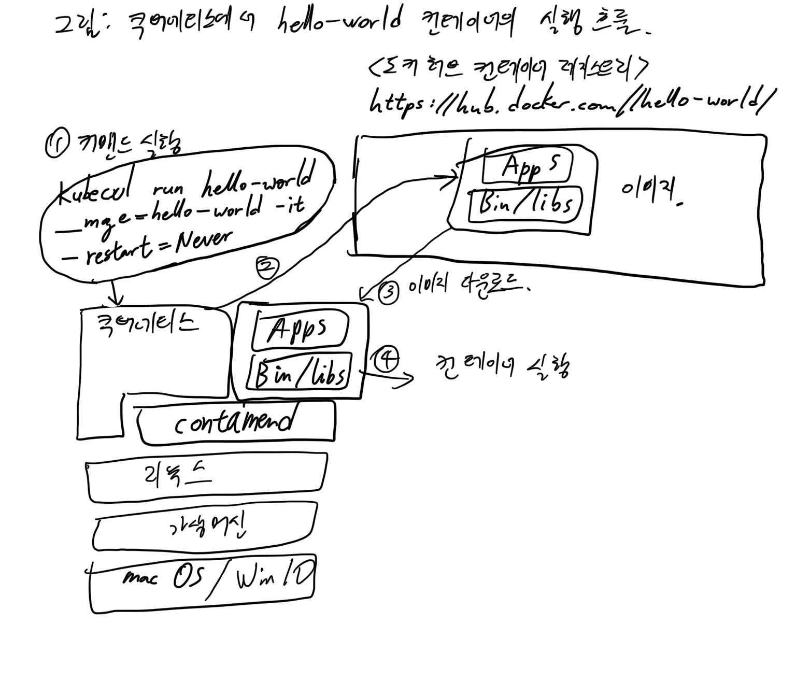

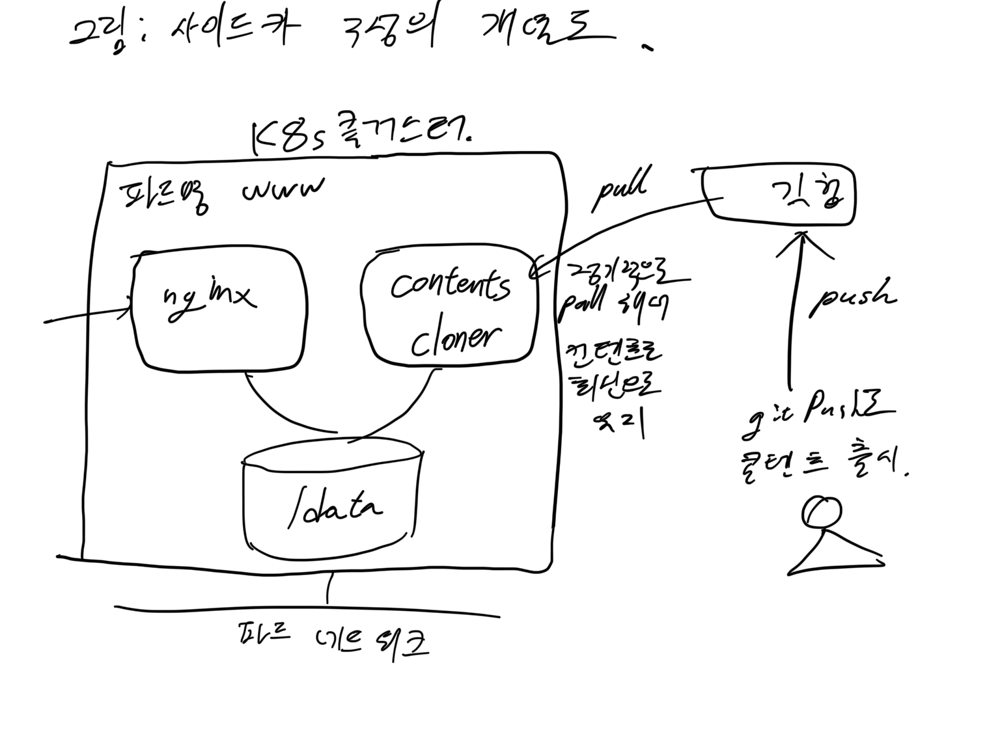


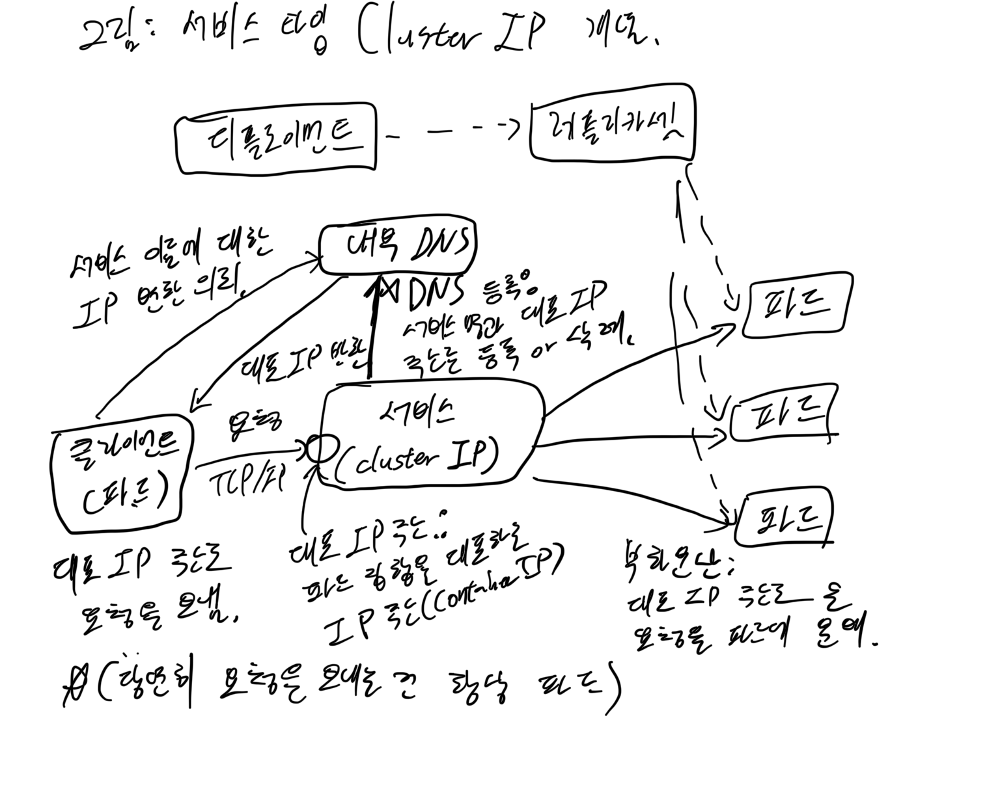

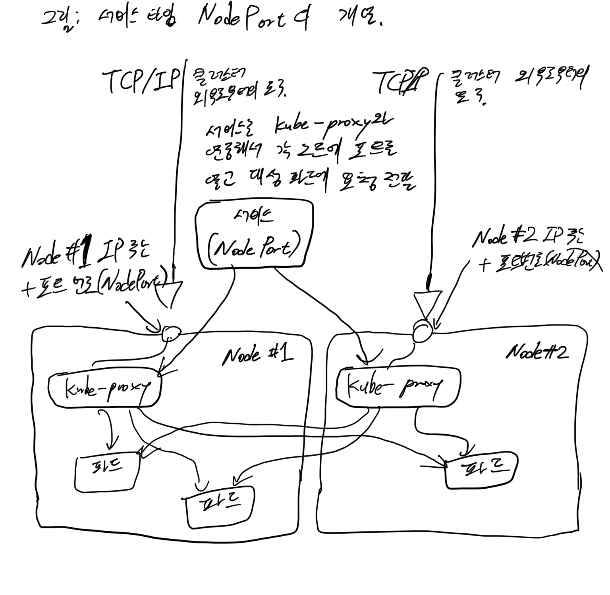

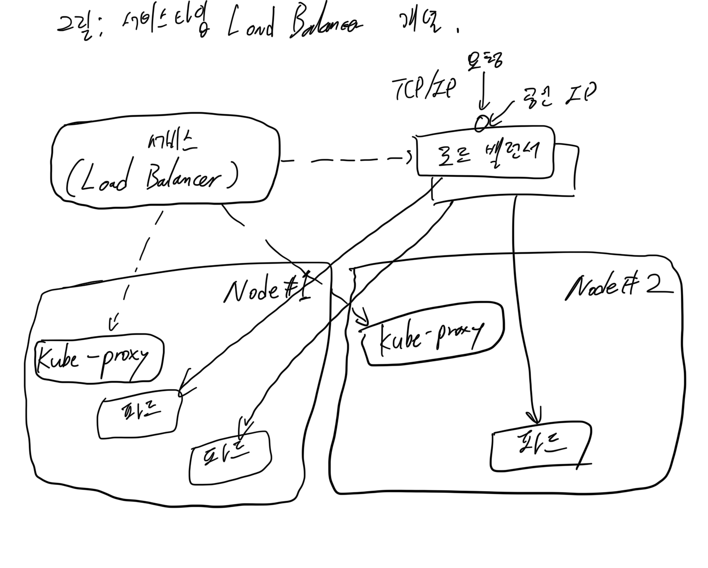

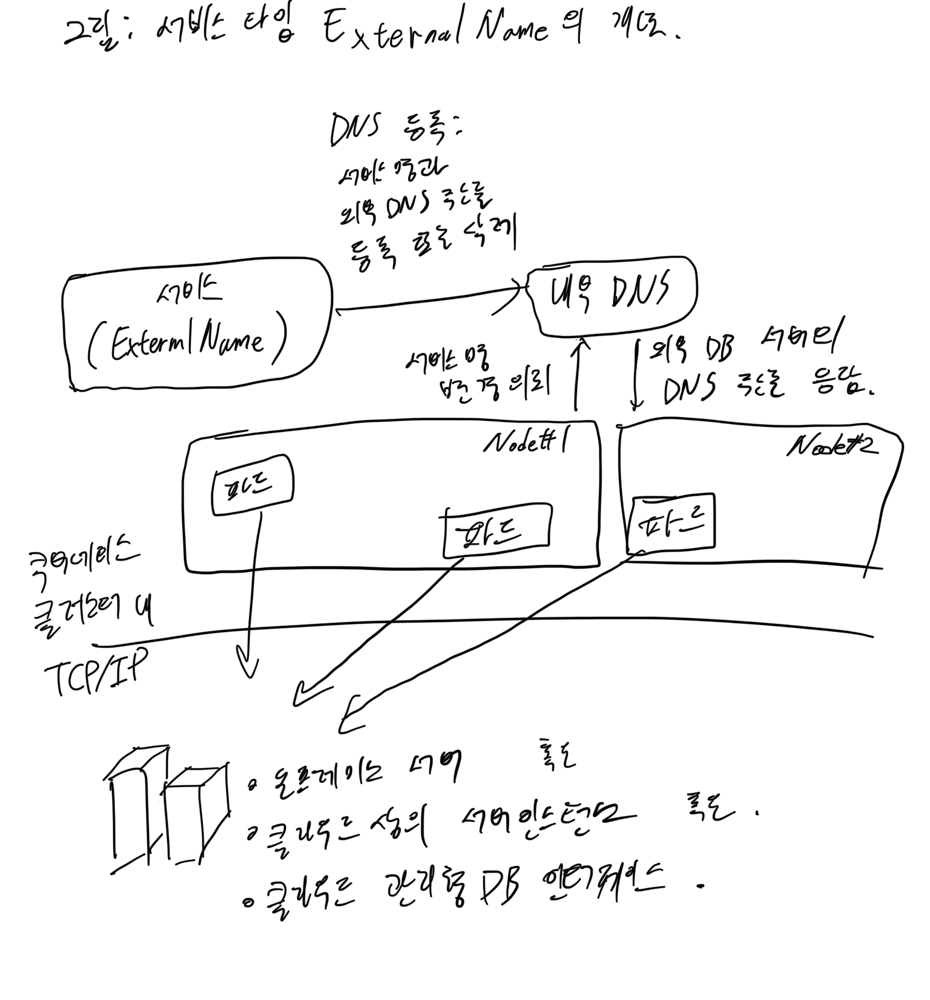

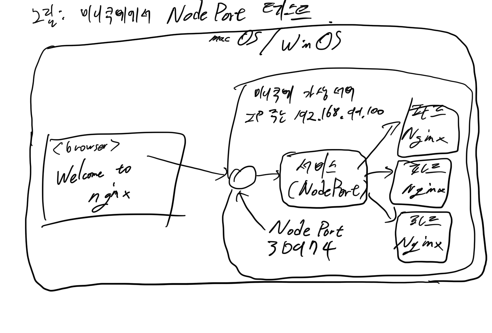

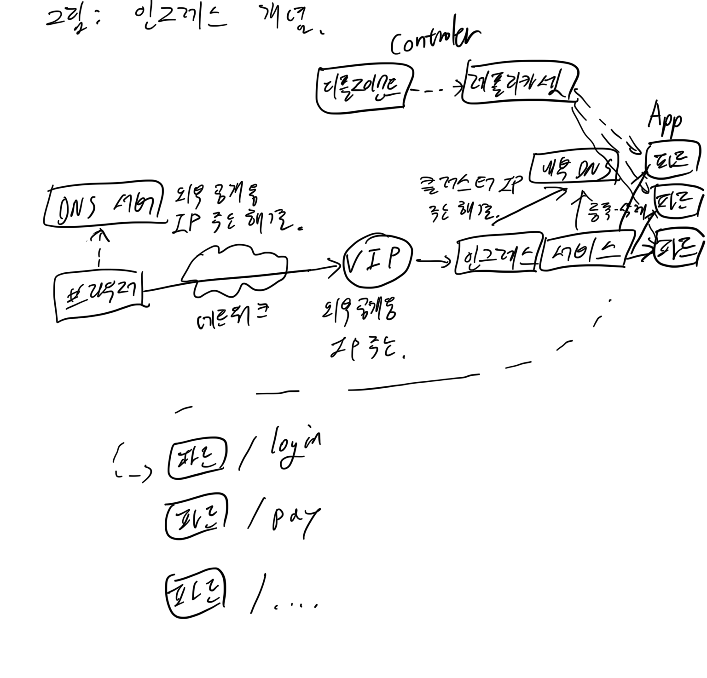

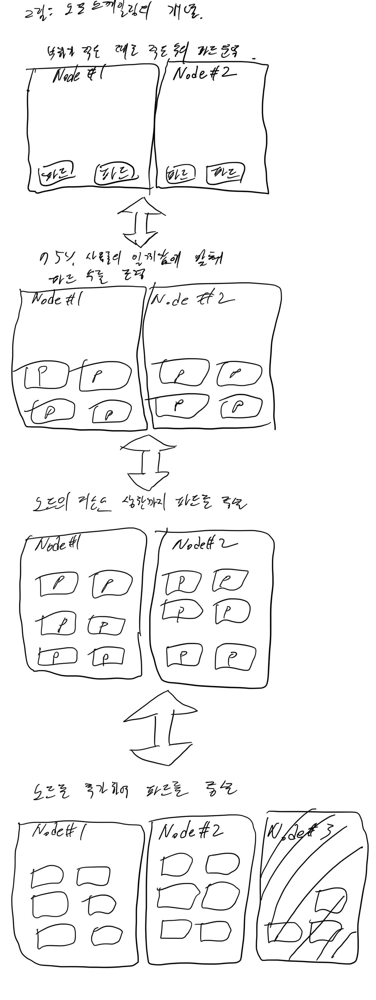

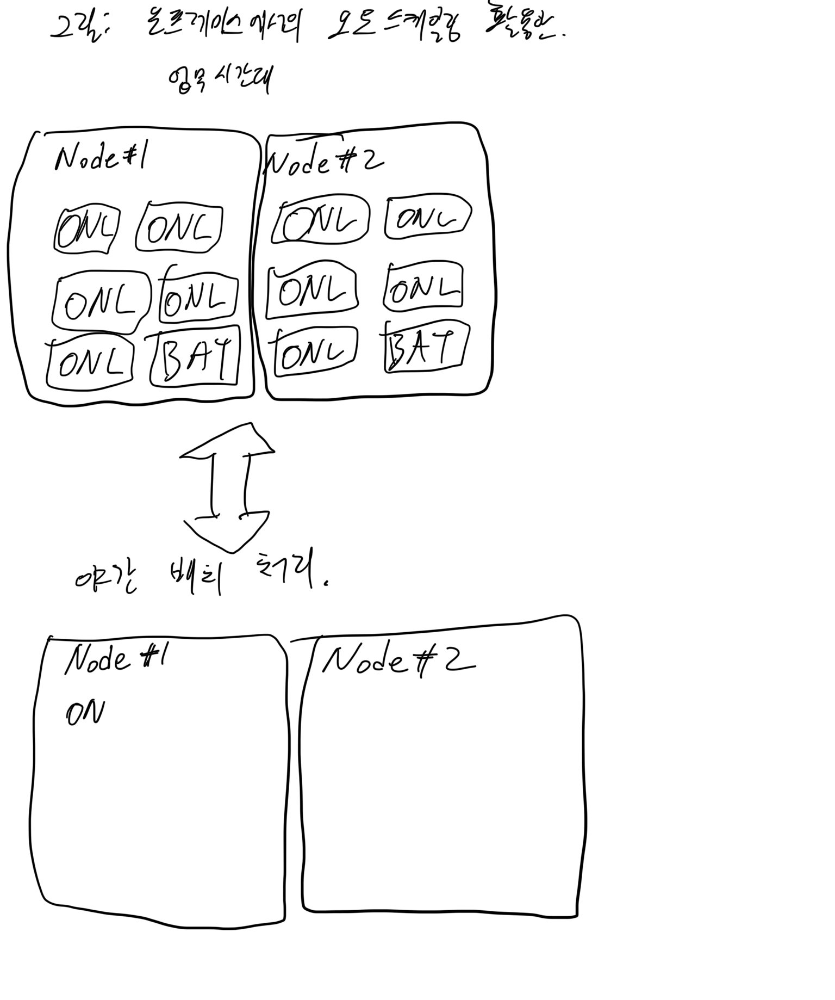

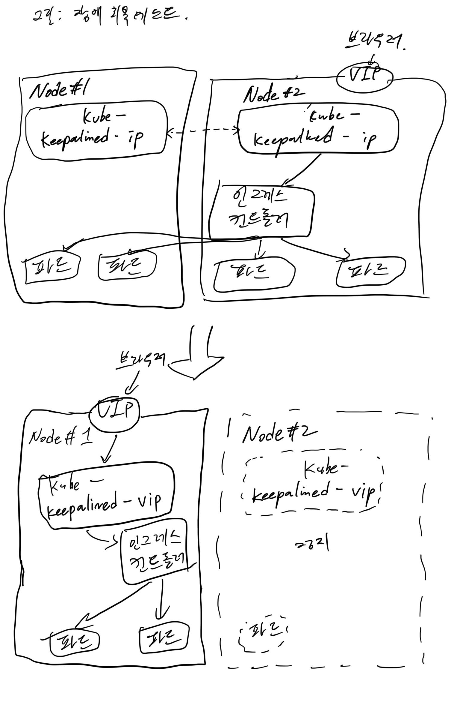

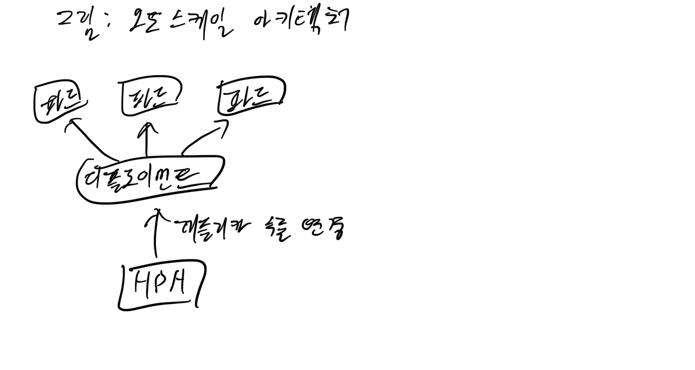

# ì´ë¦„들

- 쿠버네티스 API: 쿠버네티스 ì¡°ì‘ì€ ëª¨ë‘ APIë¡œ ë™ì‘한다.CLI kubectlì„ í†µí•´ 마스터 노드 kube-apiserverì—게 YAML í˜¹ì€ JSON 형ì‹ìœ¼ë¡œ 전송한다.
- 오브ì íŠ¸: K8s í´ëŸ¬ìŠ¤í„° ë‚´ë¶€ì˜ ì—”í‹°í‹°ë¡œ, 파드, 컨트롤러, 서비스 ë“±ì˜ ì¸ìŠ¤í„´ìŠ¤ë¥¼ ì˜ë¯¸. 쿠버네티스 APIì˜ ë¦¬ì†ŒìŠ¤ ì¢…ë¥˜ì— ë§ê²Œ 설정 ë° ìƒì„±ëœë‹¤. (그럼 모든 파드, 컨트롤러, 서비스는 공통 ì¡°ìƒì„ 가지는가? 아니, ê°ì²´ì§€í–¥ ê°œë…ì€ ì•„ë‹ˆë‹¤. 오브ì íŠ¸ë“¤ì´ ë™ì¼í•œ APIì—ì„œ kind만 달리 설정ëœë‹¤ëŠ” ì˜ë¯¸ë‹¤. 파드와 컨트롤러는 ê°™ì€ ë©”ë‰´íŒì— ìˆëŠ” 파스타와 스테ì´í¬ì˜ 관계 ê°™ì€ ê±°ì§€.) 
- kube-system 네ì„스í˜ì´ìŠ¤: K8s 시스템 관련 ê¸°ëŠ¥ì„ í•˜ëŠ” 오브ì íŠ¸ë“¤ì€ ì´ ë„¤ì„ ìŠ¤í˜ì´ìŠ¤ì—ì„œ 만들어ì§.
- 쿠버네티스ì—ì„œì˜ ë„¤ì„ ìŠ¤í˜ì´ìŠ¤: 오브ì íŠ¸ë“¤ì€ kind 안ì—ì„œ 유ì¼í•œ ì´ë¦„ì„ ê°€ì ¸ì•¼ 함.
- 워í¬ë¡œë“œ: 컨테ì´ë„ˆ, 파드, ì»¨íŠ¸ë¡¤ëŸ¬ì˜ ê·¸ë£¹. 컨테ì´ë„ˆ ì‹¤í–‰ì„ ê´€ë¦¬í•˜ê¸° 위해 사용.
- 컨테ì´ë„ˆ: 쿠버네티스ì—서는 컨테ì´ë„ˆë§Œ ë…ìì ìœ¼ë¡œ 실행하는 ê²ƒì´ ë¶ˆê°€ëŠ¥í•˜ë©°, 파드 ë‚´ì— ì‹¤í–‰í•´ì•¼ 한다. 컨테ì´ë„ˆ ê°€ë™ ì‹œ ì´ë¯¸ì§€ì˜ ì´ë¦„, 실행 명령어, 실행 ì¸ì, 환경 변수, 리소스 요청/ìƒí•œ ê°’ì´ ì„¤ì •ëœ ëŒ€ë¡œ ìƒì„±ë˜ê² ì§€
- 파드: 컨테ì´ë„ˆë¥¼ 실행하기 위한 í•œ ê°œ ë˜ëŠ” 여러 ê°œì˜ ì»¨í…Œì´ë„ˆ. 매우 중요한 오브ì íŠ¸ì„
- 컨트롤러: 파드를 제어하는 오브ì íŠ¸
# 탑다운1

목표: Minikube í´ëŸ¬ìŠ¤í„°ë¥¼ 로컬ì—ì„œ 실행하고, 간단한 Nginx 웹 서버를 ë°°í¬í•œ 후, 외부ì—ì„œ 접근할 수 ìˆë„ë¡ ì„œë¹„ìŠ¤ë¡œ 노출합니다.

## 1.  í´ëŸ¬ìŠ¤í„° ìƒì„±

```shell
# í´ëŸ¬ìŠ¤í„° 1ê°œ ìƒì„±
minikube start
```


## 2. 메니í˜ìŠ¤íŠ¸ ì‘성

nginx-deployment.yaml

```shell
apiVersion: apps/v1
kind: Deployment
metadata:
  name: nginx-deployment
  labels:
    app: nginx
spec:
  replicas: 2
  selector:
    matchLabels:
      app: nginx
  template:
    metadata:
      labels:
        app: nginx
    spec:
      containers:
      - name: nginx
        image: nginx:latest
        ports:
        - containerPort: 80
        
```

## 3. Nginx Service Manifest ì‘성

nginx-service.yaml

```shell
apiVersion: v1
kind: Service
metadata:
  name: nginx-service
spec:
  selector:
    app: nginx
  ports:
  - protocol: TCP
    port: 80
    targetPort: 80
  type: NodePort
```

## 4. 메니í˜ìŠ¤íŠ¸ë¥¼ í´ëŸ¬ìŠ¤í„°ì— ì ìš©

```shell
kubectl apply -f nginx-deployment.yaml
kubectl apply -f nginx-service.yaml
```

## 5. 서비스 ì ‘ê·¼ 확ì¸

```shell
minikube service nginx-service
```


# ì´ìŠˆ: 지금 í´ëŸ¬ìŠ¤í„°ì— í• ë‹¹ëœ Elastic IP와 다른 주소로 서비스 urlì´ ìƒì„±

## Phase1

환경: ubuntu 22, amd, EC2, minikube

로그: ì—†ìŒ

변경사항: nginx-serivce.yaml, nginx-deployment.yaml ìƒì„± 후 í´ëŸ¬ìŠ¤í„° ì ìš©

## Phase2-1

확ì¸: 서비스 타ì…ì´ NodePortë¡œ 지정ë¨. NodePort 타ì…ì˜ ì„œë¹„ìŠ¤ëŠ” í´ëŸ¬ìŠ¤í„° ë…¸ë“œì˜ ì•„ì´í”¼ì™€ ì§€ì •ëœ í¬íŠ¸ë¥¼ 통해 ì™¸ë¶€ì— ë…¸ì¶œ. ì´ ê³¼ì •ì—ì„œ Elastic IPê°€ ì•„ë‹Œ 기본 ë„¤íŠ¸ì›Œí¬ ì¸í„°í˜ì´ìŠ¤ ì•„ì´í”¼ê°€ ì‚¬ìš©ëœ ê²ƒìœ¼ë¡œ ë³´ì„. 

externalIPs 필드를 활용하면 서비스로 외부 접근 가능하다고 함

ì‹œë„: 

```shell
apiVersion: v1
kind: Service
metadata:
  name: my-service
spec:
  selector:
    app: my-app
  ports:
    - protocol: TCP
      port: 80
      targetPort: 80
  type: NodePort
  externalIPs:
    - 43.200.202.183
```

ê²°ê³¼ 분ì„: 실패

í´ëŸ¬ìŠ¤í„° ì ìš©ê³¼ 서비스 확ì¸ì„ 진행하였ìŒ

```shell
kubectl apply -f nginx-deployment.yaml
kubectl apply -f nginx-service.yaml
minikube service nginx-service
```

```shell
ubuntu@ip-172-31-27-11:~/manifest$ minikube service nginx-service
|-----------|---------------|-------------|---------------------------|
| NAMESPACE |     NAME      | TARGET PORT |            URL            |
|-----------|---------------|-------------|---------------------------|
| default   | nginx-service |          80 | http://192.168.49.2:32594 |
|-----------|---------------|-------------|---------------------------|
🉠 Opening service default/nginx-service in default browser...
👉  http://192.168.49.2:32594
```

결과로 ìƒì„±ëœ urlì— externalURLì€ ë°˜ì˜ë˜ì§€ ì•ŠìŒ. 그냥 elastic IP를 바로 ì ‘ì†í•˜ë©´? ì´ê²ƒë„ 안 ë¨

## Phase2-2: 다른 ì´ìŠˆ 발견

확ì¸: nginx-service.yamlì˜ externalURL ì„¤ì •ì€ ì„œë¹„ìŠ¤ urlê³¼ 무관함. ì´ì™€ 관련한 GPT 문답

> externalIPs 필드는 Kubernetes í´ëŸ¬ìŠ¤í„° ë‚´ì—ì„œ 노드가 특정 IP(예: íƒ„ë ¥ì  IP)ë¡œ 들어오는 트ë˜í”½ì„ 서비스로 전달하ë„ë¡ ì¶”ê°€ì ì¸ ë¼ìš°íŒ… ê·œì¹™ì„ ì„¤ì •í•˜ëŠ” ì—­í• ì„ í•©ë‹ˆë‹¤. 하지만 ì´ í•„ë“œê°€ ìˆë‹¤ê³  í•´ì„œ Kubernetes API나 관련 ë„구가 ìë™ìœ¼ë¡œ 서비스 URLì„ ê·¸ 외부 IPë¡œ 변경해주지는 않습니다.

노드 í¬íŠ¸ëŠ” ë§ ê·¸ëŒ€ë¡œ ë…¸ë“œì˜ í¬íŠ¸ë¥¼ 지정하는 서비스 타ì…. 노드는 ì—¬ì „íˆ í˜¸ìŠ¤íŠ¸ì˜ ì•„ì´í”¼ë¡œ ì„¤ì •ë  ìˆ˜ë°–ì— ì—†ë‹¤. ê·¸ë˜ì„œ 로드 밸런서를 쓰는 ê²ƒì´ ì¼ë°˜ì . 그러나 로드 밸런서는 추가 ë¹„ìš©ì„ ìœ ë°œí•  수 ìˆë‹¤ê³  한다. 왜? 로드 밸런서 리소스는 ë”°ë¡œ ì¸ìŠ¤í„´ìŠ¤ì²˜ëŸ¼ ìƒì„±ì´ ëœë‹¤. ê·¸ë˜ì„œ ì§ì ‘ 비활성화 시켜주는 조치가 필요하다. ì¼ë‹¨ 로드 밸런서로 서비스 타ì…ì„ ë³€í™˜í•´ë³´ì.

ì‹œë„

nginx-service.yamlì„ ë‹¤ìŒê³¼ ê°™ì´ ë³€ê²½

```shell
apiVersion: v1
kind: Service
metadata:
  name: nginx-service
spec:
  selector:
    app: nginx
  ports:
    - protocol: TCP
      port: 80
      targetPort: 80
  type: LoadBalancer
```

ì´ë¥¼ í´ëŸ¬ìŠ¤í„°ì— ì ìš©í•˜ë©´ AWS ì—ì„œ 제공하는 로드 밸런서가 ìƒì„±ëœë‹¤. ì´ëŠ” AWS 콘솔ì—ì„œ í™•ì¸ ê°€ëŠ¥

결과분ì„: ì†”ë£¨ì…˜ì´ ì œëŒ€ë¡œ ì ìš©ì•ˆ ë¨.(솔루션 ìì²´ì˜ ë¬¸ì œê°€ 아님)

í˜„ì¬ externalIPê°€ pending ìƒíƒœ. AWS 콘솔ì—ì„œë„ ì•„ë¬´ê²ƒë„ í™•ì¸ ì•ˆ ë¨. kubectlì—ì„œ 매니í˜ìŠ¤íŠ¸ ì ìš©í•œ 것과 별개로 AWS 콘솔ì—ì„œ 별ë„ì˜ ì¡°ì‘ì„ í•´ì¤˜ì•¼ 하는가? 그렇지는 않지만, AWS와 í´ëŸ¬ìŠ¤í„° 통합 ì—¬ë¶€ì— ë”°ë¼ ì•ˆ ë  ìˆ˜ë„ ìˆë‹¤. ê·¸ëŸ°ë° í•´ê²°ì´ ì•ˆ ë˜ê³  ìˆìœ¼ë‹ˆ, 별ë„ì˜ ì´ìŠˆë¥¼ ìƒì„±í•˜ë„ë¡ í•œë‹¤.

# ì´ìŠˆ: 로드 밸런서가 ìƒì„±ë˜ì§€ ì•ŠìŒ

## Phase1

환경: unbuntu, EC2, 

로그: ì—†ìŒ

변경사항: nginx-service.yamlì„ í†µí•´ 로드 밸런서 타ì…ì„ ì§€ì •í•˜ì˜€ìŒ.

## Phase2-1: 다른 ì´ìŠˆ 발견

확ì¸: AWS와 쿠버네티스 í´ëŸ¬ìŠ¤í„° ì—°ë™ í™•ì¸

```shell
# ê° ë…¸ë“œ ì •ë³´ 표기. ì—°ë™ì´ 제대로 ë으면 ê° ë…¸ë“œì— AWS 관련 ì •ë³´ 표기
kubectl get nodes -o wide
#  failure-domain.beta.kubernetes.io/zone ë˜ëŠ” 
# topology.kubernetes.io/region 표기가 ìˆëŠ”지 확ì¸
kubectl describe node minikube | grep topology
```

관련 표기가 ì—†ìŒ. AWS와 쿠버네티스 í´ëŸ¬ìŠ¤í„°(minikube)ê°€ ì—°ë™ë˜ì§€ 않았다. 

> Minikube는 로컬 개발 ë° í…ŒìŠ¤íŠ¸ ìš©ë„ë¡œ 만들어진 Kubernetes í´ëŸ¬ìŠ¤í„°ì´ê¸° 때문ì—, AWSì™€ì˜ í†µí•©(예: AWS 리소스 ìë™ í”„ë¡œë¹„ì €ë‹, IAM ì—­í•  ì—°ë™, AWS 관련 노드 ë¼ë²¨ 등)ì´ ìë™ìœ¼ë¡œ ì´ë£¨ì–´ì§€ì§€ 않습니다.

ì‹œë„: 

그렇다면 minikube로는 EC2ì—ì„œ 로드 밸런서를 ìƒì„±í•  수 없군. 

결과분ì„: ì›ì²œ 불가

그냥 노드 í¬íŠ¸ 타ì…으로 다시 바꾸고, ì ê¹ ì¸ìŠ¤í„´ìŠ¤ ì•„ì´í”¼ 보안 ì„¤ì •ì„ ì—´ì–´ì„œ 서비스 ì ‘ì† í…ŒìŠ¤íŠ¸ë¥¼ 하고 ë‹¤ìŒ ì‹¤ìŠµìœ¼ë¡œ 넘어가ë„ë¡ í•˜ì. → ì´ì¡°ì°¨ë„ 안 ëœë‹¤.

# ì´ìŠˆ: 노드í¬íŠ¸ 서비스로 ì ‘ì†ì´ 안 ë¨

## Phase1

환경: ubuntu 22, amd, EC2, minikube, elastic IP 사용 중

로그: ì—†ìŒ

변경사항: nginx-serivce.yamlì— ë…¸ë“œ í¬íŠ¸ 설정하여 í´ëŸ¬ìŠ¤í„°ì— ì ìš©, http://192.168.49.2:32594ë¡œ 서비스 ë§í¬ ìƒì„± ë¨. AWS ì¸ìŠ¤í„´ìŠ¤ì˜ 보안 그룹ì—ì„œ 해당 í¬íŠ¸ë¥¼ 모든 TCP ìš”ì²­ì— ëŒ€í•´ 허가하ë„ë¡ ì¸ë°”ìš´ë“œ ê·œì¹™ì„ ì„¤ì •í•¨. 그럼ì—ë„ http://<í• ë‹¹ëœ íƒ„ë ¥ì IP>:노드í¬íŠ¸ ë¡œ ì ‘ì†ì´ 불가능함. 

## Phase2-2: 대안 발견(curl)

확ì¸: Minikubeì˜ íŠ¹ì„±ì„ ìƒê°í•´ì•¼ 함.

> Minikube를 EC2 ì¸ìŠ¤í„´ìŠ¤ì—ì„œ 실행할 경우, Minikube í´ëŸ¬ìŠ¤í„°ëŠ” 기본ì ìœ¼ë¡œ ë…ìì ì¸ ê°€ìƒ ë„¤íŠ¸ì›Œí¬ ë‚´ì—ì„œ ë™ì‘합니다.  서비스 ë§í¬ë¡œ ë³´ì´ëŠ” http://192.168.49.2:32594는 Minikube 내부ì—ì„œ í• ë‹¹ëœ IPì´ë©°, EC2 ì¸ìŠ¤í„´ìŠ¤ì— í• ë‹¹ëœ íƒ„ë ¥ì  IP와는 ë³„ê°œì˜ ë„¤íŠ¸ì›Œí¬ ì¸í„°í˜ì´ìŠ¤ì— 매핑ë˜ì–´ ìˆìŠµë‹ˆë‹¤.

→ 즉, 아무리 AWS 보안 ì„¤ì •ì„ ì§€ì§€ê³  ë³¶ì•„ë„ ì™¸ë¶€ì—ì„œ Minikube í´ëŸ¬ìŠ¤í„° 서비스를 ì´ìš©í•  수는 없다는 소리. 대신 ë¯¸ë‹ˆì¿ ë² ì˜ ê°€ìƒ ë„¤íŠ¸ì›Œí¬ë¡œ  http://192.168.49.2:32594 ì ‘ì†í•´ì•¼ 한다. ê·¸ëŸ°ë° ì´ê±´ ë‹¹ì—°íˆ ì™¸ë¶€ ì ‘ì†ì´ 불가능한 네트워í¬ë‹¤. 

> 외부 ì ‘ê·¼ì„ ì›í•œë‹¤ë©´ minikube tunnelì„ ì‚¬ìš©í•˜ëŠ” ë°©ë²•ì´ ê°€ì¥ ì¼ë°˜ì ì…니다.

ì‹œë„

1. í¬íŠ¸ 설정: 그대로 놔 ë‘ë©´ ë¨
1. LoadBalancerë¡œ 서비스 íƒ€ì… ë‹¤ì‹œ 변경
1. í„°ë„ì€ ê³„ì† í„°ë¯¸ë„ì„ ì ìœ í•˜ê³  ìˆì–´ì•¼ 함
ê²°ê³¼ 분ì„:

ì´ê²ƒë„ 안 ëœë‹¤. 미니쿠베로는 외부 ì ‘ì†ì´ 안 ë˜ëŠ” ê±° 같다.

대신, curlë¡œ EC2 호스트 ì¸ìŠ¤í„´ìŠ¤ì—ì„œ ì ‘ì†í•˜ì—¬ htmlì„ í™•ì¸í•  수  ìˆë‹¤. ì¼ë‹¨ì€ ì´ë ‡ê²Œ 사용할 수 ìˆë‹¤. ë‹¤ìŒ ë‹¨ê³„ 실습ì€, 미니쿠베로 외부 í´ë¼ì´ì–¸íŠ¸ ì ‘ì†ì„ ìš°ì„ ì ìœ¼ë¡œ í•´ë³´ì. → 하긴 ê·¸ë˜ì„œ ì‰ê·¸ë ˆìŠ¤ê°€ ìˆëŠ” 거지. ì„œë¹„ìŠ¤ì˜ ì•„ì´í”¼ê°€ 외부 í˜¸ìŠ¤íŒ…ì´ ê°€ëŠ¥í•´ì•¼ 한다는 ìƒê°ì´ ì´ìƒí•œ 것ì´ë‹¤.


# 탑다운2

목표: 다ìŒì€ 실습 ë‚œì´ë„를 í•œ 단계 높여서 Ingress 컨트롤러와 TLS 종료, 그리고 경로 기반 ë¼ìš°íŒ…ì„ ì‚¬ìš©í•˜ëŠ” 프로ì íŠ¸ 예시ì…니다.

## 1. ì‰ê·¸ë ˆìŠ¤ 컨트롤러 설치

ingress 컨트롤러를 ì´ë ‡ê²Œ 설치할 수 ìˆë‹¤.

```shell
minikube addons enable ingress
```

실행 확ì¸

```shell
kubectl get pods -n ingress-nginx
```

## 2. ë‘ ê°œì˜ ì• í”Œë¦¬ì¼€ì´ì…˜ ë°°í¬

### 1) Nginx Deployment and service

nginx-deployment.yaml

```shell
apiVersion: apps/v1
kind: Deployment
metadata:
  name: nginx-deployment
  labels:
    app: nginx
spec:
  replicas: 2
  selector:
    matchLabels:
      app: nginx
  template:
    metadata:
      labels:
        app: nginx
    spec:
      containers:
      - name: nginx
        image: nginx:stable
        ports:
        - containerPort: 80
---
apiVersion: v1
kind: Service
metadata:
  name: nginx-service
spec:
  selector:
    app: nginx
  ports:
  - protocol: TCP
    port: 80
    targetPort: 80
  type: ClusterIP
```

### 2) node.js 간단한 웹 ë°°í¬

node-deployment.yaml

```shell
apiVersion: apps/v1
kind: Deployment
metadata:
  name: node-deployment
  labels:
    app: node-app
spec:
  replicas: 2
  selector:
    matchLabels:
      app: node-app
  template:
    metadata:
      labels:
        app: node-app
    spec:
      containers:
      - name: node-app
        # 예시용 간단한 Node.js ì´ë¯¸ì§€ (실제 테스트를 위해 간단한 ì´ë¯¸ì§€ í•„ìš”)
        image: hashicorp/http-echo
        args:
          - "-text=Hello from Node.js app"
        ports:
        - containerPort: 5678
---
apiVersion: v1
kind: Service
metadata:
  name: node-service
spec:
  selector:
    app: node-app
  ports:
  - protocol: TCP
    port: 80
    targetPort: 5678
  type: ClusterIP
```

## 3. Ingress 리소스 ìƒì„±

### a) TLS ì¸ì¦ì„œ ìƒì„±

> Minikube는 테스트 ìš©ë„ë¡œ Self-Signed ì¸ì¦ì„œë¥¼ 사용할 수 ìˆìŠµë‹ˆë‹¤. ì•„ë˜ ëª…ë ¹ì–´ë¥¼ 통해 ì¸ì¦ì„œì™€ 키를 ìƒì„±í•©ë‹ˆë‹¤.


```shell
openssl req -x509 -nodes -days 365 -newkey rsa:2048 \
  -out tls.crt -keyout tls.key \
  -subj "/CN=example.com/O=example.com"
```

ì¸ì¦ì„œë¥¼ 쿠버네티스 secret으로 ìƒì„±

```shell
kubectl create secret tls tls-secret --key tls.key --cert tls.crt
```

### b) Ingress 리소스 ìƒì„±

ingress.yaml

```shell
apiVersion: networking.k8s.io/v1
kind: Ingress
metadata:
  name: advanced-ingress
  annotations:
    nginx.ingress.kubernetes.io/ssl-redirect: "true"
spec:
  tls:
  - hosts:
    - example.com
    secretName: tls-secret
  rules:
  - host: example.com
    http:
      paths:
      - path: /nginx
        pathType: Prefix
        backend:
          service:
            name: nginx-service
            port:
              number: 80
      - path: /node
        pathType: Prefix
        backend:
          service:
            name: node-service
            port:
              number: 80
```


> ì´ Ingress 설정ì€:
•	example.com ë„ë©”ì¸ì— 대해 TLS를 ì ìš©
•	/nginx 경로는 Nginx 서비스로 ë¼ìš°íŒ…
•	/node 경로는 Node.js (http-echo) 서비스로 ë¼ìš°íŒ…


> 실제 테스트ì—서는 /etc/hosts 파ì¼ì— example.comì„ Minikube IP(예: minikube ip)ë¡œ 매핑하거나, 브ë¼ìš°ì €ì—ì„œ 해당 ë„ë©”ì¸ìœ¼ë¡œ ì ‘ì†í•´ 테스트할 수 ìˆìŠµë‹ˆë‹¤.

## 4. 리소스 ì ìš© ë° í…ŒìŠ¤íŠ¸

ê° ì•¼ë©œ 파ì¼ì„ í´ëŸ¬ìŠ¤í„°ì— ì ìš©

```shell
kubectl apply -f nginx-deployment.yaml
kubectl apply -f node-deployment.yaml
kubectl apply -f ingress.yaml
```

리소스가 ì˜ ë°°í¬ë는지 확ì¸

```shell
kubectl get all
kubectl get ingress
```

Ingressì— í• ë‹¹ëœ ì•„ì´í”¼ 확ì¸

```shell
minikube ip
```

192.168.49.2

중요: 로컬 호스트 íŒŒì¼ ìˆ˜ì •

/etc/hosts 파ì¼ì— ì•„ë˜ í•­ëª© 추가

```shell
<minikube_ip>   example.com
```

로컬 브ë¼ìš°ì €ì—ì„œ ì ‘ì† í…ŒìŠ¤íŠ¸â†’ EC2ì—서는 어떻게 하지?

https://example.com/nginx → curl https://example.com/nginx -k
https://example.com/node


## ì˜ë¬¸ì ë“¤

### Q1.

ì‰ê·¸ë ˆìŠ¤ 쓰는게 외부 í´ë¼ì´ì–¸íŠ¸ì—ì„œë„ ì„œë¹„ìŠ¤ ì ‘ì†í•  수 ìˆê²Œ 해주는 ê±° 아닌가? 미니쿠베ë¼ëŠ” ì´ìœ ë¡œ ì‰ê·¸ë ˆìŠ¤ ì¨ë„ 외부 í´ë¼ì´ì–¸íŠ¸ ì ‘ì†ì´ 안 ë˜ë©´, 미니쿠베로는 대체 ë­˜ í•  수 ìˆëŠ”ê°€? í„°ë„ ì•ˆ ì“°ë©´ ì•„ë¬´ê²ƒë„ ëª» 하는 ê±° 아닌가?

A.

Minikube는 로컬 개발 ë° í…ŒìŠ¤íŠ¸ìš©ìœ¼ë¡œ 만들어진 ë„구ì´ë¯€ë¡œ,

실제 í¼ë¸”릭 í´ë¼ìš°ë“œ 환경(예: AWS, GCP)ì—ì„œì˜ Ingress처럼 외부 IP나 로드 밸런서를 ìë™ìœ¼ë¡œ ìƒì„±í•´ 주지 않습니다.

ê²°ê³¼ì ìœ¼ë¡œ “Ingress를 ì •ì˜í•˜ë©´ 외부ì—ì„œë„ ì ‘ê·¼ 가능â€ì´ë¼ëŠ” Kubernetes ì¼ë°˜ë¡ ì´, Minikube 환경ì—서는 제한ì ìœ¼ë¡œë§Œ ì ìš©ë©ë‹ˆë‹¤.

1. 왜 Minikubeì—ì„œ Ingress를 ì¨ë„ 외부 ì ‘ì†ì´ 어려운가?

1.	Minikubeì˜ ë„¤íŠ¸ì›Œí¬ êµ¬ì¡°

•	Minikube는 내부ì ìœ¼ë¡œ VMì´ë‚˜ 컨테ì´ë„ˆ 네트워í¬ë¥¼ 사용해 로컬 환경ì—ì„œ Kubernetes를 실행합니다.

•	“외부 IPâ€ê°€ 없는 ìƒíƒœì´ë¯€ë¡œ, Ingress를 만들었다 í•´ë„ ì™¸ë¶€(ì¸í„°ë„·)ì—ì„œ ì§ì ‘ ì ‘ì†í•  수 없습니다.

2.	LoadBalancer ì—°ë™ ë¶€ì¬

•	í´ë¼ìš°ë“œ 환경ì—서는 Ingress 컨트롤러가 í´ë¼ìš°ë“œì˜ 로드 밸런서를 만들고 í¼ë¸”릭 IP를 할당합니다.

•	Minikubeì—는 그런 ê¸°ëŠ¥ì´ ì—†ì–´ì„œ, Ingress를 ì •ì˜í•´ë„ “로컬 ì „ìš©â€ìœ¼ë¡œë§Œ ë™ì‘합니다.

2. 그렇다면 Minikubeë¡œ Ingress를 쓰는 ì´ìœ ëŠ”?

1.	개발/테스트 환경 시뮬레ì´ì…˜

•	실제 í´ë¼ìš°ë“œ 환경ì—ì„œ Ingress를 사용하기 ì „, 로컬 환경ì—ì„œ Ingress 리소스(YAML) êµ¬ì„±ì„ ë¯¸ë¦¬ 시험해 ë³¼ 수 ìˆìŠµë‹ˆë‹¤.

•	예: 경로 기반 ë¼ìš°íŒ…, TLS 설정 ë“±ì„ ë¡œì»¬ì—ì„œ 빠르게 ê²€ì¦í•  수 ìˆìŠµë‹ˆë‹¤.

2.	여러 서비스 ë¼ìš°íŒ… 테스트

•	í•œ ë„ë©”ì¸(ë˜ëŠ” IP) ì•„ë˜ ì—¬ëŸ¬ 서비스(/app1, /app2 등)ë¡œ 트ë˜í”½ì„ 분기하는 ë¡œì§ì„ 로컬ì—ì„œ 확ì¸í•  수 ìˆìŠµë‹ˆë‹¤.

3. Minikubeì—ì„œ 외부 접근하려면 어떻게 해야 하나?

A. minikube tunnel 사용 (LoadBalancer íƒ€ì… ì„œë¹„ìŠ¤ 테스트)

•	LoadBalancer 타ì…ì˜ ì„œë¹„ìŠ¤ë¥¼ ìƒì„±í•˜ê³ ,

•	minikube tunnel 명령어를 실행하면,

Minikubeê°€ 로컬 머신(ë˜ëŠ” EC2 ì¸ìŠ¤í„´ìŠ¤)ì˜ ë„¤íŠ¸ì›Œí¬ ì¸í„°í˜ì´ìŠ¤ë¥¼ 통해 외부ì—ì„œ ì ‘ê·¼ 가능한 í¬íŠ¸ë¥¼ ì—´ì–´ì¤ë‹ˆë‹¤.

ì¥ì : 로컬 개발 환경ì—ì„œ LoadBalancer 테스트 가능

단ì : tunnel 프로세스를 ê³„ì† ì‹¤í–‰í•´ ë‘어야 하며, ë„ë©”ì¸ ê¸°ë°˜ ì ‘ê·¼ì€ /etc/hosts 등 추가 ì„¤ì •ì´ í•„ìš”

B. NodePort + SSH í¬íŠ¸ í¬ì›Œë”© (ë˜ëŠ” NAT)

•	NodePortë¡œ 서비스를 노출한 ë’¤, SSH í¬íŠ¸ í¬ì›Œë”©ì„ 통해 로컬 브ë¼ìš°ì €ì—ì„œ 테스트할 수 ìˆìŠµë‹ˆë‹¤.

•	í˜¹ì€ Minikubeê°€ ë™ì‘하는 호스트(EC2 등)ì—ì„œ OS 레벨 NAT를 설정해 외부 IP/í¬íŠ¸ë¥¼ NodePortë¡œ 매핑할 ìˆ˜ë„ ìˆìŠµë‹ˆë‹¤.

C. /etc/hostsë¡œ ë„ë©”ì¸ ë§¤í•‘ (로컬 테스트)

•	로컬 PC나 Minikube 실행 í˜¸ìŠ¤íŠ¸ì˜ /etc/hosts를 수정해 example.comì„ Minikube IPë¡œ 매핑하면, 로컬ì—ì„œ 해당 ë„ë©”ì¸ìœ¼ë¡œ ì ‘ê·¼ 가능합니다.

•	ì—¬ì „íˆ ì¸í„°ë„· ì „ì²´ì—는 노출ë˜ì§€ ì•Šê³ , 해당 호스트(í˜¹ì€ ë¡œì»¬ PC) 내부ì—서만 유효합니다.

4. 정리

•	Minikube는 프로ë•ì…˜ 환경ì—ì„œ 외부 트ë˜í”½ì„ ë°›ì•„ë“¤ì¼ ìš©ë„ë¡œ ì„¤ê³„ëœ ê²ƒì´ ì•„ë‹ˆë¼, 로컬ì—ì„œ K8s를 학습하고 테스트하기 위한 ë„구ì…니다.

•	Ingress를 ì‚¬ìš©í•´ë„ **“로컬(ë˜ëŠ” Minikube 호스트) 내부â€**ì—서만 ë™ì‘하며, 외부 ì ‘ê·¼ì´ í•„ìš”í•˜ë©´ 추가ì ì¸ í„°ë„ë§ì´ë‚˜ í¬íŠ¸ í¬ì›Œë”© ì„¤ì •ì„ í•´ì•¼ 합니다.

•	실제로 외부(ì¸í„°ë„·)ì—ì„œ ì ‘ê·¼ 가능한 Kubernetes í™˜ê²½ì„ ë§Œë“¤ë ¤ë©´, EKS, GKE, AKS ê°™ì€ í´ë¼ìš°ë“œ-managed Kubernetes나, ìì²´ í´ëŸ¬ìŠ¤í„°ì— cloud-controller(AWS, OpenStack 등)를 설정해야 합니다.

ê²°êµ­, Minikubeì—ì„œ Ingress는 â€œê¸°ëŠ¥ì  í•™ìŠµâ€ì„ 위한 것ì´ì§€, 실제 í¼ë¸”릭 ì ‘ê·¼ì„ ìœ„í•œ ì†”ë£¨ì…˜ì´ ì•„ë‹ˆë‹¤ë¼ê³  ì´í•´í•˜ì‹œë©´ ë©ë‹ˆë‹¤.

ë”°ë¼ì„œ í„°ë„ë§ì´ë‚˜ í¬íŠ¸ í¬ì›Œë”© ê°™ì€ ì¶”ê°€ ì‘ì—… ì—†ì´ â€œì™¸ë¶€ì—ì„œ 바로 ì ‘ê·¼â€í•˜ê¸°ëŠ” 어렵고,

ì´ëŠ” Minikubeì˜ ê·¼ë³¸ì ì¸ 설계(로컬 테스트용) 때문ì…니다

### Q2

1. 개발/테스트 환경 시뮬레ì´ì…˜
•	실제 í´ë¼ìš°ë“œ 환경ì—ì„œ Ingress를 사용하기 ì „, 로컬 환경ì—ì„œ Ingress 리소스(YAML) êµ¬ì„±ì„ ë¯¸ë¦¬ 시험해 ë³¼ 수 ìˆìŠµë‹ˆë‹¤.
•	예: 경로 기반 ë¼ìš°íŒ…, TLS 설정 ë“±ì„ ë¡œì»¬ì—ì„œ 빠르게 ê²€ì¦í•  수 ìˆìŠµë‹ˆë‹¤.
1. 여러 서비스 ë¼ìš°íŒ… 테스트
•	í•œ ë„ë©”ì¸(ë˜ëŠ” IP) ì•„ë˜ ì—¬ëŸ¬ 서비스(/app1, /app2 등)ë¡œ 트ë˜í”½ì„ 분기하는 ë¡œì§ì„ 로컬ì—ì„œ 확ì¸í•  수 ìˆìŠµë‹ˆë‹¤.
ì´ëŸ° ê¸°ëŠ¥ë“¤ì€ ì‰ê·¸ë ˆìŠ¤ë¥¼ ì¨ì•¼ë§Œ í•  수 ìˆëŠ” 것들ì¸ê°€ë³´ì§€?

A

네, ë§ìŠµë‹ˆë‹¤.
Ingress는 여러 ì„œë¹„ìŠ¤ì— ëŒ€í•œ 경로 기반 ë¼ìš°íŒ…, TLS 종료, ë„ë©”ì¸ ê¸°ë°˜ ë¼ìš°íŒ… ë“±ì„ í†µí•©ì ìœ¼ë¡œ 관리할 수 ìˆê²Œ í•´ 주므로,
ì´ëŸ° ê¸°ëŠ¥ë“¤ì„ íš¨ìœ¨ì ìœ¼ë¡œ 구현하고 테스트하려면 Ingress를 사용하는 ê²ƒì´ ì¼ë°˜ì ì…니다.

물론 NodePort나 LoadBalancer 서비스를 ê°ê° ë”°ë¡œ 설정하여 ì¼ë¶€ ê¸°ëŠ¥ì„ êµ¬í˜„í•  수는 ìˆì§€ë§Œ,
Ingress는 중앙 집중ì‹ìœ¼ë¡œ 여러 ë¼ìš°íŒ… 규칙과 TLS ì„¤ì •ì„ í•œ ê³³ì—ì„œ 관리할 수 ìˆëŠ” ì¥ì ì´ ìˆìŠµë‹ˆë‹¤.

# ì´ìŠˆ: nginx-deployment.yaml í´ëŸ¬ìŠ¤í„° ì ìš© 오류

## Phase1

환경: EC2, AMD, Ubuntu, minikube

로그: error: error validating "nginx-deployment.yaml": error validating data: failed to download openapi: Get "https://192.168.49.2:8443/openapi/v2?timeout=32s": dial tcp 192.168.49.2:8443: connect: no route to host; if you choose to ignore these errors, turn validation off with --validate=false

변경사항: nginx-deployment.yaml ì‘성 후 kubectl apply -f nginx-deployment.yaml 실행

## Phase2-1: í•´ê²°

확ì¸: 192.168.49.2:8443ì´ ë¬´ìŠ¨ ì•„ì´í”¼ì¸ì§€ 모르겠다. í´ëŸ¬ìŠ¤í„° ì•„ì´í”¼ì¸ê°€? ì¼ë‹¨ 로그 ìì²´ì˜ ì˜ë¯¸ëŠ” 야멜 파ì¼ì„ í´ëŸ¬ìŠ¤í„°ì— ì ìš©í•˜ëŠ” ê³¼ì •ì— validationì—ì„œ 문제가 ìƒê²¼ë‹¤ëŠ” 것으로 ë³´ì¸ë‹¤. 

즉, 내부ì—ì„œ ë¼ìš°íŒ…ì´ ì•ˆ ëë˜ ê²ƒì´ë‹¤. minikube statusë¡œ í™•ì¸ ê²°ê³¼ 컨트롤 플레ì¸ì´ stop ìƒíƒœì¸ ê²ƒì„ í™•ì¸.

ì‹œë„: minikube start

ê²°ê³¼ 분ì„: 성공. 

# 탑다운3

다ìŒì€ ì¿ ë²„ë„¤í‹°ìŠ¤ì˜ ë‹¤ì–‘í•œ 고급 기능(다중 서비스, Ingress, TLS, ë„¤íŠ¸ì›Œí¬ ì •ì±…, Persistent Volume, Horizontal Pod Autoscaler 등)ì„ í™œìš©í•˜ëŠ” ê³ ë‚œì´ë„ 실습 예시ì…니다.

## 1. 네ì„스í˜ì´ìŠ¤ ìƒì„±

모든 리소스를 격리할 네ì„스í˜ì´ìŠ¤ë¥¼ ìƒì„±í•©ë‹ˆë‹¤.

```markdown
apiVersion: v1
kind: Namespace
metadata:
  name: advanced-demo
```

```markdown
kubectl apply -f namespace.yaml
```

## 2. ConfigMap, Secret ìƒì„±

백엔드 서비스ì—ì„œ 사용할 설정 ê°’ê³¼ ë°ì´í„°ë² ì´ìŠ¤ ì ‘ì† ì •ë³´ë¥¼ 관리

```markdown
apiVersion: v1
kind: ConfigMap
metadata:
  name: backend-config
  namespace: advanced-demo
data:
  LOG_LEVEL: "info"
  FEATURE_FLAG: "true"
```

```markdown
apiVersion: v1
kind: Secret
metadata:
  name: db-secret
  namespace: advanced-demo
type: Opaque
data:
  # base64 ì¸ì½”ë”©ëœ ê°’ìœ¼ë¡œ ì…ë ¥ (예: echo -n "mypassword" | base64)
  DB_PASSWORD: bXlwYXNzd29yZA==
```

```markdown
kubectl apply -f configmap.yaml
kubectl apply -f secret.yaml
```

## 3. DB deploy(including persistent storage)

```markdown
apiVersion: v1
kind: PersistentVolumeClaim
metadata:
  name: db-pvc
  namespace: advanced-demo
spec:
  accessModes:
    - ReadWriteOnce
  resources:
    requests:
      storage: 1Gi
---
apiVersion: apps/v1
kind: Deployment
metadata:
  name: mysql
  namespace: advanced-demo
spec:
  replicas: 1
  selector:
    matchLabels:
      app: mysql
  template:
    metadata:
      labels:
        app: mysql
    spec:
      containers:
      - name: mysql
        image: mysql:8.0
        env:
        - name: MYSQL_ROOT_PASSWORD
          valueFrom:
            secretKeyRef:
              name: db-secret
              key: DB_PASSWORD
        ports:
        - containerPort: 3306
        volumeMounts:
        - name: mysql-data
          mountPath: /var/lib/mysql
      volumes:
      - name: mysql-data
        persistentVolumeClaim:
          claimName: db-pvc
---
apiVersion: v1
kind: Service
metadata:
  name: mysql-service
  namespace: advanced-demo
spec:
  selector:
    app: mysql
  ports:
  - protocol: TCP
    port: 3306
    targetPort: 3306
  clusterIP: None  # Headless service (DB í´ëŸ¬ìŠ¤í„° ë‚´ ì—°ê²° 테스트용)
```

```markdown
kubectl apply -f db-deployment.yaml
```

## 4. 백엔드 서비스 ë°°í¬

backend-deployment.yaml

```markdown
apiVersion: apps/v1
kind: Deployment
metadata:
  name: backend
  namespace: advanced-demo
spec:
  replicas: 2
  selector:
    matchLabels:
      app: backend
  template:
    metadata:
      labels:
        app: backend
    spec:
      containers:
      - name: backend
        image: nginxdemos/hello # ë°ëª¨ìš© ì´ë¯¸ì§€
        ports:
        - containerPort: 8080
        env:
        - name: LOG_LEVEL
          valueFrom:
            configMapKeyRef:
              name: backend-config
              key: LOG_LEVEL
        - name: FEATURE_FLAG
          valueFrom:
            configMapKeyRef:
              name: backend-config
              key: FEATURE_FLAG
        - name: DB_HOST
          value: mysql-service.advanced-demo.svc.cluster.local
        - name: DB_PASSWORD
          valueFrom:
            secretKeyRef:
              name: db-secret
              key: DB_PASSWORD
---
apiVersion: v1
kind: Service
metadata:
  name: backend-service
  namespace: advanced-demo
spec:
  selector:
    app: backend
  ports:
  - protocol: TCP
    port: 80
    targetPort: 8080
  type: ClusterIP
```

í´ëŸ¬ìŠ¤í„° ì ìš©í•˜ê¸°

## 5. 프론트엔드 서비스 ë°°í¬

```markdown
apiVersion: apps/v1
kind: Deployment
metadata:
  name: frontend
  namespace: advanced-demo
spec:
  replicas: 2
  selector:
    matchLabels:
      app: frontend
  template:
    metadata:
      labels:
        app: frontend
    spec:
      containers:
      - name: frontend
        image: nginx:latest
        ports:
        - containerPort: 80
---
apiVersion: v1
kind: Service
metadata:
  name: frontend-service
  namespace: advanced-demo
spec:
  selector:
    app: frontend
  ports:
  - protocol: TCP
    port: 80
    targetPort: 80
  type: ClusterIP
```

```markdown
kubectl apply -f frontend-deployment.yaml
```

## 6. ë„¤íŠ¸ì›Œí¬ ì •ì±…

```markdown
apiVersion: networking.k8s.io/v1
kind: NetworkPolicy
metadata:
  name: allow-backend-to-db
  namespace: advanced-demo
spec:
  podSelector:
    matchLabels:
      app: mysql
  ingress:
  - from:
    - podSelector:
        matchLabels:
          app: backend
    ports:
    - protocol: TCP
      port: 3306
---
apiVersion: networking.k8s.io/v1
kind: NetworkPolicy
metadata:
  name: allow-frontend-to-backend
  namespace: advanced-demo
spec:
  podSelector:
    matchLabels:
      app: backend
  ingress:
  - from:
    - podSelector:
        matchLabels:
          app: frontend
    ports:
    - protocol: TCP
      port: 8080
```

```markdown
kubectl apply -f networkpolicy.yaml
```

## 7. Ingress와 TLS 구성

### a. TLS ì¸ì¦ì„œ ìƒì„± (Self-Signed)

```markdown
openssl req -x509 -nodes -days 365 -newkey rsa:2048 \
  -out tls.crt -keyout tls.key \
  -subj "/CN=advanced-demo.local/O=advanced-demo"
```

쿠버네티스 ì‹œí¬ë¦¿ ìƒì„±

```markdown
kubectl create secret tls tls-secret --key tls.key --cert tls.crt -n advanced-demo
```

### b. Ingress 리소스 ì‘성

```markdown
apiVersion: networking.k8s.io/v1
kind: Ingress
metadata:
  name: advanced-ingress
  namespace: advanced-demo
  annotations:
    nginx.ingress.kubernetes.io/ssl-redirect: "true"
spec:
  tls:
  - hosts:
    - advanced-demo.local
    secretName: tls-secret
  rules:
  - host: advanced-demo.local
    http:
      paths:
      - path: /api
        pathType: Prefix
        backend:
          service:
            name: backend-service
            port:
              number: 80
      - path: /
        pathType: Prefix
        backend:
          service:
            name: frontend-service
            port:
              number: 80
```

ì´ê²ƒë„ í´ëŸ¬ìŠ¤í„°ì— ì ìš©.

## 8. HPA 설정

예를 들어, 백엔드 ì„œë¹„ìŠ¤ì— ëŒ€í•´ CPU ì‚¬ìš©ëŸ‰ì´ 50%를 초과하면 ìë™ìœ¼ë¡œ Pod 수를 ì¦ê°€ì‹œí‚¤ë„ë¡ ì„¤ì •í•©ë‹ˆë‹¤.

```markdown
apiVersion: autoscaling/v2
kind: HorizontalPodAutoscaler
metadata:
  name: backend-hpa
  namespace: advanced-demo
spec:
  scaleTargetRef:
    apiVersion: apps/v1
    kind: Deployment
    name: backend
  minReplicas: 2
  maxReplicas: 5
  metrics:
  - type: Resource
    resource:
      name: cpu
      target:
        type: Utilization
        averageUtilization: 50
```

```markdown
kubectl apply -f hpa.yaml
```


## 9. 테스트 ë° ê²€ì¦

### 모든 리소스 ìƒíƒœ 확ì¸

```markdown
kubectl get all -n advanced-demo
kubectl get ingress -n advanced-demo
```

### ì‰ê·¸ë ˆìŠ¤ ì ‘ì† í…ŒìŠ¤íŠ¸

/etc/hosts 파ì¼ì— minikube ip와 advanced-demo.local 매핑 추가

```markdown
<minikube ip> advanced-demo.local # 192.168.49.2
```

https://advanced-demo.localë¡œ ì ‘ì† ì‹œ 기본 경로는 프론트엔드로, /api 경로는 백엔드 api 서비스로 ë¼ìš°íŒ….

### HPA 테스트

백엔드 ì„œë¹„ìŠ¤ì— ë¶€í•˜ë¥¼ ë°œìƒì‹œí‚¤ê±°ë‚˜, kubectl top pod -n advanced-demo 명령어로 CPU ì‚¬ìš©ëŸ‰ì„ ëª¨ë‹ˆí„°ë§ í•˜ì—¬ HPA ë™ì‘ 확ì¸

# ì´ìŠˆ: í´ëŸ¬ìŠ¤í„° ì‰ê·¸ë ˆìŠ¤ connection refused

## Phase1

환경: AMD, Ubuntu, Ec2, minikube
로그: curl: (7) Failed to connect to advanced-demo.local port 443 after 0 ms: Connection refused

변경사항: 

1. backend-deployment, conifgmap, db-deployment, frontend-deployment, hpa, ingress, namespace, networkpolicy, secret 야멜 파ì¼ë“¤ì„ 통해 리소스를 설정하고 í´ëŸ¬ìŠ¤í„°ì— ì ìš©.
1. /etc/hosts 파ì¼ì— minikube ip를 advanced-demo.localì— í• ë‹¹. 192.168.49.2 advanced-demo.local
## Phase2-1

확ì¸:	 

1. 네ì„스í˜ì´ìŠ¤ advanced-demoì— Ingress 리소스가 올바르게 ìƒì„±ë˜ì—ˆëŠ”지 확ì¸: ì •ìƒ
  1. kubectl get ingress -n advanced-demo
    1. advanced-ingress   <none>   advanced-demo.local             80, 443   22m
1. Minikubeì—ì„œ Ingress ì• ë“œì˜¨ì´ í™œì„±í™”ë˜ì–´ ìˆê³ , Ingress 컨트롤러(NGINX Ingress)ê°€ 실행 중ì¸ì§€ 확ì¸: 비정ìƒ(ingress
  1. kubectl get pods -n ingress-nginx
    1. No resources found in ingress-nginx namespace.
    1. ì‰ê·¸ë ˆìŠ¤ ì• ë“œì˜¨ì„ í´ëŸ¬ìŠ¤í„°ì— ë”°ë¡œ 활성화시켜야 í•˜ëŠ”ë° ì•„ê¹Œ í´ëŸ¬ìŠ¤í„°ë¥¼ 삭제하고 다시 ì‹œì‘í•œ 후 활성화를 안 했다.
  1. ì˜ë¬¸: ì‰ê·¸ë ˆìŠ¤ëŠ” ingress-nginxë¼ëŠ” 별ë„ì˜ ë„¤ì„스í˜ì´ìŠ¤ë¥¼ 쓰는가?
    1. 네, 보통 ingress-nginx 컨트롤러는 별ë„ì˜ ë„¤ì„스í˜ì´ìŠ¤(대개 ingress-nginx)ì— ë°°í¬ë©ë‹ˆë‹¤. 예를 들어, Minikubeì—ì„œ Ingress ì• ë“œì˜¨ì„ í™œì„±í™”í•˜ë©´, 기본ì ìœ¼ë¡œ ingress-nginx 네ì„스í˜ì´ìŠ¤ì— 컨트롤러 Podë“¤ì´ ìƒì„±ë©ë‹ˆë‹¤. 물론, 설치 방법ì´ë‚˜ í™˜ê²½ì— ë”°ë¼ ë„¤ì„스í˜ì´ìŠ¤ ëª…ì€ ë‹¬ë¼ì§ˆ 수 ìˆìŠµë‹ˆë‹¤
ì‹œë„

```markdown
minikube addons enable ingress
kubectl get pods -n ingress-nginx
```

ì •ìƒì ìœ¼ë¡œ 추가ë¨. 

ê²°ê³¼ 분ì„: 성공

# 탑다운4: 헬스체í¬

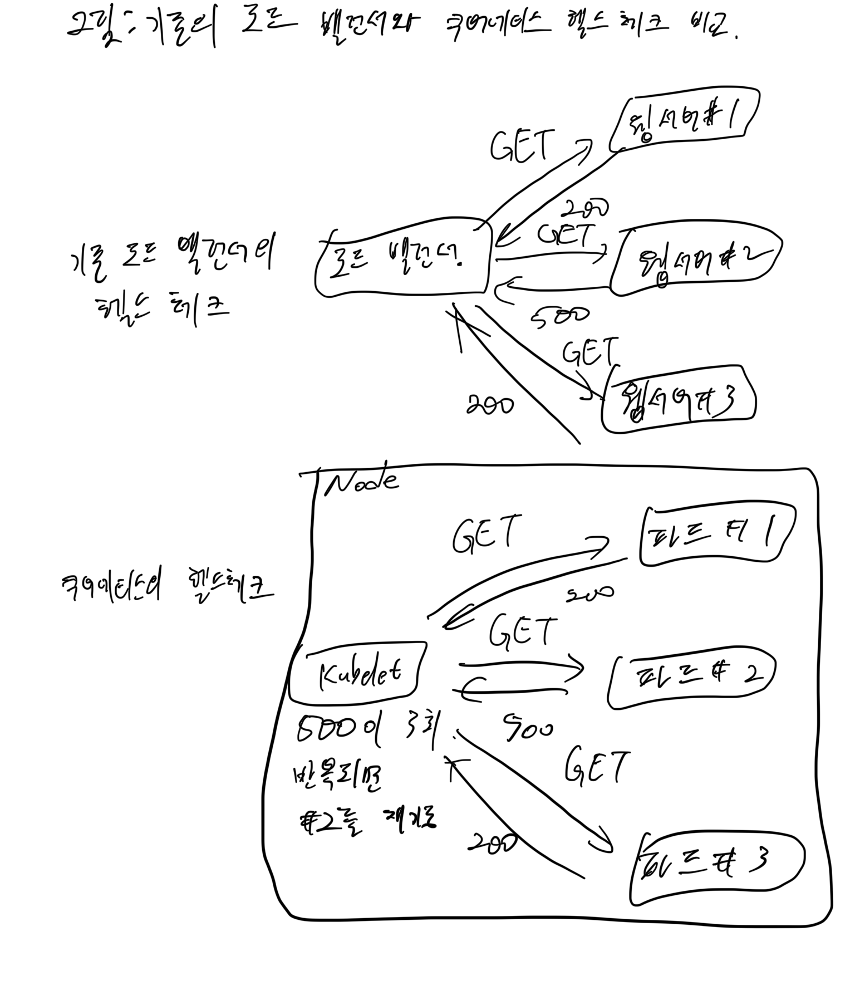

## 1. ./webapl-pod.yml 파ì¼

```markdown
apiVersion: v1
kind: Pod
metadata:
  name: webapl
spec:
  containers:
    - name: webapl
      image: maho/webapl:0.1
      livenessProbe:
        httpGet:
          path: /healthz
          port: 3000
        initialDelaySeconds: 3
        periodSeconds: 5
      readinessProbe:
        httpGet:
          path: /ready
          port: 3000
        initialDelaySeconds: 15 # 프로브 검사 ì‹œì‘ ì „ 대기 시간
        periodSeconds: 6 # 검사 간격

```

ì—­í• : ì´ êµ¬ì„± 파ì¼ì€ maho/webapl:0.1 ì´ë¯¸ì§€ë¥¼ 사용하는 Pod를 ìƒì„±í•˜ê³ , 해당 컨테ì´ë„ˆì˜ ìƒíƒœë¥¼ 주기ì ìœ¼ë¡œ 확ì¸í•˜ì—¬ Liveness Probe를 통해 컨테ì´ë„ˆê°€ ì •ìƒì ìœ¼ë¡œ 실행 중ì¸ì§€ ê°ì‹œí•˜ê³ , Readiness Probe를 통해 서비스 준비 ìƒíƒœë¥¼ 확ì¸í•˜ì—¬ 트ë˜í”½ì„ 전달할 수 ìˆëŠ”지를 íŒë‹¨í•©ë‹ˆë‹¤.

## 2. webapl/Dockerfile

```markdown
FROM alpine:latest
## Node.js  https://pkgs.alpinelinux.org/package/edge/main/x86_64/nodejs
RUN apk update && apk add --no-cache nodejs npm
## ì˜ì¡´ 모듈
WORKDIR /
ADD ./package.json /
RUN npm install
ADD ./webapl.js /
## 애플리케ì´ì…˜ 기ë™
CMD node /webapl.js
```

ì—­í• : ì´ Dockerfileì€ ê²½ëŸ‰ Alpine Linux ì´ë¯¸ì§€ë¥¼ 기반으로 Node.js í™˜ê²½ì„ êµ¬ì„±í•˜ê³ , 애플리케ì´ì…˜ì˜ ì˜ì¡´ì„±ì„ 설치한 후, webapl.js 파ì¼ì„ 실행하여 애플리케ì´ì…˜ì„ ì‹œì‘하는 ê³¼ì •ì„ ìë™í™”합니다


## 3. webapl/package.json

```markdown
{
    "name": "webapl",
    "version": "1.0.0",
    "description": "",
    "main": "webapl.js",
    "scripts": {
        "test": "echo \"Error: no test specified\" && exit 1"
    },
    "author": "",
    "license": "ISC",
    "dependencies": {
        "express": "^4.16.3"
    }
}
```

ì—­í• : ì´ package.json 파ì¼ì€ “webapl†애플리케ì´ì…˜ì˜ 기본 설정 정보를 ë‹´ê³  ìˆìœ¼ë©°, 프로ì íŠ¸ ì´ë¦„, 버전, ë©”ì¸ íŒŒì¼, 스í¬ë¦½íŠ¸, 그리고 Express와 ê°™ì€ ì˜ì¡´ì„± íŒ¨í‚¤ì§€ë“¤ì„ ê´€ë¦¬í•©ë‹ˆë‹¤. ì´ë¥¼ 통해 Node.jsì—ì„œ 해당 애플리케ì´ì…˜ì„ 빌드, 테스트, 실행할 수 ìˆê²Œ ë„와ì¤ë‹ˆë‹¤.


## 4. webapl/webapl.js

```markdown
// ëª¨ì˜ ì• í”Œë¦¬ì¼€ì´ì…˜
//
const express = require('express')
const app = express()
var start = Date.now()
// Liveness 프로브 핸들러
// ê¸°ë™ í›„ 40초가 ë˜ë©´, 500 ì—러를 반환한다.
// 그 전까지는 HTTP 200 OK를 반환한다.
// 즉, 40초가 ë˜ë©´, Liveness프로브가 실패하여 컨테ì´ë„ˆê°€ ì¬ê¸°ë™í•œë‹¤.
//
app.get('/healthz', function (request, response) {
    var msec = Date.now() - start
    var code = 200
    if (msec > 40000) {
        code = 500
    }
    console.log('GET /healthz ' + code)
    response.status(code).send('OK')
})
// Rediness 프로브 핸들러
// 애플리케ì´ì…˜ì˜ 초기화 시간으로
// ê¸°ë™ í›„ 20ì´ˆ 지나고 나서부터 HTTP 200ì„ ë°˜í™˜í•œë‹¤.
// 그 전까지는 HTTPS 200 OK를 반환한다.
app.get('/ready', function (request, response) {
    var msec = Date.now() - start
    var code = 500
    if (msec > 20000) {
        code = 200
    }
    console.log('GET /ready ' + code)
    response.status(code).send('OK')
})
// 첫 화면
//
app.get('/', function (request, response) {
    console.log('GET /')
    response.send('Hello from Node.js')
})
// 서버 í¬íŠ¸ 번호
//
app.listen(3000);
```

ì—­í• : 노드 ê¸°ë°˜ì˜ ê°„ë‹¨í•œ 웹 서버를 구성하며, Kubernetes와 ê°™ì€ í™˜ê²½ì—ì„œ Liveness ë° Readiness Probe를 테스트하는 ìš©ë„ë¡œ 사용ë©ë‹ˆë‹¤.


## 5. 테스트

### 테스트 순서

1. 파드 ë°°í¬í•˜ê¸°
1. 파드 ìƒíƒœ 확ì¸
  1. kubectl get pods
1. 로그 분ì„으로 프로브 ë™ì‘ 확ì¸
  1. kubectl logs webapl
  1. kubectl describe pod webapl


### 테스트 결과 로그

```markdown
Events:
  Type     Reason          Age                   From               Message
  ----     ------          ----                  ----               -------
  Normal   Scheduled       42m                   default-scheduler  Successfully assigned default/webapl to minikube
  Normal   Pulling         42m                   kubelet            Pulling image "maho/webapl:0.1"
  Normal   Pulled          42m                   kubelet            Successfully pulled image "maho/webapl:0.1" in 5.272s (5.272s including waiting). Image size: 51079110 bytes.
  Warning  Unhealthy       39m                   kubelet            Readiness probe failed: Get "http://10.244.0.18:3000/ready": dial tcp 10.244.0.18:3000: connect: connection refused
  Normal   Created         35m (x6 over 42m)     kubelet            Created container: webapl
  Normal   Started         35m (x6 over 42m)     kubelet            Started container webapl
  Normal   Pulled          23m (x8 over 40m)     kubelet            Container image "maho/webapl:0.1" already present on machine
  Warning  Unhealthy       21m (x11 over 41m)    kubelet            Readiness probe failed: HTTP probe failed with statuscode: 500
  Normal   Pulling         15m                   kubelet            Pulling image "johoo54/webapl:0.1"
  Warning  Unhealthy       11m (x37 over 41m)    kubelet            Liveness probe failed: HTTP probe failed with statuscode: 500
  Normal   Killing         11m (x13 over 41m)    kubelet            Container webapl failed liveness probe, will be restarted
  Warning  BackOff         6m44s (x75 over 32m)  kubelet            Back-off restarting failed container webapl in pod webapl_default(cdd4de9d-dddb-464a-927b-3148e19751cc)
  Normal   Pulled          5m22s (x5 over 13m)   kubelet            Container image "johoo54/webapl:0.1" already present on machine
  Normal   SandboxChanged  114s                  kubelet            Pod sandbox changed, it will be killed and re-created.
  Warning  Unhealthy       54s (x3 over 64s)     kubelet            Liveness probe failed: HTTP probe failed with statuscode: 500
  Normal   Killing         54s                   kubelet            Container webapl failed liveness probe, will be restarted
  Normal   Pulled          24s (x2 over 109s)    kubelet            Container image "johoo54/webapl:0.1" already present on machine
  Normal   Created         24s (x2 over 109s)    kubelet            Created container: webapl
  Normal   Started         24s (x2 over 108s)    kubelet            Started container webapl
  Warning  Unhealthy       4s (x3 over 94s)      kubelet            Readiness probe failed: HTTP probe failed with statuscode: 500
```

- í•´ì„: 쿠버네티스가 제대로 ë™ì‘하고 ìˆìŒ
ì´ ì´ë²¤íŠ¸ 로그는 Podì˜ ìƒì•  주기 ë™ì•ˆ 헬스체í¬(리드니스, ë¼ì´ë¸Œë‹ˆìŠ¤)와 ê´€ë ¨ëœ ë¬¸ì œë“¤ì´ ë°œìƒí•˜ì—¬ 컨테ì´ë„ˆê°€ ì¬ì‹œì‘ë˜ê³  ìˆëŠ” ìƒí™©ì„ 보여줘요. ê° ì´ë²¤íŠ¸ì˜ ì˜ë¯¸ë¥¼ 단계별로 분ì„하면 다ìŒê³¼ 같습니다:

1. 초기 ìŠ¤ì¼€ì¤„ë§ ë° ì´ë¯¸ì§€ í’€ë§

•	Scheduled & Pulling & Pulled

•	default-schedulerê°€ Pod를 minikube ë…¸ë“œì— í• ë‹¹í–ˆê³ ,

•	ì§€ì •ëœ ì´ë¯¸ì§€ "maho/webapl:0.1"ì„ ì •ìƒì ìœ¼ë¡œ í’€ë§í•´ 컨테ì´ë„ˆë¥¼ ìƒì„± ë° ì‹œì‘했습니다.

2. Readiness Probe 실패 (초기)

•	Warning: Unhealthy - Readiness probe failed: connection refused

•	초기ì—는 /ready 엔드í¬ì¸íŠ¸ì— ì ‘ê·¼ ì‹œ ì—°ê²°ì´ ê±°ë¶€(refused)ëœ ê²ƒìœ¼ë¡œ ë³´ì…니다.

•	ì´ëŠ” 애플리케ì´ì…˜ì´ ì•„ì§ ì¤€ë¹„ë˜ì§€ 않았거나 í¬íŠ¸ê°€ 열리지 않았기 ë•Œë¬¸ì¼ ìˆ˜ ìˆìŠµë‹ˆë‹¤.

3. 컨테ì´ë„ˆ ìƒì„± ë° ì¬ì‹œì‘ 반복

•	Created & Started

•	여러 차례 컨테ì´ë„ˆê°€ ìƒì„±ë˜ê³  ì‹œì‘ë˜ì—ˆìŒì„ ì•Œ 수 ìˆìŠµë‹ˆë‹¤.

•	Warning: Unhealthy - Readiness probe failed: HTTP probe failed with statuscode: 500

•	ì¼ì • ì‹œê°„ì´ ì§€ë‚œ 후ì—ë„ Readiness Probeê°€ HTTP 500 ì—러를 반환하고 ìˆìŠµë‹ˆë‹¤.

•	ì´ëŠ” 애플리케ì´ì…˜ì˜ /ready 핸들러ì—ì„œ 20ì´ˆ ì´ì „ì—는 500 ìƒíƒœë¥¼ 반환하ë„ë¡ ì„¤ê³„ëœ ì ê³¼ ì—°ê´€ë  ìˆ˜ ìˆìŒ.

4. ì´ë¯¸ì§€ 변경 ì‹œë„

•	Pulling image “johoo54/webapl:0.1â€

•	ì–´ëŠ ì‹œì ì— "johoo54/webapl:0.1" ì´ë¯¸ì§€ë¡œ 변경하여 í’€ë§ì„ ì‹œë„하는 ì´ë²¤íŠ¸ê°€ ë°œìƒí–ˆì–´ìš”.

•	ì´ëŠ” ì´ì „ ì´ë¯¸ì§€(maho/webapl:0.1) 대신 다른 ì´ë¯¸ì§€ë¡œ êµì²´í–ˆìŒì„ ì˜ë¯¸í•©ë‹ˆë‹¤.

5. Liveness Probe 실패 ë° ì»¨í…Œì´ë„ˆ ì¬ì‹œì‘

•	Warning: Unhealthy - Liveness probe failed: HTTP probe failed with statuscode: 500

•	Liveness Probeë„ HTTP 500 ì‘ë‹µì„ ë°›ì•„ 실패하고, ê·¸ ê²°ê³¼ 컨테ì´ë„ˆê°€ ì¬ì‹œì‘ë©ë‹ˆë‹¤.

•	Killing & BackOff

•	Liveness Probe 실패로 ì¸í•´ 컨테ì´ë„ˆê°€ 여러 번 종료ë˜ê³  ì¬ì‹œì‘ë˜ë‹¤ê°€, ê²°êµ­ “Back-off restarting failed container†메시지로 컨테ì´ë„ˆê°€ ì¬ì‹œì‘ë˜ì§€ 않는 ìƒíƒœì— ì´ë¦…니다.

•	Back-off는 ì¼ì • 시간 ê°„ê²©ì„ ë‘ê³  ì¬ì‹œì‘ ì‹œë„를 하는ë°, 반복 실패 후 ì ì  ëŒ€ê¸°ì‹œê°„ì´ ëŠ˜ì–´ë‚˜ëŠ” ìƒí™©ì„ ì˜ë¯¸í•©ë‹ˆë‹¤.

6. 최종 ìƒí™©

•	최근 ì´ë²¤íŠ¸ì—서는 ì—¬ì „íˆ Liveness Probe 실패와 Readiness Probe 실패가 반복ë˜ë©°, 컨테ì´ë„ˆê°€ ì¬ì‹œì‘ë˜ê³  ìˆìŠµë‹ˆë‹¤.

•	ë¡œê·¸ì— ë”°ë¥´ë©´ /healthz (ë¼ì´ë¸Œë‹ˆìŠ¤)와 /ready (리드니스) 핸들러가 ê³„ì† HTTP 500 ìƒíƒœë¥¼ 반환하고 ìˆì–´, 애플리케ì´ì…˜ ìƒíƒœê°€ ì •ìƒì ìœ¼ë¡œ 개선ë˜ì§€ ì•Šì€ ìƒíƒœì…니다.

종합 분ì„

•	Readiness Probe:

•	초반ì—는 í¬íŠ¸ ì—°ê²° 거부(connection refused) 문제가 ìˆì—ˆìœ¼ë‚˜, ì´í›„ì—는 500 ìƒíƒœë¥¼ 반환하는 것으로 변경ë¨.

•	ì´ëŠ” 애플리케ì´ì…˜ì´ 준비 ìƒíƒœê°€ ë˜ì§€ 않았ìŒì„ ì˜ë¯¸í•˜ë©°, ì„œë¹„ìŠ¤ì— íŠ¸ë˜í”½ì„ 전달하지 않게 ë©ë‹ˆë‹¤.

•	Liveness Probe:

•	40ì´ˆ ì´í›„ ì˜ë„ëœ ë™ì‘대로 500 ìƒíƒœë¥¼ 반환하여 컨테ì´ë„ˆê°€ ì¬ì‹œì‘ë˜ë„ë¡ ìœ ë„하고 ìˆìŠµë‹ˆë‹¤.

•	그러나 ê³„ì† ë°˜ë³µë˜ëŠ” 실패와 ì¬ì‹œì‘으로 ì¸í•´ Back-off ìƒíƒœì— 진ì…하게 ë˜ì—ˆìŠµë‹ˆë‹¤.

•	ì´ë¯¸ì§€ 변경:

•	ì¤‘ê°„ì— ì´ë¯¸ì§€ê°€ "maho/webapl:0.1"ì—ì„œ "johoo54/webapl:0.1"ë¡œ ë³€ê²½ëœ ê²ƒì´ ë³´ì´ëŠ”ë°, ì´ëŠ” 테스트나 ë°°í¬ ê³¼ì •ì—ì„œ 새로운 ë²„ì „ì˜ ì´ë¯¸ì§€ë¥¼ 사용하려는 ì‹œë„ì¼ ìˆ˜ ìˆìŠµë‹ˆë‹¤.

ê²°ë¡ 

ì´ ë¡œê·¸ëŠ” í—¬ìŠ¤ì²´í¬ í”„ë¡œë¸Œ ì„¤ì •ì— ë”°ë¼ ì• í”Œë¦¬ì¼€ì´ì…˜ì˜ /healthz와 /ready 엔드í¬ì¸íŠ¸ê°€ ì˜ë„ëœ ëŒ€ë¡œ ë™ì‘하고 ìˆìŒì„ 보여주지만, 실제로는 계ì†í•´ì„œ HTTP 500 ìƒíƒœë¥¼ 반환하여:

•	Readiness Probe: 초기화 ì´í›„ì—ë„ ì‹¤íŒ¨ ìƒíƒœë¡œ 남아 서비스 트ë˜í”½ì´ 전달ë˜ì§€ ì•ŠìŒ.

•	Liveness Probe: 40ì´ˆ ì´í›„ 실패로 ì¸í•´ 컨테ì´ë„ˆê°€ 반복ì ìœ¼ë¡œ ì¬ì‹œì‘ë˜ê³ , ê²°êµ­ ì¬ì‹œì‘ì´ Back-off ìƒíƒœë¡œ ì´ì–´ì§.

ë”°ë¼ì„œ, 애플리케ì´ì…˜ì˜ í—¬ìŠ¤ì²´í¬ í•¸ë“¤ëŸ¬ê°€ ì˜ë„í•œ ë™ì‘(예: 초기 준비 ìƒíƒœì™€ ì¼ì • ì‹œê°„ì´ ì§€ë‚œ 후 ì¬ì‹œì‘)ì„ ì˜¬ë°”ë¥´ê²Œ 시뮬레ì´ì…˜í•˜ê³  ìˆëŠ”지, 그리고 ê·¸ì— ë”°ë¼ Kubernetesê°€ 올바르게 대ì‘하는지를 확ì¸í•  수 ìˆìŠµë‹ˆë‹¤. 추가로, 실제 ìš´ì˜ í™˜ê²½ì—서는 ì´ëŸ¬í•œ í—¬ìŠ¤ì²´í¬ ì¡°ê±´ì´ ì ì ˆí•œì§€, ë˜ëŠ” ë¡œì§ì„ 수정해야 하는지를 검토할 필요가 ìˆìŠµë‹ˆë‹¤.

### ì˜ë¬¸: Liveness Probe vs Readiness Probe

Kubernetesì—ì„œ Liveness Probe와 Readiness Probe는 ê°ê° 다른 목ì ì„ 가지고 ìˆì–´ìš”. ì•„ë˜ì—ì„œ ì°¨ì´ì ì„ 정리하고, ì˜ë¬¸ì„ 해결해볼게요.

🔹 Liveness Probe (ìƒì¡´ 확ì¸)

목ì : 컨테ì´ë„ˆê°€ ì •ìƒì ìœ¼ë¡œ 실행ë˜ê³  ìˆëŠ”지 확ì¸

실패하면: 컨테ì´ë„ˆë¥¼ ì¬ì‹œì‘함

📌 언제 사용?

•	컨테ì´ë„ˆê°€ ì‘답하지 않는 ìƒíƒœ(Hang, Deadlock 등) ê°€ ë˜ì—ˆì„ ë•Œ ìë™ìœ¼ë¡œ ì¬ì‹œì‘

•	애플리케ì´ì…˜ì´ ì™„ì „íˆ ë©ˆì¶”ê±°ë‚˜, ë” ì´ìƒ ì •ìƒì ìœ¼ë¡œ ë™ì‘하지 않는 경우 ê°ì§€

📌 예제 (코드와 ì—°ê²°í•´ì„œ ì´í•´)

ì´ì „ì— ì‚¬ìš©í•œ webapl.js 코드ì—ì„œ:

```plain text
app.get('/healthz', function (request, response) {
    var msec = Date.now() - start
    var code = 200
    if (msec > 40000) {  // 40초가 지나면 500 반환
        code = 500
    }
    console.log('GET /healthz ' + code)
    response.status(code).send('OK')
})
```

•	ì²˜ìŒ 40ì´ˆ ë™ì•ˆì€ HTTP 200ì„ ë°˜í™˜ → ì •ìƒì ìœ¼ë¡œ ë™ì‘

•	40ì´ˆ ì´í›„ HTTP 500ì„ ë°˜í™˜ → Liveness Probe 실패 → Kubernetesê°€ 컨테ì´ë„ˆ ì¬ì‹œì‘

📌 Liveness Probe ë™ì‘ ë°©ì‹

1.	/healthz ê²½ë¡œì— ìš”ì²­

2.	HTTP 200ì´ë©´ ì •ìƒ, 500ì´ë©´ 실패

3.	실패하면 Kubernetesê°€ 컨테ì´ë„ˆë¥¼ ì¬ì‹œì‘함

🔹 Readiness Probe (준비 ìƒíƒœ 확ì¸)

목ì : 애플리케ì´ì…˜ì´ 트ë˜í”½ì„ ë°›ì„ ì¤€ë¹„ê°€ ë˜ì—ˆëŠ”지 확ì¸

실패하면: 해당 Pod는 서비스ì—ì„œ 제외ë˜ë©°, 트ë˜í”½ì„ 받지 ì•ŠìŒ (ì¬ì‹œì‘하지 ì•ŠìŒ)

📌 언제 사용?

•	애플리케ì´ì…˜ì´ 초기화 중ì´ê±°ë‚˜, 특정 ì‘ì—…ì´ ëë‚  때까지 트ë˜í”½ì„ 받지 않아야 í•  ë•Œ

•	DB ì—°ê²°, 설정 로드 등 준비가 완료ë˜ê¸° ì „ì—는 í´ë¼ì´ì–¸íŠ¸ ìš”ì²­ì„ ë°›ìœ¼ë©´ 안 ë˜ëŠ” 경우

📌 예제 (코드와 ì—°ê²°í•´ì„œ ì´í•´)

ì´ì „ì— ì‚¬ìš©í•œ webapl.js 코드ì—ì„œ:

```plain text
app.get('/ready', function (request, response) {
    var msec = Date.now() - start
    var code = 500
    if (msec > 20000) {  // 20초가 지나야 200 반환
        code = 200
    }
    console.log('GET /ready ' + code)
    response.status(code).send('OK')
})
```

•	ì‹œì‘ í›„ 20ì´ˆ ë™ì•ˆ HTTP 500 반환 → Readiness Probe 실패 → 트ë˜í”½ 받지 ì•ŠìŒ

•	20ì´ˆ ì´í›„ HTTP 200 반환 → Readiness Probe 성공 → 트ë˜í”½ 받기 ì‹œì‘

📌 Readiness Probe ë™ì‘ ë°©ì‹

1.	/ready ê²½ë¡œì— ìš”ì²­

2.	HTTP 200ì´ë©´ 트ë˜í”½ì„ ë°›ì„ ì¤€ë¹„ 완료 → ì„œë¹„ìŠ¤ì— ì¶”ê°€ë¨

3.	HTTP 500ì´ë©´ ì•„ì§ ì¤€ë¹„ë˜ì§€ ì•ŠìŒ â†’ 트ë˜í”½ì—ì„œ 제외ë¨

🔹 Liveness Probe vs Readiness Probe 비êµ

🔹 ì˜ë¬¸ í•´ê²°: 왜 둘 다 필요한가?

1.	Readiness Probe가 없으면?

•	애플리케ì´ì…˜ì´ ì•„ì§ ì¤€ë¹„ë˜ì§€ ì•Šì•˜ëŠ”ë° í´ë¼ì´ì–¸íŠ¸ ìš”ì²­ì„ ë°›ì„ ìˆ˜ë„ ìˆìŒ

•	초기 ì„¤ì •ì´ í•„ìš”í•œ 애플리케ì´ì…˜(DB ì—°ê²° 등)ì—서는 ìš”ì²­ì´ ì‹¤íŒ¨í•  ê°€ëŠ¥ì„±ì´ ë†’ìŒ

2.	Liveness Probe가 없으면?

•	애플리케ì´ì…˜ì´ 죽거나 무한 ë£¨í”„ì— ë¹ ì ¸ë„ Kubernetesê°€ ê°ì§€í•˜ì§€ 못해 ê³„ì† ì„œë¹„ìŠ¤ë¨

•	사용ìê°€ ì§ì ‘ Pod를 ì¬ì‹œì‘해야 í•  ìˆ˜ë„ ìˆìŒ

3.	ê°™ì€ ì—”ë“œí¬ì¸íŠ¸ë¥¼ 사용하면 안 ë˜ë‚˜?

•	가능하지만 권ì¥ë˜ì§€ ì•ŠìŒ

•	Readiness Probe는 ì¼ì‹œì ì¸ 준비 ìƒíƒœ 확ì¸, Liveness Probe는 지ì†ì ì¸ ìƒíƒœ 확ì¸ì´ 목ì ì´ê¸° ë•Œë¬¸ì— êµ¬ë¶„í•´ì„œ 설정하는 ê²ƒì´ ì¢‹ìŒ

🔹 최종 결론

•	Readiness Probe는 초기 준비 ìƒíƒœë¥¼ 확ì¸í•˜ì—¬, 준비ë˜ì§€ ì•Šì€ Podì— íŠ¸ë˜í”½ì„ 전달하지 ì•ŠìŒ.

•	Liveness Probe는 컨테ì´ë„ˆê°€ ë¹„ì •ìƒ ìƒíƒœì— ë¹ ì¡Œì„ ë•Œ ìë™ ì¬ì‹œì‘하여 복구 가능하게 함.

•	둘 다 설정하면 트ë˜í”½ ì†ì‹¤ì„ 최소화하고 안정ì ì¸ 서비스 ìš´ì˜ì´ 가능함.

✅ Readiness Probe는 â€œì¤€ë¹„ë  ë•Œê¹Œì§€ 트ë˜í”½ì„ 안 주는 것â€

✅ Liveness Probe는 “죽으면 컨테ì´ë„ˆë¥¼ 다시 ì‹œì‘하는 것â€


